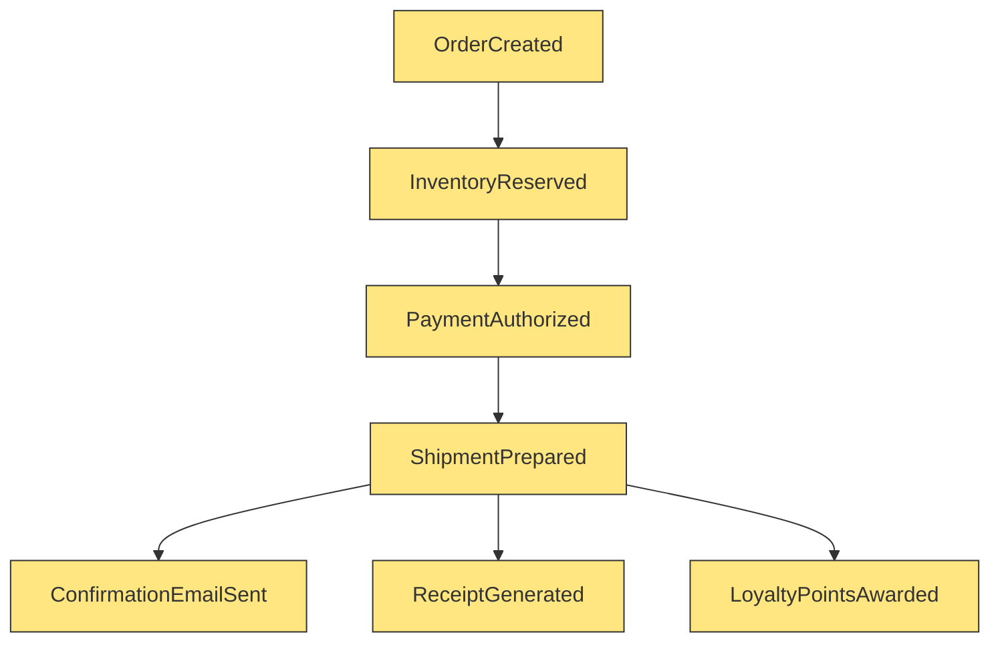
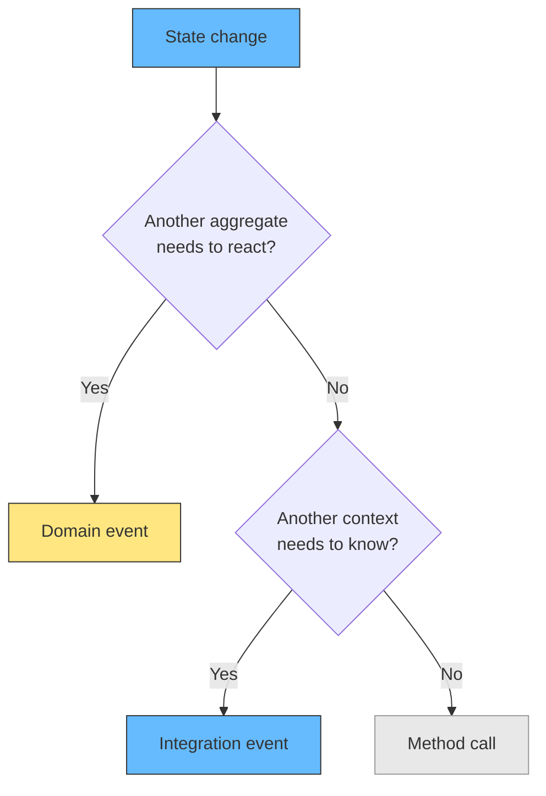
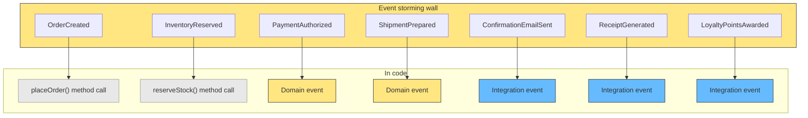
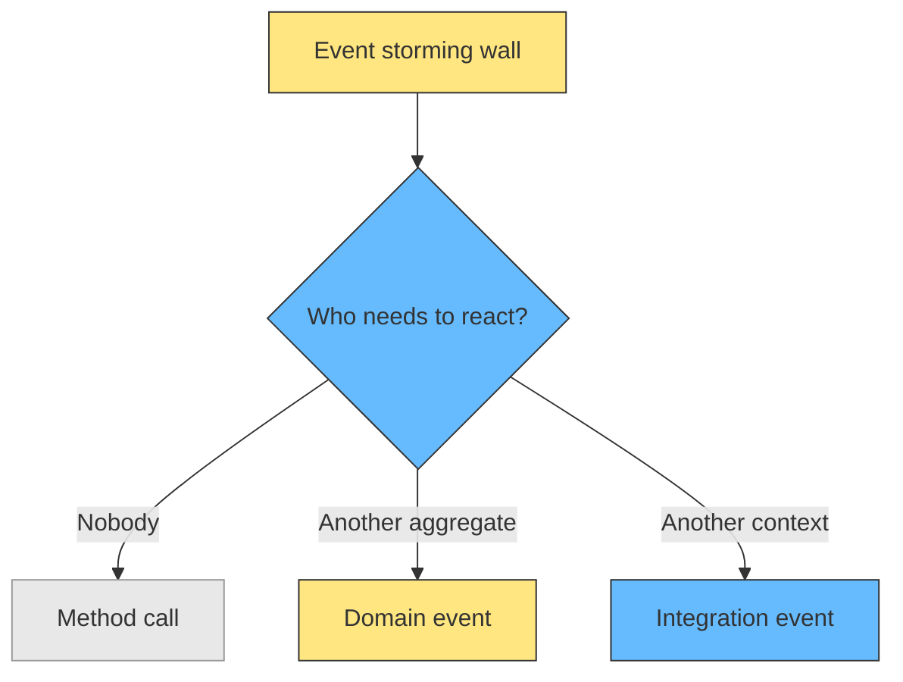

# When Events Are Events and When They Are Not

Not every event from event storming becomes an event in code. An orange sticky means "something happened in the business." A code event means "something else needs to react." If no other context needs to know, it is a method call, not an event. And when you do emit an event to another context, that tells you something about the relationship: those two contexts are coupled through that moment.

Here is an event storming wall for an online bookstore:

<div style={{display: 'flex', justifyContent: 'center'}}>



</div>

Seven orange stickies. The natural impulse is to emit all seven as domain events in code. That is a mistake.

## The filter

A domain event in code exists to tell something else to react. If nothing else reacts, the state change is a method call. The workshop produces discovery. The developer decides what becomes a communication mechanism.

Brandolini: "It's the developer understanding, not the expert knowledge, that becomes working code."

Microsoft's .NET docs: "Use domain events to explicitly implement side effects across multiple aggregates." The key word is *across*. Within a single aggregate, you just change state.

<div style={{display: 'flex', justifyContent: 'center'}}>



</div>

## Applying the filter to the bookstore

<div style={{display: 'flex', justifyContent: 'center'}}>



</div>

| Sticky | Code | Why |
|---|---|---|
| OrderCreated | `placeOrder()` | Changes state. Nothing else reacts yet. |
| InventoryReserved | `reserveStock()` | Same transaction as OrderCreated. Internal. |
| PaymentAuthorized | Domain event | Payment aggregate needs to react. |
| ShipmentPrepared | Domain event | Shipment aggregate needs to react. |
| ConfirmationEmailSent | Integration event | Notification system is outside the domain. |
| ReceiptGenerated | Integration event | Same. |
| LoyaltyPointsAwarded | Integration event | Same. |

Seven stickies. Two method calls, two domain events, three integration events.

## Before and after

Every sticky as an event:

```python
class OrderService:
    def place_order(self, order):
        order.status = "created"
        self.event_store.append(OrderCreated(order))
        self.event_store.append(InventoryReserved(order))
        self.event_store.append(PaymentRequested(order))
        self.event_store.append(ShipmentRequested(order))
        self.event_store.append(ConfirmationEmailRequested(order))
        self.event_store.append(ReceiptRequested(order))
        self.event_store.append(LoyaltyPointsRequested(order))
```

Only cross-boundary communication as events:

```python
class OrderService:
    def place_order(self, order):
        order.reserve_stock()
        order.status = "created"
        self.event_store.append(OrderCreated(order))
```

The second version tells you what matters: `OrderCreated` is the moment other aggregates need to react. Everything else is internal.

## Why event storming still works

The workshop is not wrong for producing more events than the code needs. Every orange sticky is a business concept worth understanding. The filter happens between the wall and the keyboard.

<div style={{display: 'flex', justifyContent: 'center'}}>



</div>

## Related

- [DDD: The Complete Process Step by Step](ddd-process.md) - the full process from discovery to implementation
- [Transactions Outside the Aggregate](transactions-outside-aggregate.md) - how to handle communication across aggregate boundaries
- [Strong vs Eventual Consistency](strong-vs-eventual-consistency.md) - the consistency decision for cross-aggregate events
