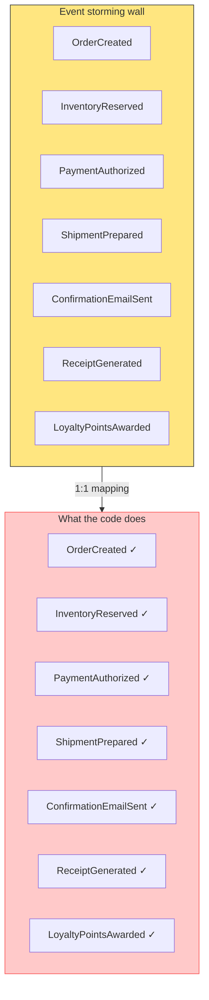
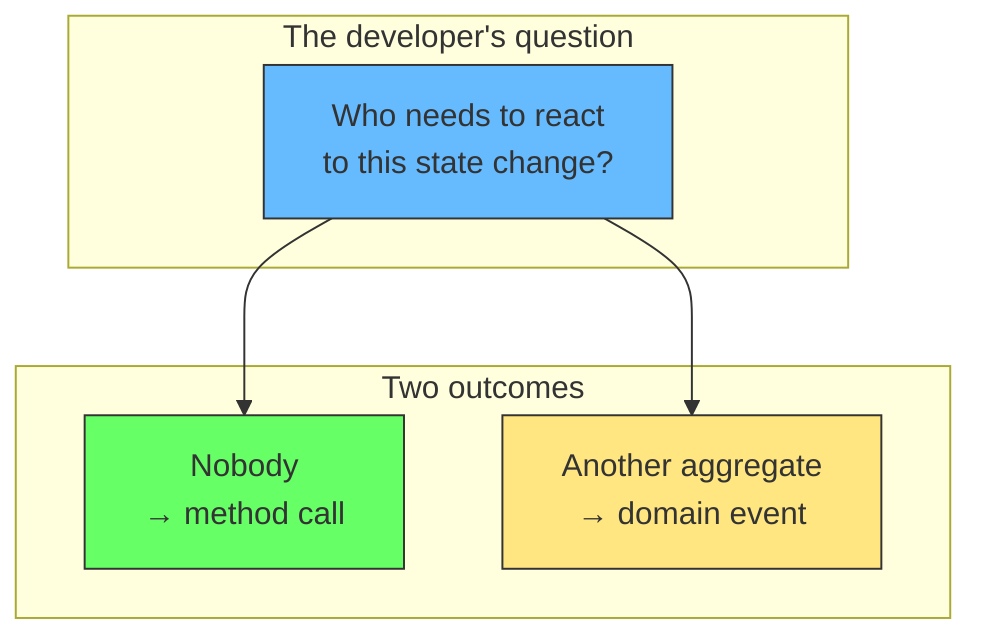
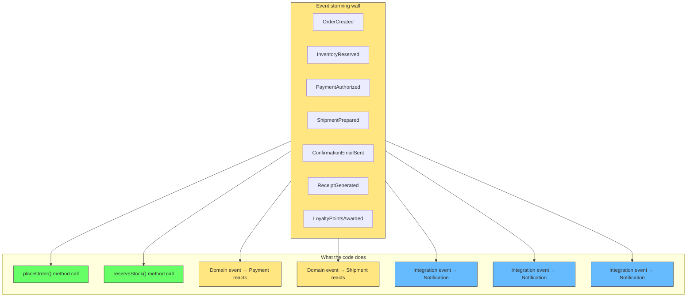
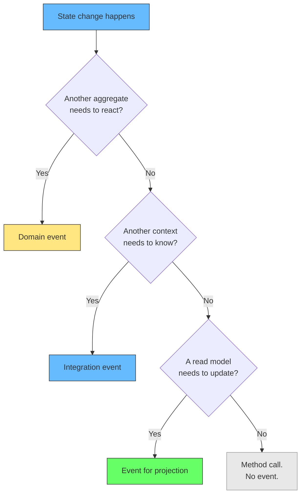
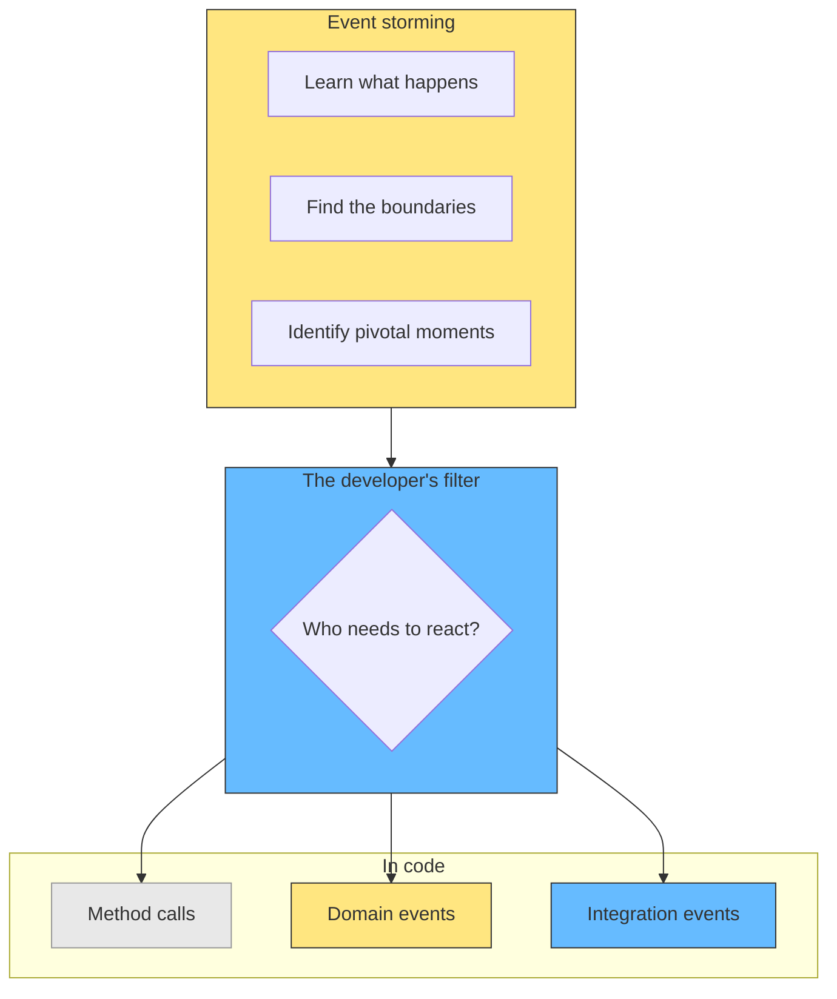

# When Events Are Events and When They Are Not

## The problem: event explosion

After an event storming session, the team has a wall full of orange stickies. The natural impulse is to emit every one of them as a domain event in code. OrderCreated, InventoryReserved, PaymentAuthorized, ShipmentPrepared, ConfirmationEmailSent, ReceiptGenerated, LoyaltyPointsAwarded. The codebase fills with events that nobody listens to.

The system still works, but it becomes hard to follow. When you read the code, you cannot tell which events actually matter and which are noise. Every state change fires an event, so the word "event" loses its meaning. The team starts to wonder if event storming led them somewhere wrong.



The mistake is a 1:1 mapping between workshop artifacts and code artifacts. Event storming is a discovery tool. Not every discovery becomes a communication mechanism.

## The solution: events are for communication, not for recording

A domain event exists in code to tell something else that it needs to react. If nothing else needs to react, the state change is just a method call. The event storming wall shows what happened in the business. The code shows what the software needs to communicate.

Brandolini puts it directly: "It's the developer understanding, not the expert knowledge, that becomes working code." The workshop produces business concepts. The developer decides which ones become code events.

Microsoft's .NET documentation is explicit: "Use domain events to explicitly implement side effects across multiple aggregates." The key word is *across*. Events cross a boundary. Within a single aggregate, you just change state.



## Most orange stickies become method calls

Take the bookstore example. The event storming wall shows:

| Orange sticky | What happens in code |
|---|---|
| OrderCreated | `OrderService.placeOrder()` changes state. Nothing else needs to react yet. Method call. |
| InventoryReserved | Inside the same transaction as OrderCreated. The `Order` aggregate reserves stock. Method call. |
| PaymentAuthorized | A separate aggregate reacts to `OrderCreated`. The `Payment` context needs to know. Domain event. |
| ShipmentPrepared | A separate aggregate reacts to `PaymentAuthorized`. The `Shipment` context needs to know. Domain event. |
| ConfirmationEmailSent | An integration event. The notification system is outside the core domain. Integration event. |
| ReceiptGenerated | Same as confirmation email. Integration event. |
| LoyaltyPointsAwarded | Same as confirmation email. Integration event. |

Seven orange stickies. Three become domain or integration events. Four become method calls.



## When to emit a domain event: the decision test

Ask three questions in order:

1. Does another aggregate need to change state in response? If yes, emit a domain event.
2. Does another bounded context need to know? If yes, emit an integration event.
3. Does a read model (CQRS) need to update? If yes, emit an event for the projection.
4. None of the above? Do not emit an event. Change state in a method call.

The test is simple: if you can remove the event and nothing breaks, it was not an event. It was a recording of something that already happened.



## The code before and after

Before (every orange sticky is an event):

```python
class OrderService:
    def place_order(self, order):
        order.status = "created"
        self.event_store.append(OrderCreated(order))
        self.event_store.append(InventoryReserved(order))
        self.event_store.append(PaymentRequested(order))
        self.event_store.append(ShipmentRequested(order))
        self.event_store.append(ConfirmationEmailRequested(order))
        self.event_store.append(ReceiptRequested(order))
        self.event_store.append(LoyaltyPointsRequested(order))
```

After (only cross-boundary communication is an event):

```python
class OrderService:
    def place_order(self, order):
        order.reserve_stock()          # method call
        order.status = "created"
        self.event_store.append(OrderCreated(order))  # domain event
        # Payment, Shipment, Notification react to this
```

The second version is shorter, but that is not the point. The point is that the second version tells you exactly what matters: `OrderCreated` is the moment when other aggregates need to react. Everything else is internal to the order.

## Why event storming still works

The workshop is not wrong for producing more events than the code needs. The workshop is for discovery. You are learning what happens, in what order, and where the boundaries are. Every orange sticky is a business concept worth understanding.

The filter happens between the wall and the keyboard. Brandolini's framing: "Software development is a learning process, working code is a side effect." The workshop is the learning. The code is the side effect. Not every learning event becomes a code event.



## Related

- [DDD: The Complete Process Step by Step](ddd-process.md) - the full process from discovery to implementation
- [Transactions Outside the Aggregate](transactions-outside-aggregate.md) - how to handle communication across aggregate boundaries
- [Strong vs Eventual Consistency](strong-vs-eventual-consistency.md) - the consistency decision for cross-aggregate events
