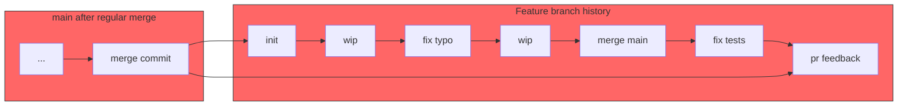
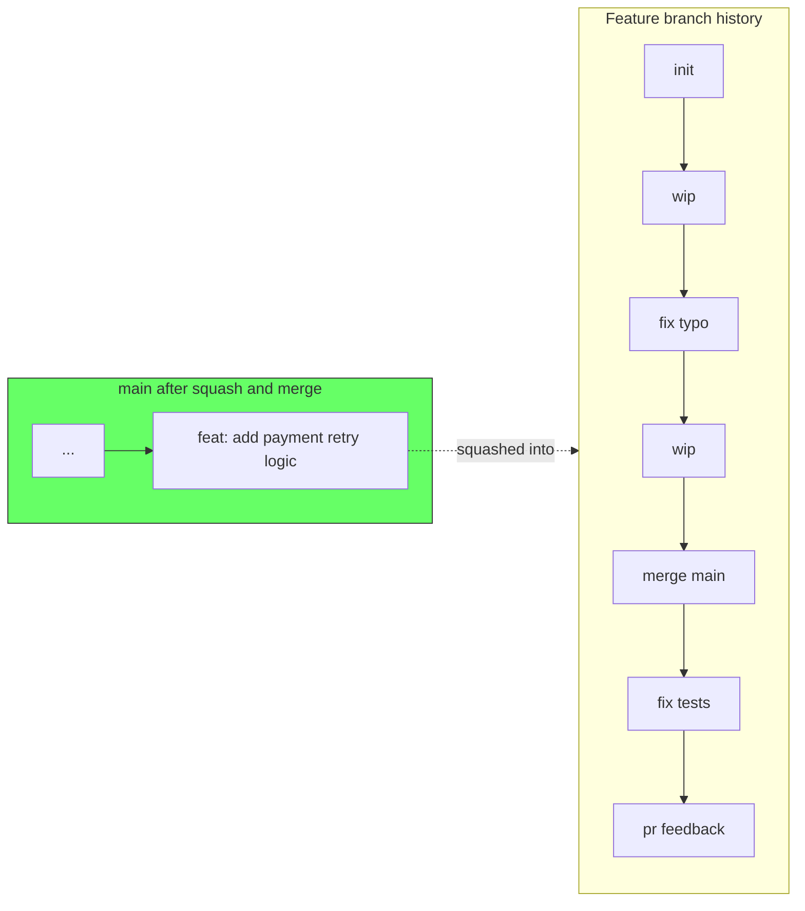
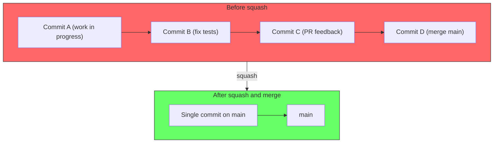
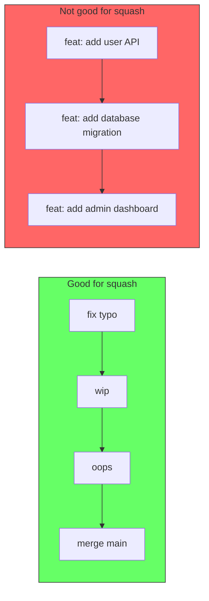
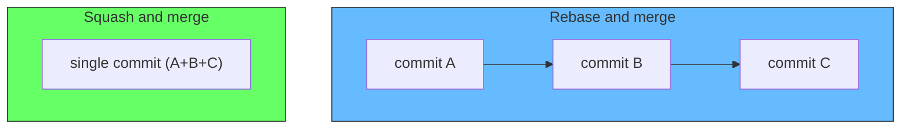

# Git Squash and Merge

## The problem: a history of work-in-progress

When multiple developers work on a feature branch, the commit history often looks like this:

```
fix typo
wip
oops fix lint
pr feedback
more pr feedback
fix tests
merge main
actually fix tests this time
wip
```

Each commit represents a checkpoint, not a logical unit of work. When this branch is merged with a regular merge commit, the entire history of false starts, lint fixes, and merge commits gets preserved in the main branch forever.



Every noise commit is now part of the permanent record. Anyone reading `git log` on main must wade through the noise to find meaningful changes. `git bisect` becomes painful. Reverting a feature requires untangling a web of partial commits.

## The solution: squash and merge

Squash and merge collapses an entire branch into a single commit before integrating it into main. All the work-in-progress commits are gone. One commit for one feature.



The squash commit message should describe the feature as a whole, not the individual WIP steps. This is what the main branch should communicate: "this commit adds payment retry logic." Not: "fix typo."

```
feat: add payment retry logic

Retries failed payments up to 3 times with exponential backoff.
Stores retry state in the payment_attempts table.
Sends notification after final failure.

Closes #482
```

## How it works

Squash and merge takes all the commits on the feature branch, combines them into a single diff, and creates one new commit on main with that diff. The feature branch commits are not added to main — their content is, but their individual commit messages are discarded.



Platforms like GitHub, GitLab, and Bitbucket provide a "Squash and merge" button on pull requests. When you click it, you are prompted to write a single commit message for the squashed result.

## When to squash and merge

### Good candidates

- A branch with many small fixup commits, typo fixes, and "wip" checkpoints
- Any branch where the individual commits are meaningless outside the context of the PR
- Branches that include "merge main" commits to stay up to date

### Bad candidates

- Commits that represent independently meaningful units of work, especially if they might need to be reverted separately
- Example: a branch that adds a feature in commit A and then adds a database migration in commit B. If commit B has a bug, you want to revert just the migration without losing the feature.



## Squash and merge vs rebase and merge

Both produce a clean history, but they differ in how.

Rebase and merge rewrites the feature branch commits onto the tip of main, preserving each commit individually. The history looks linear, and each commit is kept as a separate entry.

Squash and merge collapses everything into one commit. The individual commits are lost.



Use rebase and merge when each commit on the feature branch is a coherent, independent change. Use squash and merge when the branch is a collection of work-in-progress that should be presented as one unit.

## What about the commit author?

When you squash and merge, the author of the squash commit is the person who performed the merge (typically the reviewer who clicked the button), not the original developer. The individual commits are still visible on the feature branch in the pull request, but in the main branch history, the feature is credited to the merger.

Some teams solve this by having the original developer squash their branch locally before pushing, then using a regular merge:

```bash
git rebase -i main
# mark all commits except the first as "squash"
git push --force-with-lease
```

This way the squash commit retains the original author, and the merge is a simple fast-forward or merge commit.

## Summary

| Merge strategy | History preserved | History is clean | Best for |
|---|---|---|---|
| Regular merge | Yes | No | Shared branches, preserving individual commits |
| Squash and merge | No (collapsed) | Yes | Feature branches with many WIP commits |
| Rebase and merge | Yes (rebased) | Yes | Feature branches with meaningful individual commits |

Squash and merge is the right default for most feature branches. It keeps main branch history readable, makes `git bisect` practical, and ensures that each commit on main represents a complete, coherent change.
