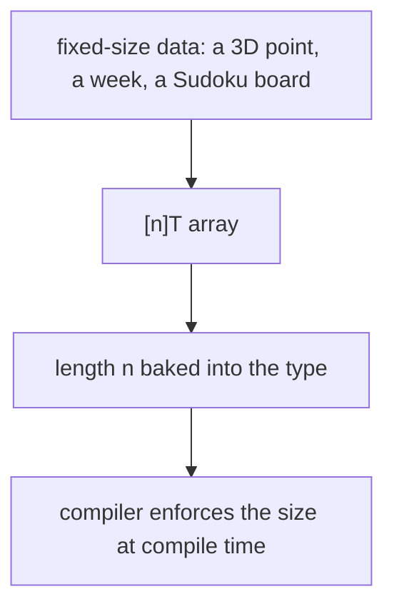
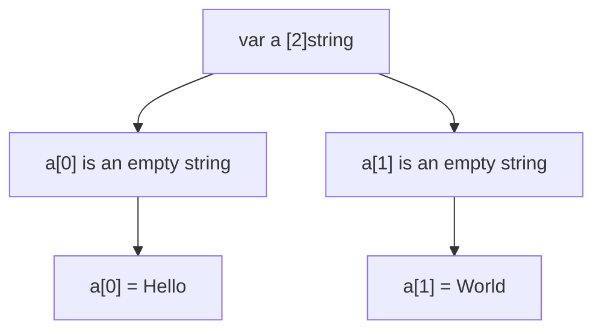
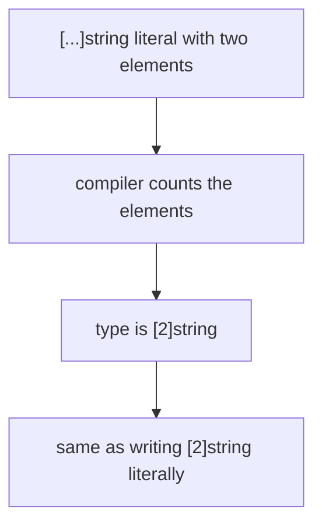
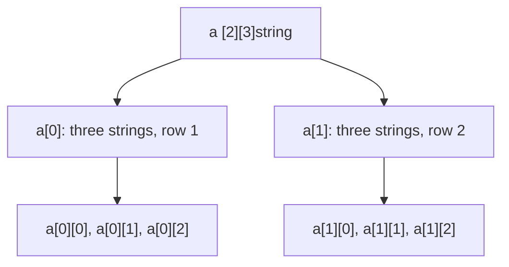

# Go Arrays

## TLDR

- An array is a fixed-length sequence of values of one type: `[n]T` is an array of `n` values of type `T`.
- The length is part of the type, so an array cannot grow or shrink.
- Declare with `var a [2]string`, or initialize in one line with `a := [2]string{"hello", "world"}`.
- Use `[...]` to have the compiler count the length for you: `a := [...]string{"hello", "world"}`.
- Accessing an index outside the array is a compile-time error, caught before the program runs.
- Print with `%q` to quote each string element; `Println` and `%s` leave them unquoted.
- Arrays are rare in real Go; when the length is unknown, use a slice instead (next article).

## The problem: a collection with a known, fixed size

Most of the time you do not know how many items you will store, so you reach for a slice. But some data has a size that never changes: a 3D point is always three numbers, a week is always seven days, a Sudoku board is always 9 by 9. For these cases you want a contiguous block of values whose size is fixed at compile time and enforced by the compiler. Go's array is exactly that: a numbered sequence of elements of a single type with a length that is part of its type.

<div style={{display: 'flex', justifyContent: 'center'}}>



</div>

## What an array is

The type `[n]T` is an array of `n` values of type `T`. This line declares a variable `a` as an array of ten integers:

```go
var a [10]int
```

The length is part of the type, not a property you can change later. `[10]int` and `[11]int` are different types, so there is no way to resize an array at runtime; doing so would mean changing the value's type.

## Declaring and assigning by index

You can declare an array, then fill each slot by index. Indexes are zero-based, like most languages.

```go
package main

import "fmt"

func main() {
    var a [2]string   // an array of size 2
    a[0] = "Hello"    // index 0 holds "Hello"
    a[1] = "World"    // index 1 holds "World"
    fmt.Println(a[0], a[1]) // Hello World
    fmt.Println(a)          // [Hello World]
}
```

The zero value of an array is an array full of the element type's zero value, so `var a [2]string` starts as two empty strings. You then overwrite each slot by index.

<div style={{display: 'flex', justifyContent: 'center'}}>



</div>

## Initializing as you declare

If you already know the values, set them in the declaration. A composite literal lists the elements inside curly braces.

```go
primes := [6]int{2, 3, 5, 7, 11, 13} // six prime numbers
fmt.Println(primes)
```

```go
a := [2]string{"hello", "world!"}
fmt.Printf("%q", a)
```

## Letting the compiler count: `[...]`

When the literal makes the length obvious, use an ellipsis to let the compiler count the elements. The resulting type still has a concrete length; only the spelling is shorter.

```go
a := [...]string{"hello", "world!"}
fmt.Printf("%q", a)
```

`[...]string{"hello", "world!"}` is exactly `[2]string{"hello", "world!"}`. You are not making a resizable array; you are only avoiding writing the `2` by hand.

<div style={{display: 'flex', justifyContent: 'center'}}>



</div>

## Printing arrays

The output depends on the format verb. `Println` and `%s` print the elements unquoted; `%q` prints each string element in double quotes.

```go
a := [2]string{"hello", "world!"}
fmt.Println(a)       // [hello world!]
fmt.Printf("%s\n", a) // [hello world!]
fmt.Printf("%q\n", a) // ["hello" "world!"]
```

`%q` is the "quote" verb: it wraps each string in double quotes, so spaces and element boundaries in the output are unambiguous.

## Multi-dimensional arrays

An array can contain arrays. `[2][3]string` is an array of two arrays, each holding three strings, laid out like a 2-by-3 grid.

```go
package main

import "fmt"

func main() {
    var a [2][3]string
    for i := 0; i < 2; i++ {
        for j := 0; j < 3; j++ {
            a[i][j] = fmt.Sprintf("row %d - column %d", i+1, j+1)
        }
    }
    fmt.Printf("%q", a)
    // [["row 1 - column 1" "row 1 - column 2" "row 1 - column 3"]
    //  ["row 2 - column 1" "row 2 - column 2" "row 2 - column 3"]]
}
```

<div style={{display: 'flex', justifyContent: 'center'}}>



</div>

## Out-of-bounds access is a compile error

Because the length is part of the type, the compiler knows the valid index range and rejects an index that is too large before the program ever runs.

```go
var a [2]string
a[3] = "Hello"
// invalid array index 3 (out of bounds for 2-element array)
```

A length-2 array has only indexes 0 and 1. Index 3 would be the fourth element, so it does not exist. This is a safety feature: a mistake that in other languages would corrupt memory or crash at runtime is caught here at compile time.

## When not to use an array

An array forces you to decide the size up front. When you do not know how many items you will have, that constraint is a burden, not a safety net. Go's answer is the slice, which wraps an array and lets the length grow. In practice most Go collection code uses slices; arrays appear mainly where the size is fixed by the domain, such as transformation matrices. The next article covers slices.

## Summary

An array is a fixed-length sequence of a single type, and its length is part of its type, so it cannot be resized. Declare one with `var a [2]string`, initialize it with a literal, or let the compiler count the elements with `[...]`. Out-of-bounds indexes fail at compile time, and `%q` prints each element quoted. Use arrays when the size is fixed by the domain; use slices everywhere else.

## Sources

- A Tour of Go, [Arrays](https://go.dev/tour/moretypes/6) - the `[n]T` type and the compile-time bounds check.
- Go Bootcamp (Matt Aimonetti), [Arrays](https://www.gobootcamp.com/book/arrays) - declaration, the `[...]` ellipsis, the `%q`/`%s`/`Println` printing comparison, and multi-dimensional arrays.
- The Go Programming Language Specification, [Array types](https://go.dev/ref/spec#Array_types) - the length as part of the array type.
