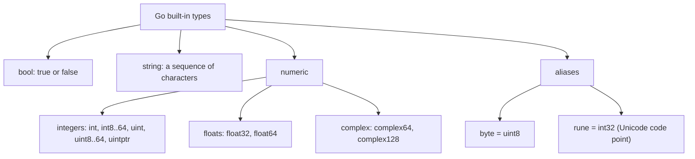
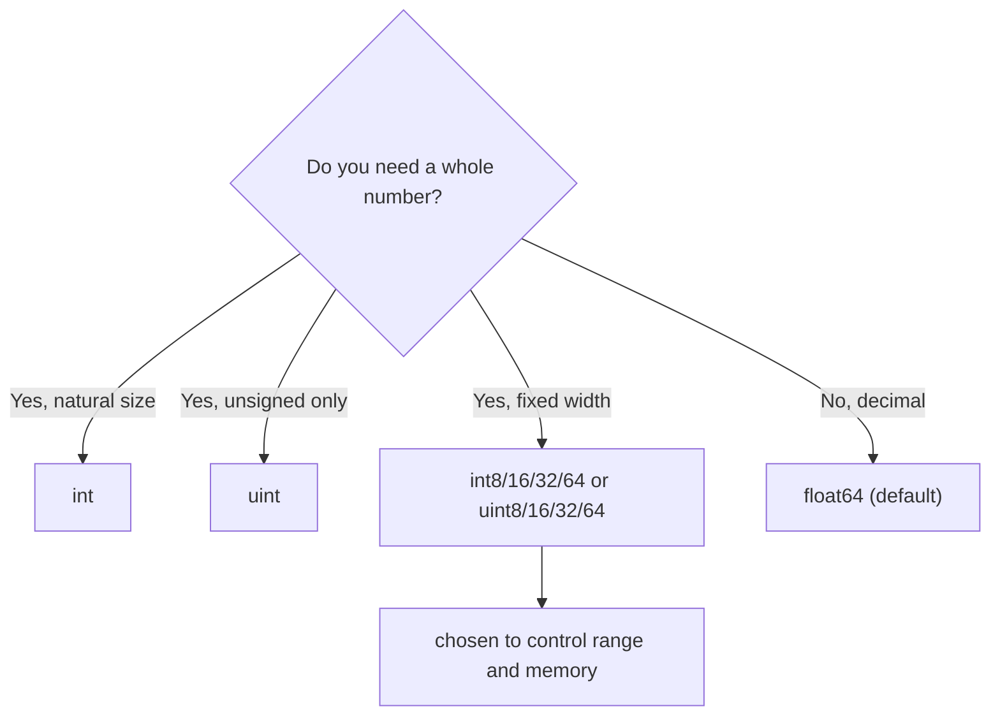

# Go Basic Types

## TLDR

- Go's built-in types split into **booleans** (`bool`), **strings** (`string`), and a family of **numeric** types (signed/unsigned integers, floats, complex), plus two aliases: `byte` and `rune`.
- `byte` is an alias for `uint8`; `rune` is an alias for `int32` and represents a Unicode code point.
- `int` and `uint` are platform-sized: 32 or 64 bits depending on the architecture, while `uintptr` is large enough to hold the bits of a pointer.
- Every numeric type has a fixed range; `uint8` spans 0 to 255, `int8` spans -128 to 127, and so on.
- Default to `int` for whole numbers and `float64` for decimals, and reach for the sized types only when the range or memory layout matters.

## The problem: a statically typed language needs concrete types

Go compiles to machine code, so before it produces a binary it must know the exact type and size of every value. That requirement is what lets the compiler reject type mistakes early and lay out memory precisely. The trade-off is that you must pick a type for each value, and picking well means knowing the built-in types, their ranges, and when to use each one. This article maps out that vocabulary.

<div style={{display: 'flex', justifyContent: 'center'}}>



</div>

## The three basic kinds

### `bool`

A boolean holds exactly one of two values: `true` or `false`. It is used for conditions and flags and cannot be interchanged with `0`/`1` the way it can in C.

```go
var goIsFun bool = true
```

### `string`

A string is a sequence of characters (more precisely, a read-only sequence of bytes). You will use it constantly for names, messages, paths, and any textual data.

```go
var name string = "Oberyn"
```

### Numeric types

The numeric types are the largest family, and the reason they exist in so many sizes is control: you get to choose how much memory a number uses and what range it covers.

## The full type table

| Type | What it holds |
| --- | --- |
| `bool` | `true` or `false` |
| `string` | an array of characters |
| `uint` | either 32 or 64 bits (platform-sized) |
| `int` | same size as `uint` (platform-sized) |
| `uintptr` | an unsigned integer large enough to store the bits of a pointer |
| `uint8` | all unsigned 8-bit integers (0 to 255) |
| `uint16` | all unsigned 16-bit integers (0 to 65535) |
| `uint32` | all unsigned 32-bit integers (0 to 4294967295) |
| `uint64` | all unsigned 64-bit integers (0 to 18446744073709551615) |
| `int8` | all signed 8-bit integers (-128 to 127) |
| `int16` | all signed 16-bit integers (-32768 to 32767) |
| `int32` | all signed 32-bit integers (-2147483648 to 2147483647) |
| `int64` | all signed 64-bit integers (-9223372036854775808 to 9223372036854775807) |
| `float32` | all IEEE-754 32-bit floating-point numbers |
| `float64` | all IEEE-754 64-bit floating-point numbers |
| `complex64` | complex numbers with `float32` real and imaginary parts |
| `complex128` | complex numbers with `float64` real and imaginary parts |
| `byte` | alias for `uint8` |
| `rune` | alias for `int32` (represents a Unicode code point) |

## `int` and `uint`: platform-sized

`int` and `uint` do not have a fixed width. On a 32-bit machine they are 32 bits; on a 64-bit machine they are 64 bits. This is deliberate: it makes `int` the "natural" word size for the current architecture, which is usually the fastest and most convenient choice for ordinary whole numbers. Use `int` unless you have a specific reason to pin the size or want unsigned behavior.

`uintptr` is a special unsigned integer large enough to hold the raw bits of a pointer. It is rarely used in application code and shows up mostly in low-level and `unsafe` work.

<div style={{display: 'flex', justifyContent: 'center'}}>



</div>

## `byte` and `rune`: aliases, not new types

`byte` and `rune` are not distinct types; they are aliases that give meaning to existing ones.

- `byte` is an alias for `uint8`. It says "a single byte," which is the natural unit when reading raw data or text byte-by-byte.
- `rune` is an alias for `int32`. It says "a Unicode code point," which matters because a `string` is a sequence of bytes, and indexing a string gives you a `byte`, while iterating it gives you `rune`s. A rune can represent a character that is more than one byte in UTF-8.

```go
var b byte = 65          // b == uint8(65)
var r rune = '⌘'         // r == int32(0x2318), a single Unicode code point
```

The `byte`/`rune` distinction is why "how long is this string" has two answers: `len(s)` counts bytes, while `utf8.RuneCountInString(s)` counts code points.

## Reading types at runtime

The `%T` format verb prints a value's type, which is a handy way to confirm what the compiler inferred. The example below declares three package-level variables with explicit types and prints each one's type and value.

```go
package main

import (
    "fmt"
    "math/cmplx"
)

var (
    goIsFun bool       = true            // a bool
    maxInt  uint64     = 1<<64 - 1       // the largest uint64
    z       complex128 = cmplx.Sqrt(-5 + 12i) // a complex128
)

func main() {
    const f = "%T(%v)\n"
    fmt.Printf(f, goIsFun, goIsFun) // bool(true)
    fmt.Printf(f, maxInt, maxInt)   // uint64(18446744073709551615)
    fmt.Printf(f, z, z)             // complex128((2+3i))
}
```

`1<<64 - 1` is the bit-shift idiom for "2 to the power of 64, minus 1," which is the maximum `uint64`. The `cmplx.Sqrt(-5 + 12i)` call shows that complex types are first-class, not an afterthought.

## Summary

Go gives you `bool`, `string`, a wide set of integer and floating-point numeric types, and the `byte`/`rune` aliases. `int` and `uint` are platform-sized, `uintptr` exists to hold pointer bits, and each fixed-width type has a precise range. The default choices are `int` for whole numbers and `float64` for decimals, with the sized types reserved for when you need to control range or memory. Once you have values of these types, the next question is how to move between them, which is the subject of the type conversion article.

## Sources

- A Tour of Go, [Basic types](https://go.dev/tour/basics/11) - the type table, the `byte`/`rune` aliases, and the platform-sized `int`/`uint` description.
- Go Bootcamp (Matt Aimonetti), [Basic types](https://www.gobootcamp.com/book/basic-types) - the `bool`/`string`/numeric split and the `goIsFun`/`maxInt`/`complex` example.
- The Go Programming Language Specification, [Numeric types](https://go.dev/ref/spec#Numeric_types) - the formal range of each integer, float, and complex type.
