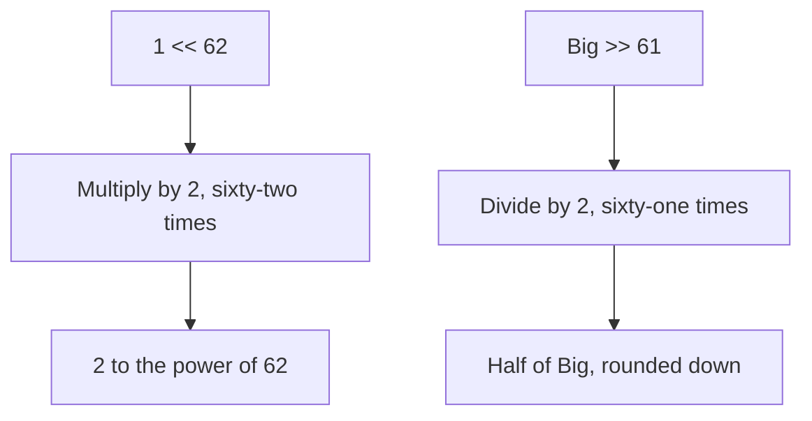

# Go Bit-Shift Operators

## TLDR

- `x << n` shifts the bits of `x` **left** by `n` positions; each left shift effectively multiplies by 2.
- `x >> n` shifts the bits of `x` **right** by `n` positions; each right shift effectively divides by 2.
- The right operand (`n`, the shift count) must be an integer type (or a value Go can implicitly convert to integer).
- Bit-shifting is the idiomatic way to express powers of two, like `1 << 62` meaning "2 to the power of 62."
- In Go, shifts appear most often inside `const` blocks to define large, exact numeric constants.

## The problem: expressing huge, exact powers of two

Some values are awkward to write out as decimal literals. `2^62` is `4611686018427387904`, and getting a single digit wrong is easy and invisible. Bit-shift operators let you express such numbers precisely and readably: `1 << 62` says "take the number 1 and shift it left 62 bits," which is exactly `2^62`. They are also the natural way to build bit masks and flags.

<div style={{display: 'flex', justifyContent: 'center'}}>



</div>

## What the operators do

The left-shift operator `<<` moves every bit of its first operand left by the number of positions given by its second operand. Bits shifted past the end are dropped, and zeros fill in on the right. Each shift by one position doubles the value, so `x << n` equals `x` multiplied by `2^n`.

The right-shift operator `>>` moves bits the other way. Each shift by one position halves the value (integer division), so `x >> n` equals `x` divided by `2^n`, rounding toward zero for integers.

```go
const (
    Big   = 1 << 62   // 2^62
    Small = Big >> 61 // 2^62 / 2^61 = 2
)
```

Here `Big` is `2^62`, and `Small` is `Big` shifted back right by 61, giving `2`. The operators work together to derive one constant from another without writing any decimal literal.

## The operand type rule

The shift count (the right operand) must be an integer. Go requires the second operand to be of an integer type, or an untyped constant that can be represented as an integer. You cannot shift by a float.

```go
const Big = 1 << 62      // 62 is an untyped integer constant, valid
// const Bad = 1 << 1.5  // invalid: shift count must be integer
```

The first operand can also be negative or any integer type; the shift itself just moves bits, and signedness affects whether right shifts preserve the sign bit (arithmetic shift) or not.

## Why this matters in practice

Bit shifts show up in Go most often in two places: defining large constants cleanly, and building bit flags where each bit means something. In the constants article, `Big = 1 << 62` is exactly this: a precise, self-documenting power of two that would be painful and error-prone to write as a decimal literal.

## Summary

`<<` and `>>` move bits left and right, multiplying or dividing by powers of two. The shift count must be an integer. Use them to express large powers of two and bit masks without writing huge or error-prone decimal numbers, which is why they appear so often inside Go `const` blocks.

## Sources

- The Go Programming Language Specification, [Arithmetic operators](https://go.dev/ref/spec#Arithmetic_operators) - the definition of `<<` and `>>`, and the requirement that the shift count be an integer type.
- Go Bootcamp (Matt Aimonetti), [Constants](https://www.gobootcamp.com/book/constants) - the note on left-shift and right-shift semantics and the `1 << 62` / `Big >> 61` example.
- A Tour of Go, [Numeric Constants](https://go.dev/tour/basics/16) - the use of large constants formed by shifts.
