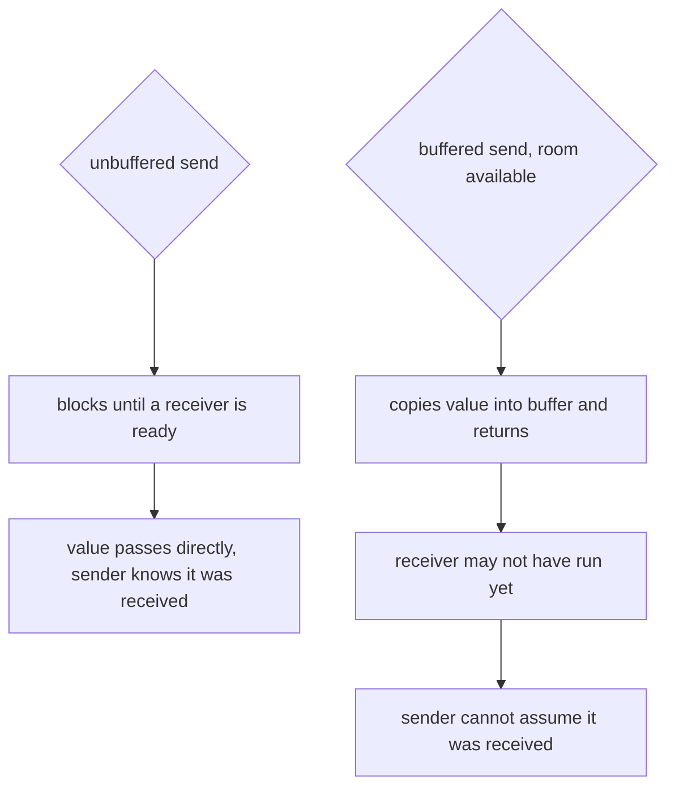

# Buffered vs Unbuffered Channels in Go

## TLDR

- Two differences, and they are the same difference seen from two sides.
- **Unbuffered** (`make(chan T)`): a send and its receive are one synchronous handoff. The sender blocks until a receiver is present, and when the send returns the receiver has the value.
- **Buffered** (`make(chan T, n)`): a send drops the value into the buffer and returns immediately if there is room. The receiver can join later, up to `n` values late.
- So with unbuffered you can conclude "the listener got it." With buffered you cannot, because the value may still be sitting in the buffer.
- "Later" is not "never": once the buffer is full, the next send blocks until someone receives.
- Pick unbuffered when the reader must be there and you want the handoff guaranteed. Pick buffered when the reader joins later and you do not want to block now, and choose `n` as how far ahead you are willing to run.

## The one difference

An unbuffered channel has no storage. For a send to complete, a receiver must be parked on the channel at that instant. The two goroutines meet, the value passes directly from one to the other, and both proceed. This is why the send is a **synchronous handoff**: the moment your `ch <- v` returns, you know the other goroutine took `v`.

A buffered channel has storage. A send copies the value into the buffer and returns if there is room, whether or not anyone is reading. The receiver can come along later and drain it. This is an **asynchronous drop-off**.

<div style={{display: 'flex', justifyContent: 'center'}}>



</div>

## What that means when you send

The practical consequence is what you said: the mode decides what the sender is allowed to conclude.

With an unbuffered channel, a returned send means the receiver has the value. That makes it useful for a handoff, for a signal, or for request/response, anywhere "it has arrived" must be true.

With a buffered channel, a returned send only means the value was accepted. The receiver may run much later, or not yet at all. That is the point when the reader joins later and you do not want to block now. It is also the trap: if you send and then assume the other side has acted, you can be wrong by up to `n` values.

This is the whole difference in two programs:

```go
// unbuffered: this send returns only once the receiver has taken "ping"
ch := make(chan string)
go func() { time.Sleep(100 * time.Millisecond); fmt.Println("got", <-ch) }()
ch <- "ping"
fmt.Println("send returned, receiver has it")

// buffered: this send returns immediately, receiver has not run yet
buf := make(chan string, 1)
go func() { time.Sleep(100 * time.Millisecond); fmt.Println("got", <-buf) }()
buf <- "ping"
fmt.Println("send returned, value still in the buffer")
```

```
send returned, receiver has it
got ping
```

```
send returned, value still in the buffer
got ping
```

## A buffer only lets the reader be late, not absent

A buffer does not remove the need for a receiver. It removes the need for one *right now*, for the first `n` sends. After that the buffer is full and the next send blocks, exactly like an unbuffered one.

```go
ch := make(chan int, 2)
ch <- 1 // ok, buffer has room
ch <- 2 // ok, buffer now full
ch <- 3 // blocks until someone receives
```

If nobody ever receives, that third send never completes and the program reports `fatal error: all goroutines are asleep - deadlock!`. So the buffer buys you a bounded amount of look-ahead, and `n` is the size of that allowance. If the reader might join much later, or never, a buffer is the wrong fix; you want a reader that always drains, or a way to cancel the send.

## Summary

Unbuffered is a synchronous handoff: the sender waits for a receiver and, when the send returns, the value has been received. Buffered is an asynchronous drop-off: the send returns once the value is in the buffer, so the receiver can join later, up to `n` values late, and the sender cannot assume it was received. That is the entire difference. Pick unbuffered when you need the arrival guarantee and the reader must be present; pick buffered when the reader will join later and you do not want to block now, sizing the buffer as how far ahead you are willing to run.

## Sources

- The Go Programming Language Specification, [Channel types](https://go.dev/ref/spec#Channel_types) - "If the capacity is zero or absent, the channel is unbuffered and communication succeeds only when both a sender and receiver are ready. Otherwise, the channel is buffered and communication succeeds without blocking if the buffer is not full (sends) or not empty (receives)."
- The Go Programming Language Specification, [Send statements](https://go.dev/ref/spec#Send_statements) - "A send on an unbuffered channel can proceed if a receiver is ready. A send on a buffered channel can proceed if there is room in the buffer."
- Effective Go, [Channels](https://go.dev/doc/effective_go#channels) - "Unbuffered channels combine communication ... with synchronization"; "If the channel is unbuffered, the sender blocks until the receiver has received the value. If the channel has a buffer, the sender blocks only until the value has been copied to the buffer."
- Rob Pike, [Go Concurrency Patterns](https://go.dev/talks/2012/concurrency.slide) - "Buffering removes synchronization. Buffering makes them more like Erlang's mailboxes. Buffered channels can be important for some problems but they are more subtle to reason about."
- Go by Example, [Channel Buffering](https://gobyexample.com/channel-buffering) - "By default channels are unbuffered ... Buffered channels accept a limited number of values without a corresponding receiver for those values."
- A Tour of Go, [Buffered Channels](https://go.dev/tour/concurrency/3) - "Sends to a buffered channel block only when the buffer is full. Receives block when the buffer is empty."
