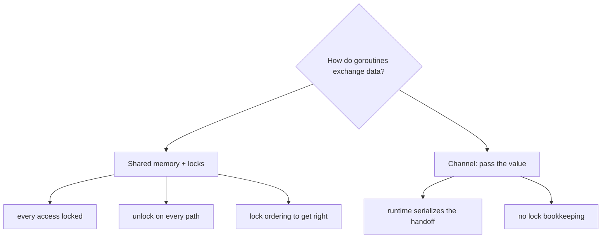
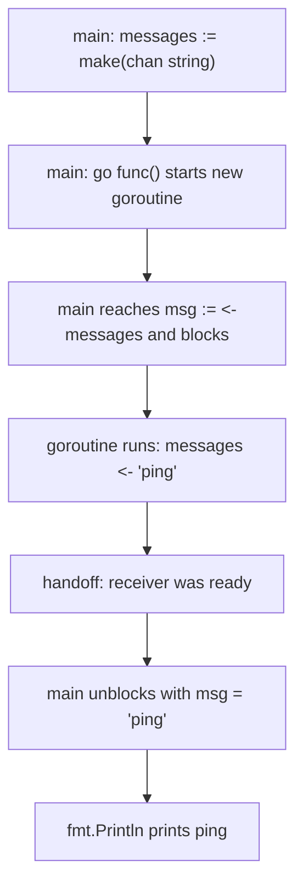
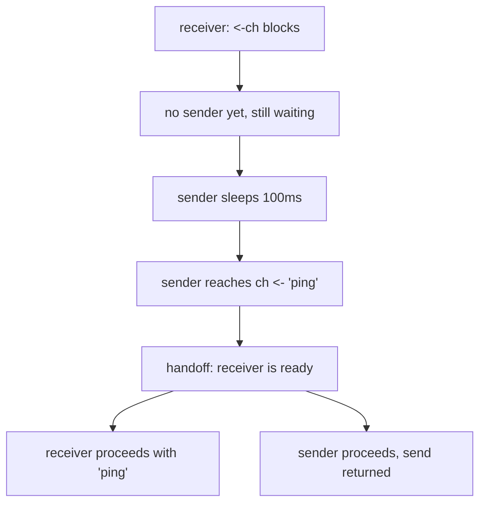
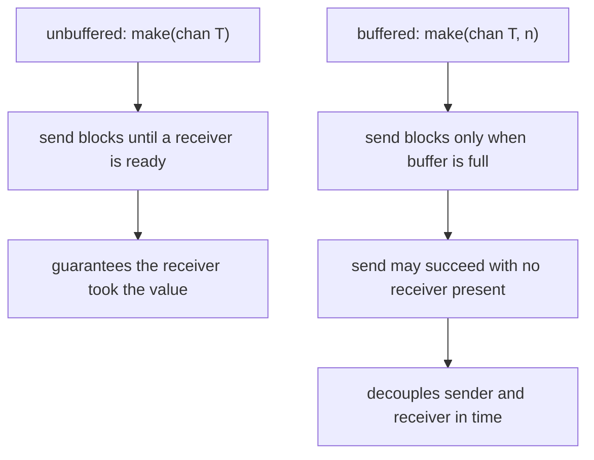
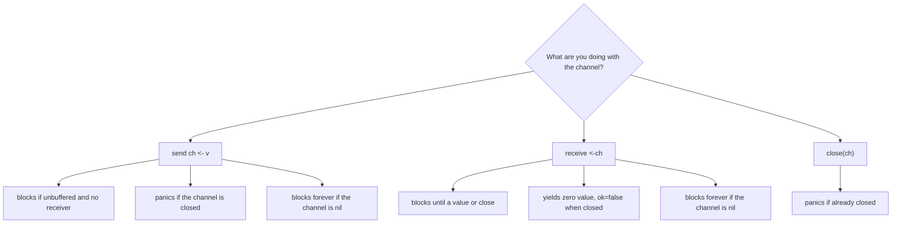

# Go Channels

## TLDR

- A channel is a **typed pipe**: `make(chan T)` creates one, `ch <- v` sends, and `<-ch` receives.
- Channels connect goroutines. A value sent in one goroutine is received in another, with the runtime guaranteeing the handoff.
- By default a channel is **unbuffered**: a send blocks until a receiver is ready, and a receive blocks until a sender sends. Both sides meeting is called a rendezvous.
- That blocking **is** the synchronization. The [Go by Example](https://gobyexample.com/channels) program waits for `"ping"` at the end without any mutex, `WaitGroup`, or sleep, because the receive cannot proceed until the value arrives.
- A **buffered** channel `make(chan T, n)` accepts up to `n` values before a send blocks.
- `close(ch)` marks a channel done; `range ch` drains it, and a receive from a closed channel returns the zero value with `ok == false`.
- A send on a **closed** channel panics. A send or receive on a **nil** channel blocks forever, which the runtime reports as a deadlock.
- The idiom behind all of this: **do not communicate by sharing memory; instead, share memory by communicating.**

## The problem: getting data from one goroutine to another safely

Once you can start concurrent work with `go`, the next problem is unavoidable: the goroutines have to exchange data. A worker produces a result, and another goroutine has to consume it. The worker is done, and something has to know.

Traditional threads solve this by sharing memory. All threads see the same variables, and to keep them consistent you protect every shared access with a lock. It works, but the lock management is easy to get wrong: forget to unlock on one path and you deadlock, take two locks in different orders and you deadlock, and every read of shared data has to remember which lock guards it. The bookkeeping grows faster than the logic.

Go's answer comes from C. A. R. Hoare's Communicating Sequential Processes: instead of sharing a variable and coordinating access to it, **pass the value**. A channel is the pipe that value travels through, and the Go runtime ensures only one goroutine touches the data at a time. This is the idea the Go blog summarizes as:

> Do not communicate by sharing memory; instead, share memory by communicating.

The blog's own `Poller` example shows the effect. The lock-based version is a page of `Lock`/`Unlock` pairs around a shared slice wrapped in a mutex. The channel version is:

```go
type Resource string

func Poller(in, out chan *Resource) {
    for r := range in {
        // poll the URL

        // send the processed Resource to out
        out <- r
    }
}
```

The delicate locking logic is gone, and the data structure no longer carries bookkeeping fields. That is the payoff channels are for.

<div style={{display: 'flex', justifyContent: 'center'}}>



</div>

## Creating a channel and sending a value

A channel is created with `make`, and it is **typed by the values it carries**. A `chan string` can only send and receive strings; the compiler enforces it, so a channel cannot be used to smuggle the wrong type.

```go
messages := make(chan string)
```

The arrow operator does both directions of traffic. `ch <- v` sends `v` into the channel, and `<-ch` receives from it. Read the arrow as the direction the value flows:

```go
ch <- "ping"  // send "ping" into ch
msg := <-ch   // receive a value from ch into msg
```

Because a channel is a value, you can hold it in a variable, pass it to a function, and store it in a struct. A function that only sends takes `chan<- T`, one that only receives takes `<-chan T`, and the compiler prevents either from doing the other operation.

## The canonical example

This is the program from Go by Example, and it is the smallest useful demonstration of all the pieces together.

```go
package main

import "fmt"

func main() {
    messages := make(chan string)

    go func() { messages <- "ping" }()

    msg := <-messages
    fmt.Println(msg)
}
```

Run it and it prints `ping`. That single word is a value that was created in one goroutine and consumed in another, with no shared variable and no lock.

The notable part is what is **not** in the program. There is no `time.Sleep`, no `sync.WaitGroup`, no mutex. The `main` goroutine reaches `<-messages` and blocks there. It cannot proceed until a value arrives. The anonymous goroutine sends `"ping"`, which unblocks the receive, and only then does `fmt.Println` run. The channel did the waiting for us.

<div style={{display: 'flex', justifyContent: 'center'}}>



</div>

## The rendezvous: why sends and receives block

By default a channel is **unbuffered**, and "default" is doing a lot of work here. On an unbuffered channel, communication happens only when a sender and a receiver are both present. The Go spec states it exactly:

> Communication blocks until the send can proceed. A send on an unbuffered channel can proceed if a receiver is ready. A send on a buffered channel can proceed if there is room in the buffer.

So a send and its matching receive are two halves of one event. Whichever side arrives first waits for the other. This is why the `"ping"` program waits correctly at the end: the receive is not "checking for a message", it is parked until the send happens.

You can watch the rendezvous directly. This program sleeps on the sender side:

```go
package main

import (
    "fmt"
    "time"
)

func main() {
    ch := make(chan string)

    go func() {
        time.Sleep(100 * time.Millisecond)
        fmt.Println("sender: about to send")
        ch <- "ping"
        fmt.Println("sender: send returned")
    }()

    fmt.Println("receiver: about to receive")
    msg := <-ch
    fmt.Println("receiver: got", msg)
    time.Sleep(50 * time.Millisecond)
}
```

```
receiver: about to receive
sender: about to send
sender: send returned
receiver: got ping
```

The receiver prints first and blocks. Only when the sender reaches `ch <- "ping"` does the value transfer, and the sender's `send returned` line prints immediately after, because the send completed the moment the receiver was ready. Both sides move on together. That simultaneous exchange is the rendezvous.

<div style={{display: 'flex', justifyContent: 'center'}}>



</div>

Unbuffered channels are the right default precisely because of this property. A channel with no buffer guarantees the sender knows the receiver actually took the value, which is what turns a channel into a synchronization primitive and not just a queue.

## Directional channel types

A channel type can be restricted to one direction, and this is worth using in function signatures because it documents intent and prevents mistakes. The spec's send statement also notes the natural asymmetry: the channel direction must permit the operation, so a function handed a `<-chan int` cannot send on it.

```go
func produce(out chan<- int) { out <- 42; close(out) }
func consume(in <-chan int)  { fmt.Println("consume:", <-in) }

func main() {
    ch := make(chan int)
    go produce(ch)
    consume(ch)
}
```

`produce` is handed a send-only view and `consume` a receive-only view, both pointing at the same underlying channel. Neither can perform the other's operation: the compiler stops it.

## Buffered channels

A buffered channel is created with a capacity, and `make(chan T, n)` lets a sender proceed without a waiting receiver, up to `n` values. The send only blocks when the buffer is full, and the receive only blocks when it is empty.

```go
buf := make(chan int, 2)
buf <- 1
buf <- 2
// no receiver is waiting yet, but these sends did not block
fmt.Println(len(buf), cap(buf)) // 2 2
```

```
2 2
```

`len` reports how many values are currently sitting in the buffer; `cap` is the capacity. Buffering is a trade: it removes the requirement that both sides be present at the same instant, which is useful for smoothing bursts, but it also means a send does **not** guarantee the receiver has the value. When you want synchronization, an unbuffered channel says so more clearly. Buffering is about decoupling in time, not about the handoff guarantee.

<div style={{display: 'flex', justifyContent: 'center'}}>



</div>

## Closing a channel and ranging over it

`close(ch)` says "no more values will be sent." It is not a way to receive, and it is not required for correctness unless something is ranging or waiting for the end of the stream. Once closed:

- A receive returns any buffered values first, then the zero value of the element type, immediately.
- The two-value receive form `v, ok := <-ch` reports `ok == false` once the channel is closed and drained, which is how you distinguish "closed" from "sent a zero value."
- `range ch` receives values until the channel is closed, then stops. This is the idiomatic consumer loop.

```go
nums := make(chan int)
go func() {
    for i := 1; i <= 3; i++ {
        nums <- i
    }
    close(nums)
}()

for n := range nums {
    fmt.Println("range got", n)
}

v, ok := <-nums
fmt.Printf("closed recv: v=%d ok=%v\n", v, ok)
```

```
range got 1
range got 2
range got 3
closed recv: v=0 ok=false
```

Two rules to keep close. First, **close from the sender**, never the receiver, because only the side that knows there are no more values should signal it. Second, **do not send on a closed channel**: that is a run-time panic, and the panic message is literally `send on closed channel`. The receiver side is safe to reuse a closed channel; it just keeps getting the zero value with `ok == false`.

## nil channels block forever

The zero value of a channel type is `nil`, and a nil channel is not empty; it is inert. A send or receive on a nil channel blocks forever. If nothing can ever unblock it and no other goroutine can make progress, the runtime detects that the whole program is stuck and reports:

```
fatal error: all goroutines are asleep - deadlock!
```

It also names the operation, for example `[chan receive (nil chan)]`. This is genuinely useful while learning: a deadlock message usually means you are waiting on a channel that nobody will ever send to, often because you forgot to start the sending goroutine or forgot to close a channel a `range` loop is waiting on.

<div style={{display: 'flex', justifyContent: 'center'}}>



</div>

## Why this matters

Channels are not just a queue type. They are the mechanism that makes the second half of Go's concurrency slogan concrete. Sharing a slice behind a mutex means every goroutine that touches it must agree on the lock; passing values over a channel means only one goroutine holds the value at any time, and the runtime, not your discipline, enforces the handoff. That is why the lock-based `Poller` shrinks to a few lines, and why the `"ping"` program needs no synchronization code at all: the blocking receive is the synchronization.

A channel is also only half the picture. The other half is `select`, which lets one goroutine wait on several channels at once, and contexts, which let a wait be cancelled. Those build directly on the send-and-receive-at-one-rendezvous behavior described here.

## Summary

A channel is a typed pipe created with `make(chan T)`, with `ch <- v` to send and `<-ch` to receive. An unbuffered channel makes every send wait for a ready receiver and every receive wait for a sender, so the rendezvous itself is the synchronization; this is why the Go by Example program waits for `"ping"` without any other coordination. A buffered channel `make(chan T, n)` decouples the two sides in time by holding up to `n` values. Restrict direction with `chan<- T` and `<-chan T`. Closing signals the end: `range` drains, `v, ok := <-ch` reports `ok == false` after close, sending on a closed channel panics, and nil channels block forever until the runtime reports a deadlock. Underneath it all is the rule that instead of sharing memory and locking it, you pass the value.

## Sources

- The Go Blog, Andrew Gerrand, [Share Memory By Communicating](https://go.dev/blog/codelab-share) - the lock-based versus channel-based `Poller` example and the canonical quote "Do not communicate by sharing memory; instead, share memory by communicating."
- The Go Programming Language Specification, [Channel types](https://go.dev/ref/spec#Channel_types) - channel direction types, `chan<- T` and `<-chan T`, and how direction constrains operations.
- The Go Programming Language Specification, [Send statements](https://go.dev/ref/spec#Send_statements) - "Communication blocks until the send can proceed. A send on an unbuffered channel can proceed if a receiver is ready. A send on a buffered channel can proceed if there is room in the buffer. A send on a closed channel proceeds by causing a run-time panic. A send on a nil channel blocks forever."
- The Go Programming Language Specification, [Receive operator](https://go.dev/ref/spec#Receive_operator) - the `v, ok := <-ch` form and the behavior of receiving from a closed channel.
- The Go Programming Language Specification, [Close](https://go.dev/ref/spec#Close) and [For statements with range clause](https://go.dev/ref/spec#For_statements) - closing a channel and ranging over one until it is closed.
- Effective Go, [Channels](https://go.dev/doc/effective_go#channels) - channels as the way goroutines communicate, and the synchronization they provide.
- Go by Example, [Channels](https://gobyexample.com/channels) - the `messages`/`"ping"` example this article is based on, and the note that "sends and receives block until both the sender and receiver are ready."
- The `builtin` package documentation, [make](https://pkg.go.dev/builtin#make) - creating channels and the meaning of the capacity argument.
