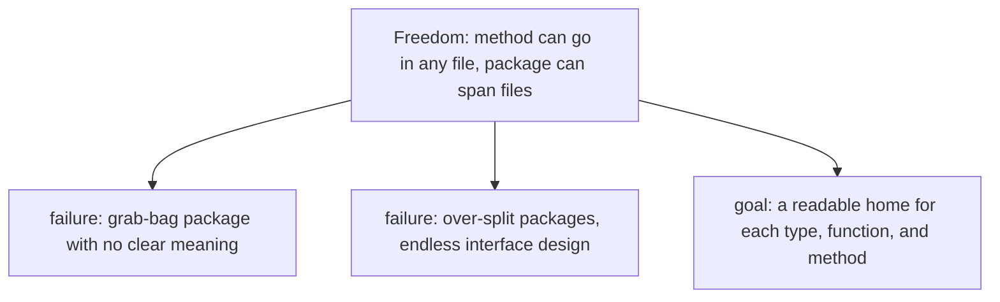
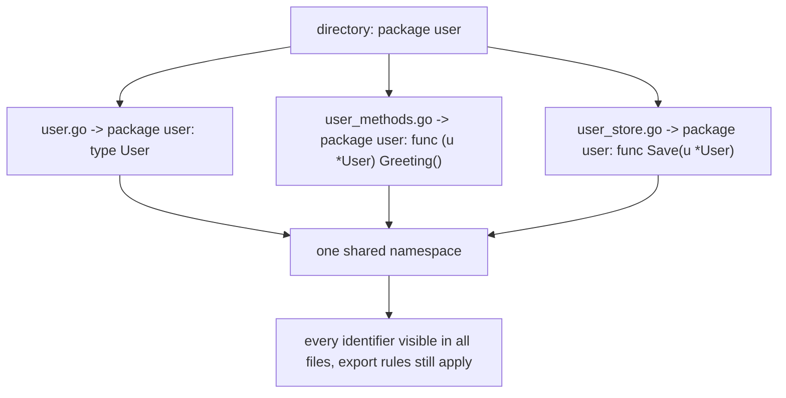
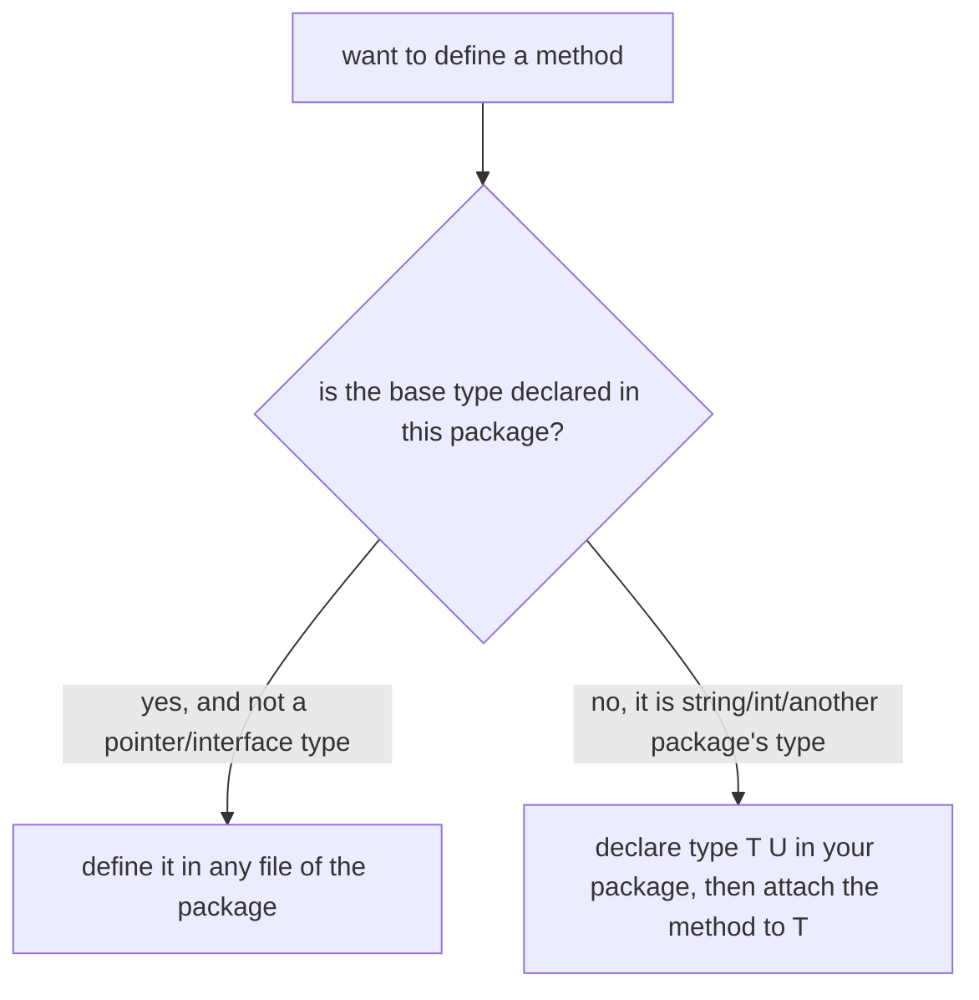
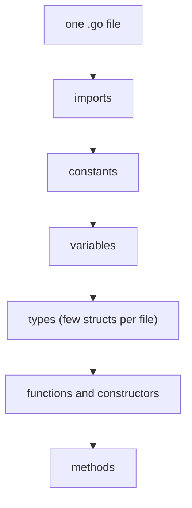
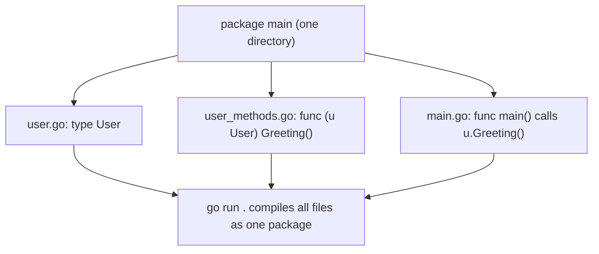
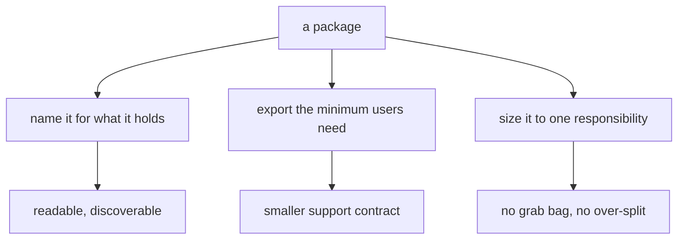

# Organizing Go Code: Where Types, Functions, and Methods Live

## TLDR

- A **package is one directory**. Every `.go` file in that directory declares the same `package` name, and all of them share one namespace. A package can span many files.
- A method can live in **any file of the package**, not necessarily the file that declares the type. The binding comes from the receiver type, not from file location, so `user.go` can hold the struct and `user_methods.go` can hold its methods.
- The specification fixes only the top-level order inside a file: package clause, then imports, then declarations. The **imports, constants, variables, types, constructors, then methods** order is a readable convention, not a language rule.
- You can define methods on any type you declare in the package, not just structs, but not on a type from another package or a basic type. For those, declare a new defined type (see [Defined Types](./go-defined-types.md)).
- Keep each package meaningful and its **exported surface small**. The Go blog's rule: "If in doubt, leave it out!" A large public interface is a large support contract.
- `gofmt` owns whitespace and formatting, so organization is really about naming, grouping, and what each file and package is responsible for.

## The problem: Go separates behavior from the type, so where does it go?

In a class-based language, the method has an obvious home: inside the class body. Go deliberately removes that container. A method is declared outside the type, and the same package may be spread across many files. That is a lot of freedom, and freedom without a convention produces two failure modes the Go blog names directly:

> It is easy to just throw everything into a "grab bag" package, but this dilutes the meaning of the package name (as it must encompass a lot of functionality) and forces the users of small parts of the package to compile and link a lot of unrelated code. On the other hand, it is also easy to go overboard in splitting your code into small packages, in which case you will likely become bogged down in interface design, rather than just getting the job done.

So the problem is not "how do I make Go compile," since any arrangement compiles. It is "where should this type, function, and method live so a reader can find it, and so the package name still means something?" This article answers that, starting from what the language actually guarantees and then adding the conventions that the Go team uses.

<div style={{display: 'flex', justifyContent: 'center'}}>



</div>

## A package is a directory, and it can span files

The specification is precise: "A package in turn is constructed from one or more source files that together declare constants, types, variables and functions belonging to the package and which are accessible in all files of the same package." It also says "A set of files sharing the same PackageName form the implementation of a package," and that an implementation may require all files of a package to sit in the same directory, which the `go` tool does.

The practical consequences:

- One directory equals one package. You cannot put two packages in the same directory.
- Every file in the directory starts with the same `package` clause.
- An identifier declared in any file (a type, constant, variable, function, or method) is visible to every other file in the package, including unexported identifiers. There is no per-file visibility.
- Files divide a package for the reader's benefit, not for the compiler's.

This is why a package is best thought of as the unit of code, and a module (introduced in [Modules, Packages, and Type Aliases](./go-modules-and-type-aliases.md)) as the unit of versioning and distribution that contains one or more packages.

<div style={{display: 'flex', justifyContent: 'center'}}>



</div>

## Where a method is allowed to go

Because a method is bound by its receiver type and not by a file, the placement rule is simply: define it in **any file of the same package**. The receiver rule from [Go Methods and Method Receivers](./go-methods-and-receivers.md) is what constrains *what* it can attach to:

- The receiver base type must be a defined type declared in the same package as the method.
- The receiver cannot be a pointer or interface type.
- You cannot define a method on a type from another package, including predeclared types such as `string` and `int`.

When the type belongs to someone else, you declare a new defined type in your package and attach the method to that. The mechanics (and why an alias will not work) are in [Defined Types: Adding Methods to Types You Do Not Own](./go-defined-types.md).

<div style={{display: 'flex', justifyContent: 'center'}}>



</div>

## A recommended layout for a single file

The specification's "source file organization" defines the required skeleton: the package clause, then imports, then top-level declarations. It does not dictate the order of the declarations themselves. The convention that reads best, and the one the Go Bootcamp material recommends, is:

1. imports
2. constants
3. variables
4. types (keep the number of structs per file low)
5. functions (including constructors like `NewUser`)
6. methods

Putting the types before the methods that use them means a reader meets the data, then the constructors, then the behavior attached to it. Here is the complete example with that ordering:

```go
package main

import (
	"fmt"
)

const (
	ConstExample = "const before vars"
)

var (
	ExportedVar    = 42
	nonExportedVar = "so say we all"
)

// The main type(s) for the file.
type User struct {
	FirstName, LastName string
	Location            *UserLocation
}

type UserLocation struct {
	City    string
	Country string
}

// Functions, including constructors.
func NewUser(firstName, lastName string) *User {
	return &User{
		FirstName: firstName,
		LastName:  lastName,
		Location: &UserLocation{
			City:    "Santa Monica",
			Country: "USA",
		},
	}
}

// Methods.
func (u *User) Greeting() string {
	return fmt.Sprintf("Dear %s %s", u.FirstName, u.LastName)
}

func main() {
	us := User{
		FirstName: "Matt",
		LastName:  "Damon",
		Location: &UserLocation{
			City:    "Santa Monica",
			Country: "USA",
		},
	}
	fmt.Println(us.Greeting())
}
```

A few details worth calling out, because they link back to earlier articles:

- `Location` is declared `*UserLocation`, so its value is a pointer, and the literal assigns `&UserLocation{...}` to match. This is the value-vs-pointer choice from [Go Pointers](./go-pointers.md): the field is a pointer, so you give it an address.
- `NewUser` is a constructor by convention, not a language feature. Go has no constructors; `NewUser` is a normal function that returns a ready-to-use `*User`. The `New` prefix is idiomatic ([Exported Names](./go-exported-names.md)).
- The order above is a convention. The compiler accepts any order, and `gofmt` will not reorder your declarations. Tools like `gopls` also provide an "organize imports" action, but they will not rearrange constants and types for you, so the discipline is yours.

<div style={{display: 'flex', justifyContent: 'center'}}>



</div>

## Splitting one package across several files

A package spanning multiple files is legal, and it is a useful tool once a file grows. The type can live in one file and its methods in another, and the compiler does not care. The only requirements are that the files are in the same directory and declare the same package name.

```go
// user.go
package main

type User struct {
	FirstName, LastName string
}
```

```go
// user_methods.go
package main

import "fmt"

func (u User) Greeting() string {
	return fmt.Sprintf("Dear %s %s", u.FirstName, u.LastName)
}
```

```go
// main.go
package main

import "fmt"

func main() {
	u := User{"Matt", "Aimonetti"}
	fmt.Println(u.Greeting()) // Dear Matt Aimonetti
}
```

Running `go run .` in that directory compiles all three together, because they are one package. This is the mechanism the Go Bootcamp material describes when it says "a package can span multiple files," and it stresses the right framing: you *can* do this, you are not *required* to. Splitting pays off when files become long or when a natural seam appears (types in one file, HTTP handlers in another, storage in a third), and it costs almost nothing because there is no visibility boundary between files of the same package.

<div style={{display: 'flex', justifyContent: 'center'}}>



</div>

## Keeping the package meaningful

The file layout is the small version of the problem. The larger version is what belongs in a package at all, and how much of it you expose. The Go blog's guidance is short and holds up:

- **Choose good names.** A package name gives its contents context. The standard library's `bytes.Buffer` reads well because `bytes` supplies the meaning; the same type in a package called `util` would need a clumsier name. The last element of an import path is conventionally the package name, so `net/http` contains `package http`.
- **Minimize the exported interface.** "The larger the interface you provide, the more you must support." Every exported type, function, variable, and constant becomes an implicit contract with users, and the blog's advice is blunt: "If in doubt, leave it out!" This is why Go's export rule is just capitalization (see [Exported Names](./go-exported-names.md)); a lowercase name keeps a thing private.
- **Avoid both the grab bag and the over-split.** Some standard library packages are large (`http` spans many files and exports over a hundred identifiers) and some are tiny (`hash` is one file with three declarations). There is no hard rule; the size should match the responsibility. `package main` is allowed to be larger than others, because a command often contains code that is only useful to that executable.

<div style={{display: 'flex', justifyContent: 'center'}}>



</div>

## Checklist

| Question | Good answer |
| --- | --- |
| Is this type, function, or method in the package that owns it? | Yes. The receiver base type must be in the same package. |
| Which file should it live in? | Any file in the package; group by responsibility, not by accident. |
| What order inside the file? | imports, constants, variables, types, functions, methods (a convention). |
| Should this package be split? | Only when a file or responsibility grows; files share one namespace. |
| Should this identifier be exported? | Only if users need it. Otherwise keep it lowercase. |
| Does the package name still describe everything in it? | If not, it has become a grab bag, split or rename it. |

## Summary

Go organizes code with packages, not classes. A package is a directory, every file in it shares one package name and one namespace, and a method can be declared in any of those files because it is bound by its receiver type, not by location. The spec fixes the top of a file (package clause, imports, declarations), while the readable order of constants, variables, types, functions, and methods is a convention you maintain yourself; `gofmt` handles formatting but not arrangement. You cannot attach a method to another package's type or a basic type, so a defined type is the tool for that. Beyond layout, the design work is keeping a package focused on one responsibility and its exported surface as small as it can be, because every exported name is a promise you have to keep.

## Sources

- The Go Programming Language Specification, [Packages](https://go.dev/ref/spec#Packages) and [Source file organization](https://go.dev/ref/spec#Source_file_organization), for "A package in turn is constructed from one or more source files ...," the package clause/imports/declarations skeleton, "A set of files sharing the same PackageName form the implementation of a package," and the same-directory requirement.
- The Go Programming Language Specification, [Method declarations](https://go.dev/ref/spec#Method_declarations), for the receiver base type rule (the type must be declared in the same package as the method, and cannot be a pointer or interface type).
- Andrew Gerrand, [Organizing Go code](https://go.dev/blog/organizing-go-code) (Go Blog, 2012), for naming (`bytes.Buffer`), minimizing the exported interface and "If in doubt, leave it out!," the grab-bag vs over-split trade-off, the standard library size examples, and the note that `package main` is often larger.
- Effective Go, [Formatting](https://go.dev/doc/effective_go#formatting), [Commentary](https://go.dev/doc/effective_go#commentary), and [Package names](https://go.dev/doc/effective_go#package-names), for `gofmt` as the formatting authority, doc comments, and the package-name conventions.
- Go Bootcamp (Matt Aimonetti), [Code Organization](https://www.gobootcamp.com/book/codeorganization), for the recommended imports/constants/variables/types/functions/methods order, the "few structs per file" advice, and the statement that a package can span multiple files.
- Go Bootcamp (Matt Aimonetti), [Methods](https://www.gobootcamp.com/book/methods), for the `NewUser` constructor and the `&UserLocation` pointer field example.
- The Go Programming Language Specification, [Address operators](https://go.dev/ref/spec#Address_operators), for why a `*UserLocation` field is assigned `&UserLocation{...}`.
