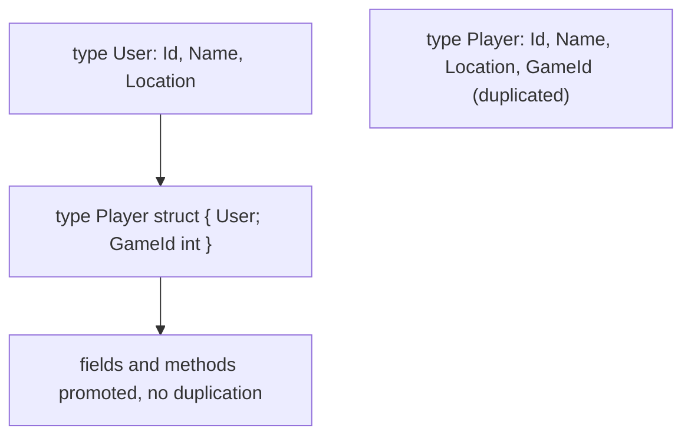
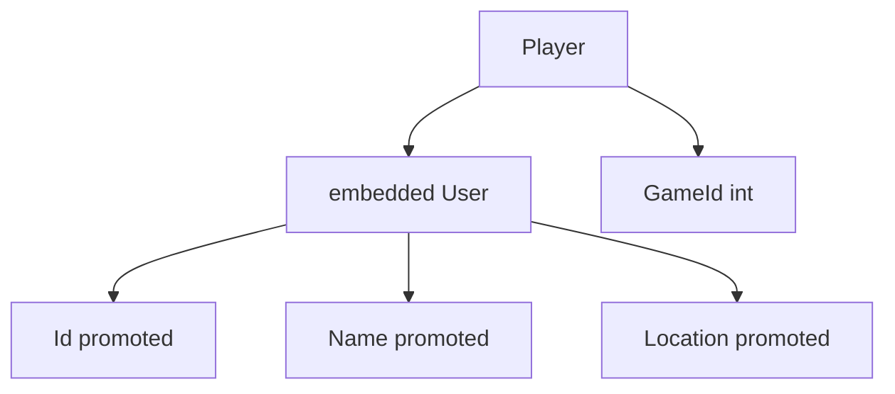
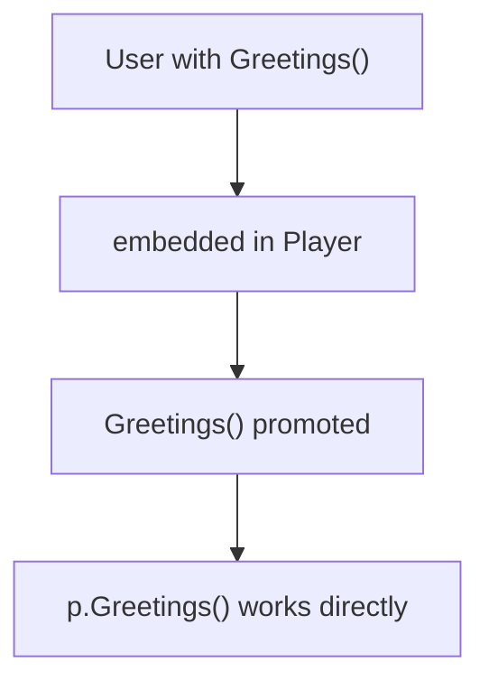
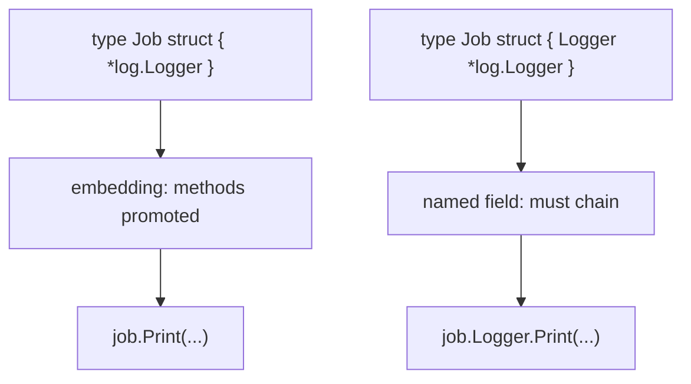

# Go Composition (Struct Embedding)

## TLDR

- Go replaces inheritance with **composition**: embed one struct inside another to reuse its fields and methods.
- An embedded field is declared by its type only, with no name: `type Player struct { User; GameId int }`.
- Embedded fields and methods are **promoted**: `p.Id` and `p.Greetings()` work directly on the outer struct.
- A struct literal with an embedded type must pass the **whole embedded struct** as one value, not its individual fields.
- Embedding a pointer type such as `*log.Logger` promotes all of that type's methods, effectively "inheriting" an implementation.

## The problem: reusing fields without inheritance

Object-oriented programmers reach for inheritance to say "a `Player` is a `User`, plus a bit more." Go has no inheritance, so it must solve the same problem another way. The concrete symptom is duplicated code: a `Player` needs the same fields as a `User` plus one extra, and writing them twice is both tedious and a maintenance hazard. Go's answer is composition, or *embedding*: nest one struct inside another so the outer type reuses the inner type's fields and methods.

<div style={{display: 'flex', justifyContent: 'center'}}>



</div>

## The duplication problem

Without embedding, a `Player` that needs a `User`'s fields copies them all:

```go
package main

import "fmt"

type User struct {
    Id       int
    Name     string
    Location string
}

type Player struct {
    Id       int
    Name     string
    Location string
    GameId   int
}

func main() {
    p := Player{}
    p.Id = 42
    p.Name = "Matt"
    p.Location = "LA"
    p.GameId = 90404
    fmt.Printf("%+v", p)
}
```

`Player` duplicates every `User` field just to add `GameId`. For two fields this is harmless, but the duplication scales badly and, worse, keeps the two structs unrelated: nothing tells the compiler that a `Player` is conceptually a `User`.

## Embedding to reuse

Composition fixes this by embedding the `User` type directly, with no field name:

```go
type User struct {
    Id             int
    Name, Location string
}

type Player struct {
    User    // embeds all of User's fields
    GameId  int
}
```

The embedded `User` contributes its fields to `Player`, and they are accessed directly, as if they were declared on `Player` itself. This is called **field promotion**. You can initialize a `Player` with dot notation:

```go
p := Player{} // zero value
p.Id = 42
p.Name = "Matt"
p.Location = "LA"
p.GameId = 90404
fmt.Printf("%+v", p)
```

`p.Id`, `p.Name`, and `p.Location` are promoted from the embedded `User`, while `p.GameId` belongs to `Player` itself.

<div style={{display: 'flex', justifyContent: 'center'}}>



</div>

## Struct literals with an embedded type

The literal syntax is the one place embedding changes the rules. With an embedded type, you cannot pass the inner fields directly; you must pass the whole embedded struct as a single value.

```go
package main

import "fmt"

type User struct {
    Id             int
    Name, Location string
}

type Player struct {
    User
    GameId int
}

func main() {
    p := Player{
        User{Id: 42, Name: "Matt", Location: "LA"}, // the whole embedded struct
        90404,
    }
    fmt.Printf("Id: %d, Name: %s, Location: %s, Game id: %d\n",
        p.Id, p.Name, p.Location, p.GameId)
    p.Id = 11 // still directly settable after creation
    fmt.Printf("%+v", p)
}
```

Inside the literal, `User{Id: 42, Name: "Matt", Location: "LA"}` is one value for the embedded field, and `90404` is the `GameId`. Once the value exists, the promoted fields remain directly accessible, so `p.Id` reads and writes without qualification.

## Method promotion

Embedding promotes methods too. If `User` has a method, a `Player` can call it directly.

```go
package main

import "fmt"

type User struct {
    Id             int
    Name, Location string
}

func (u *User) Greetings() string {
    return fmt.Sprintf("Hi %s from %s", u.Name, u.Location)
}

type Player struct {
    User
    GameId int
}

func main() {
    p := Player{}
    p.Id = 42
    p.Name = "Matt"
    p.Location = "LA"
    fmt.Println(p.Greetings()) // promoted from User
}
```

`p.Greetings()` works because the `Greetings` method is promoted from the embedded `User`. This is the Go version of "inheriting" behavior: the outer struct gains the inner struct's methods through composition, with no class hierarchy.

<div style={{display: 'flex', justifyContent: 'center'}}>



</div>

## Embedding a pointer type

Embedding is not limited to struct values. You can embed a pointer, which promotes that type's methods onto the outer struct. A classic example is embedding `*log.Logger` so the outer type gains all the logging methods.

```go
package main

import (
    "log"
    "os"
)

type Job struct {
    Command string
    *log.Logger // embedded pointer: promotes all Logger methods
}

func main() {
    job := &Job{"demo", log.New(os.Stdout, "Job: ", log.Ldate)}
    job.Print("starting now...") // promoted from *log.Logger
}
```

By embedding `*log.Logger` instead of declaring a named `Logger` field, the `Job` type gains `Print`, `Printf`, and every other `*log.Logger` method directly, so `job.Print(...)` just works. Compare this to the non-embedded version, where the field has a name:

```go
type Job struct {
    Command string
    Logger  *log.Logger // a named field, not embedded
}

job := &Job{"demo", log.New(os.Stdout, "Job: ", log.Ldate)}
job.Logger.Print("test") // must go through the field name
```

With a named field you chain: `job.Logger.Print(...)`. With an embedded field you skip the name: `job.Print(...)`. Both are valid; embedding is what removes the middle step.

<div style={{display: 'flex', justifyContent: 'center'}}>



</div>

## `&Job{...}` vs `Job{...}`

The choice of pointer vs value shows up in embedded examples, so it is worth spelling out. `&Job{...}` produces a `*Job`; `Job{...}` produces a `Job` value. For a struct whose only use is reading fields or calling methods, both behave identically because Go auto-dereferences, and it auto-takes the address for pointer-receiver methods on addressable values. The practical differences are:

| Aspect | `&Job{...}` | `Job{...}` |
| --- | --- | --- |
| Type | `*Job` | `Job` |
| Copy on assignment | No (pointer copied) | Yes (whole struct) |
| Can be `nil` | Yes | No |
| Typical use | Sharing/mutating | Small, value-like data |

The one place it really matters is map values, which are not addressable:

```go
m := map[string]Job{"x": {Command: "a"}}
m["x"].SetCommand("b") // COMPILE ERROR: map elements are not addressable
```

Use `&T{...}` when the struct is large, needs mutation, or must be shared, and `T{...}` for small, copy-friendly values.

## Summary

Go replaces inheritance with composition: embed a struct (or pointer) inside another, and its fields and methods are promoted onto the outer type. Struct literals with an embedded type pass the whole embedded value rather than its individual fields, and embedding a pointer such as `*log.Logger` promotes an entire method set. This gives you the reuse and polymorphism of inheritance while keeping the type system flat and explicit.

## Sources

- Go Bootcamp (Matt Aimonetti), [Composition](https://www.gobootcamp.com/book/composition) - the `User`/`Player` duplication and embedding example, the struct-literal rule, and method promotion.
- Go Bootcamp (Matt Aimonetti), [Composition with log.Logger](https://www.gobootcamp.com/book/composition) - the `Job` example embedding `*log.Logger` and the promoted `Print` method.
- A Tour of Go, [Struct embedding](https://go.dev/tour/moretypes/3) - embedding as a form of composition and field promotion.
- The Go Programming Language Specification, [Struct types](https://go.dev/ref/spec#Struct_types) - the rule that an embedded field is declared with a type name but no field name.
