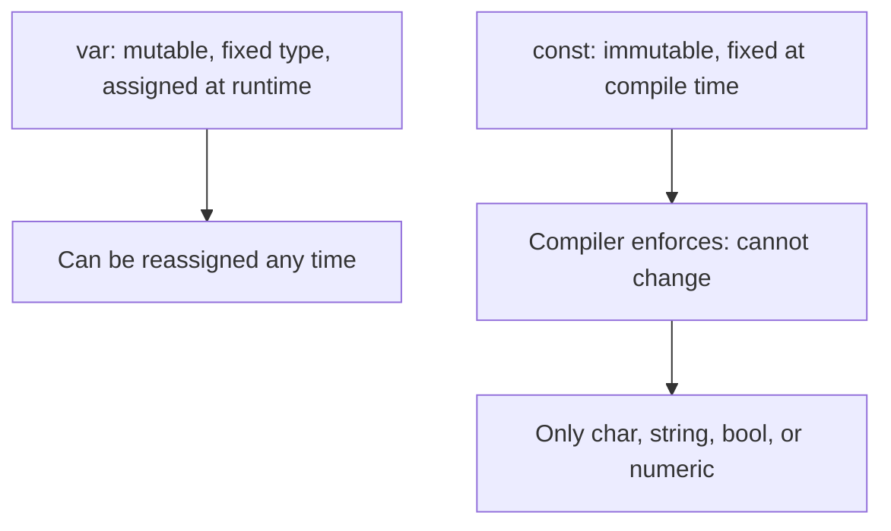
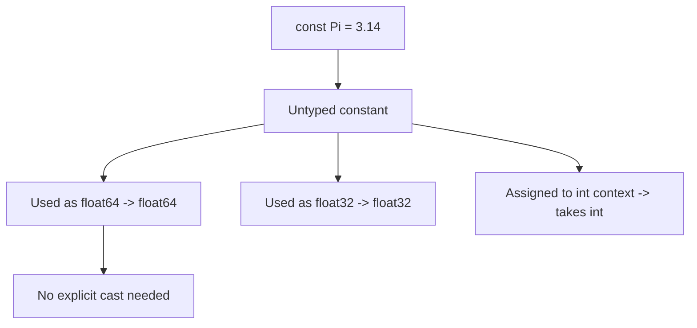

# Go Constants

## TLDR

- A constant is a value fixed at compile time, declared with `const` instead of `var`.
- Constants can only hold a **character, string, boolean, or numeric** value; no slices, maps, structs, or functions.
- Constants **cannot** be declared with `:=`; you must use `const` with an explicit `=` and value.
- An **untyped constant** has no concrete type until it is used; it takes on whatever type the surrounding context needs.
- Use a `const (...)` block to group related constants, and compute complex constant values with expressions like `1 << 62`.

## The problem: values that must never change

Variables are mutable by design, but a lot of values in a program should not change: HTTP status codes, mathematical constants, configuration limits. If these are ordinary variables, nothing stops accidental reassignment, and the compiler cannot make assumptions about them. Go gives you `const` to make these values fixed at compile time, so the compiler can rely on them and reject any attempt to mutate them.

<div style={{display: 'flex', justifyContent: 'center'}}>



</div>

## Declaring constants

A constant looks like a variable declaration but uses `const`. Unlike variables, a constant must be initialized when declared; you cannot write `const Pi` with no value.

```go
const Pi = 3.14
```

There is no `:=` for constants, because `:=` is a *short variable declaration*. Constants are a different category of thing, so Go forces you to say `const` explicitly.

```go
// Invalid:
// Pi := 3.14

// Valid:
const Pi = 3.14
```

## Grouping constants in a block

When constants belong together, use a `const` block. Each line is its own constant, and the syntax stays clean without repeating `const`.

```go
const (
    StatusOK                   = 200
    StatusCreated              = 201
    StatusAccepted             = 202
    StatusNonAuthoritativeInfo = 203
    StatusNoContent            = 204
    StatusResetContent         = 205
    StatusPartialContent       = 206
)
```

This mirrors the `var (...)` block pattern and is the standard way to define a set of named values like status codes.

## What constants can and cannot hold

Constants are limited to values the compiler can fully evaluate and represent: characters, strings, booleans, and numbers. You cannot make a constant out of a slice, map, struct, or function, because those are built at runtime.

```go
const Truth = false   // boolean
const Greeting = "ハローワールド" // string (any characters, not just ASCII)
const Big = 1 << 62   // numeric, computed with a bit-shift
```

## Untyped constants

This is the subtle part. A constant like `Pi = 3.14` has **no concrete type** until you use it. It is "untyped." When you plug it into a context that expects a `float64`, it becomes a `float64`; in a context expecting `float32`, it becomes `float32`. This is why you can use `math.Pi` in a `float32` expression without an explicit cast, while a `float64` *variable* would require one.

```go
package main

import "fmt"

const (
    Pi    = 3.14
    Truth = false
    Big   = 1 << 62
    Small = Big >> 61
)

func main() {
    const Greeting = "ハローワールド" // declaring a constant
    fmt.Println(Greeting)
    fmt.Println(Pi)
    fmt.Println(Truth)
    fmt.Println(Big)
}
```

`Big = 1 << 62` and `Small = Big >> 61` show that constant values can be computed with expressions, and `Small` is derived from `Big` without issue. The bit-shift operators `<<` and `>>` are covered in their own article.

<div style={{display: 'flex', justifyContent: 'center'}}>



</div>

## Why untyped constants matter

In a language with strict typing, untyped constants are the escape hatch that keeps numeric code readable. Without them, you would write casts everywhere: `float32(Pi)`, `int(Big)`. Because a constant has no fixed type, the compiler adapts it to wherever you put it. This only works for constants; a typed variable stays exactly one type forever.

## Summary

Constants are compile-time, immutable values declared with `const`. They are limited to characters, strings, booleans, and numbers, and cannot use `:=`. Group them in a `const` block, and remember that constants start **untyped**, taking on the type of whatever context uses them. That single feature removes most of the casting noise you would otherwise need in a statically typed language.

## Sources

- A Tour of Go, [Basics: Constants](https://go.dev/tour/basics/15) - constant declarations, the block form, and the restriction against `:=`.
- A Tour of Go, [Numeric Constants](https://go.dev/tour/basics/16) - the concept of untyped constants taking the type required by context.
- The Go Programming Language Specification, [Constant declarations](https://go.dev/ref/spec#Constant_declarations) and [Constants](https://go.dev/ref/spec#Constants) - what constant expressions may hold and how untyped constants behave.
- Go Bootcamp (Matt Aimonetti), [Constants](https://www.gobootcamp.com/book/constants) - status code block example and the left/right shift note.
