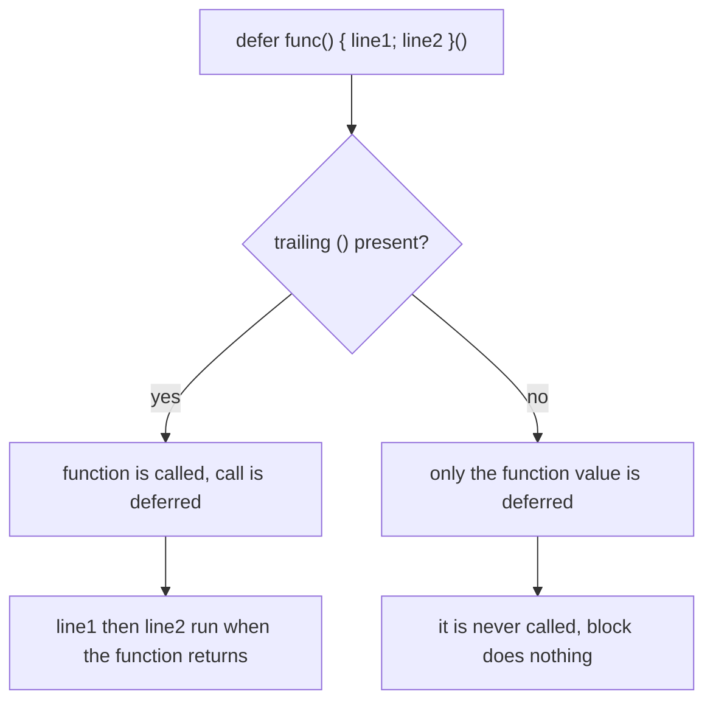

# Defer with Multiple Lines

## TLDR

- `defer` takes a single **call**, not a block, so `defer fmt.Println(a)` defers exactly one statement.
- To defer several lines, wrap them in an anonymous function and call it: `defer func() { ... }()`.
- The trailing `()` is required. `defer func() { ... }` without it defers the creation of the function, which does nothing and does not compile as you expect.
- The whole block runs together when the surrounding function returns, top to bottom, as one deferred call.
- The same rules apply as any defer: arguments evaluated at the `defer` line, runs on `return` or `panic`, LIFO across multiple defers.

## The problem: `defer` is not `defer { }`

In languages like Swift or Java's `try/finally`, the cleanup is a **block** with its own braces. Go's `defer` does not work that way: it is a statement that takes one function call and postpones that call until the surrounding function returns. So this is fine:

```go
defer fmt.Println("cleanup")
```

but you cannot write a brace block directly after `defer`:

```go
defer {
	fmt.Println("cleanup")
} // does not compile: "expression in defer must be function call"
```

That brace form is exactly what the multi-line anonymous function gives you back.

## The solution: an anonymous function, immediately called

Wrap the lines in a function literal and call it at the `defer` line:

```go
package main

import "fmt"

func main() {
	defer func() {
		fmt.Println("deferred cleanup")
		fmt.Println("deferred cleanup1")
	}()

	fmt.Println("running")
}
```

```
running
deferred cleanup
deferred cleanup1
```

Three things are happening:

- `func() { ... }` creates an anonymous function value.
- The final `()` calls it. `defer` postpones that call to the end of `main`.
- Both `Println` calls run together at return time, in order.

<div style={{display: 'flex', justifyContent: 'center'}}>



</div>

The `()` is not decoration. Without it you are deferring the evaluation of a function *value*, not a call, and the body never executes. (A bare `defer func(){}()` with an empty body is legal but pointless.)

## Same rules as any defer

The anonymous-function form does not change defer's semantics, it only lets you put more inside the deferred call.

**Arguments are evaluated at the `defer` line, not at return time.** Pass them as parameters to freeze their values:

```go
x := 10
defer func(v int) {
	fmt.Println("captured by value:", v) // 10
}(x)
x = 99
```

**A closure over the variable sees the later value**, because it reads the variable when the block runs:

```go
y := 10
defer func() {
	fmt.Println("closed over variable:", y) // 99
}()
y = 99
```

**Multiple defers run last-in-first-out**, and they still run while a panic unwinds:

```go
defer fmt.Println("deferred 1 (runs last)")
defer fmt.Println("deferred 2")
defer fmt.Println("deferred 3 (runs first)")
panic("boom")
```

```
deferred 3 (runs first)
deferred 2
deferred 1 (runs last)
```

## The exception: `os.Exit`

`defer` runs when a function returns, normally or via panic. It does **not** run when the process is torn down. `os.Exit` terminates immediately, so a multi-line deferred block is skipped just like a single-line one. See [`os.Exit`, deferred functions, and exit codes](./go-os-exit.md).

## Summary

`defer` takes one call, so to defer multiple statements you put them in an anonymous function and call it: `defer func() { ... }()`. The trailing `()` is what makes it a deferred call; drop it and the block never runs. Inside, the ordinary defer rules hold: arguments captured at the `defer` line, closures reading live variables at return time, last-in-first-out ordering, and execution on panic. The only thing it does not survive is `os.Exit`.

## Sources

- The Go Programming Language Specification, [Defer statements](https://go.dev/ref/spec#Defer_statements) - "Each time a 'defer' statement executes, the function value and parameters to the call are evaluated as usual and saved anew but the actual function is not invoked." The function value must be a call.
- Effective Go, [Defer](https://go.dev/doc/effective_go#defer) - deferred calls run when the surrounding function returns, either by return or panic, in last-in-first-out order.
- The `os` package documentation, [func Exit](https://pkg.go.dev/os#Exit) - "The program terminates immediately; deferred functions are not run."
