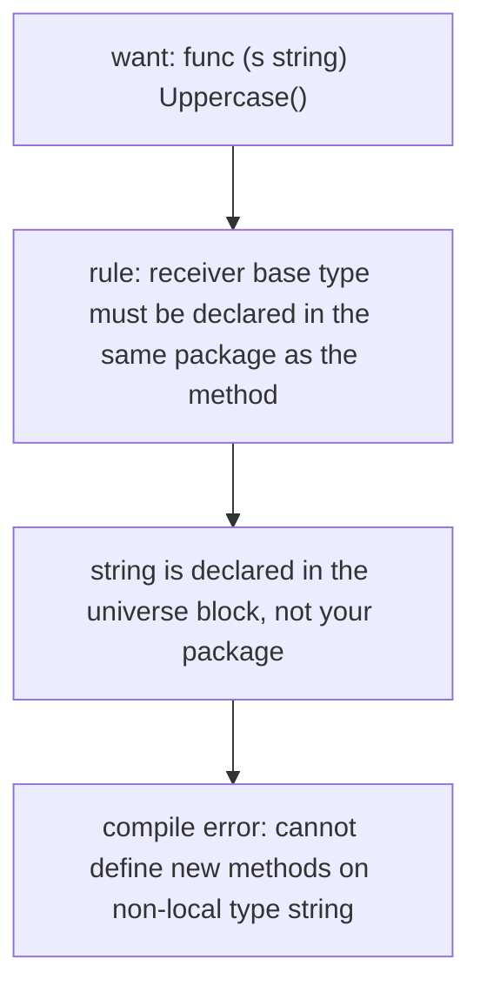
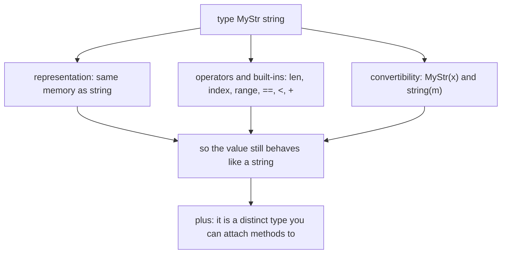
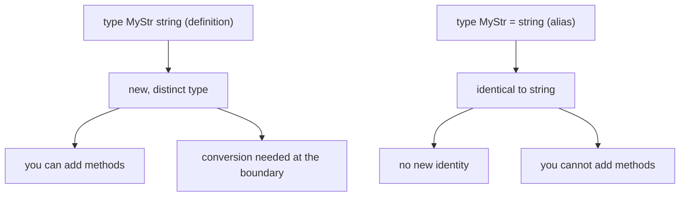

# Go Defined Types: Adding Methods to Types You Do Not Own

## TLDR

- You **cannot** attach a method to a type declared in another package. Go's rule: the receiver base type must be declared in the same package as the method, and it cannot be a pointer or interface type. `string` counts as "another package" because it is predeclared in the universe block.
- The fix is a **defined type**: `type MyStr string` declares a brand new type whose *underlying type* is `string`. Because `MyStr` belongs to your package, you can attach methods to it.
- This is **not a type alias**. `type MyStr string` (no `=`) defines a new, distinct type. `type MyStr = string` (with `=`) is an alias, and you *cannot* add methods to an alias.
- The underlying type gives you three things: the same **representation**, the **operators and built-ins** for that kind (`len`, indexing, `range`, `==`, `<`, `+`), and **convertibility** to and from every type with the same underlying type. That last one is why `MyStr("aaa")` and `string(m)` are legal.
- Two practical uses: **attaching behavior** (method syntax on a value), and **compile-time type safety** (distinct `UserID` and `ProductID` cannot be swapped even though both are strings).
- The price is explicit conversion at boundaries. If you do not need the underlying type's behavior, a `struct` is a perfectly good choice instead.
- Many standard library types are defined types exactly for this reason: `time.Duration`, `net/http.HandlerFunc`, `io/fs.FileMode`, `net.IP`.

## The problem: methods must live with their type

A common task is wanting a method on a value whose type you do not control. The concrete examples:

- You want `value.Uppercase()` on a string-like value, but `strings.ToUpper` is a function, not a method.
- You want a `Celsius` type with a `ToFahrenheit()` method.
- You want to distinguish a `UserID` from a `ProductID` at compile time, even though both are strings.

Go blocks the obvious approach. The specification requires that the method's **receiver base type** be declared in the same package as the method, and it must not be a pointer or interface type. The Tour states it plainly: "You can only declare a method with a receiver whose type is defined in the same package as the method. You cannot declare a method with a receiver whose type is defined in another package (which includes the built-in types such as `int`)." Since `string` is a predeclared type in the universe block, not your package, you cannot write `func (s string) Uppercase() ...`.

<div style={{display: 'flex', justifyContent: 'center'}}>



</div>

## The mechanism: declare a new type that you own

Declare a new defined type whose underlying type is the one you want, then attach the method to your new type:

```go
package main

import "strings"

// MyStr's underlying type is string, but MyStr is a distinct type
// owned by this package, which is what makes the method below legal.
type MyStr string

func (s MyStr) Uppercase() string {
	return strings.ToUpper(string(s))
}

func main() {
	println(MyStr("test").Uppercase()) // TEST
}
```

The receiver is `MyStr`, declared in this package, so the method is allowed. The type is *new* and *distinct* from `string`, which is the whole point: it is a type you own, so you can give it methods.

## What the underlying type actually gives you

This is the part that trips people up. Defining `MyStr` from `string` is not cosmetic. The underlying type supplies three concrete capabilities:

1. **Representation.** A `MyStr` is stored exactly like a `string`, with no wrapper and no extra allocation.
2. **Operators and built-ins for that kind.** Because `string` is an ordered kind, `len(s)`, `s[i]`, `for i, r := range s`, `s == t`, `s < t`, and `s + t` all work on `MyStr` values, and `MyStr` can be a map key.
3. **Convertibility.** The spec allows converting between types that have identical underlying types. So `MyStr` and `string` convert to each other freely.

That third point is the one worth dwelling on, because it answers "why tie it to `string` at all":

```go
type MyStr string

MyStr("aaa")        // string literal -> MyStr
s := "aaa"          // s is string
MyStr(s)            // string -> MyStr
string(MyStr("x"))  // MyStr -> string
```

`MyStr("aaa")` is a **conversion**, not a constructor. It works only because `MyStr` and `string` share the same underlying type, so the language permits reinterpreting a string value under the new name. (The literal `"aaa"` is also an untyped constant, so even `var s MyStr = "aaa"` works with no conversion at all.)

If instead you wrote `type MyStr struct { s string }`, all of this disappears. `MyStr("aaa")` becomes a compile error, `len(m)` does not compile, `m[0]` does not compile, `m + n` does not compile, and `%s` prints the struct rather than the string. You would have to delegate every operation by hand (`len(m.s)`, `m.s[0]`, ...) and add a `String()` method to format it.

<div style={{display: 'flex', justifyContent: 'center'}}>



</div>

## Use case 1: attaching behavior

`strings.ToUpper` is a plain function. If you want it to read as a method, `value.Uppercase()`, you need a type to hang it on. The same pattern gives you domain-specific behavior on a value whose representation is simple:

```go
type Celsius float64

func (c Celsius) ToFahrenheit() float64 {
	return float64(c)*9/5 + 32
}
```

Note that the method body converts back to the underlying type to do the arithmetic. `Celsius` contributes identity and a place to attach the method; the numeric behavior comes from `float64`.

## Use case 2: compile-time type safety

A defined type is distinct from its underlying type, so the compiler stops you from mixing two types that merely share a representation:

```go
type UserID string
type ProductID string

func lookupUser(id UserID) { /* ... */ }

var p ProductID = "p-123"
lookupUser(p) // compile error: cannot use p (type ProductID) as type UserID
```

Both are strings underneath, but `UserID` and `ProductID` are not interchangeable, which eliminates a whole class of argument-order bugs. This is the same feature that makes methods possible, used on its own.

## Defined types are not type aliases

Here is the exact point where the common tutorial wording goes wrong. The sentence "to add methods to a type you do not own, define an alias for it" uses the wrong word. A type alias would not help at all.

```go
type MyStr string   // defined type: new identity, you own it, methods allowed
type MyStr = string // alias: another spelling of string, methods NOT allowed
```

- A **type definition** (`type T U`, no `=`) creates a **defined type** named `T` with underlying type `U`. It is a new, distinct type owned by the declaring package, so you can attach methods. Older documentation calls these "named types"; the type-alias proposal prefers "defined type".
- A **type alias** (`type T = U`, with `=`) creates an alternative spelling of `U`. `T` and `U` are the *identical* type. It adds no new identity, so it gives you no new place to attach methods, and if `U` is defined in another package you cannot use `T` as a receiver either.

<div style={{display: 'flex', justifyContent: 'center'}}>



</div>

| Declaration | Kind | Same identity as `U`? | Can you add methods? |
| --- | --- | --- | --- |
| `type T U` | defined type | No, new type | Yes (you own `T`) |
| `type T = U` | alias | Yes, identical | No |
| `type T = pkg.U` | alias to an imported type | Yes | No |

The type-alias proposal is explicit on the last row: "if `T1` is an alias for a type `T2` defined in an imported package, method declarations using `T1` as a receiver type are invalid."

So the corrected rule is: **to add methods to a type you do not own, define a new *defined type* based on it, not an alias.** Aliasing is for the opposite goal, keeping two names identical across packages, which is what makes it useful during a migration (see [Modules, packages, and type aliases](./go-modules-and-type-aliases.md)).

## When to use a struct instead

A defined type is not always the answer. Choose it when you want the underlying type's representation, operators, and conversions. If you want none of that, a `struct` is clearer:

- Use a **defined type** when the new type should still behave like its underlying type: it can be compared, indexed, ranged over, formatted with `%s`, and converted at the boundary.
- Use a **struct** when you do not need any of that and want to model a genuinely different thing with its own fields. Then methods are natural, because you own the struct.

A quick way to decide: ask whether `MyNewType(someUnderlyingValue)` should be legal. If yes, the value is "the same thing with a new name and methods", so use a defined type. If no, use a struct.

## Real examples in the standard library

Defined types on a foreign underlying type are everywhere in the standard library. Each one reuses a simple representation while adding identity and methods or type safety:

- `time.Duration` is `type Duration int64`: a plain count of nanoseconds with methods like `Seconds()` and `String()`.
- `net/http.HandlerFunc` is `type HandlerFunc func(ResponseWriter, *Request)`: a function type with a `ServeHTTP` method, so a bare function satisfies the `Handler` interface.
- `io/fs.FileMode` is `type FileMode uint32`: a bitmask with methods like `IsDir()`.
- `net.IP` is `type IP []byte`: a byte slice with methods like `String()` and `Equal()`.

Each relies on the same three things this article described: the underlying representation, the operations that come with it, and explicit conversion at the boundaries.

## Summary

To add behavior to a type you do not own, you cannot attach a method to the original type, because Go requires the receiver base type to live in the same package as the method. Instead you declare a new **defined type** whose underlying type is the original, and attach methods to the new type. That new type keeps the underlying type's representation, operators, and convertibility, which is why values still behave like the original and why `MyStr("aaa")` works. It is a distinct type, so it also gives you compile-time type safety. The thing you cannot use for this is a **type alias**, which introduces no new type and therefore no new place for methods. Aliases exist for the separate problem of keeping two names identical during a migration.

## Sources

- The Go Programming Language Specification, [Type definitions](https://go.dev/ref/spec#Type_definitions), [Method declarations](https://go.dev/ref/spec#Method_declarations), and [Conversions](https://go.dev/ref/spec#Conversions), for the definition of a defined type, the receiver base type rule, and convertibility between types with identical underlying types.
- Russ Cox and Robert Griesemer, [Proposal: Type Aliases](https://github.com/golang/proposal/blob/master/design/18130-type-alias.md) (2016), for the distinction between a type definition and a type alias, the shared method set of an alias, and the rule that an alias of an imported type cannot be used as a receiver.
- A Tour of Go, [Methods continued](https://go.dev/tour/methods/3), for the rule that a method's receiver type must be defined in the same package.
- Effective Go, [Methods](https://go.dev/doc/effective_go#methods), for the statement that methods can be defined for any named type except a pointer or interface.
- Package documentation for the standard library examples: [`time.Duration`](https://pkg.go.dev/time#Duration), [`net/http.HandlerFunc`](https://pkg.go.dev/net/http#HandlerFunc), [`io/fs.FileMode`](https://pkg.go.dev/io/fs#FileMode), and [`net.IP`](https://pkg.go.dev/net#IP).
