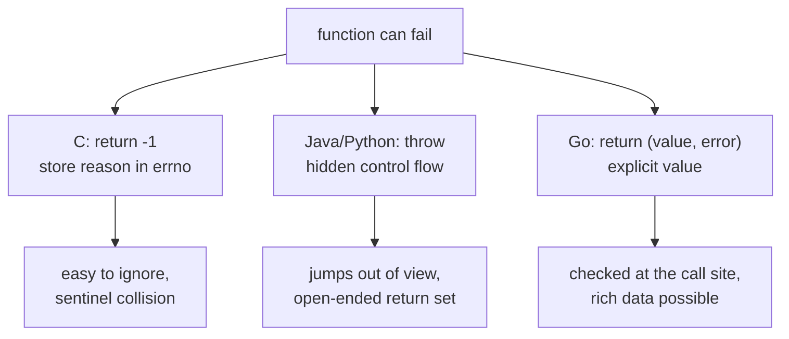
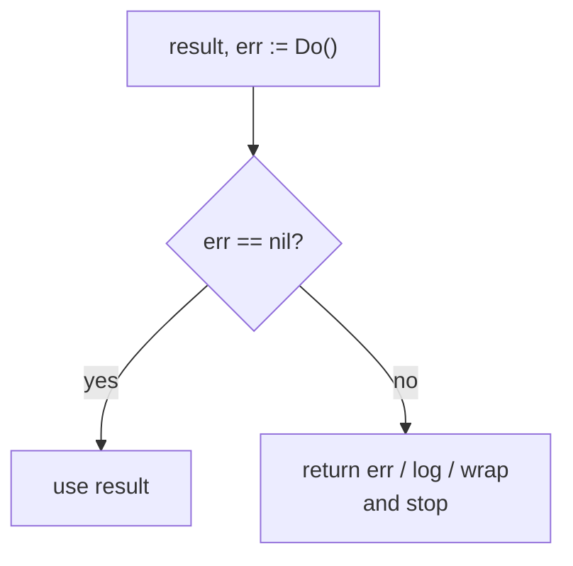
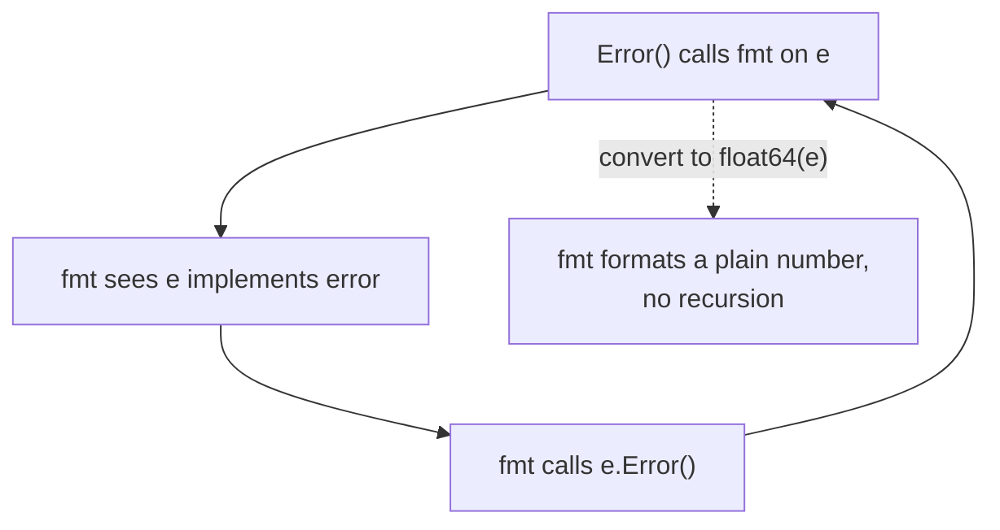
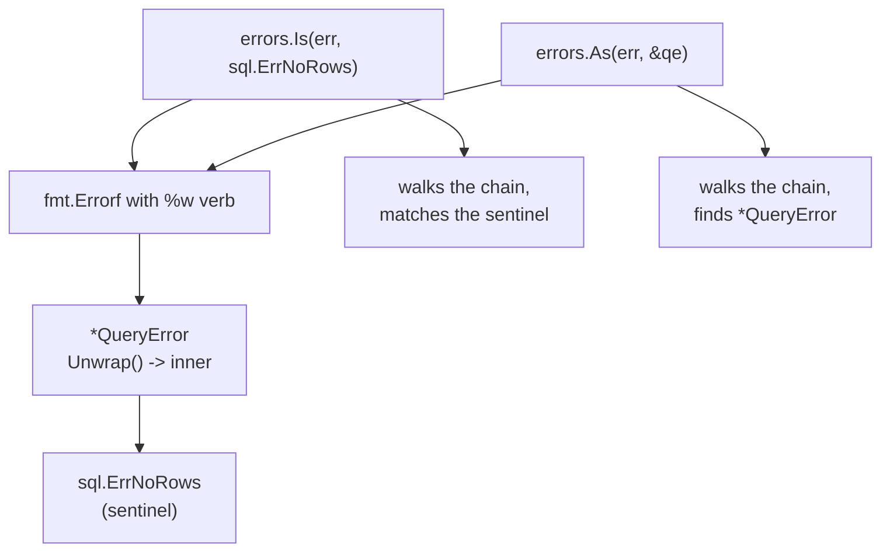

# Go Errors: the `error` Interface and Returning Errors

## TLDR

- `error` is a predeclared interface with a single method, `Error() string`. Any type with that method is an error.
- Go functions report failure as a normal return value, usually the last result: `(value, error)`. Callers check `if err != nil`.
- `errors.New` and `fmt.Errorf` build simple string errors. `fmt.Errorf` with `%w` wraps an error so it can be inspected later.
- A custom error type can carry structured data, such as a timestamp or an offset, that callers recover with a type assertion or `errors.As`.
- `fmt` prints an error by calling its `Error() string` method. That is why a custom error prints correctly with no extra work.
- Do not call `fmt.Print` or `fmt.Sprintf` on the receiver inside `Error()` itself. That re-enters `Error()` and loops forever; convert to the underlying type first.
- Inspect wrapped errors with `errors.Is` (sentinel value) and `errors.As` (specific type) rather than `==` or a bare type assertion.

## The problem: signaling failure without hiding it

A function can fail, and the caller must be able to find out that it failed and why. Two common designs are in-band error codes and exceptions. In C, a function returns a sentinel such as `-1` and stashes the reason in a global like `errno`. The caller can forget to check, the sentinel can be a valid value, and the reason is easy to lose. Exceptions solve the forgetting problem but introduce hidden control flow: a call can jump out of the function somewhere the reader cannot see, and the set of values a function returns becomes open-ended.

Go takes a third path: an error is an ordinary value returned alongside the result. If you ignore it, you ignore a value, which is visible in the code. If you want to add detail, you build a richer value. Because it is just an interface, you control what information travels with it, from a plain message to a struct with fields.

<div style={{display: 'flex', justifyContent: 'center'}}>



</div>

## The `error` interface

An error is anything that can describe itself as a string. That idea is captured by the predeclared interface type `error`, which has a single method:

```go
type error interface {
	Error() string
}
```

Because it is just an interface, any type can be an error by implementing `Error() string`. The `error` type is predeclared in the universe block, so you never import it or define it yourself.

## Returning and checking an error

The convention is that a function that can fail returns an `error` as its last result, and returns the zero value for the other results when it fails. The caller checks the error before using the value.

```go
func Open(name string) (file *File, err error)
```

```go
f, err := os.Open("filename.ext")
if err != nil {
	log.Fatal(err)
}
// use f
```

This `(value, error)` shape is possible because Go functions can return multiple values, the same mechanism described in [Functions, multiple return values, and named results](./go-functions.md). It replaces the C idiom of a negative count plus a hidden `errno`, and it replaces passing a pointer to an out-parameter. `os.File.Write` returns both a count and an error, so it can say "you wrote some bytes, but not all of them, because the device filled up."

<div style={{display: 'flex', justifyContent: 'center'}}>



</div>

## Building an error

The simplest error is a string. The `errors` package's `New` function builds one, and `fmt.Errorf` builds one from a format string using the same verbs as `Printf`.

```go
func Sqrt(f float64) (float64, error) {
	if f < 0 {
		return 0, errors.New("math: square root of negative number")
	}
	// implementation
}
```

```go
if f < 0 {
	return 0, fmt.Errorf("math: square root of negative number %g", f)
}
```

`errors.New` and `fmt.Errorf` produce a value whose concrete type is an unexported `errors.errorString`. Its `Error()` method returns the text, and nothing else. That is fine until a caller needs to know which argument failed, or needs to tell one kind of failure from another, at which point you want a custom type.

## `fmt` prints an error by calling `Error()`

The `fmt` package formats an `error` value by calling its `Error() string` method. This is why an error created by `errors.New` prints as its text:

```go
f, err := Sqrt(-1)
if err != nil {
	fmt.Println(err) // math: square root of negative number -1
}
```

The same rule makes custom error types print correctly for free. As the Go blog puts it, it is the error implementation's responsibility to summarize the context: the error from `os.Open` formats as `open /etc/passwd: permission denied`, not just `permission denied`.

## Custom error types

Since `error` is an interface, an error value can be any structure you like. A custom type lets you attach data and give the caller something to inspect. This example stores the time and a description of what went wrong.

```go
package main

import (
	"fmt"
	"time"
)

type MyError struct {
	When time.Time
	What string
}

func (e *MyError) Error() string {
	return fmt.Sprintf("at %v, %s", e.When, e.What)
}

func run() error {
	return &MyError{
		time.Now(),
		"it didn't work",
	}
}

func main() {
	if err := run(); err != nil {
		fmt.Println(err) // at 2009-11-10 23:00:00 +0000 UTC, it didn't work
	}
}
```

Nothing about `fmt.Println(err)` needed changing. Because `*MyError` has an `Error() string` method, it is an `error`, and `fmt` calls that method to produce the text.

A more useful variant carries the value that caused the failure, so a caller can recover it. The Go blog's own example defines `NegativeSqrtError` as a `float64`, which lets a caller assert the concrete type and read the offending number while everyone else still sees a normal error string.

```go
type NegativeSqrtError float64

func (f NegativeSqrtError) Error() string {
	return fmt.Sprintf("math: square root of negative number %g", float64(f))
}
```

The trick worth pausing on is `type NegativeSqrtError float64` itself. `NegativeSqrtError` is a defined type whose underlying type is `float64`, not an alias for it, so it is a distinct type that behaves like a `float64` for storage and conversion while gaining something the built-in does not have: a method set. That is the same mechanism described in [Defined types](./go-defined-types.md). Attaching `Error() string` to it is what makes the number satisfy the `error` interface, so a plain `float64` becomes an error by acquiring behavior. Likewise `type MyError struct { ... }` is a defined struct type, and its `Error()` method is what turns a record of time and message into an error. In both cases the pattern is identical: take an arbitrary type, give it an `Error()` method, and it is now an `error`.

Defining a type over a built-in also buys compile-time safety that the bare built-in cannot offer, because the new type is distinct from its underlying type and from other defined types that share the same underlying type. A temperature bug is the classic illustration:

```go
type Celsius float64
type Fahrenheit float64

var c Celsius = 100
var f Fahrenheit = 32

_ = c + c        // OK: both Celsius
// _ = c + f     // compile error: mismatched types Celsius and Fahrenheit
```

Both types are `float64` underneath, but the compiler refuses to add a `Celsius` to a `Fahrenheit`, because they are different types. If both had been plain `float64` variables, `c + f` would compile and silently mix units. The defined type keeps the unit in the type system, and conversion between them must be explicit, `Celsius(f)`. This is the reasoning in the Go blog's `NegativeSqrtError`: the type exists so the compiler, and the caller, can tell a square-root argument apart from an arbitrary number.

The standard library follows the same pattern. The `encoding/json` package returns a `*json.SyntaxError` that carries an `Offset` field. The offset is not shown in the default text, but a caller can use it to report a line and column:

```go
if serr, ok := err.(*json.SyntaxError); ok {
	line, col := findLine(f, serr.Offset)
	return fmt.Errorf("%s:%d:%d: %v", f.Name(), line, col, err)
}
```

One caveat from the Go blog: it is usually a mistake to return a concrete error type from a function rather than the `error` interface, unless the caller genuinely needs the extra fields, because it commits you to that type forever. Return `error`.

## Worked example: `Sqrt` that rejects negative input

Putting the pieces together, here is the classic exercise: a `Sqrt` that returns a non-nil error for a negative argument, using a custom error type so the message includes the bad value. The function computes the square root with Newton's method, then is modified to reject negative numbers.

The reason `ErrNegativeSqrt` is a defined type at all, rather than a plain `errors.New("cannot Sqrt negative number")`, is that the caller should be able to recover the exact argument that was rejected. A bare string error throws the value away. Defining `type ErrNegativeSqrt float64` keeps the offending number as the error's own value, so `Error()` can format it back into the message and a caller can still type-assert the error to read the original `x`. This mirrors the Go blog's `NegativeSqrtError` and the later, richer `json.SyntaxError`, both of which store data the plain-text form cannot.

```go
package main

import (
	"fmt"
)

type ErrNegativeSqrt float64

func (e ErrNegativeSqrt) Error() string {
	return fmt.Sprintf("cannot Sqrt negative number: %g", float64(e))
}

func Sqrt(x float64) (float64, error) {
	if x < 0 {
		return 0, ErrNegativeSqrt(x)
	}

	z := 1.0
	for i := 0; i < 10; i++ {
		z = z - ((z*z)-x)/(2*z)
	}
	return z, nil
}

func main() {
	fmt.Println(Sqrt(2))
	fmt.Println(Sqrt(-2)) // cannot Sqrt negative number: -2
}
```

The detail that catches people is the conversion inside `Error()`: it uses `float64(e)`, not `e`. Writing `fmt.Sprintf("... %v", e)` instead sends the program into an infinite loop. The reason is the same one behind `fmt` calling `Error()` in the first place: `e` is of type `ErrNegativeSqrt`, which implements `error`, so `fmt` tries to format it by calling `e.Error()` again. That call reaches the same `Sprintf`, which calls `Error()` again, forever. Converting to the underlying `float64` gives `fmt` a plain number with no `Error` method, so it formats the number directly. Effective Go documents the identical trap for `String()` methods.

<div style={{display: 'flex', justifyContent: 'center'}}>



</div>

## Wrapping errors with `%w`

Adding context as an error travels up the stack is common. `fmt.Errorf` can do it, but with `%v` the original error is flattened to text and lost to programs. Since Go 1.13, the `%w` verb wraps the original instead, giving the returned error an `Unwrap` method that yields it again.

```go
if err != nil {
	// %v flattens the error to a string.
	return fmt.Errorf("decompress %v: %v", name, err)
}
```

```go
if err != nil {
	// %w keeps the original available underneath.
	return fmt.Errorf("decompress %v: %w", name, err)
}
```

An error that wraps another may itself be wrapped, forming an error chain. The choice of `%v` versus `%w` is about whether callers should be able to look inside. Wrapping exposes the underlying error, which makes it part of your API; if the underlying error is an implementation detail, do not wrap it.

## Inspecting errors: `errors.Is` and `errors.As`

Two patterns predate wrapping. A sentinel error is a specific value compared with `==`. A typed error is recovered with a type assertion.

```go
var ErrNotFound = errors.New("not found")

if err == ErrNotFound {
	// something wasn't found
}
```

```go
if e, ok := err.(*NotFoundError); ok {
	// err is a *NotFoundError, and e holds it
}
```

Both break once errors are wrapped, because `==` and a type assertion only see the outer error. The `errors.Is` and `errors.As` functions walk the whole chain instead.

```go
if errors.Is(err, ErrNotFound) {
	// err, or something it wraps, is ErrNotFound
}
```

```go
var e *QueryError
if errors.As(err, &e) {
	// err, or something it wraps, is a *QueryError, and e is set to it
}
```

`errors.Is` behaves like comparison to a sentinel, `errors.As` behaves like a type assertion, and both consider every error in the chain. A custom type can also implement an `Is` method to define equality, and an `Unwrap` method to control what the next link in the chain is.

<div style={{display: 'flex', justifyContent: 'center'}}>



</div>

## Errors can embed interfaces too

Because `error` is an interface with one method, richer error interfaces embed it. The `net` package defines `net.Error` as an `error` plus two methods, so a value of that type is an error and also reports whether the failure was a timeout or temporary:

```go
package net

type Error interface {
	error
	Timeout() bool   // Is the error a timeout?
	Temporary() bool // Is the error temporary?
}
```

Client code asserts `net.Error` and can then sleep and retry on a temporary failure while giving up on a permanent one. This is the same interface embedding described in [Implicit interfaces and interface composition](./go-implicit-interfaces.md), applied to errors: a small base interface, extended where more behavior is needed.

## Summary

The built-in `error` interface, with its single `Error() string` method, turns failure into an ordinary value that functions return and callers check. Plain errors come from `errors.New` and `fmt.Errorf`, and `fmt` prints any of them by calling `Error()`. When a caller needs detail, a custom error type attaches data and is recovered with a type assertion or `errors.As`. Wrapping with `%w` preserves the original error for inspection, and `errors.Is` and `errors.As` walk the chain so sentinels and typed errors still work through layers of context. The one sharp edge is recursion: never format the receiver itself inside `Error()`, because that re-enters the method; convert to the underlying type first.

## Sources

- The Go Blog, Andrew Gerrand, [Error handling and Go](https://go.dev/blog/error-handling-and-go) - the `error` interface declaration, `errors.New`, `fmt` formatting errors via `Error()`, the `NegativeSqrtError` and `json.SyntaxError` examples, `net.Error`, and the advice against returning concrete error types.
- The Go Blog, Damien Neil and Jonathan Amsterdam, [Working with Errors in Go 1.13](https://go.dev/blog/go1.13-errors) - sentinel errors, `Unwrap`, `errors.Is`, `errors.As`, the `%w` verb, and when to wrap.
- The Go Programming Language Specification, [Errors](https://go.dev/ref/spec#Errors) - the predeclared `error` interface and the `Error() string` method.
- Effective Go, [Printing](https://go.dev/doc/effective_go#printing) - the `String()` recursion trap that is identical in shape to the `Error()` recursion trap.
- A Tour of Go, [Exercise: Errors](https://go.dev/tour/methods/20) - the `Sqrt`/`ErrNegativeSqrt` exercise and the note about the infinite loop.
- The `errors` package documentation, [package errors](https://pkg.go.dev/errors) - `New`, `Is`, `As`, and `Unwrap`.
- Matt Aimonetti, [Go Bootcamp, Errors](https://www.softcover.io/read/88e295ad/GoBootcamp/interfaces) - the `MyError` example and the errors exercise this article is based on.
