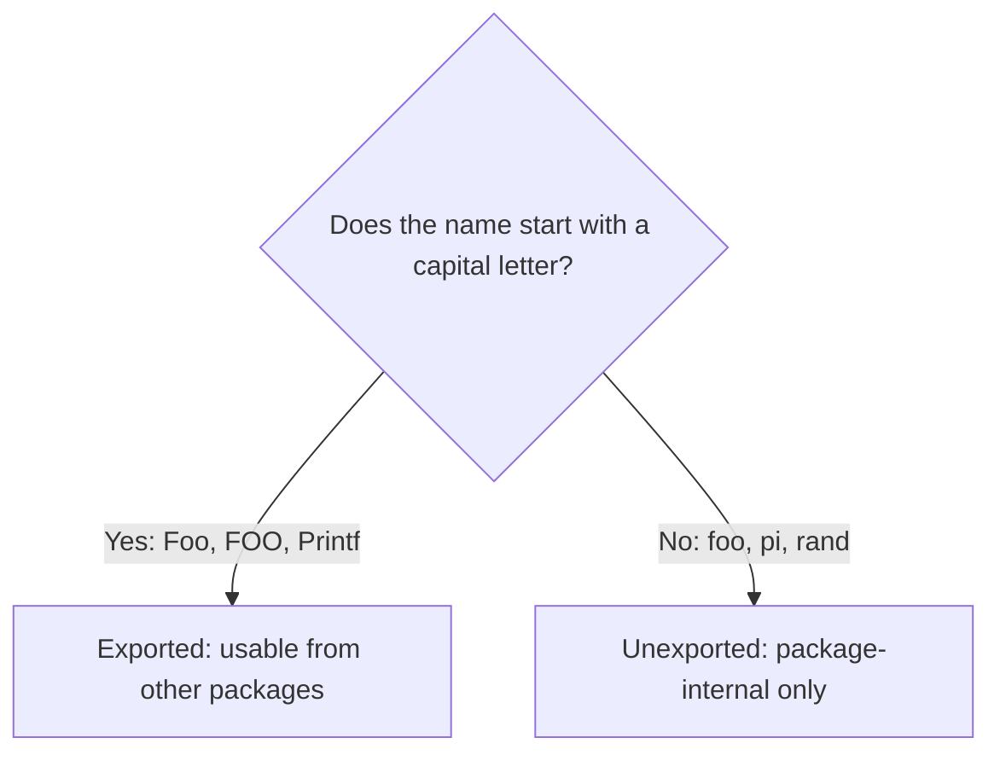
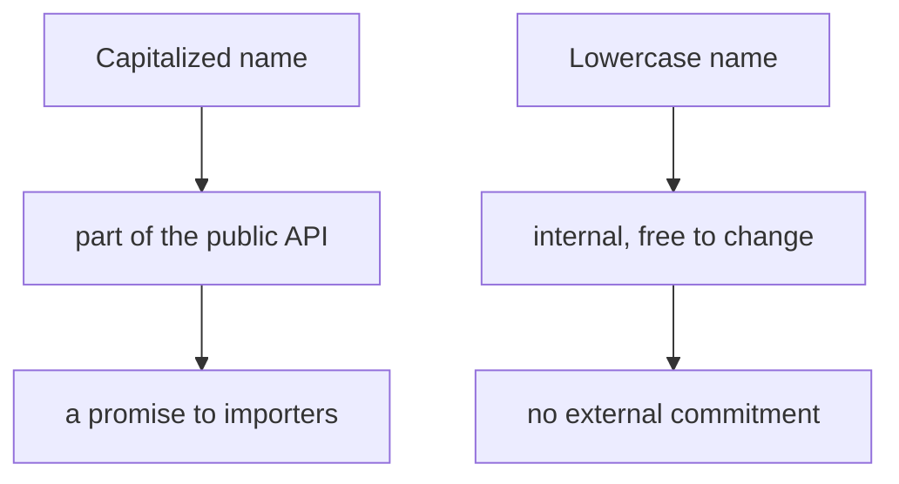

# Go Exported Names (the Capital Letter Rule)

## TLDR

- After importing a package, you can only use its **exported** names: variables, functions, and methods that begin with a capital letter.
- `Foo` and `FOO` are exported; `foo` is not.
- This is Go's entire visibility system. There are no `public`/`private` keywords; capitalization is the rule.
- `math.Pi` works because `Pi` is capitalized; `math.pi` fails to compile because lowercase names are not exported.

## The problem: a visibility system with no keywords

Most languages mark visibility with keywords: `public`, `private`, `protected`. Go has none of them. Instead, it uses a single rule based on capitalization: a name is exported if it starts with an uppercase letter, and unexported if it starts with a lowercase letter. The rule is trivial to read but has real consequences: it determines what you can touch from outside a package.

<div style={{display: 'flex', justifyContent: 'center'}}>



</div>

## The rule in practice

Try to use a lowercase name from an imported package, and the compiler rejects it.

```go
package main

import (
    "fmt"
    "math"
)

func main() {
    fmt.Println(math.pi) // error: lowercase, not exported
}
```

Change it to the capitalized form and it compiles:

```go
package main

import (
    "fmt"
    "math"
)

func main() {
    fmt.Println(math.Pi) // works: Pi is exported
}
```

The `math` package defines `Pi` with a capital `P`, so it is available to importers. If it had been named `pi`, no code outside `math` could use it.

## Why capitalization, not keywords

Go's designers chose this to make visibility self-evident at a glance. There is no extra keyword to declare, and no ambiguity about what a keyword might mean across files. The capitalization is the documentation: if a name is capitalized, it is part of the package's public API; if not, it is an internal implementation detail.

This also gives you a cheap signal about API stability. Because exported names form the contract other packages rely on, Go programmers are careful about what they capitalize. A lowercase name is free to change; an uppercase one is a promise.

<div style={{display: 'flex', justifyContent: 'center'}}>



</div>

## Exported names apply to functions, methods, and variables

The rule is uniform. It covers exported functions (`fmt.Println`), exported variables and constants (`math.Pi`), and exported methods on types. Anything with a capital first letter is reachable from another package; anything with a lowercase first letter is not.

```go
// Inside package math:
const Pi = 3.14  // exported
const e  = 2.71  // unexported (math.e does not exist)
```

The same capital-letter rule is what makes `package main` programs able to call into the standard library: every function you use from `fmt` or `math` is exported, which is why its name starts uppercase.

## Summary

Go's visibility system is a single capitalization rule. A name is exported if it begins with a capital letter (`Foo`, `Printf`) and unexported if it begins lowercase (`foo`, `pi`). There are no public/private keywords. This is why `math.Pi` compiles while `math.pi` does not, and it doubles as Go's convention for separating public API from internal implementation.

## Sources

- A Tour of Go, [Exported names](https://go.dev/tour/basics/3) - the capital letter rule and the `math.pi` vs `math.Pi` example.
- The Go Programming Language Specification, [Exported identifiers](https://go.dev/ref/spec#Exported_identifiers) - the formal definition of an exported name.
- Go Bootcamp (Matt Aimonetti), [Packages](https://www.gobootcamp.com/book/packages) - the exported names discussion.
