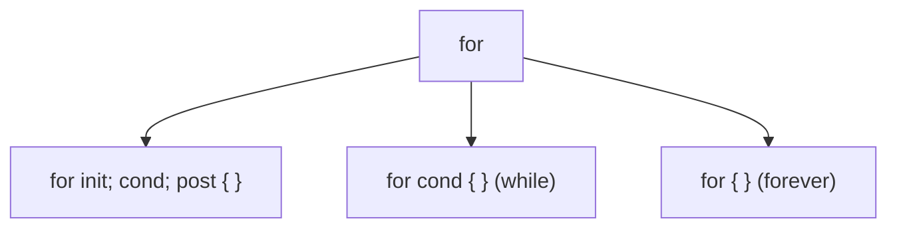
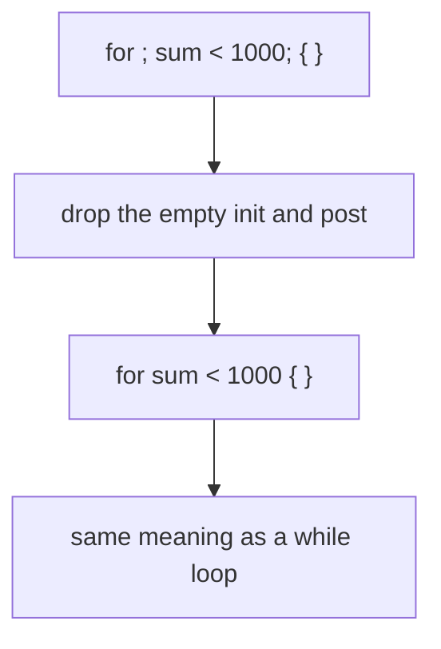

# Go For Loops

## TLDR

- `for` is Go's only loop; there is no `while`, `do while`, or `repeat`.
- No parentheses around the parts; the braces `{ }` are required.
- The full form is `for init; condition; post { ... }`, like C or Java.
- Drop the `init` and `post` to loop while a condition holds: `for sum < 1000 { ... }`.
- An empty condition `for { ... }` loops forever.
- Use `range` to iterate over slices and maps (covered in the range article).

## The problem: repeating work

Programs constantly repeat: sum a list, retry a request, walk every row of a table. Most languages offer several loops, `for`, `while`, `do while`, and developers argue over which to use where. Go keeps exactly one loop, `for`, and expresses every other loop shape by leaving parts of it out. One construct, no choice to make.

<div style={{display: 'flex', justifyContent: 'center'}}>



</div>

## The basic for loop

The full form matches C or Java, minus the parentheses:

```go
package main

import "fmt"

func main() {
    sum := 0
    for i := 0; i < 10; i++ {
        sum += i
    }
    fmt.Println(sum) // 45
}
```

There are three parts separated by semicolons: the init statement `i := 0` runs once before the loop, the condition `i < 10` is checked before each iteration, and the post statement `i++` runs after each iteration.

## Dropping the pre and post statements

The init and post parts are optional. Leave them out and keep only the condition:

```go
sum := 1
for ; sum < 1000; { // keep doubling while sum < 1000
    sum += sum
}
fmt.Println(sum) // 1024
```

The semicolons remain, but the init and post are empty. The condition still guards every iteration, so this runs until `sum` reaches 1024.

## For as a while loop

Drop the empty slots and their semicolons too, and `for` reads exactly like a `while`:

```go
sum := 1
for sum < 1000 {
    sum += sum
}
fmt.Println(sum) // 1024
```

`for sum < 1000 { ... }` is Go's `while`. There is no separate `while` keyword because this already covers it.

<div style={{display: 'flex', justifyContent: 'center'}}>



</div>

## Infinite loops

Leave the condition out entirely and the loop never stops on its own:

```go
for {
    // do something forever
}
```

This is Go's `for (;;)`. To exit, use `break`, `return`, or let a `range`/`select` end it. A server's accept loop or a retry loop often looks like this.

## Exercise: sum an array with for

Rewriting a loop from another language makes the shape concrete. This C++ `while` sums five integers:

```cpp
int foo[5] = {6, 2, 77, 4, 12};
int count = 0;
int sum = 0;
while (count < 5) {
    sum += foo[count];
    count++;
}
```

The Go equivalent carries the same logic in a `for`:

```go
package main

import "fmt"

func GetSum(array []int) int {
    sum := 0
    n := len(array)
    for i := 0; i < n; i++ {
        sum = sum + array[i]
    }
    return sum
}

func main() {
    fmt.Println(GetSum([]int{6, 2, 77, 4, 12})) // 101
}
```

The C++ counter and index become the `for`'s init, condition, and post. Note the C++ array `foo` became a Go slice `[]int`; the difference between arrays and slices is covered in the arrays and slices articles.

## Summary

`for` is Go's single loop. The full `for init; condition; post` form handles counting; dropping the init and post gives a `while`; dropping the condition gives an infinite loop. There is no `while` keyword because `for` with a lone condition already is one.

## Sources

- A Tour of Go, [For](https://go.dev/tour/flowcontrol/1), [For continued](https://go.dev/tour/flowcontrol/2), [For is Go's "while"](https://go.dev/tour/flowcontrol/3), and [Forever](https://go.dev/tour/flowcontrol/4) - the three `for` forms.
- The Go Programming Language Specification, [For statements](https://go.dev/ref/spec#For_statements) - the init/condition/post structure and the `for {}` infinite form.
- Go Bootcamp (Matt Aimonetti), [For loops](https://www.gobootcamp.com/book/control-structures) - the C++ to Go conversion exercise.
