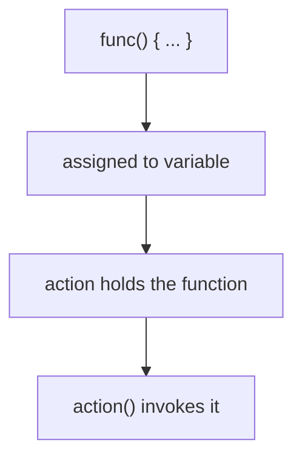
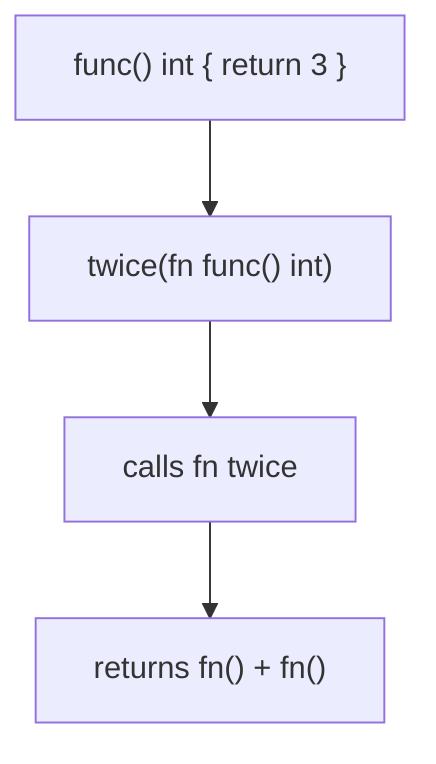

# Go Function Values (Anonymous Functions)

## TLDR

- In Go, **functions are values**. You can assign one to a variable, pass it around, and call it later.
- An **anonymous function** is a function literal without a name: `func() { ... }`.
- `action := func() { ... }` stores a function in the `action` variable, then `action()` calls it.
- This is the foundation of Go closures, callbacks, and higher-order functions.
- It is not a special "lambda" type; it is the same function value concept applied without a declared name.

## The problem: behavior you want to store or pass, not just call immediately

Sometimes you do not want to run a function right away. You want to save it, pass it to another function, or decide later when to call it. Languages solved this in different ways: callbacks, function pointers, lambdas, interfaces. Go's solution is the simplest possible one: a function is a value like any other, so it can be assigned to a variable and invoked through that variable.

<div style={{display: 'flex', justifyContent: 'center'}}>



</div>

## Assigning a function to a variable

The `func` keyword normally introduces a named function declaration. Drop the name, and you get a function literal (an anonymous function) that can be assigned to a variable.

```go
func main() {
    action := func() { // action is a variable that contains a function
        // doing something
    }
    action()
}
```

`action` is a variable whose type is `func()`. The function body only runs when you write `action()`, not when you assign it. This is the key difference from declaring a named function and calling it directly: the function is a piece of data you control.

## Passing and returning functions

Because functions are values, you can pass them as arguments and return them from other functions.

```go
func twice(fn func() int) int {
    return fn() + fn()
}
```

This makes Go support higher-order functions without any special syntax. A function that takes or returns another function is just an ordinary function whose parameter or return type happens to be `func`.

<div style={{display: 'flex', justifyContent: 'center'}}>



</div>

## The connection to closures

The moment you assign an anonymous function to a variable, you also open the door to **closures**: an anonymous function can capture variables from its surrounding scope and keep using them after that scope would otherwise have gone away.

```go
counter := func() func() int {
    count := 0
    return func() int {
        count++
        return count
    }
}()

counter() // 1
counter() // 2
```

The inner anonymous function closes over `count`, so `count` survives across calls. This is only possible because the function is a value that can be returned and held. Function values and closures are the same feature viewed from two angles.

## Why Go chose this over separate syntax

Some languages introduce a distinct `lambda` or arrow syntax for this. Go did not, on purpose: a function value is exactly a function, with the same `func` keyword, the same body syntax, and the same type system. The only difference is whether it has a declared name. That keeps the language small; you learn one concept, and it covers callbacks, closures, and higher-order functions all at once.

## Summary

Functions are first-class values in Go. An anonymous function is just a `func` literal with no name, which you can assign to a variable (`action := func() { ... }`) and call later (`action()`). This single idea powers callbacks, higher-order functions, and closures, without any special lambda syntax.

## Sources

- A Tour of Go, [Function values](https://go.dev/tour/moretypes/24) - functions as values and calling them through a variable.
- A Tour of Go, [Function closures](https://go.dev/tour/moretypes/25) - anonymous functions capturing surrounding variables.
- The Go Programming Language Specification, [Function literals](https://go.dev/ref/spec#Function_literals) - the syntax and semantics of anonymous functions.
- Go Bootcamp (Matt Aimonetti), [Anonymous functions](https://www.gobootcamp.com/book/functions) - the `action := func() { ... }` example.
