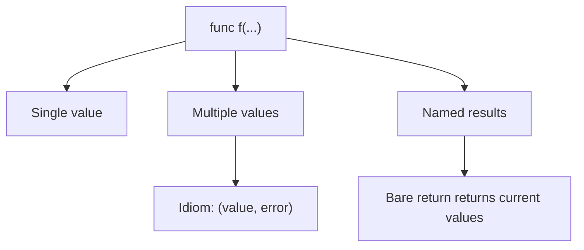
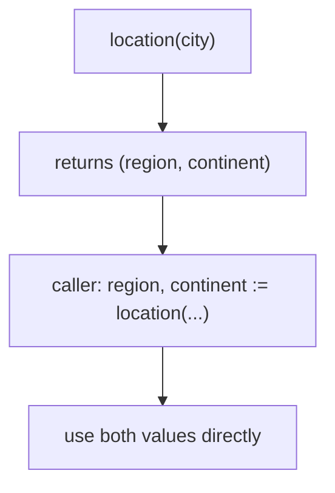

# Go Functions, Multiple Return Values, and Named Results

## TLDR

- A function is declared with `func name(params) returnType { ... }`.
- Parameters of the same type can share one type: `func add(x, y int) int`.
- Go functions can return **multiple values**, which is the idiomatic way to return a result together with an error or a pair of related values.
- Return values can be **named**, which declares them as variables and lets a bare `return` return their current values.
- Named results are convenient but can hurt readability in long functions; use them when the meaning of each value is otherwise unclear.

## The problem: functions that need to return more than one thing

Most languages let a function return a single value, which forces awkward workarounds when you need two: wrapping results in a tuple object, using out-parameters, or throwing exceptions for control flow. Go removes the constraint. A function can return any number of values, and this is not a special case; it is the normal way to return a result and an error together.

<div style={{display: 'flex', justifyContent: 'center'}}>



</div>

## Declaring functions and parameters

The basic form puts the parameter list and return type after the function name. The type comes after the parameter name.

```go
package main

import "fmt"

func add(x int, y int) int {
    return x + y
}

func main() {
    fmt.Println(add(42, 13))
}
```

When consecutive parameters share a type, you can declare the type once for the group:

```go
func add(x, y int) int {
    return x + y
}
```

`x, y int` means "both `x` and `y` are `int`." This shorthand only applies to parameters of the same type, and it keeps signatures short.

## Multiple return values

A function returns multiple values by listing their types in parentheses. The caller receives them in order.

```go
package main

import "fmt"

func location(city string) (string, string) {
    var region string
    var continent string

    switch city {
    case "Los Angeles", "LA", "Santa Monica":
        region, continent = "California", "North America"
    case "New York", "NYC":
        region, continent = "New York", "North America"
    default:
        region, continent = "Unknown", "Unknown"
    }
    return region, continent
}

func main() {
    region, continent := location("Santa Monica")
    fmt.Printf("Matt lives in %s, %s", region, continent)
}
```

`location` returns two strings, and the caller binds them to `region` and `continent` with `:=`. This pattern generalizes to Go's most important convention: returning `(result, error)` from a function, where the caller checks the error before using the result.

<div style={{display: 'flex', justifyContent: 'center'}}>



</div>

## Named results

You can give return values names in the signature. Naming them declares them as variables initialized to their zero value, and a bare `return` (with no arguments) returns their current values.

```go
func split(sum int) (x, y int) {
    x = sum * 4 / 9
    y = sum - x
    return // returns x and y as they currently are
}
```

The bare `return` reads as "return the named results," which is why named results are sometimes called "naked returns." They can make short functions cleaner, but in a long function a bare `return` forces the reader to scroll up to remember what is being returned, which is a real readability cost.

## When to use named results

| Situation | Recommendation | Why |
| --- | --- | --- |
| Returning `(value, error)` | Leave unnamed, return explicitly | The meaning is obvious from convention |
| Two+ return values whose roles are unclear | Name them | Documents what each value is |
| Short function | Named results + bare return is fine | Easy to see the whole body at once |
| Long function | Return explicitly | Bare return is a readability trap |

## Summary

Go functions take parameters with a compact shared-type shorthand and can return any number of values, which is how Go handles both multi-value results and the `(result, error)` idiom. Named results turn return values into variables and enable a bare `return`, but they are a convenience to use judiciously, not a rule to follow everywhere.

## Sources

- A Tour of Go, [Functions](https://go.dev/tour/basics/4), [Functions continued](https://go.dev/tour/basics/5), and [Multiple results](https://go.dev/tour/basics/6) - function declaration, the shared-type parameter shorthand, and multiple return values.
- A Tour of Go, [Named return values](https://go.dev/tour/basics/7) - named results and the bare `return`.
- The Go Programming Language Specification, [Function declarations](https://go.dev/ref/spec#Function_declarations) and [Return statements](https://go.dev/ref/spec#Return_statements) - formal syntax and the bare return rule.
- Go Bootcamp (Matt Aimonetti), [Functions](https://www.gobootcamp.com/book/functions) - the `location` two-value example and named result guidance.
