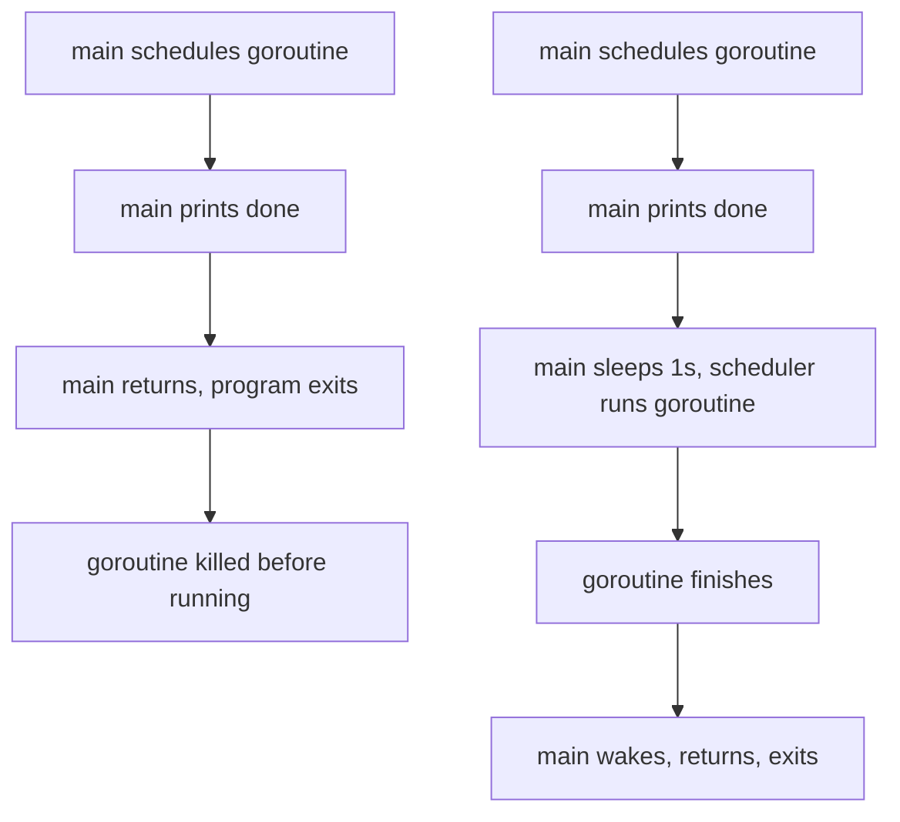

# Go Goroutines: Why the Output Disappears Without `time.Sleep`

## TLDR

- `go f()` schedules `f` on a new goroutine and **returns immediately**. It does not wait for `f`.
- `main` is itself a goroutine. When `func main` returns, **the program exits** and every other goroutine is killed mid-flight.
- That is the whole reason the output vanishes: `main` prints `done` and returns before the scheduler gets to run `f`.
- `time.Sleep` only *appears* to fix it. It is a race, not synchronization; a slower goroutine is still killed.

## The example

```go
package main

import (
	"fmt"
)

func f(from string) {
	for i := range 3 {
		fmt.Println(from, ":", i)
	}
}

func main() {

	f("direct")

	go f("goroutine")

	go func(msg string) {
		fmt.Println(msg)
	}("going")

	// time.Sleep(time.Second)
	fmt.Println("done")
}
```

Output:

```
direct : 0
direct : 1
direct : 2
done
```

The goroutines printed nothing. Uncomment the `time.Sleep` and their lines appear. The question is not "how do I get the output" but "why does the sleep change anything."

## Why: `go` does not wait

The `go` keyword starts a new goroutine and returns to the caller at once. It is not an ordinary call; the call to `f` happens *later*, concurrently. So `main` does not pause on that line and marches straight on.

Then `main` reaches the end and returns. When `func main` returns, the Go program terminates abruptly, and every other goroutine is destroyed wherever it happens to be.

So the sequence is:

1. `main` runs `f("direct")` as an ordinary call and waits. Its three lines always print.
2. `main` issues two `go` statements. The goroutines are scheduled but may not have run.
3. `main` prints `done`.
4. `main` returns, and the runtime exits, killing the scheduled goroutines.

`main` had almost nothing left to do after scheduling them, so it usually finishes first.

<div style={{display: 'flex', justifyContent: 'center'}}>



</div>

The sleep works only because it gives the scheduler a window to run the goroutines before `main` returns. Nothing in that duration is guaranteed. If the goroutine is slower than the sleep, the output is lost again.

## The problem this exposes

The bug is not missing output, it is that Go gives you no signal that your goroutine was cut off. The Go spec is explicit about it: when `func main` returns, the program exits, and it does not wait for other goroutines to complete. Effective Go puts it plainly: the program will not wait for them to finish before exiting.

That means you cannot tell from the code that work was dropped. The requirement is never "make the output appear", it is "wait until the goroutine is actually done", and that has to be expressed in the code. `sync.WaitGroup` does it properly:

```go
var wg sync.WaitGroup

wg.Add(1)
go func() {
	defer wg.Done()
	f("goroutine")
}()

fmt.Println("done")
wg.Wait() // blocks until the goroutine calls Done
```

`wg.Wait()` blocks `main` until the goroutine finishes, so the work can no longer be discarded. Note this fixes the wait but not the ordering: goroutine output still interleaves unpredictably with `main`'s.

## Summary

`go f()` schedules `f` and returns immediately. `main` is a goroutine too, and when it returns the program exits, killing every other goroutine. That is why the goroutine's output is missing: `main` prints `done` and returns before the scheduler runs it. `time.Sleep` is a race that happens to mask this, not a fix.

## Sources

- The Go Programming Language Specification, [Program initialization and execution](https://go.dev/ref/spec#Program_execution) - "when the function main returns, the program exits. It does not wait for other (non-main) goroutines to complete."
- The Go Programming Language Specification, [Go statements](https://go.dev/ref/spec#Go_statements) - "program execution does not wait for the invoked function to complete."
- Effective Go, [Goroutines](https://go.dev/doc/effective_go#goroutines) - the warning that "the program will not wait for them to complete before exiting".
- The `sync` package documentation, [type WaitGroup](https://pkg.go.dev/sync#WaitGroup) - `Add`, `Done`, and `Wait`.
- Go by Example, [Goroutines](https://gobyexample.com/goroutines) - the `f`/`main` example this article is based on.