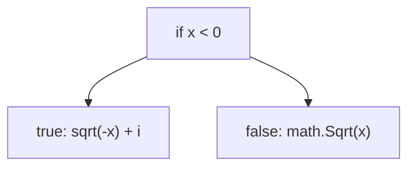
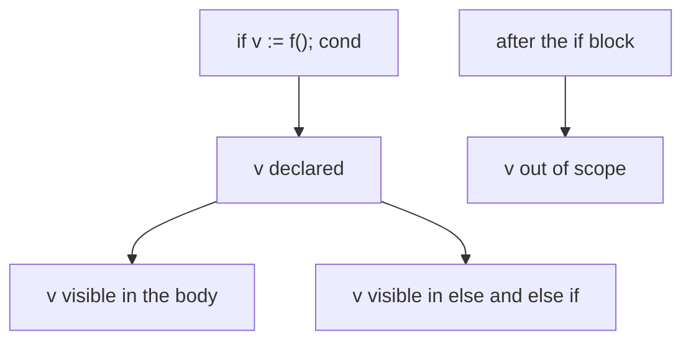

# Go If Statements

## TLDR

- `if` looks like C or Java, but the parentheses `( )` are gone and the braces `{ }` are required.
- `else` and `else if` work as you would expect.
- An `if` can start with a short statement before the condition: `if v := f(); v < lim { ... }`.
- A variable declared in that short statement is scoped to the `if` and all its `else` blocks, and nowhere else.

## The problem: branching on a condition

Programs constantly choose between paths: is the value negative, did the call fail, is the user logged in. The `if` statement is the basic tool. Go keeps the familiar shape from C and Java but tightens it: drop the parentheses, keep the braces, and add a way to declare a variable just for the decision.

## The basic if statement

```go
if answer != 42 {
    return "Wrong answer"
}
```

There are no parentheses around `answer != 42`, and the braces are mandatory even for a one-line body. This removes a common style debate and a class of bugs (a missing brace silently changing what is conditional).

```go
package main

import (
    "fmt"
    "math"
)

func sqrt(x float64) string {
    if x < 0 {
        return sqrt(-x) + "i"
    }
    return fmt.Sprint(math.Sqrt(x))
}

func main() {
    fmt.Println(sqrt(2), sqrt(-4)) // 1.4142135623730951 2i
}
```

Negative inputs are handled by recursing on `-x` and appending `i`; otherwise the square root is computed normally.

<div style={{display: 'flex', justifyContent: 'center'}}>



</div>

## The if short statement

Like `for`, an `if` can start with a short statement that runs before the condition. The statement and condition are separated by a semicolon.

```go
if err := foo(); err != nil {
    panic(err)
}
```

This declares `err`, calls `foo()`, and tests `err` in one line. The pattern is everywhere in Go because so many functions return a value plus an error.

```go
package main

import (
    "fmt"
    "math"
)

func pow(x, n, lim float64) float64 {
    if v := math.Pow(x, n); v < lim {
        return v
    }
    return lim
}

func main() {
    fmt.Println(
        pow(3, 2, 10),  // 9
        pow(3, 3, 20),  // 20
    )
}
```

`v` is computed once and used only inside the `if`. This keeps a temporary variable from leaking into the surrounding function.

## Scope of the short-statement variable

A variable declared in an `if`'s initialization statement is scoped exclusively to that `if` and all of its `else` and `else if` branches. It is not accessible after the conditional ends.

```go
if v := math.Pow(x, n); v < lim {
    return v
} else {
    fmt.Println(v) // v is visible here too
}
// v is out of scope here
```

<div style={{display: 'flex', justifyContent: 'center'}}>



</div>

This scoping is a deliberate feature: the variable exists only where the decision is being made, so it cannot be misused later in the function.

## Summary

Go's `if` drops the parentheses, requires the braces, and supports a short initialization statement whose variable lives only inside the `if` and its `else` branches. The most common use is the `if err := f(); err != nil` idiom for error handling.

## Sources

- A Tour of Go, [If](https://go.dev/tour/flowcontrol/5), [If with a short statement](https://go.dev/tour/flowcontrol/6), and [If and else](https://go.dev/tour/flowcontrol/7) - the `sqrt` and `pow` examples and the short-statement scope.
- The Go Programming Language Specification, [If statements](https://go.dev/ref/spec#If_statements) - the short statement and its scope ending at the `if`.
- Go Bootcamp (Matt Aimonetti), [If statements](https://www.gobootcamp.com/book/control-structures) - the `answer != 42` and `if err := foo()` idiom.
