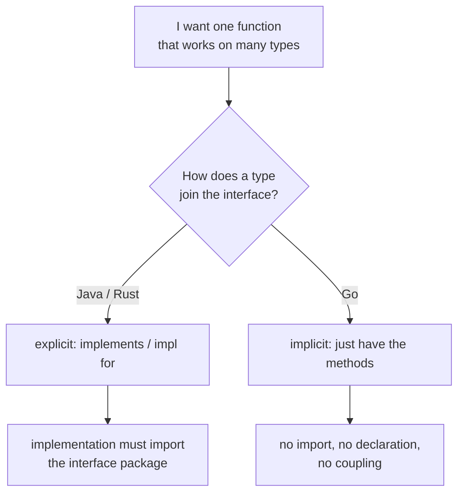
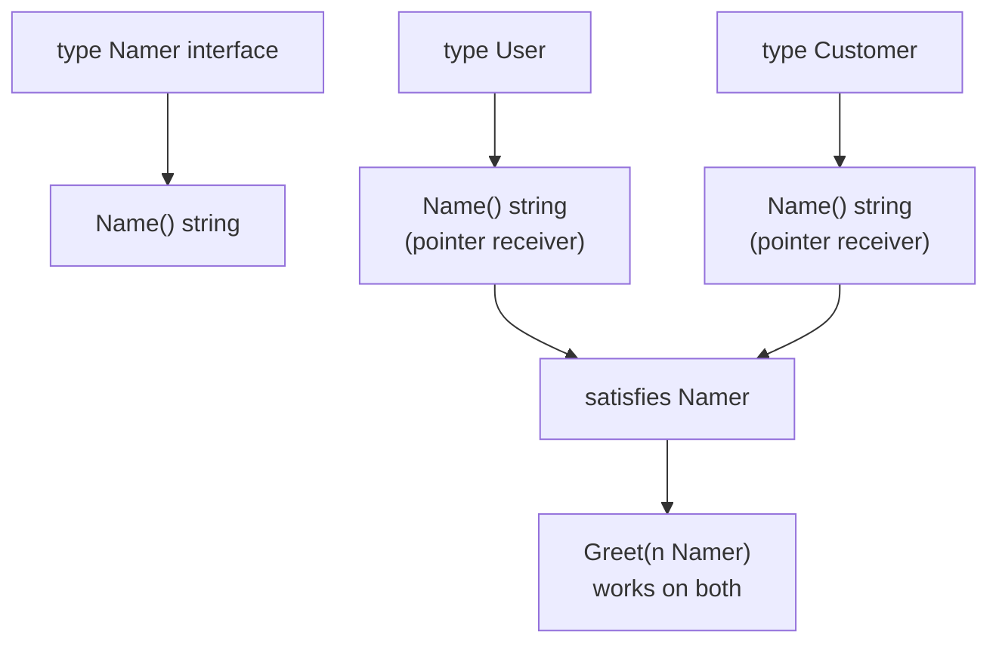
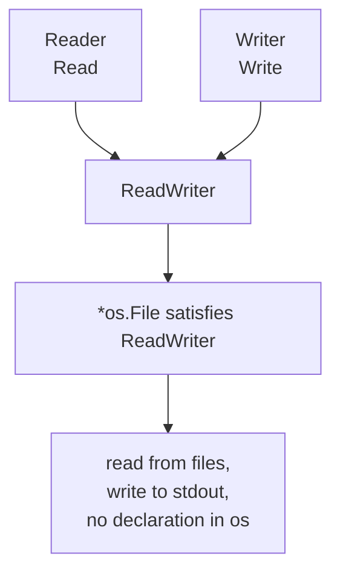

# Go Implicit Interfaces and Interface Composition

## TLDR

- A type satisfies an interface just by implementing its methods. There is no `implements` keyword and no explicit declaration of intent.
- Because satisfaction is implicit, the package that defines the interface and the package that provides the implementation do not have to know about each other. This decoupling is the point.
- Interfaces compose by embedding other interfaces. `io.ReadWriter` is literally `Reader` plus `Writer`.
- Small, focused interfaces (usually one method) are the Go idiom. You build larger behaviors by embedding smaller ones, not by making one interface huge.
- Whether you assign a value or a pointer to an interface depends on the receiver of the methods. A pointer-receiver method means only `*T` satisfies the interface, so you assign `&T{...}`. This is the method set rule covered in [Methods and method receivers](./go-methods-and-receivers.md).
- The empty interface `interface{}` (alias `any`) has no methods, so every type satisfies it.

## The problem: reuse behavior without a shared type

You want to write a function that works on any value that can do a thing, for example produce a name. In a language with inheritance you would make every such type a subtype of a common base. In Rust you would write `impl Trait for Type`. Both approaches force a connection: the implementation has to name the interface it satisfies.

That connection is a form of coupling. If the interface lives in package `a` and the implementation lives in package `b`, then `b` must import `a` just to say "I implement it." A type you do not own, such as a type from the standard library or a third-party package, cannot be retrofitted with a new declaration at all. You would be stuck wrapping it.

Go removes the declaration entirely. A type satisfies an interface because it happens to have the right methods. The relationship is discovered by the compiler, not declared by the programmer.

<div style={{display: 'flex', justifyContent: 'center'}}>



</div>

## Implicit satisfaction

A type implements an interface by implementing the methods that interface contains. Nothing else is required. The classic example uses a single-method interface called `Namer` and a function `Greet` that accepts it.

```go
package main

import (
	"fmt"
)

type User struct {
	FirstName, LastName string
}

// Name is defined with a pointer receiver.
func (u *User) Name() string {
	return fmt.Sprintf("%s %s", u.FirstName, u.LastName)
}

// Namer is defined by the Name() method alone.
type Namer interface {
	Name() string
}

// Greet accepts any value whose method set includes Name() string.
func Greet(n Namer) string {
	return fmt.Sprintf("Dear %s", n.Name())
}

func main() {
	u := &User{"Matt", "Aimonetti"}
	fmt.Println(Greet(u)) // Dear Matt Aimonetti
}
```

`User` never mentions `Namer`. It simply has a `Name() string` method, so `Greet` accepts it. The interface is a description of behavior, and any type that matches the description fits.

The same interface works for a completely unrelated type as long as that type also has `Name() string`. Here a `Customer` joins the same abstraction with no shared base type.

```go
package main

import (
	"fmt"
)

type User struct {
	FirstName, LastName string
}

func (u *User) Name() string {
	return fmt.Sprintf("%s %s", u.FirstName, u.LastName)
}

type Customer struct {
	Id       int
	FullName string
}

func (c *Customer) Name() string {
	return c.FullName
}

type Namer interface {
	Name() string
}

func Greet(n Namer) string {
	return fmt.Sprintf("Dear %s", n.Name())
}

func main() {
	u := &User{"Matt", "Aimonetti"}
	fmt.Println(Greet(u)) // Dear Matt Aimonetti
	c := &Customer{42, "Francesc"}
	fmt.Println(Greet(c)) // Dear Francesc
}
```

Both `Name` methods are pointer receivers, so both values are passed as pointers (`&User{...}`, `&Customer{...}`). This is not a quirk of the example. Interface satisfaction is decided by the method set, and the method set of `*T` contains both value-receiver and pointer-receiver methods, while the method set of `T` contains only value-receiver methods. If a type's method uses a pointer receiver, only the pointer satisfies the interface. The full rule, and why `v.Scale(5)` works without `&` at a call site but `var _ Interface = v` does not compile, is in [Methods and method receivers](./go-methods-and-receivers.md).

<div style={{display: 'flex', justifyContent: 'center'}}>



</div>

## Why implicit satisfaction matters

The A Tour of Go states the consequence directly: "Implicit interfaces decouple the definition of an interface from its implementation, which could then appear in any package without prearrangement."

Two things follow from this.

First, the interface and the implementations are independent. The implementation package does not import the interface package, so you can add a new implementation without touching the interface. You can also define an interface in your own package to describe a behavior that a type from another package already happens to have, without that package knowing or agreeing. This is how a function like `Greet` can accept a type that was written years earlier by someone else.

Second, interfaces can be discovered rather than predicted. Because you never have to go back and tag every type with a new interface name, it is cheap to introduce a new interface after the fact. A common Go practice is to define the interface at the point of use, in the package that consumes it, describing exactly the behavior that package needs. The standard library does this constantly: functions accept a small `io.Reader` or `io.Writer` rather than a concrete file type, so callers can pass files, network connections, buffers, or test doubles without any of them declaring anything.

This is also why Go interfaces tend to be small. Since the interface is just a description of what the consumer needs, making it larger than necessary forces implementations to carry methods nobody calls and couples them to details that should stay private.

## Composing interfaces by embedding

A larger behavior is often just a few smaller ones combined. An interface can embed another interface, and the embedded interface's methods become part of the outer interface's method set. The `io` package is the canonical example. It defines `Reader` and `Writer` separately, then combines them.

```go
package main

import (
	"fmt"
	"os"
)

type Reader interface {
	Read(b []byte) (n int, err error)
}

type Writer interface {
	Write(b []byte) (n int, err error)
}

// ReadWriter embeds both Reader and Writer, so its method set is the union.
type ReadWriter interface {
	Reader
	Writer
}

func main() {
	var w Writer

	// os.Stdout already implements Writer.
	w = os.Stdout

	fmt.Fprintf(w, "hello, writer\n")
}
```

Here `ReadWriter` requires nothing new. It is a name for "something that can both read and write." Any type with a `Read` method and a `Write` method satisfies it. Embedding is how you grow an interface without listing its methods again, and it keeps each small piece usable on its own. You can require only `Reader` where reading is all you need, and only `ReadWriter` where both directions matter.

The standard library actually defines these already, so you do not write them yourself. In `io`, `ReadWriter` is exactly:

```go
type ReadWriter interface {
	Reader
	Writer
}
```

and `os.File` satisfies it, along with `io.Reader`, `io.Writer`, `io.Closer`, `io.Seeker`, and more, all at once, without declaring a single one.

One detail about the example above is worth correcting explicitly. It is not that `os.Stdout`'s `Write` method has a value receiver. `os.Stdout` has type `*os.File`, and `File`'s methods (`Read`, `Write`, `Close`) are declared with pointer receivers. Because `os.Stdout` is already a pointer, it satisfies `Writer` directly, with no extra `&`. The rule is always the method set: `*os.File` includes the pointer-receiver methods, so `*os.File` satisfies `Writer`.

<div style={{display: 'flex', justifyContent: 'center'}}>



</div>

## Define interfaces where you use them

Because satisfaction is implicit, the interface does not have to live next to the type it describes. The idiomatic placement is in the package that consumes the behavior, often right where it is needed. A handler package that only needs to log can declare `type Logger interface { Println(...interface{}) }` and accept any logger, including `*log.Logger` from the standard library and a test spy. Neither of those types imports the handler package.

This is the same property described above, applied as a design rule: accept interfaces, and keep them as small as the consumer actually needs. It is why `io.Reader` and `io.Writer` are one method each, and why `io.ReadWriter` is only two.

## Summary

Go interfaces are satisfied implicitly. A type joins an interface by having the right methods, with no `implements` keyword and no declaration of intent. That decouples the interface from its implementations: neither package needs to know the other, types you do not own can satisfy your interfaces, and you can introduce an interface after the types already exist. Interfaces compose by embedding, which is how small, focused interfaces like `io.Reader` and `io.Writer` are combined into `io.ReadWriter` without repeating methods. The one rule that still bites is the method set: a pointer-receiver method means the pointer type satisfies the interface, so you pass `&T{...}` and not `T{...}`.

## Sources

- A Tour of Go, [Interfaces are implemented implicitly](https://go.dev/tour/methods/10) - a type implements an interface by implementing its methods, with no `implements` keyword, and the decoupling that follows.
- Effective Go, [Interfaces](https://go.dev/doc/effective_go#interfaces) - interfaces specify behavior, the `-er` naming convention, and how types satisfy them.
- The Go Programming Language Specification, [Interface types](https://go.dev/ref/spec#Interface_types) - interfaces as method sets, and embedding one interface in another.
- The Go Programming Language Specification, [Method sets](https://go.dev/ref/spec#Method_sets) - the method set of `T` versus `*T` and its effect on interface satisfaction.
- The `io` package documentation, [Reader, Writer, ReadWriter](https://pkg.go.dev/io) - the standard definitions, including `ReadWriter` as the embedding of `Reader` and `Writer`.
- Effective Go, [Methods](https://go.dev/doc/effective_go#methods) - value versus pointer receivers and the automatic address-of at call sites.
- Matt Aimonetti, [Go Bootcamp, Interfaces](https://www.softcover.io/read/88e295ad/GoBootcamp/interfaces) - the `User`/`Customer`/`Namer`/`Greet` example and the `Reader`/`Writer` illustration this article is based on.
