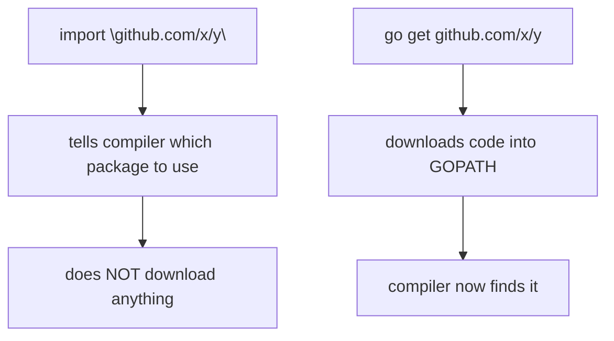
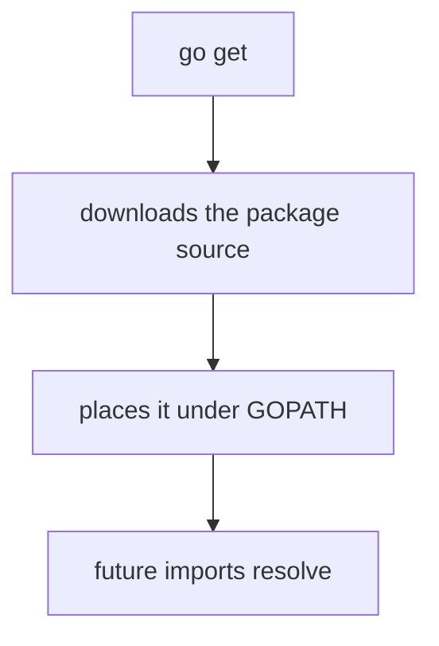
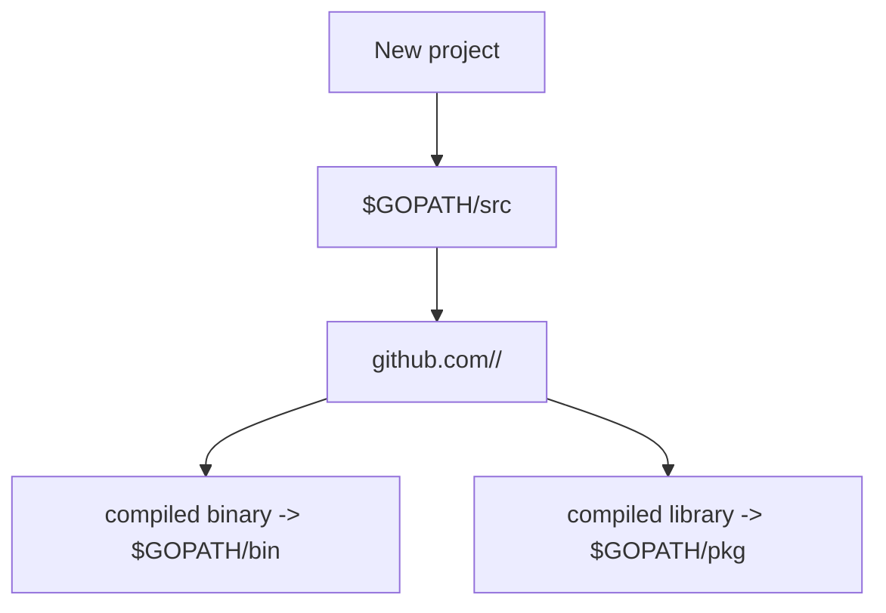
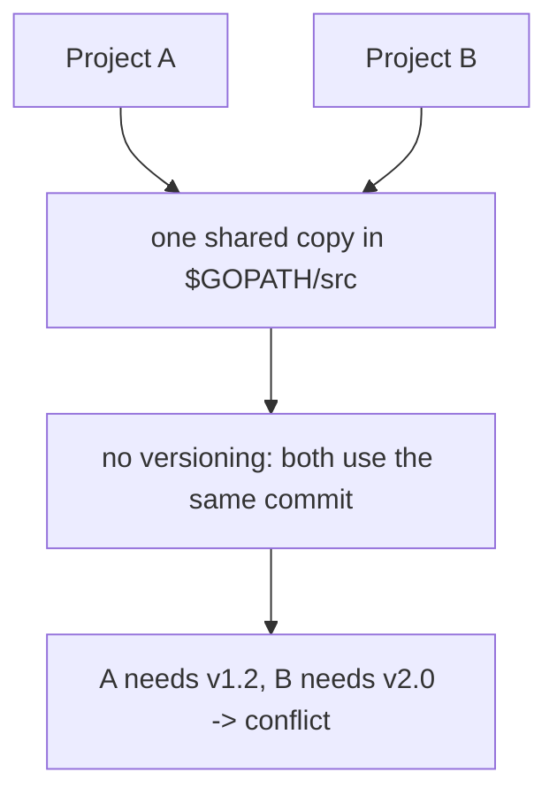
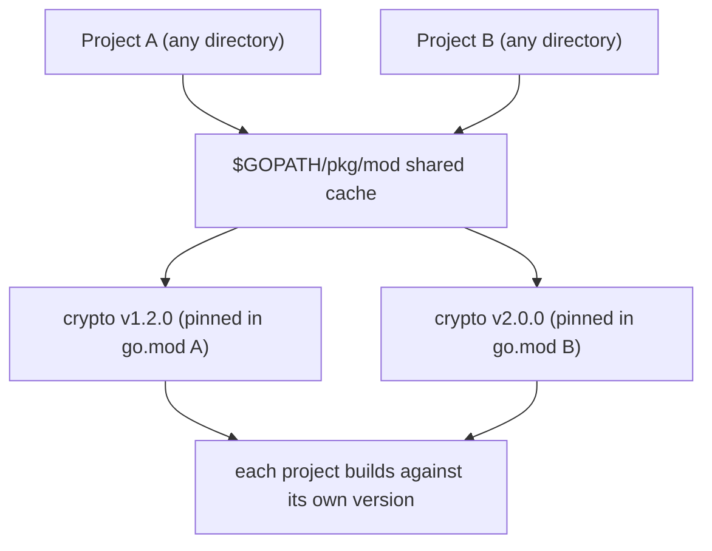

# Go Imports and Code Location (GOPATH)

## TLDR

- You import a package by its **import path**, which looks like a web URL for nonstandard packages: `github.com/mattetti/goRailsYourself/crypto`.
- An import path only tells the compiler **what to find**; it does not fetch code. You fetch with `go get`.
- The classic `GOPATH` model stored source (`src`), compiled libraries (`pkg`), and binaries (`bin`) all in one workspace, and your own projects had to live under `$GOPATH/src`.
- **Modern Go uses modules**: your project can live in any directory, versioned dependencies are recorded in a local `go.mod`, and `$GOPATH` now mostly holds the shared dependency cache (`pkg/mod`) and installed binaries (`bin`).
- Dependencies are stored **once, globally, and shared** by all your projects; each project still pins its own version in `go.mod`.

## The problem: how does the compiler find your code?

An import statement names a package, but the compiler does not automatically download it. If you write `import "github.com/mattetti/goRailsYourself/crypto"`, that string is a path that tells Go where the package lives and how to refer to it. Something still has to put the actual code on your disk in the place Go expects it. That is what `GOPATH` and `go get` are for.

<div style={{display: 'flex', justifyContent: 'center'}}>



</div>

## Importing standard and nonstandard packages

Standard library packages import with a short path, and you can write one import per line or group them in a block.

```go
import "fmt"
import "math/rand"
```

The block form is the idiomatic way to list multiple imports:

```go
import (
    "fmt"
    "math/rand"
)
```

Nonstandard packages are namespaced by their location, usually a web URL. For example, some Rails logic ported to Go lives in the repository `github.com/mattetti/goRailsYourself`, and importing its crypto package looks like this:

```go
import "github.com/mattetti/goRailsYourself/crypto"
```

The import path mirrors the code's home on the internet, which keeps naming globally unique: two people can both have a `crypto` package without colliding, because the full path includes their username and repository.

## Getting the code with `go get`

The path `github.com/mattetti/goRailsYourself/crypto` tells the compiler which package to import, but it does not pull the repository down for you. You do that yourself:

```go
$ go get github.com/mattetti/goRailsYourself/crypto
```

This downloads the code into your Go path. After it runs, the import resolves because the source now exists where Go looks for it.

<div style={{display: 'flex', justifyContent: 'center'}}>



</div>

## The classic `GOPATH` layout

In the original Go model, when you install Go you set the `GOPATH` environment variable. It was where Go stored binaries and libraries, and also where you kept your own source code. The layout is three folders:

```go
$ ls $GOPATH
bin     pkg     src
```

- **`bin`** holds compiled binaries. You typically add it to your system `PATH`.
- **`pkg`** holds compiled versions of libraries, so the compiler can link against them without recompiling.
- **`src`** holds all Go source code, organized by import path.

## Where to put new code (the classic rule)

In the GOPATH era, a new program or library had to live inside `$GOPATH/src`, using a fully qualified path such as:

```go
github.com/<your username>/<project name>
```

This kept your project's location consistent with its import path. Code placed anywhere else was hard for the toolchain to discover. As you will see below, **this requirement no longer applies with Go modules**: your project can live in any directory on disk.

<div style={{display: 'flex', justifyContent: 'center'}}>



</div>

## GOPATH vs Go modules: what changed

The `GOPATH` model described above is how Go worked before modules. It is now the *legacy* model; Go modules (introduced in Go 1.11, the default since Go 1.16) replaced it, mainly because of two problems with the shared workspace. Both of the points below are why.

### Point 1: shared dependencies with no versions

In the classic model, if two of your projects both used `github.com/mattetti/goRailsYourself/crypto`, there was exactly **one** copy of it on disk, under `$GOPATH/src/github.com/mattetti/goRailsYourself/crypto`. Both projects imported that same checkout and both binaries linked against it. This is great for disk space, but it is a serious limitation: there is **no versioning**. Both projects are locked to whatever commit is currently sitting in `src`.

```go
// Two projects importing the same dependency:
import "github.com/mattetti/goRailsYourself/crypto"
```

If project A needs crypto v1.2.0 and project B needs v2.0.0, the shared copy cannot be both. You would have to switch the single checkout back and forth, or fork it. That "dependency hell" is the main reason Go modules exist.

<div style={{display: 'flex', justifyContent: 'center'}}>



</div>

### Point 2: projects can live anywhere, `$GOPATH` just holds the cache

With Go modules, your project's folder location no longer matters. You can keep your code in any directory; a local `go.mod` file declares the module path and pins each dependency's version. You are not forced into `$GOPATH/src` anymore.

```go
// In every module project, a go.mod file records:
// module github.com/<your username>/<project name>
// require github.com/mattetti/goRailsYourself/crypto v1.2.0
```

So what is `$GOPATH` for now? It is mostly a **global, shared store of downloaded dependency code** (plus a place for installed binaries). When `go mod download` or `go build` fetches a dependency, it stores one copy in the module cache. The layout is:

- **`$GOPATH/pkg/mod`** - the module cache. One shared, read-only copy of each downloaded dependency, stored per version. All your projects reuse it, so storage is still not duplicated.
- **`$GOPATH/bin`** - binaries installed with `go install`.
- `$GOPATH/src` - no longer used for your own projects; it only lingers for legacy GOPATH-mode code.

Your projects record *which* versions to use in `go.mod` and `go.sum`; the cache holds *the code*. Because the cache is shared read-only, the two projects can now use **different versions** of the same dependency safely, because each builds against its own pinned version in the cache rather than one shared mutable checkout.

<div style={{display: 'flex', justifyContent: 'center'}}>



</div>

### One nuance: the cache is shared, so do not edit it

Since `pkg/mod` is a shared store used by many projects, you should treat it as read-only. If you want to modify a dependency, do not edit the cached copy. Instead vendor it into your project (`go mod vendor`) or point at a local copy with a `replace` directive in `go.mod`. Otherwise you would be mutating code that other projects also rely on.

## Summary

Import paths identify packages and follow a URL-like convention for nonstandard code, but they do not fetch anything by themselves. In the classic `GOPATH` model, `go get` downloaded code into a shared `src`/`pkg`/`bin` workspace and your projects had to live under `$GOPATH/src`. Go modules replaced that: your project can live in any directory, versions are pinned per project in `go.mod`, and `$GOPATH` now holds the shared, versioned dependency cache (`pkg/mod`) plus installed binaries (`bin`). Dependencies are still stored and reused once across projects, but each project can now use its own pinned version.

## Sources

- Go Bootcamp (Matt Aimonetti), [Packages](https://www.gobootcamp.com/book/packages) - the `go get` command, the `GOPATH` `bin`/`pkg`/`src` layout, and the `github.com/<user>/<project>` convention.
- The Go Programming Language Specification, [Import declarations](https://go.dev/ref/spec#Import_declarations) - the import path and the single vs block import forms.
- Go command documentation, [`go get`](https://pkg.go.dev/cmd/go) - the behavior of `go get` in fetching packages.
- Go Modules Reference, [Requirements and versioning](https://go.dev/ref/mod) - how `go.mod` pins versions and how the module cache in `$GOPATH/pkg/mod` stores downloaded dependencies.
- A Tour of Go, [Imports](https://go.dev/tour/basics/2) - the import block form.
