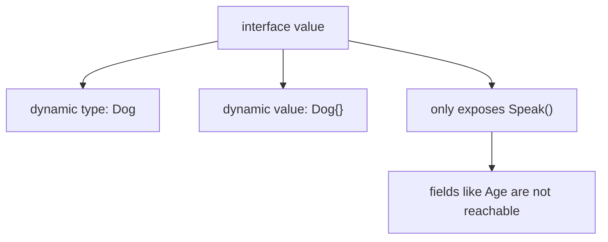

# Go Interfaces

## TLDR

- An interface declares **method signatures only**; it cannot hold fields. `Name string` inside an interface is a compile error.
- A type satisfies an interface **implicitly** just by implementing the right methods; there is no `implements` keyword.
- When two types share methods, an interface lets you write one function that works on either, and the concrete method called is decided at runtime. This is Go's polymorphism.
- An interface value stores a **dynamic type** and a **dynamic value**; you can only call the interface's methods on it, not access concrete fields.
- The empty interface `interface{}` (alias `any`) has no methods, so every type satisfies it, which is why it can hold any value.

## The problem: polymorphism without inheritance

Go has no inheritance, so it cannot express "a `Dog` and a `Cat` are both `Animal`s" with a class hierarchy. The problem that inheritance solved, writing code against a common abstraction and deciding at runtime which implementation to call, still needs a solution. Go's answer is the interface: a type that describes *behavior* (a set of methods), not *data*. Anything that has the right methods is treated as that type, no declaration required.

<div style={{display: 'flex', justifyContent: 'center'}}>

```mermaid
flowchart TD
    I["interface Speaker"] --> M["Speak() string"]
    D["type Dog"] --> DM["Speak() string"]
    C["type Cat"] --> CM["Speak() string"]
    DM --> SAT["implicitly satisfies Speaker"]
    CM --> SAT
    SAT --> POLY["one function works on Dog and Cat"]
```

</div>

## Interfaces have no fields

The single most important constraint on interfaces: they contain method signatures, nothing else. You cannot declare a field inside an interface.

```go
// This only says: "Any type with a Speak() string method is a Speaker."
type Speaker interface {
    Speak() string
}
```

Attempting to add data fails to compile:

```go
type Speaker interface {
    Name string // COMPILE ERROR: interfaces cannot have fields
    Speak() string
}
```

An interface is a contract about behavior. If you need data, you put it in a struct; if you need to express "anything that can speak," you use an interface. This distinction drives how you design Go types.

<div style={{display: 'flex', justifyContent: 'center'}}>

```mermaid
flowchart TD
    Q{"What are you describing?"} -->|"Data (fields)"| S["struct"]
    Q -->|"Behavior (methods)"| IF["interface"]
    IF --> NO["no fields allowed, only method signatures"]
```

</div>

## Implicit satisfaction

A type does not declare that it implements an interface. It just implements the methods, and Go treats it as satisfying the interface automatically. This is the opposite of Java's `implements` or Rust's `impl ... for`, and it is the reason interfaces feel lightweight in Go.

```go
package main

import "fmt"

type Speaker interface {
    Speak() string
}

type Dog struct{}

func (d Dog) Speak() string {
    return "Woof"
}

type Cat struct{}

func (c Cat) Speak() string {
    return "Meow"
}

func announce(s Speaker) string {
    return s.Speak()
}

func main() {
    fmt.Println(announce(Dog{})) // Woof
    fmt.Println(announce(Cat{})) // Meow
}
```

Neither `Dog` nor `Cat` mentions `Speaker`. Each simply has a `Speak() string` method, so each can be passed to `announce`, which accepts a `Speaker`. That is the whole mechanism.

## Polymorphism via interfaces

The `announce` function demonstrates Go's form of polymorphism. It accepts a `Speaker` and calls `s.Speak()`. The actual implementation that runs depends on the concrete value passed in: a `Dog` produces `"Woof"`, a `Cat` produces `"Meow"`. When two types share methods, an interface is exactly the right tool, because it lets you decide at runtime which implementation to call.

```go
announce(Dog{}) // calls Dog.Speak -> "Woof"
announce(Cat{}) // calls Cat.Speak -> "Meow"
```

This is the core idea: program against what a value can *do*, not what it *is*.

## What an interface value holds

An interface value has two parts under the hood: a **dynamic type** and a **dynamic value**. When you write `announce(Dog{})`, the `Speaker` parameter holds the dynamic type `Dog` and the dynamic value `Dog{}`. Calling `s.Speak()` looks up the method on the dynamic type and runs it.

Because the concrete fields are hidden behind the interface, you cannot reach them through the interface value directly. If `Dog` had an `Age` field, `s.Age` would not compile when `s` is a `Speaker`; the interface only exposes `Speak()`. Recovering the concrete value is the job of a type assertion, covered in the next article.

<div style={{display: 'flex', justifyContent: 'center'}}>



</div>

## The empty interface

An interface with no methods is satisfied by every type, since every type trivially has zero methods. It is written `interface{}`, and Go 1.18 added `any` as an alias.

```go
var anything interface{} // or: var anything any

anything = 42
anything = "hello"
anything = Dog{}
```

Because `any` accepts everything, it is how Go expresses "this could be a value of any type," as seen in function parameters that take arbitrary data. The cost is that you cannot use the value until you recover its concrete type with a type assertion.

## Summary

Interfaces in Go describe behavior with method signatures, never fields. Any type with the matching methods satisfies the interface implicitly, which gives you polymorphism without inheritance: write a function against the interface and the concrete method is chosen at runtime. An interface value carries a dynamic type and value but exposes only its methods, so concrete fields stay hidden. The empty interface `interface{}`/`any` accepts every type, and recovering a concrete type from any interface is what type assertions are for.

## Sources

- A Tour of Go, [Interfaces](https://go.dev/tour/methods/9) - interfaces as sets of method signatures and the concept of implicit satisfaction.
- A Tour of Go, [Interfaces are implemented implicitly](https://go.dev/tour/methods/10) - the rule that a type satisfies an interface by implementing its methods, with no explicit declaration.
- A Tour of Go, [The empty interface](https://go.dev/tour/methods/14) - `interface{}` holding values of any type and the `any` alias.
- The Go Programming Language Specification, [Interface types](https://go.dev/ref/spec#Interface_types) - the formal rule that an interface specifies a method set and holds no fields.
