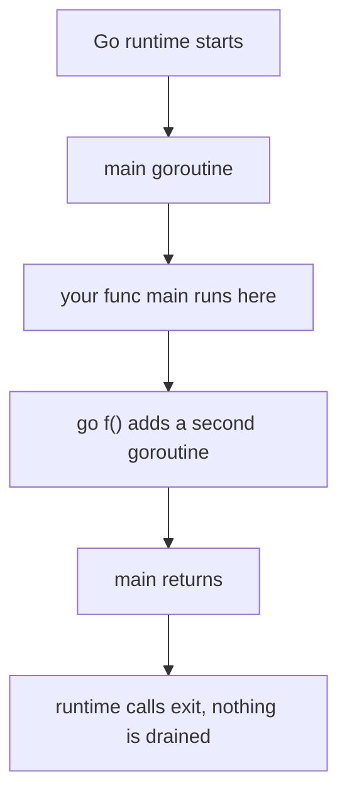
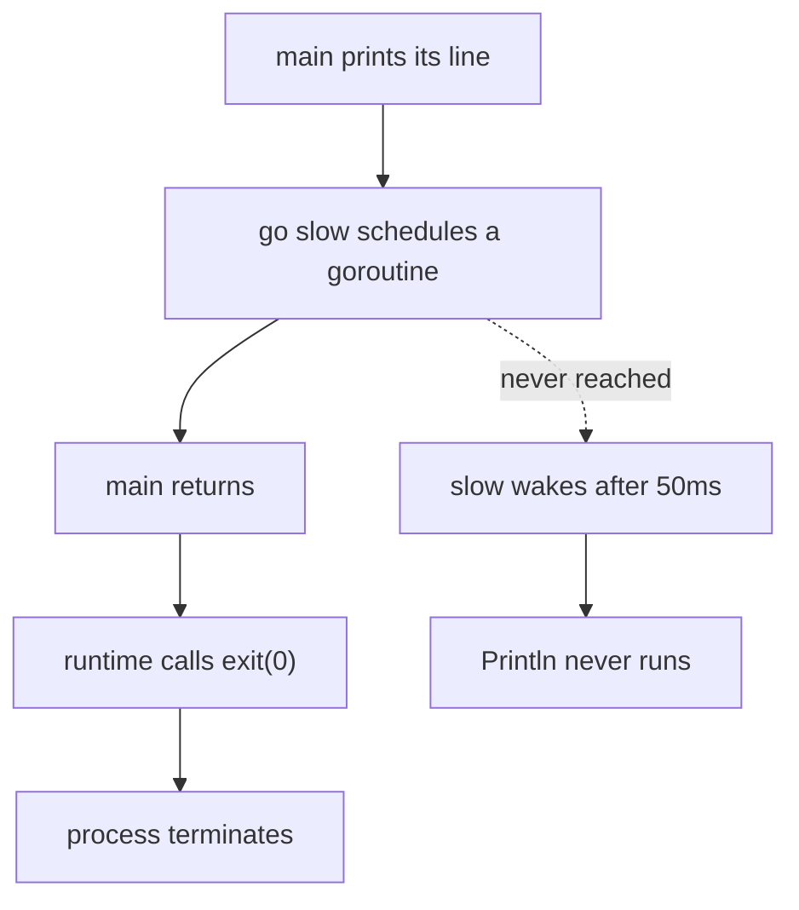

# `main` Runs in a Goroutine Too

## TLDR

- Yes. Your `func main()` is executed **inside a goroutine**, the one the Go runtime starts the program with.
- It is an ordinary goroutine as far as the runtime is concerned. You can call `runtime.NumGoroutine()` inside `main` and get `1`.
- The one thing that makes it special: **when it returns, the program exits**. It is not waited on, and neither is anything else.
- The runtime calls your `main`, and when the call returns it calls `exit(0)`. Nothing is drained, waited for, or flushed.
- Practical consequence: a `go` statement in the last few lines of `main` is a race you will eventually lose.

## The problem: is `main` just another goroutine?

The rule "when `main` returns, the program exits" sounds like `main` gets special treatment. But it is worth separating two things that are easy to conflate: `main` is *not* privileged while it runs, it is only *fatal* when it finishes. That distinction explains why concurrency behaves normally inside `main` and yet work gets dropped at the very end.

You can observe the goroutine directly:

```go
package main

import (
	"fmt"
	"runtime"
)

func main() {
	fmt.Println(runtime.NumGoroutine()) // 1
	go fmt.Println("hi")
	fmt.Println(runtime.NumGoroutine()) // 2
}
```

The count is `1` inside `main` because `main` is itself running as a goroutine. Spawn one and it becomes `2`.

<div style={{display: 'flex', justifyContent: 'center'}}>



</div>

## What the runtime actually does

The mechanism is in the Go runtime source, not in a language rule. In `runtime/proc.go`, the runtime's own `main` function resolves a linkname to `main.main` and calls it:

```go
//go:linkname main_main main.main
func main_main()
```

```go
fn := main_main // make an indirect call, as the linker doesn't know the address of the main package when laying down the runtime
fn()

// ... ASAN and race bookkeeping ...

exit(0)
```

That is the whole story. Your `main.main` is called as an ordinary function from the runtime's main goroutine. When it returns, execution falls through to `exit(0)`. There is no join, no wait, no attempt to let other goroutines finish. The process is gone.

This is why the spec phrases the rule in terms of your function rather than your goroutine: "Program execution begins by initializing the program and then invoking the function main in package main. When that function invocation returns, the program exits. It does not wait for other (non-main) goroutines to complete."

Note the wording "other (non-main) goroutines". Your `main.main` call is not waiting on anything at any point, including during its own execution. It simply runs, and its return is the exit signal.

## Proof that nothing is drained

This program looks like it should print the second line:

```go
package main

import (
	"fmt"
	"runtime"
	"time"
)

func slow() {
	time.Sleep(50 * time.Millisecond)
	fmt.Println("goroutine finished, but nobody saw it")
}

func main() {
	fmt.Println("main goroutine started, NumGoroutine =", runtime.NumGoroutine())
	go slow()
	// main returns immediately, no waiting at all
}
```

It prints one line and exits with status 0. The goroutine is scheduled, sleeps 50ms, and is killed long before it reaches its `Println`. `exit(0)` means a *successful* exit, which is the uncomfortable part: the program reports success while silently discarding work.

<div style={{display: 'flex', justifyContent: 'center'}}>



</div>

## Why this is worth internalizing

The exit code is `0`. Nothing logs a warning. There is no runtime panic, no "you leaked a goroutine" message. The work simply vanishes, and it vanishes *successfully*, which is far worse in practice than a crash because nothing alerts you.

The mental model to carry forward: `main` is a goroutine that happens to own the exit. Anything you want to survive past the end of `main` has to be finished before `main` returns, and the only way to guarantee that is to state the dependency explicitly with `sync.WaitGroup` or a channel. Scheduling it and hoping is not a plan, because "hoping" loses the race intermittently and you will only see it in production.

The related failure mode is `os.Exit`. Calling it skips every deferred function in `main`, so this looks like it runs its defer and then does not:

```go
func main() {
	defer fmt.Println("deferred cleanup")
	fmt.Println("running")
	os.Exit(0)
}
```

`running` prints; the deferred line does not. Returning from `main` normally runs the defers first, then exits. Reaching for `os.Exit` to "exit faster" trades a correctness guarantee for nothing.

## Summary

Your `func main()` is executed inside a goroutine, the one the runtime starts the program with, and it counts as one in `runtime.NumGoroutine()`. It is not privileged while it runs, which is why concurrency inside `main` behaves normally. Its only privilege is that its return ends the program: the runtime calls `main.main` and then `exit(0)`, waiting for nothing and draining nothing. So goroutines started near the end of `main` are killed mid-flight with an exit code of `0`, silently. Finish the work before `main` returns, and let `main` return normally rather than calling `os.Exit`, which skips deferred functions.

For what actually runs that goroutine and every other one, see [The Go runtime architecture](./go-runtime-scheduler-architecture.md), which covers the G, M, and P layers.

## Sources

- The Go Programming Language Specification, [Program initialization and execution](https://go.dev/ref/spec#Program_execution) - "Program execution begins by initializing the program and then invoking the function main in package main. When that function invocation returns, the program exits. It does not wait for other (non-main) goroutines to complete."
- The Go runtime source, `runtime/proc.go` - `main_main` linked by `//go:linkname` to `main.main`, called indirectly from the runtime's `main`, followed by `exit(0)`.
- The `runtime` package documentation, [type Goroutine](https://pkg.go.dev/runtime#Goroutine) - "A Goroutine is a lightweight thread managed by the Go runtime."
- The `runtime` package documentation, [func NumGoroutine](https://pkg.go.dev/runtime#NumGoroutine) - returns the number of goroutines that currently exist, including the one running the call.
- The `os` package documentation, [func Exit](https://pkg.go.dev/pkg/os#Exit) - "The program terminates with exit code status. ... Deferred functions are not run."
- [Go by Example, Goroutines](https://gobyexample.com/goroutines) - the `f`/`main` scheduling example referenced in the companion article.