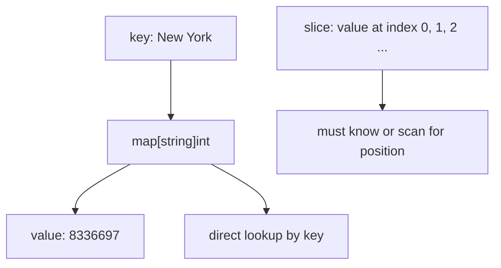
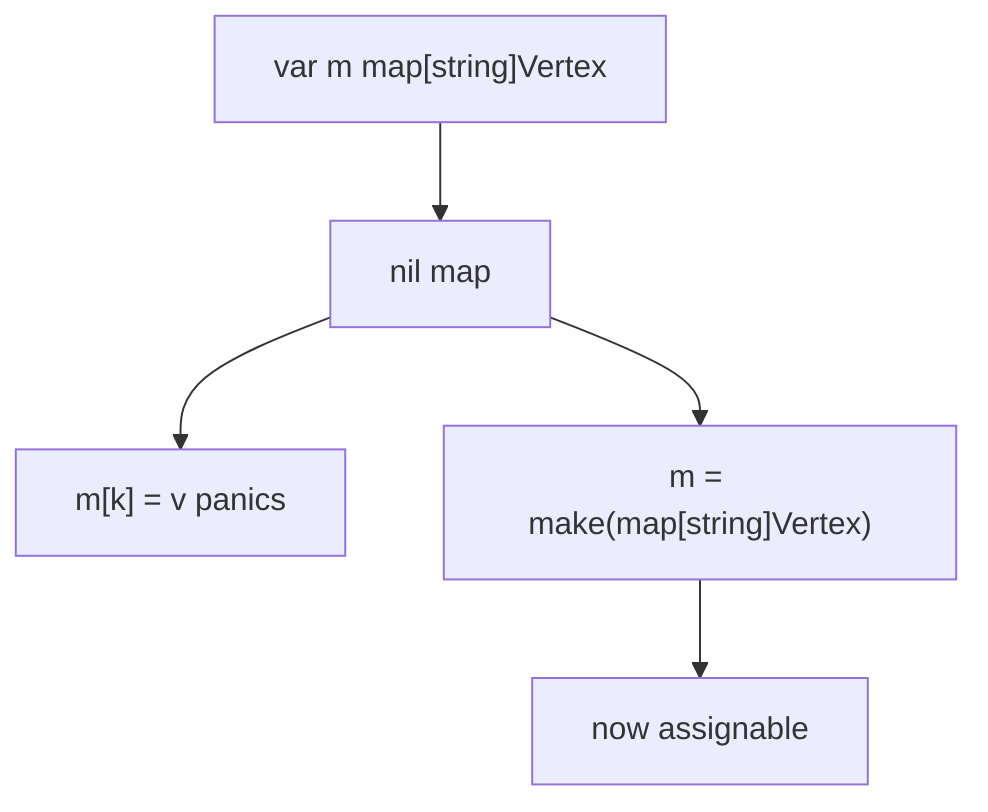
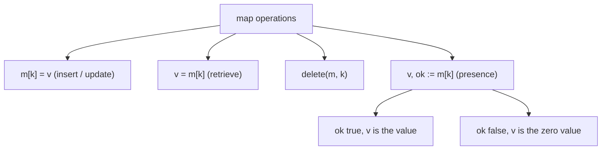
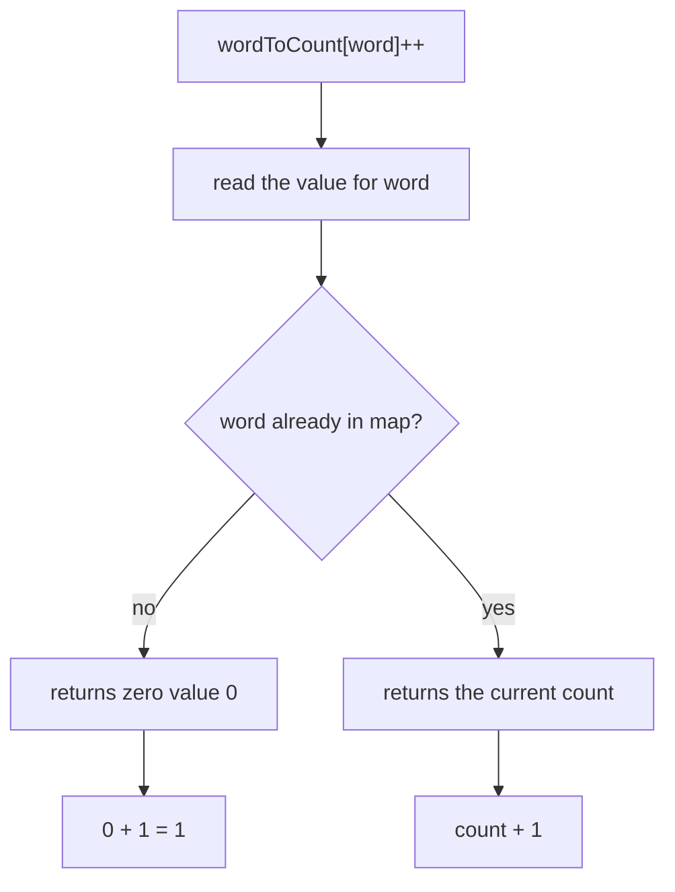

# Go Maps

## TLDR

- A map `map[K]V` maps keys of type `K` to values of type `V`; it is Go's dictionary or hash.
- A nil map cannot be assigned to; create maps with `make` (not `new`) or a map literal.
- Insert or update with `m[k] = v`; retrieve with `v = m[k]`; delete with `delete(m, k)`.
- Test presence with a two-value assignment `v, ok := m[k]`; `ok` is false and `v` is the zero value when the key is absent.
- In a map literal you can omit the element type: `"Bell Labs": {40.68, -74.40}`.
- Use a map when you look values up by key, not by position; use a slice when you index by position.

## The problem: lookup by key, not by position

Arrays and slices store values by integer position, so to find something you must know its index, or scan. Real data is usually addressed by a name or id: a city by its name, a user by an email, a word count by the word. Go's map stores key-value pairs and answers "what value goes with this key?" directly, the way dictionaries and hashes do in other languages.

<div style={{display: 'flex', justifyContent: 'center'}}>



</div>

## Creating maps

A map literal lists key-value pairs. Here string keys map to integer values.

```go
package main

import "fmt"

func main() {
    celebs := map[string]int{
        "Nicolas Cage":       50,
        "Selena Gomez":       21,
        "Jude Law":           41,
        "Scarlett Johansson": 29,
    }

    fmt.Printf("%#v", celebs)
}
```

When you do not use a literal, a map must be created with `make` before use. The nil map is empty and cannot be assigned to, so assigning to an uninitialized map panics.

```go
package main

import "fmt"

type Vertex struct {
    Lat, Long float64
}

var m map[string]Vertex

func main() {
    m = make(map[string]Vertex)
    m["Bell Labs"] = Vertex{40.68433, -74.39967}
    fmt.Println(m["Bell Labs"])
}
```

The map `m` takes a string key and maps it to a `Vertex`, a struct of two `float64` fields. The key `"Bell Labs"` maps to the value `{40.68433, -74.39967}`.

<div style={{display: 'flex', justifyContent: 'center'}}>



</div>

## Map literals with an omitted type

In a map literal, if the top-level type is just a type name, you can omit it from the elements.

```go
var m = map[string]Vertex{
    "Bell Labs": {40.68433, -74.39967},
    // same as "Bell Labs": Vertex{40.68433, -74.39967}
    "Google": {37.42202, -122.08408},
}

func main() {
    fmt.Println(m)
}
```

`{40.68433, -74.39967}` is shorthand for `Vertex{40.68433, -74.39967}` because the value type is already declared as `Vertex`.

## Mutating maps

There are four basic operations on a map: insert or update, retrieve, delete, and test for presence.

```go
m[key] = elem        // insert or update
elem = m[key]        // retrieve
delete(m, key)       // delete
elem, ok = m[key]    // test presence
```

Here they are together:

```go
package main

import "fmt"

type Vertex struct {
    Lat, Long float64
}

var m = map[string]Vertex{
    "Bell Labs": {40.68433, -74.39967},
    "Google":    {37.42202, -122.08408},
}

func main() {
    m["Splice"] = Vertex{34.05641, -118.48175} // insert
    fmt.Println(m["Splice"])

    delete(m, "Splice") // delete
    fmt.Printf("%v\n", m)

    name, ok := m["Splice"] // is it present?
    fmt.Printf("key 'Splice' is present?: %t - value: %v\n", ok, name)

    name, ok = m["Google"]
    fmt.Printf("key 'Google' is present?: %t - value: %v\n", ok, name)
}
```

When the key is present, `ok` is true. When it is absent, `ok` is false and the value is the zero value for the map's element type; reading a missing key likewise returns that zero value. The two-value form is how you tell a real zero value from a missing key.

<div style={{display: 'flex', justifyContent: 'center'}}>



</div>

## A real example: word counts

The presence behavior combines with `++` for a compact idiom: counting words. Reading an absent key returns the zero value `0`, so `m[word]++` starts a new word at `1` and increments an existing one.

```go
package main

import (
    "fmt"
    "strings"
)

func WordCount(s string) map[string]int {
    words := strings.Fields(s)
    wordToCount := map[string]int{}
    for _, word := range words {
        wordToCount[word]++
    }
    return wordToCount
}

func main() {
    fmt.Println(WordCount("go is fast go is simple"))
    // map[go:2 is:2 fast:1 simple:1]
}
```

`strings.Fields` splits the sentence into words, and each word becomes a key whose value is its count. There is no need to check whether the key exists first, and that is exactly the point. When you read a key that is not in the map, Go returns the zero value of the value type. For `map[string]int` that zero value is `0`, so `wordToCount[word]++` reads `0` on the first occurrence and increments it to `1`; on later occurrences it reads the existing count and increments it. The zero value makes the "insert if missing, otherwise increment" step collapse into one line.

<div style={{display: 'flex', justifyContent: 'center'}}>



</div>

## Checking whether a key exists

The zero-value shortcut is convenient, but it hides the difference between "key absent" and "key present with value `0`". If you need to tell those apart, use the two-value assignment.

```go
count, ok := wordToCount["go"]
if ok {
    fmt.Println("go appears", count, "times")
} else {
    fmt.Println("go does not appear")
}
```

When the key is present, `ok` is `true` and `count` holds the stored value, even if that value is `0`. When the key is absent, `ok` is `false` and `count` is the zero value. So `ok` is the signal you use when a real zero value is meaningful and must be distinguished from a missing key.

## Summary

A map is Go's key-value collection, used when data is addressed by a key rather than a position. Create it with `make` or a literal, mutate it with `m[k] = v` and `delete`, and test presence with the two-value assignment `v, ok := m[k]`. The zero value on a missing key is what makes idioms like `wordToCount[word]++` work with no special-casing.

## Sources

- A Tour of Go, [Maps](https://go.dev/tour/moretypes/19), [Map literals](https://go.dev/tour/moretypes/20), [Map literals continued](https://go.dev/tour/moretypes/21), and [Mutating Maps](https://go.dev/tour/moretypes/22) - map literals, the `make` requirement, the omitted type shorthand, and insert/retrieve/delete/test.
- A Tour of Go, [Exercise: Maps](https://go.dev/tour/moretypes/23) - the `WordCount` example and the zero-value counting idiom.
- Go Bootcamp (Matt Aimonetti), [Maps](https://www.gobootcamp.com/book/maps) - the `celebs` example and the insert/delete/presence walkthrough.
- The Go Programming Language Specification, [Map types](https://go.dev/ref/spec#Map_types) - the `map[K]V` type and nil-map assignment rules.
