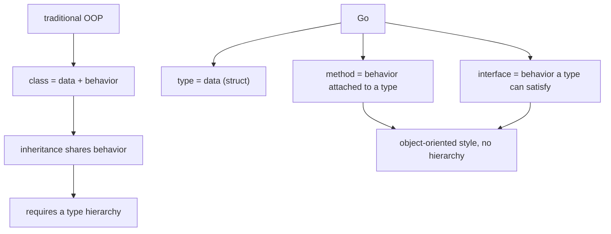
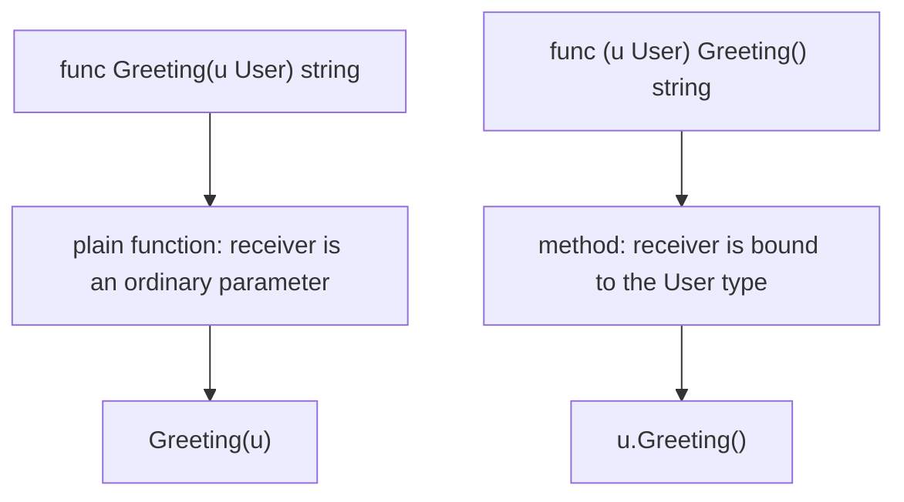
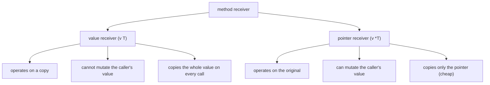
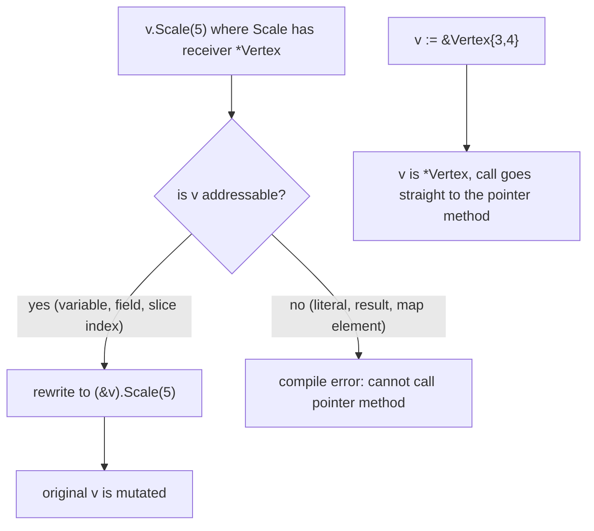
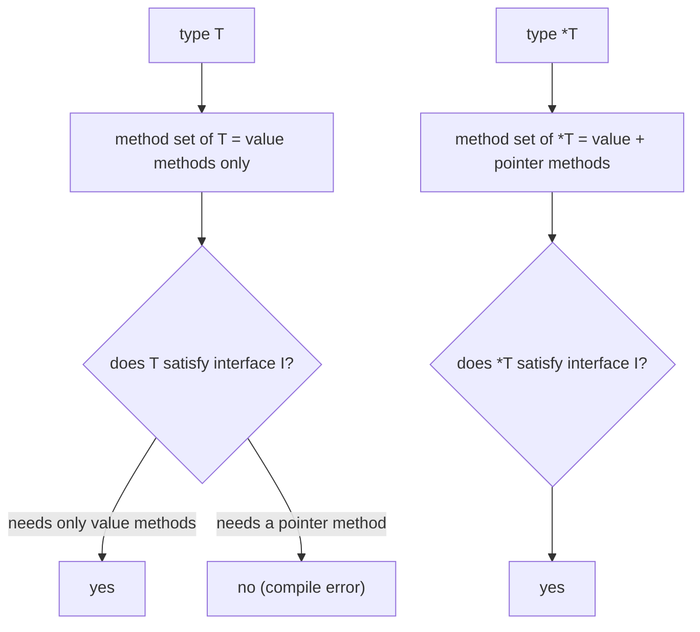

# Go Methods and Method Receivers: OOP Without Inheritance

## TLDR

- Go has no classes, but it has **methods** (functions with a receiver) and **interfaces**, which together give an object-oriented style of programming without type inheritance.
- A method is defined **outside** the type, anywhere in the type's package, by putting a receiver in front of the name: `func (u User) Greeting() string`.
- The receiver can be a **value** `(u User)` or a **pointer** `(u *User)`. At the call site Go auto-addresses and auto-dereferences, so `u.Greeting()` works either way as long as `u` is addressable.
- Use a **pointer receiver** when the method must mutate the receiver or the struct is large (only the pointer is copied); use a **value receiver** when the method only reads a small value.
- The reason `&` still matters is **method sets**: the method set of `T` contains only value-receiver methods, while the method set of `*T` contains both. So an interface that requires a pointer-receiver method is satisfied by `*T`, not `T`.
- Auto-addressing only applies to **addressable** expressions. `Vertex{}.Scale(5)`, `makeVertex().Scale(5)`, and map elements cannot call a pointer-receiver method, because there is no variable to take the address of.

## The problem: behavior has to live with data

Object-oriented languages bind behavior to data with classes, and share that behavior through inheritance: `class Dog extends Animal` reuses `Animal`'s code and makes `Dog` usable where an `Animal` is expected. Go refused that design. It has no `class`, no `extends`, and no type hierarchy; the Go FAQ's guiding principles say "there is no type hierarchy: types just are, they don't have to announce their relationships."

But the underlying need does not disappear. A program still wants to say "a `User` can produce a greeting" and "a `Vertex` can scale itself." Go answers with two separate tools: **methods**, which attach behavior to a type, and **interfaces**, which describe behavior a type can satisfy. The FAQ frames it directly: "Although Go has types and methods and allows an object-oriented style of programming, there is no type hierarchy." The interface is what replaces the hierarchy, and it is covered separately in [Go Interfaces](./go-interfaces.md) and [Why Go Has No Type Inheritance](./why-go-has-no-type-inheritance.md).

A question people ask early is the difference between a function and a method. The answer is one sentence in the specification: "A method is a function with a receiver." A receiver is the extra parameter, written between `func` and the method name, that names the value the method operates on. In object-oriented terms, a method is a function on an instance of an object.

<div style={{display: 'flex', justifyContent: 'center'}}>



</div>

## Defining a method

Methods are declared with a receiver instead of living inside a type body. Here is the canonical example, a `User` struct with a `Greeting` method:

```go
package main

import (
	"fmt"
)

type User struct {
	FirstName, LastName string
}

func (u *User) Greeting() string {
	return fmt.Sprintf("Dear %s %s", u.FirstName, u.LastName)
}

func main() {
	u := User{"Matt", "Aimonetti"}
	fmt.Println(u.Greeting()) // Dear Matt Aimonetti
}
```

The receiver is `u *User`. Read the declaration as "`Greeting` is a method whose receiver is a pointer to a `User`." Notice that the method is defined outside the struct. If you come from an object-oriented language where methods sit inside the class body, this looks odd at first, but it is deliberate: the method on `User` can be declared anywhere in the package, and it is still bound to `User`.

An interesting detail, and the source of much early confusion, is that **both** `func (u User)` and `func (u *User)` compile and can be called as `u.Greeting()`. The next sections explain why, because the difference between them is one of the most important decisions you make in Go.

<div style={{display: 'flex', justifyContent: 'center'}}>



</div>

## Methods can be attached to any type you own, not just structs

A struct is the common case, but the rule is broader. The specification says the receiver's type "must be a defined type `T` or a pointer to a defined type `T`", that `T` is the receiver base type, and that "a receiver base type cannot be a pointer or interface type and it must be declared in the same package as the method." Effective Go states the practical version: "methods can be defined for any named type (except a pointer or an interface); the receiver does not have to be a struct."

So you can attach a method to a defined type built on any underlying type:

```go
type MyStr string

func (s MyStr) Uppercase() string {
	return strings.ToUpper(string(s))
}
```

Two restrictions follow from the same rule, and they are worth stating plainly:

- You **cannot** define a method on a type declared in another package. That includes the predeclared types, because `int` and `string` live in the universe block, not your package. `func (s string) Uppercase() ...` is a compile error.
- You **cannot** define a method on a pointer type or an interface type directly. `func (p *MyStr) ...` is fine (that is a pointer to a defined type), but `type P = *MyStr` used as a receiver is not.

When the type you want to extend belongs to someone else, the fix is to declare a new defined type based on it and attach the method to your new type. That whole technique, and why a type alias is the wrong tool for it, is worked out in [Defined Types: Adding Methods to Types You Do Not Own](./go-defined-types.md).

## Value receivers vs pointer receivers

The choice of receiver controls two things: whether the method can change the receiver, and what gets copied on each call.

### Pointer receiver: avoid a copy and allow mutation

Go passes everything by value, so a value receiver copies the receiver on every call. If the receiver is a large struct, that copy is wasteful. A pointer receiver copies only the pointer, which is cheap. This is a performance reason and it is the one the user material calls out first: "First, to avoid copying the value on each method call (more efficient if the value type is a large struct)."

The second reason is correctness: a pointer receiver lets the method modify the original value. A value receiver gets a copy, so any change it makes is thrown away when the method returns. The specification describes it as a safety rule: pointer methods "can modify the receiver; invoking them on a value would cause the method to receive a copy of the value, so any modifications would be discarded."

```go
package main

import (
	"fmt"
	"math"
)

type Vertex struct {
	X, Y float64
}

func (v *Vertex) Scale(f float64) {
	v.X = v.X * f // v is the original Vertex, so this sticks
	v.Y = v.Y * f
}

func (v *Vertex) Abs() float64 {
	return math.Sqrt(v.X*v.X + v.Y*v.Y)
}

func main() {
	v := &Vertex{3, 4}
	v.Scale(5)
	fmt.Println(v, v.Abs()) // &{15 20} 25
}
```

`Scale` has to be a pointer receiver because it modifies the receiver. `Abs` only reads, so it could have been either; the authors gave it a pointer receiver for consistency (and to avoid copying the vertex).

<div style={{display: 'flex', justifyContent: 'center'}}>



</div>

## The confusing part: why does `v.Scale(5)` work without `&`?

This is the question that trips almost everyone up, because the examples seem to contradict the rule that "pointer methods can only be invoked on pointers." In the code above, `Scale` has a pointer receiver, yet `v := Vertex{3, 4}; v.Scale(5)` also works, with no `&` anywhere.

The specification resolves it in one sentence: "If `x` is addressable and `&x`'s method set contains `m`, `x.m()` is shorthand for `(&x).m()`." Effective Go adds the reasoning: "When the value is addressable, the language takes care of the common case of invoking a pointer method on a value by inserting the address operator automatically... the compiler will rewrite that to `(&b).Write` for us."

So the compiler quietly rewrites `v.Scale(5)` into `(&v).Scale(5)`. You did not pass `&`, but Go did it for you, and that is why `v` is modified.

The catch is the word **addressable**. Only some expressions have a stable location in memory whose address Go can take:

| Addressable (auto-`&` works) | Not addressable (compile error) |
| --- | --- |
| a variable: `v` | a function result: `makeVertex()` |
| a pointer indirection: `*p` | a composite literal in a call: `Vertex{3, 4}` |
| slice indexing: `s[i]` | a map element: `m["key"]` |
| a field of an addressable struct: `v.X` | a constant or literal |
| array indexing of an addressable array: `a[i]` | a string index: `s[i]` |

That table explains all the errors people hit. Each of these fails to compile with the message "cannot call pointer method ... on ...":

```go
Vertex{3, 4}.Scale(5)      // composite literal, not addressable
makeVertex().Scale(5)      // function result, not addressable
m := map[string]Vertex{"a": {3, 4}}
m["a"].Scale(5)            // map element, not addressable
```

When you write `v := &Vertex{3, 4}`, you skip the whole issue: `v` is already a `*Vertex`, so `v.Scale(5)` calls the pointer receiver directly. Using `&Vertex{3, 4}` is also the idiomatic way to say "I want a pointer here," and it is required whenever you need a `*Vertex` explicitly (for a function parameter, a struct field, or an interface, as the next section shows).

<div style={{display: 'flex', justifyContent: 'center'}}>



</div>

## Method sets: why `&` still matters for interfaces

The auto-address magic only applies to **method calls**. It does **not** apply when you assign a value to an interface variable, and that is the deeper reason the `&` question matters. To understand it you need the **method set**, which the specification defines as "the methods that can be called on an operand of that type":

- The method set of a defined type `T` consists of all methods declared with receiver type `T`.
- The method set of a pointer to a defined type `T` is the set of all methods declared with receiver `*T` **or** `T`.

In a table:

| Receiver of the method | In method set of `T` | In method set of `*T` |
| --- | --- | --- |
| value `func (v T) M()` | yes | yes |
| pointer `func (v *T) M()` | **no** | yes |

This is the surprising asymmetry. A `*T` can call every method `T` has, plus the pointer-receiver ones, but a `T` cannot call the pointer-receiver ones through the method set. The auto-address rewrite hides this at call sites, so it only becomes visible when you try to satisfy an interface:

```go
type Scaler interface {
	Scale(float64)
}

func (v *Vertex) Scale(f float64) { /* ... */ }

var _ Scaler = (*Vertex)(nil) // ok: *Vertex's method set includes Scale
var _ Scaler = Vertex{}       // compile error: Vertex does not implement Scaler
                              // (method Scale has pointer receiver)
```

The `var _ Scaler = ...` lines are the idiomatic compile-time check the Go FAQ recommends for proving that a type satisfies an interface. The second line fails because interface satisfaction is decided by the method set, and `Vertex`'s method set does not contain `Scale`. Go will not take the address of `Vertex{}` to make it fit, because `Vertex{}` is not addressable and, more importantly, because an interface value has to work regardless of how it was obtained.

This is the correct mental model to keep:

- **Method call on a concrete value**: Go auto-addresses if the value is addressable, so `v.Scale(5)` works.
- **Interface satisfaction**: no auto-addressing, so `*T` implements the interface and `T` does not.

`*os.File` is a good real-world illustration: it satisfies `io.Reader`, `io.Writer`, `io.Seeker`, `io.Closer`, and several more at once, because those methods are declared on the pointer receiver and the pointer's method set is the union of all of them.

<div style={{display: 'flex', justifyContent: 'center'}}>



</div>

## Choosing a receiver: a decision guide

| Situation | Receiver to use |
| --- | --- |
| Method mutates the receiver | pointer (`*T`) |
| Receiver is a large struct | pointer (`*T`), to avoid copying |
| Receiver is a small value that should not be shared (a point, a count, a defined type over `int`) | value (`T`) |
| Method only reads and copying is cheap | value (`T`) |
| Any method on the type is a pointer method | pointer for consistency, even read-only ones |
| The type must satisfy an interface that needs a pointer method | pointer (`*T`) |

Two practical rules reduce surprises. First, be consistent: if any method on a type needs a pointer receiver, give the rest pointer receivers too, so the type has one coherent method set. Second, remember that code like `client := &http.Client{}` is common precisely because the client's useful methods are on the pointer, and the pointer is what satisfies the interfaces and is safe to share.

## Summary

Go's object-oriented style is methods plus interfaces, with no classes and no inheritance. A method is a function with a receiver, declared outside the type but bound to it, and it can be attached to any defined type you own, not only structs. The receiver can be a value or a pointer: pointer receivers let a method mutate the receiver and avoid copying it, while value receivers operate on a copy. At a call site, Go automatically takes the address of an addressable value so that `v.Scale(5)` works even when `Scale` takes a pointer, which hides the distinction until you reach method sets and interfaces. There the rule is strict: `T`'s method set holds only value-receiver methods, `*T`'s holds both, so an interface requiring a pointer method is satisfied by `*T` and not by `T`. The addressability list is what makes the compiler accept some `x.m()` calls and reject others, and `&T{...}` is how you opt into a pointer explicitly.

## Sources

- The Go Programming Language Specification, [Method declarations](https://go.dev/ref/spec#Method_declarations), for "A method is a function with a receiver," the receiver base type rule, and the requirement that the base type be declared in the same package.
- The Go Programming Language Specification, [Method sets](https://go.dev/ref/spec#Method_sets), for the method set of `T` (value methods only) and of `*T` (value and pointer methods).
- The Go Programming Language Specification, [Calls](https://go.dev/ref/spec#Calls), for "If `x` is addressable and `&x`'s method set contains `m`, `x.m()` is shorthand for `(&x).m()`."
- The Go Programming Language Specification, [Method values](https://go.dev/ref/spec#Method_values), for the automatic address rule on addressable values and the example that `f := makeT().Mp` is invalid because the result is not addressable.
- The Go Programming Language Specification, [Address operators](https://go.dev/ref/spec#Address_operators), for the definition of addressable: a variable, pointer indirection, slice indexing, a field of an addressable struct, or an array indexing of an addressable array.
- Effective Go, [Methods](https://go.dev/doc/effective_go#methods), for "methods can be defined for any named type (except a pointer or an interface)," the value-vs-pointer receiver rule, and the explanation that the compiler rewrites `b.Write` to `(&b).Write` when `b` is addressable.
- The Go Programming Language FAQ, [Is Go an object-oriented language?](https://go.dev/doc/faq#Is_Go_an_object-oriented_language), for the "yes and no" answer, the absence of a type hierarchy, and methods being definable on any sort of data.
- The Go Programming Language FAQ, [What are the guiding principles in the design?](https://go.dev/doc/faq#principles), for "there is no type hierarchy: types just are, they don't have to announce their relationships."
- The Go Programming Language FAQ, [How do I get dynamic dispatch of methods?](https://go.dev/doc/faq#How_do_I_get_dynamic_dispatch_of_methods), for the rule that only interfaces dispatch dynamically.
- The Go Programming Language FAQ, [How can I guarantee my type satisfies an interface?](https://go.dev/doc/faq#guarantee_satisfies_interface), for the `var _ I = T{}` / `var _ I = (*T)(nil)` compile-time check.
- A Tour of Go, [Methods](https://go.dev/tour/methods/1) and [Methods and pointer indirection](https://go.dev/tour/methods/4), for methods on struct types and pointer vs value receivers.
- Go Bootcamp (Matt Aimonetti), [Methods](https://www.gobootcamp.com/book/methods), [Code Organization](https://www.gobootcamp.com/book/codeorganization), and [Method Receivers](https://www.gobootcamp.com/book/methodreceivers), for the `User`/`Greeting` example, the object-oriented framing without inheritance, and the two reasons to use a pointer receiver.
