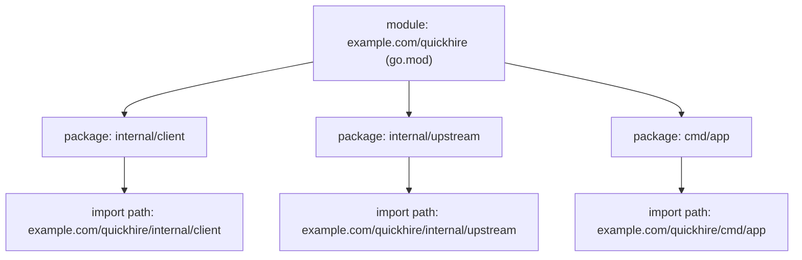
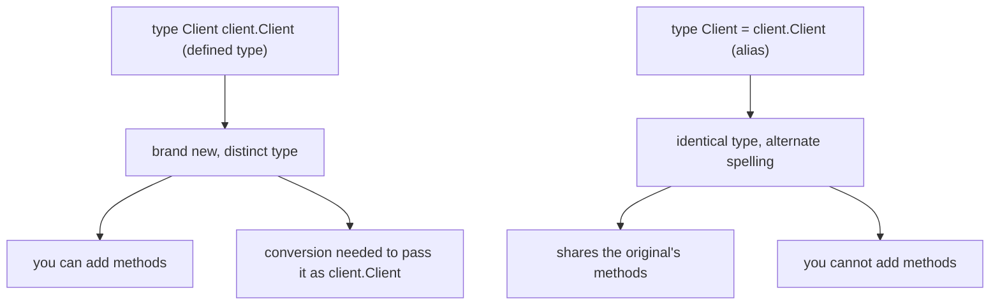
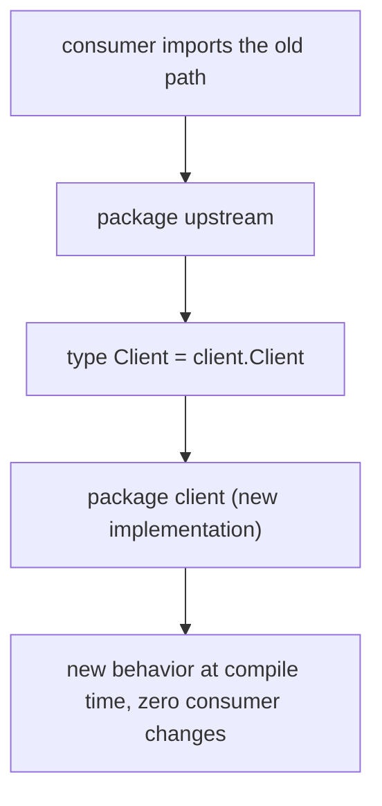
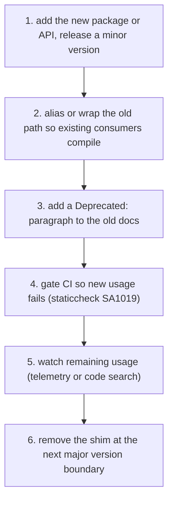
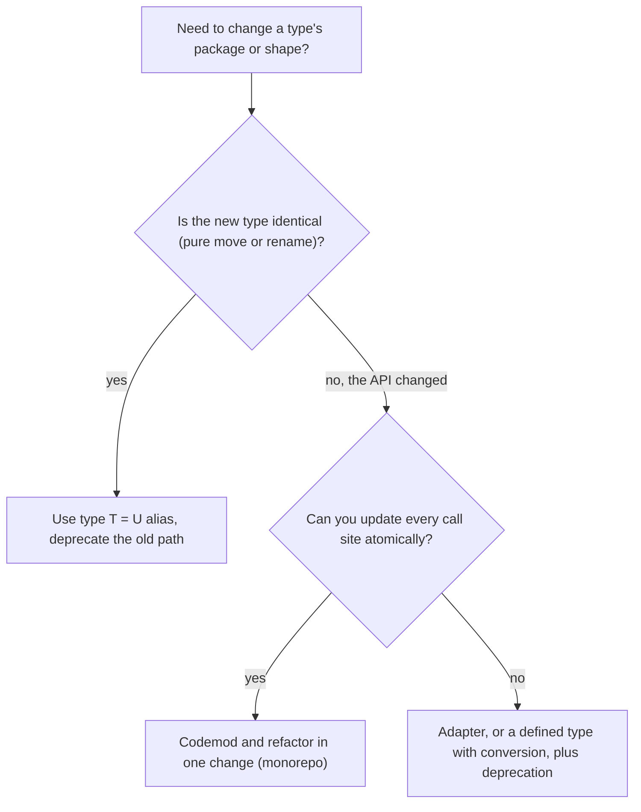

import FileTree from '@site/src/components/FileTree';

# Go Modules, Packages, and Type Aliases: Safe API Migration

## TLDR

- A **package** is Go's unit of compilation: one directory, one `package` name, imported everywhere by its **import path**. A **module** is the unit of versioning and distribution: a collection of packages described by a `go.mod` file. A package's import path is the module path plus its subdirectory.
- `go.mod` gives a module its **identity** (the `module` directive), pins **dependency versions**, and declares the **Go language version**. `go.sum` records checksums so builds are reproducible.
- `type T = U` is a **type alias**: `T` and `U` are the *identical* type, methods are shared, and no conversion is needed. You **cannot add methods** to it. If `U` is defined in another package, you also cannot use `T` as a method receiver.
- `type T U` (no `=`) is a **defined type**: a brand new type you own, useful for attaching methods and for compile-time type safety, but it is a distinct type and needs explicit conversion. It is not an alias, even though tutorials often call it one.
- Aliases exist for **gradual code repair**: move a type to a new package while old and new names still interoperate. Go 1.9 introduced them for exactly this, and `golang.org/x/net/context` aliasing the standard `context` is the canonical example.
- Large codebases run a lifecycle: add the new package, alias or wrap the old path, mark it `Deprecated:`, lint-gate new usage (staticcheck SA1019), watch real usage, then remove it at a **major version** boundary. Monorepos often skip the alias and codemod instead. Deprecation in Go does **not** mean removal, because of the Go 1 compatibility promise.
- The alias buys **compile-time continuity** only. Behavioral compatibility still has to be verified by every consuming team, which is why large migrations are phased instead of big-bang.

## The problem this solves

Two different problems often get mixed together, so it helps to separate them.

**Problem A: how does the toolchain know where code lives and which version to use?** Go's unit of compilation is the package, but packages have to be named, located, and versioned across machines. Before modules, a global `GOPATH` checkout held one mutable copy of every dependency, so two projects could not use two versions of the same library. Modules replace that.

**Problem B: how do you safely move or rename a type that other code already depends on?** Go types are *nominal*: a type declared in one package is a distinct type from one declared in another, even with identical fields. So when a team moves a type to a new package, every consumer would otherwise have to migrate before the new package can ship. Type aliases exist so old and new names can coexist and interoperate during the transition.

We will take them in order.

## Packages, modules, and import paths

A package is a collection of source files in the same directory, compiled together and sharing one namespace. A module is "a collection of packages that are released, versioned, and distributed together," identified by a module path declared in its `go.mod` file. The package path is the module path joined with the subdirectory containing the package, and that path is what you write in an `import`.

The example project used throughout this page has one module and three packages. The labels on the right show the import path each package resolves to.

<FileTree
  root="module example.com/quickhire"
  items={[
    {name: 'go.mod', note: 'declares the module path'},
    {
      name: 'internal',
      children: [
        {name: 'client', note: 'example.com/quickhire/internal/client', children: [{name: 'client.go'}]},
        {name: 'upstream', note: 'example.com/quickhire/internal/upstream', children: [{name: 'upstream.go'}]},
      ],
    },
    {
      name: 'cmd',
      children: [
        {name: 'app', note: 'package main, example.com/quickhire/cmd/app', children: [{name: 'main.go'}]},
      ],
    },
  ]}
/>

<div style={{display: 'flex', justifyContent: 'center'}}>



</div>

So a module is a level *above* a package, but it is not the same kind of thing. A package is a **code boundary** (compilation, naming, encapsulation). A module is a **distribution boundary** (versioning, dependency resolution, publishing). One module usually contains many packages, and a single-package module is perfectly legal.

### What `go.mod` is for

A module is defined by a `go.mod` file in its root directory. The file is line-oriented and holds a small set of directives:

```text
module example.com/quickhire

go 1.24

require github.com/some/dep v1.2.3
```

- The **`module` directive** declares the module path. It is the module's canonical name and the prefix of every package path inside it. Exactly one is required.
- The **`go` directive** records the Go version the module was written for. Since Go 1.21 it is a mandatory minimum: toolchains refuse to build modules that declare a newer Go version.
- The **`require` directive** lists the minimum version of each dependency. The `go` command resolves the whole graph with minimal version selection and records the result in the build list.

Alongside it, `go.sum` stores cryptographic checksums of downloaded modules, which is what makes a build reproducible. The command that creates a module is `go mod init`:

```bash
go mod init example.com/quickhire
go mod tidy   # add missing requirements, drop unused ones
```

One nuance worth knowing: the leading element of a module path (by convention a domain) must contain a dot **only if the module may be downloaded as a dependency**. The reference says a module that will never be fetched as a dependency may use any valid package path, which is why a local playground can happily be `module go-lang-playground` while a published library needs `github.com/you/repo`.

### Encapsulation with `internal`

Go only has two levels of visibility: exported (capital letter) and unexported (lowercase). To hide a whole package from outsiders, place it in a directory named `internal`. The `go` command refuses to let any package outside the tree rooted at the parent of `internal` import it. A package at `.../a/b/c/internal/d/e/f` can only be imported by code under `.../a/b/c`. This was added in Go 1.4 and enforced for all repositories from Go 1.5.

This matters for migration design: `internal/` tells you the exact blast radius of a change. Code inside the module can be forced to migrate together; only the public paths need long-lived compatibility shims.

## Alias versus defined type

An alias is easy to confuse with a related declaration, so the contrast is worth stating before the mechanics. The distinction comes down to one character, and that character decides whether two names refer to the *same* type. Go has two declarations that look almost identical:

```go
type Client client.Client   // defined type: a new identity that this package owns
type Client = client.Client // alias: an alternate spelling of client.Client
```

A **defined type** (`type T U`, no `=`) introduces a *new* type, distinct from its underlying type `U`. Because the new type belongs to the declaring package, you can attach methods to it, but you must convert values explicitly to pass them where the original type is expected. A **type alias** (`type T = U`) introduces no new type at all: `T` and `U` are the identical type, share a method set, and need no conversion. The Go specification and the type-alias proposal call the first form a "defined type" (older docs said "named type") and reserve "alias" for the `=` form, so a declaration like `type T U` is not an alias even though it is often described as one.

<div style={{display: 'flex', justifyContent: 'center'}}>



</div>

| Declaration | Kind | Same identity as `U`? | Shares methods? | Can you add methods? |
| --- | --- | --- | --- | --- |
| `type T U` | defined type | No, new type | No | Yes (you own `T`) |
| `type T = U` | alias | Yes, identical | Yes | No |
| `type T = pkg.U` | alias to imported type | Yes | Yes | No |

Two rules follow directly from the alias row and are stated in the type-alias proposal: an alias's method set is the same as the aliased type's, and "if `T1` is an alias for a type `T2` defined in an imported package, method declarations using `T1` as a receiver type are invalid."

The practical consequences: to keep two names identical across packages you use an alias; if you need a distinct type with its own methods, you use a defined type and convert at the boundary. For the full treatment of defined types, including how to add methods to a type you do not own and when a struct is a better choice, see [Defined types: adding methods to types you do not own](./go-defined-types.md).

## Moving a type without breaking consumers

Now Problem B. Suppose you have a client type in a package consumers already import, and you want the real implementation to live in a new package. Rewriting every consumer at once is not always possible (more on that below). The alias is the seam that lets both names refer to the same thing.

Start with the new implementation:

```go
// internal/client/client.go (the new implementation)
package client

import "fmt"

type Client struct {
	TargetURL string
	Timeout   int
}

func (c *Client) DoSomething() {
	fmt.Printf("calling %s (timeout %ds)\n", c.TargetURL, c.Timeout)
}
```

Then make the old public path an alias, so existing consumers keep compiling:

```go
// internal/upstream/upstream.go (the old, public path)
package upstream

import "example.com/quickhire/internal/client"

// Client is the alias downstream keeps using. It is the same type as
// client.Client, so no consumer has to migrate for this to keep compiling.
type Client = client.Client
```

Because `upstream.Client` and `client.Client` are the *identical* type, a value from one can be passed to code expecting the other, with no conversion. An interface assertion against either name succeeds, and a type switch case for either name matches. Consumers that recompile against the new version silently pick up the new implementation while their own source stays untouched.

<div style={{display: 'flex', justifyContent: 'center'}}>



</div>

The proposal spells out the motivation: aliases exist "to enable gradual code repair during large-scale refactorings, in particular moving a type from one package to another in such a way that code referring to the old name interoperates with code referring to the new name." Type aliases shipped in Go 1.9.

The canonical real-world use is the `context` migration. The `golang.org/x/net/context` package now contains:

```go
type Context = context.Context
type CancelFunc = context.CancelFunc
```

and its documentation says the package "has been superseded by the standard library context package." The old path is a thin alias, so hundreds of thousands of importers kept compiling while the ecosystem moved imports to the standard library at its own pace.

### What the alias does and does not guarantee

An alias preserves **identity** and **API shape only if the new type is compatible**. It cannot add, rename, or remove fields, and it cannot add methods. If the new `client.Client` is missing something the old type had, consumers break at compile time. The alias is a drop-in only when the new type is a superset or an exact match.

And critically, an alias says nothing about **runtime behavior**. A green compile means the types match, not that latency, error handling, retries, or edge cases behave the same. That gap is the whole reason migrations get phased.

## The migration lifecycle in large codebases

Practice splits cleanly by repository layout.

**Monorepos.** When every call site is in one repository, the cheapest path is usually not an alias at all. You rename or move the symbol and run a workspace-wide refactor (`gopls rename`, `go fix`, or an internal codemod) in a single change, and CI compiles the whole graph. A failing build is caught immediately by the same commit that caused it.

**Multi-repo or published modules.** You cannot update every consumer atomically, so you run a versioned deprecation lifecycle:

<div style={{display: 'flex', justifyContent: 'center'}}>



</div>

The pieces:

- **Deprecation is machine-readable.** Add a paragraph to the doc comment that begins with `Deprecated:`, followed by what to use instead. Static analysis tools such as staticcheck (check SA1019, "Using a deprecated function, variable, constant or field") warn on use, and pkg.go.dev hides deprecated docs. Once you gate CI on that warning, *new* usage stops immediately even before old usage is cleaned up.
- **Deprecation is not removal.** The Go wiki is explicit that because of the Go 1 compatibility promise, a deprecated feature "will be preserved in its deprecated form to keep existing programs running." Actual removal requires a **major version**, and since Go 2, a major version must carry a `/v2` suffix in the module path so the old and new import paths can coexist. That rule is what lets multiple incompatible major versions live in one build.
- **Usage accounting.** You cannot see who imports a compiled binary, so teams either instrument the old path with metrics or use code search across their repositories to know when a shim is safe to delete.

### Why phase it at all

The alias does not remove the expensive part of a migration, it decouples *when* each team pays for it. The reasons are operational:

- **Verification is per-team and expensive.** Compiling is cheap, but proving behavior is unchanged in every real flow is not. Each consuming team owns integration, end-to-end, and load tests for its own paths, and the package owner does not own those flows. Phasing lets each team re-verify on its own schedule while the compile stays green.
- **Compile compatibility is not behavioral compatibility.** As above, the type matches but the runtime may differ. Those differences are exactly what each consumer has to check.
- **Blast radius.** A big-bang switch means one subtle bug hits every consumer at once. Phased migration surfaces a problem in one team's traffic first.
- **Release cadence and ownership.** Teams have different freezes, on-call rotations, and approval gates. The alias lets the shared dependency move forward (for example, for a security patch) without blocking on a coordinated "flag day."

So the alias buys scheduling freedom, not verification savings. If the new implementation is provably behaviorally identical and you can coordinate the change atomically, you skip all of this and codemod.

### Choosing an approach

<div style={{display: 'flex', justifyContent: 'center'}}>



</div>

- **Pure move or rename** and consumers are not all under your control: alias plus deprecation.
- **API shape changed**: an alias cannot help, because it cannot change fields or methods. Use a wrapper or adapter package, a defined type with explicit conversions, or a new `v2` package and let consumers opt in.
- **You need to add methods to a foreign type**: define a new type based on it (`type T U`), never an alias.
- **Everything is in one repo and you can prove equivalence**: codemod and skip the shim.

## Summary

A package is the unit of compilation and a module is the unit of versioning and distribution, tied together by import paths and a `go.mod` file that fixes identity, dependencies, and language version. Go's nominal typing means a moved type becomes a different type, so `type T = U` aliases exist to let old and new names interoperate during a gradual migration, while `type T U` defined types are the way to add methods to something you do not own. In production, the alias is paired with a deprecation lifecycle: mark it `Deprecated:`, let tooling block new usage, watch the remaining callers, and remove it at a major version. The alias keeps code compiling; it does not remove the need for each team to verify its own flows, which is why large migrations move in phases rather than all at once.

## Sources

- Go Modules Reference, [Modules, packages, and versions](https://go.dev/ref/mod) and the [`go.mod` files](https://go.dev/ref/mod#go-mod-file) section, for the definitions of module, package path, the `module`/`go`/`require` directives, the rule that a never-fetched module may use any valid package path, major version suffixes, and module deprecation.
- Russ Cox and Robert Griesemer, [Proposal: Type Aliases](https://github.com/golang/proposal/blob/master/design/18130-type-alias.md) (2016), for the motivation of gradual code repair across packages, the identity of `type T1 = T2`, shared method sets, the rule that methods cannot use an alias of an imported type as a receiver, and the contrast with defined types.
- The Go Programming Language Specification, [Type declarations](https://go.dev/ref/spec#Type_declarations) and [Method declarations](https://go.dev/ref/spec#Method_declarations), for defined types, type aliases, and the receiver base type rule.
- A Tour of Go, [Methods continued](https://go.dev/tour/methods/3), for the rule that a method's receiver type must be defined in the same package.
- Go Wiki, [Deprecated](https://go.dev/wiki/Deprecated), for the `Deprecated:` doc-comment convention, the note that tools warn on deprecated identifiers, and the fact that deprecation does not imply removal under the Go 1 compatibility promise.
- Staticcheck, [Checks](https://staticcheck.dev/docs/checks/), entry SA1019 "Using a deprecated function, variable, constant or field".
- Go 1.4 Release Notes, [Internal packages](https://go.dev/doc/go1.4#internalpackages), for the `internal` visibility rule and its enforcement for all repositories from Go 1.5.
- `golang.org/x/net/context` package documentation, for the real alias migration where `Context` and `CancelFunc` are aliases of the standard library `context` types.
- Go Blog, [Go Modules: v2 and Beyond](https://go.dev/blog/v2-go-modules), for the `/v2` major version suffix and coexisting major versions.
