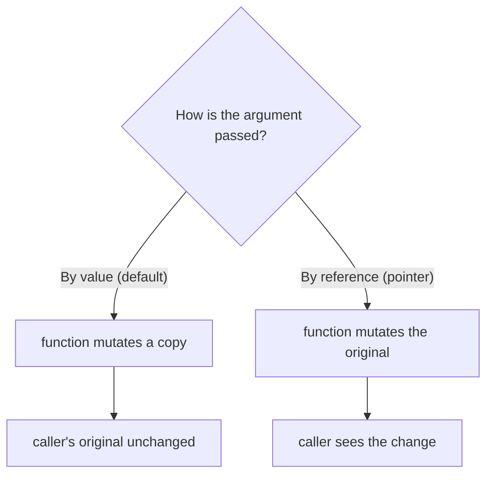
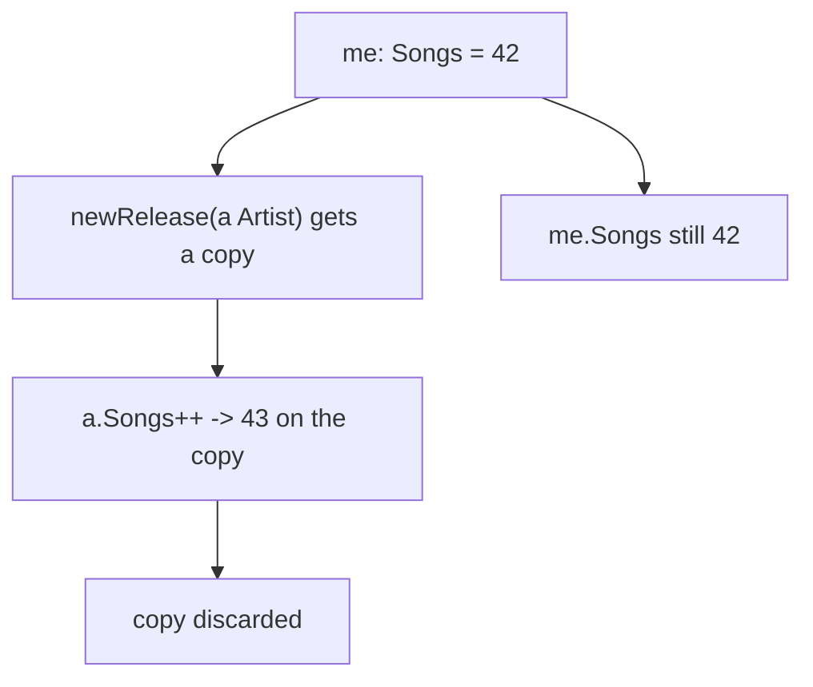
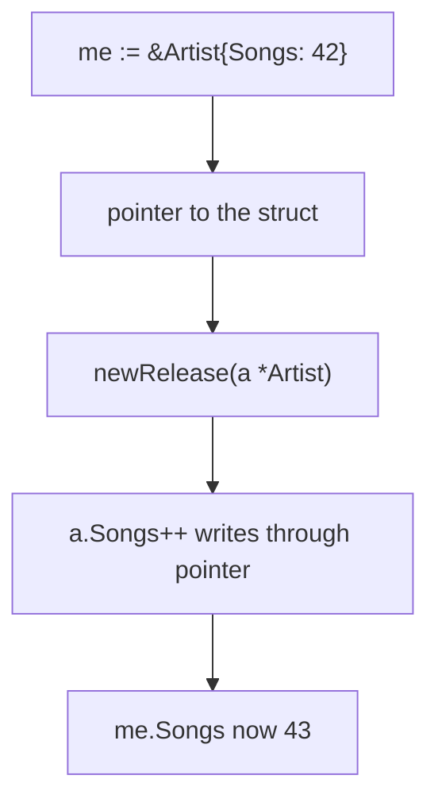

# Go Mutability: Pass by Value vs Pass by Reference

## TLDR

- In Go, only **constants** are truly immutable; variables are mutable.
- Function arguments are passed **by value** by default: the function receives a copy, so mutating the copy does not change the caller's variable.
- To mutate the original value, pass a **pointer** (pass by reference); the function then writes through the address to the caller's variable.
- Slices and maps are the exception: they are reference-like, so changes to their contents are visible to the caller even though the slice header itself is copied.
- The `&` symbol creates a pointer, and a `*` parameter type accepts one.

## The problem: why did my function not change my variable?

A common Go surprise is writing a function that updates a value, calling it, and finding the original unchanged. The cause is always the same: Go copied the value into the function, the function changed its copy, and the copy was thrown away. Understanding when Go copies and when it shares is the key to controlling state in Go.

<div style={{display: 'flex', justifyContent: 'center'}}>



</div>

## The default: pass by value

Consider a struct and a function that tries to increment a field. Passing the struct by value copies it, so the increment happens on the copy.

```go
package main

import "fmt"

type Artist struct {
    Name, Genre string
    Songs       int
}

func newRelease(a Artist) int { // passing an Artist by value
    a.Songs++
    return a.Songs
}

func main() {
    me := Artist{Name: "Matt", Genre: "Electro", Songs: 42}
    fmt.Printf("%s released their %dth song\n", me.Name, newRelease(me))
    fmt.Printf("%s has a total of %d songs", me.Name, me.Songs)
}
```

`newRelease` returns `43`, but `me.Songs` is still `42` in `main`. The function received a copy of the struct, incremented the copy's `Songs`, and the caller's struct was never touched.

<div style={{display: 'flex', justifyContent: 'center'}}>



</div>

## Pass by reference with a pointer

To mutate the original, pass a pointer. The function writes through the pointer to the caller's value.

```go
package main

import "fmt"

type Artist struct {
    Name, Genre string
    Songs       int
}

func newRelease(a *Artist) int { // passing an Artist by reference
    a.Songs++
    return a.Songs
}

func main() {
    me := &Artist{Name: "Matt", Genre: "Electro", Songs: 42}
    fmt.Printf("%s released their %dth song\n", me.Name, newRelease(me))
    fmt.Printf("%s has a total of %d songs", me.Name, me.Songs)
}
```

The only two changes are: `newRelease` now takes `*Artist` (a pointer), and `me` is created with `&Artist{...}` (a pointer to a struct). Now `a.Songs++` writes through the pointer, so `me.Songs` becomes `43`. The second print shows the change.

<div style={{display: 'flex', justifyContent: 'center'}}>



</div>

## The slice and map exception

Slices and maps behave differently. A slice header (pointer, length, capacity) is copied when passed, but the underlying array is shared, so modifying an element through a slice is visible to the caller. Maps are reference types entirely: passing a map shares the same underlying data. This is why you do not need pointers to mutate slice or map contents, even though Go is technically passing a value (the header or the map reference).

## When mutability matters

| Situation | Approach | Why |
| --- | --- | --- |
| Function must update a struct or scalar | Pass a pointer | Otherwise it changes a copy |
| Large struct passed to many functions | Pass a pointer | Avoids copying the whole struct |
| Function only reads a value | Pass by value | Simpler, no aliasing surprises |
| Slice or map contents | Pass directly | Contents are already shared |

## Summary

Go passes arguments by value by default, which means a function mutates a copy and the caller's value stays unchanged. To mutate the original, pass a pointer using `&` and accept it with a `*` parameter. Slices and maps are the exceptions, sharing their underlying data automatically. Recognizing which case you are in is what lets you predict and control state changes in Go.

## Sources

- Go Bootcamp (Matt Aimonetti), [Mutability](https://www.gobootcamp.com/book/pointers) - the pass-by-value default, the `newRelease` before/after pointer example, and the note that only constants are immutable.
- A Tour of Go, [Pointers](https://go.dev/tour/moretypes/1) - the `&` and `*` operators used for pass by reference.
- A Tour of Go, [Slices](https://go.dev/tour/moretypes/7) and [Maps](https://go.dev/tour/moretypes/19) - the reference-like behavior of slices and maps.
- The Go Programming Language Specification, [Calls](https://go.dev/ref/spec#Calls) - the formal rule that arguments are passed by value.
