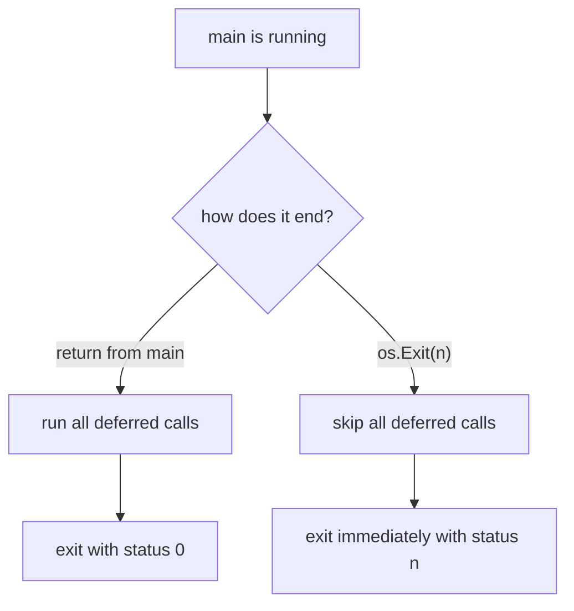

# `os.Exit`, Deferred Functions, and Exit Codes

## TLDR

- `os.Exit(code)` terminates the process **immediately**. No deferred function anywhere runs.
- The only way to end `main` and still run its `defer`s is to **return from `main`**, not call `os.Exit`.
- `main` has no return value in Go, so a non-zero exit status requires `os.Exit`. There is no JVM/C-style "return the status from main".
- Use it for one thing: reporting a failure that must stop the program right now, usually in `main` or an `init`-style startup path.
- The status code should be in `[0, 125]` for portability. `0` is success, non-zero is failure.

## Why this deserves its own page

Two facts that look unrelated are actually the same fact:

1. Returning from `main` and calling `os.Exit` both end the program, but they differ in **whether cleanup runs**.
2. A program that fails early wants a non-zero status, and Go gives you exactly one tool for that.

People reach for `os.Exit(1)` after `log.Fatal` or a failed check without realizing it silently discards every `defer` in the call stack: open files never close, temp files never delete, locks never release, buffered writes never flush. That is the entire reason to know the distinction.

## What `os.Exit` does

The `os` package is blunt about it:

> Exit causes the current program to exit with the given status code. Conventionally, code zero indicates success, non-zero an error. The program terminates immediately; deferred functions are not run. For portability, the status code should be in the range [0, 125].

"Terminates immediately" is literal. The runtime calls the OS exit syscall; the goroutine stacks are abandoned, not unwound. A `defer` is a property of a function returning, and no function returns when the process is torn down.

```go
package main

import (
	"fmt"
	"os"
)

func main() {
	defer fmt.Println("deferred cleanup")

	fmt.Println("running")
	os.Exit(3)
}
```

Output:

```
running
```

The deferred line never prints. Contrast with returning normally:

```go
func main() {
	defer fmt.Println("deferred cleanup")

	fmt.Println("running")
}
```

```
running
deferred cleanup
```

Same shape, opposite cleanup behavior. Reaching for `os.Exit` to "exit faster" or "exit harder" trades a correctness guarantee for nothing.

<div style={{display: 'flex', justifyContent: 'center'}}>



</div>

## Why you cannot just `return` a status code

In C, `int main()` returns a status and the runtime forwards it. In Go that mechanism does not exist: `func main()` has no return value and no listing of a status. The spec says only that when `main`'s invocation returns, the program exits. That exit is status `0`.

So if you need a non-zero status, `os.Exit` is not a convenience, it is the only option. That is the tension: the one tool for a non-zero status is also the one tool that skips cleanup. The resolution is to run your cleanup **before** calling it.

```go
func main() {
	if err := run(); err != nil {
		// run() returned after releasing its own resources
		fmt.Fprintln(os.Stderr, "error:", err)
		os.Exit(1)
	}
}
```

The usual shape is a small `run() error` that owns all deferred cleanup and returns an error; `main` only decides the status code. This keeps `os.Exit` in a single place where there is nothing left to defer.

## Seeing the status

Under `go run`, the Go tool wraps your program, so it catches the non-zero exit and prints it, then itself exits `1`:

```
$ go run exit.go
running
exit status 3
$ echo $?
1
```

To observe the real code, build a binary:

```
$ go build exit.go
$ ./exit
$ echo $?
3
```

This is a common source of confusion in CI: `go run` masks your code as `1` and adds its own message. If a pipeline depends on a specific exit code, build and run the binary.

## When to actually use it

- **Startup failures**: bad config, missing file, invalid flag. There is nothing to clean up yet, a non-zero status is exactly what you want, and a plain `os.Exit(1)` (or `log.Fatal`, which calls it) is fine. Note `log.Fatal` also calls `os.Exit(1)`, so it skips defers too.
- **CLI tools** that must map a condition to a documented status code.
- **Nowhere else.** A failure deep in the call stack should be returned as an `error` up to `main`, not turned into a process kill from the middle of the stack. If it is returned, every `defer` on the way runs.

The mental rule: `os.Exit` is a top-of-program decision. The lower in the stack you call it, the more cleanup you silently skip.

## Summary

`os.Exit(code)` ends the process at once and runs no deferred function, so any cleanup you registered is lost. Returning from `main` runs the defers first and exits `0`. Go has no return status on `main`, so a non-zero status forces `os.Exit`; keep the code in `[0, 125]`, run cleanup before calling it, and confine it to `main` or startup, where there is nothing left to defer. `log.Fatal` does the same thing underneath.

For why `main` returning ends the whole program, including its goroutines, see [`main` runs in a goroutine too](./go-main-runs-in-a-goroutine.md).

## Sources

- The `os` package documentation, [func Exit](https://pkg.go.dev/os#Exit) - "The program terminates immediately; deferred functions are not run. For portability, the status code should be in the range [0, 125]."
- The Go Programming Language Specification, [Program initialization and execution](https://go.dev/ref/spec#Program_execution) - "When that function invocation returns, the program exits." `main` has no return value and no listing of an exit status.
- The `log` package documentation, [func Fatal](https://pkg.go.dev/log#Fatal) - "Fatal is equivalent to Print() followed by a call to os.Exit(1)."
- [Go by Example, Exit](https://gobyexample.com/exit) - the defer-skipping example and the `go run` vs built-binary status distinction.
- Effective Go, [Defer](https://go.dev/doc/effective_go#defer) - deferred calls run when the surrounding function returns; this is why a process exit bypasses them.
