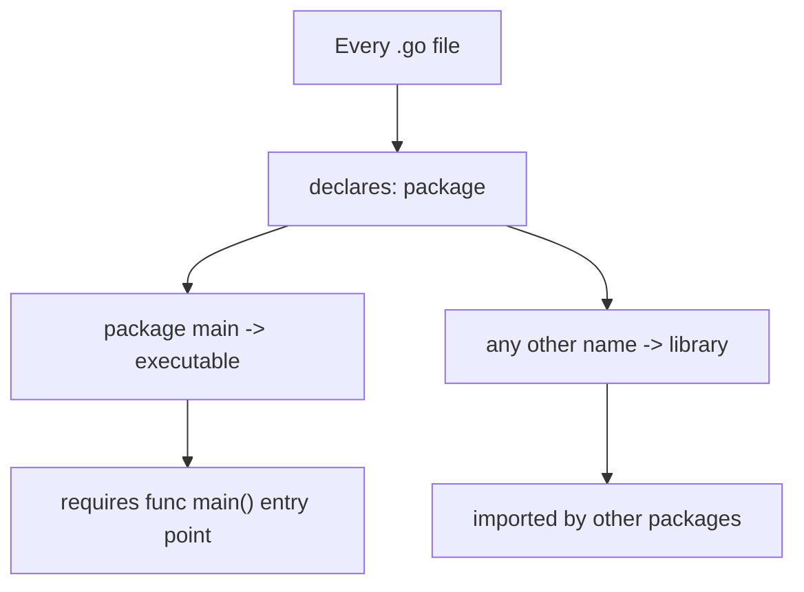
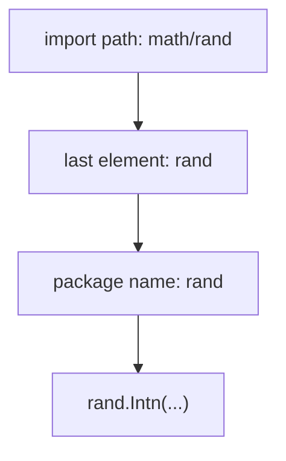

# Go Packages and the `main` Entry Point

## TLDR

- Every Go file belongs to exactly one **package**, declared at the top with `package name`.
- Every Go program is made up of packages, and programs **start running in package `main`**.
- An executable (not a library) must define a `main` package containing a `func main()`, which is the entry point.
- By convention, a package's name is the last element of its import path; `math/rand` is a package named `rand`.
- You import a package and then use its **exported** names (those starting with a capital letter).

## The problem: organizing code into reusable, compilable units

A real program is too big for one file, and you want to share code between programs. Languages solve this with modules, namespaces, or packages. Go uses **packages**: a directory of files that all declare the same package name, compiled and imported as one unit. Understanding packages means understanding how Go names code, how it knows where a program starts, and how code becomes importable.

<div style={{display: 'flex', justifyContent: 'center'}}>



</div>

## Every file declares a package

The first line of every Go file states which package the file belongs to.

```go
package main

import "fmt"

func main() {
    fmt.Printf("Hello, World!\n")
}
```

All files in the same directory must declare the same package name. The package is the unit of compilation and the unit of access control: names within a package are shared, while names between packages require importing and exporting.

## Package `main` and the entry point

There are two kinds of packages, distinguished by a single convention:

- A package named `main` produces an **executable** binary.
- Any other name produces a **library** that other programs import.

If you are writing an executable (a program you run), you must define a `main` package and a `func main()` with no arguments and no return value. That function is where the program begins; the runtime calls it automatically when the binary starts.

```go
package main

func main() {
    // this is the entry point
}
```

A library package has no `main` function; it just exposes names for others to import.

## Package naming convention

By convention, the package name matches the last element of its import path. The standard library package `math/rand` is composed of files that begin with `package rand`:

```go
package rand
```

So the import path (`math/rand`) tells you where to find the code, and the package name (`rand`) is what you use to refer to it in your code. This convention keeps import paths and package names predictable across the ecosystem.

<div style={{display: 'flex', justifyContent: 'center'}}>



</div>

## Importing and using a package

You import a package to gain access to its exported names.

```go
package main

import (
    "fmt"
    "math"
)

func main() {
    fmt.Printf("Now you have %g problems.", math.Sqrt(7))
}
```

`fmt` and `math` are the package names; `fmt.Printf` and `math.Sqrt` are exported names from those packages. The import statement tells the compiler where to look, and the package name is how you address its contents. What counts as "exported" (usable from outside) is governed by the capital-letter rule, covered in the exported names article.

## Summary

Packages are Go's unit of code organization: every file declares one package, and every program is a collection of packages. Programs start in `package main` with a `func main()` entry point. By convention a package is named after the last element of its import path, which is what keeps the relationship between "where the code lives" and "how you refer to it" predictable.

## Sources

- A Tour of Go, [Packages](https://go.dev/tour/basics/1) - every program is made of packages and starts in `package main`.
- A Tour of Go, [Imports](https://go.dev/tour/basics/2) - importing packages and the import block form.
- Go Bootcamp (Matt Aimonetti), [Packages](https://www.gobootcamp.com/book/packages) - the executable-vs-library distinction, the `main` entry point, and the package-naming convention.
- The Go Programming Language Specification, [Packages](https://go.dev/ref/spec#Packages) and [Program execution](https://go.dev/ref/spec#Program_execution) - package structure and the role of `func main`.
