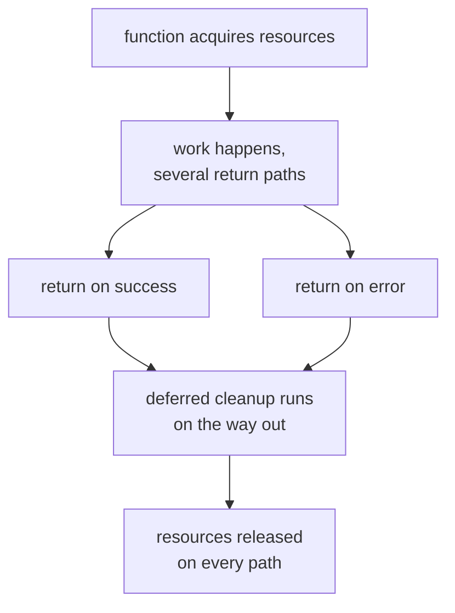
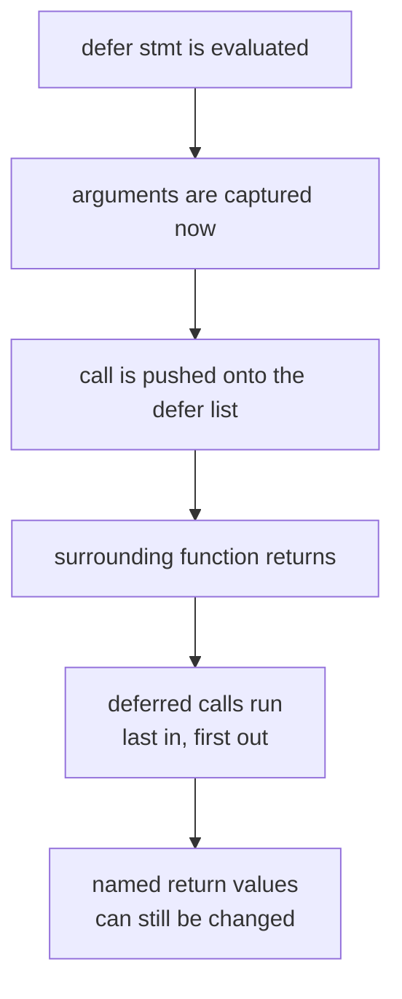
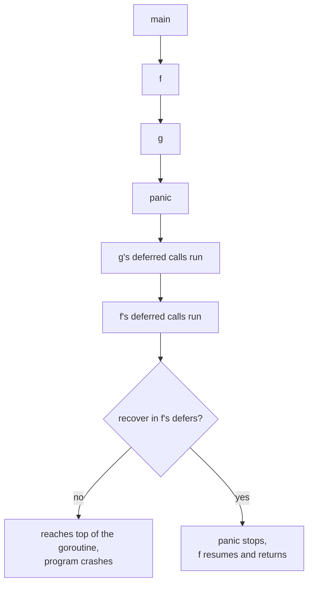
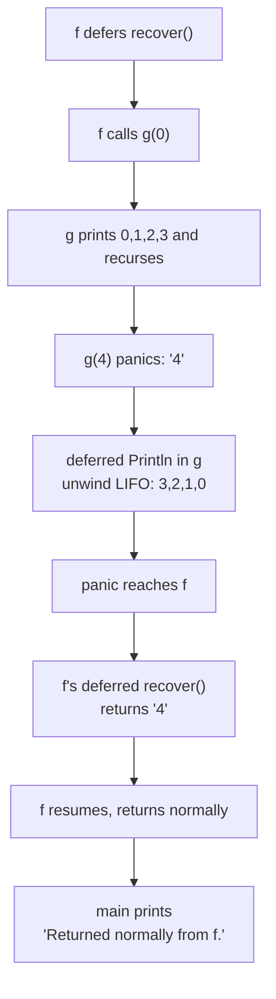

# `defer`, `panic`, and `recover`

## TLDR

- `defer` pushes a function call onto a list. The list runs after the surrounding function returns, in **last-in-first-out** order. It is Go's mechanism for cleanup.
- Three rules: a deferred call's **arguments are evaluated when the `defer` is evaluated**; deferred calls run **LIFO**; deferred functions may **read and assign named return values**.
- `panic` stops the ordinary flow, runs the deferred functions of the current function, then hands the panic to the caller. Uncaught, it keeps going up the goroutine's stack until the program crashes.
- `recover` regains control of a panicking goroutine, but **only inside a deferred function**. During normal execution it returns `nil` and does nothing; while panicking it returns the value passed to `panic` and resumes normal execution.
- `panic` and `recover` belong in **different functions**: one function panics, a caller recovers. Calling `panic` and immediately recovering in the **same** function is a pointless round trip; you already knew the condition and could have handled it directly.
- The convention: even when a package uses `panic` internally, its exported API still returns explicit errors. The standard library's `json` package is the canonical example.

## The problem: cleanup has many exit paths, and some failures cannot be handled locally

Two problems share the same tools.

First, a function that acquires resources must release them on **every** return path, including the error paths. The Go blog's `CopyFile` shows the bug before `defer`:

```go
func CopyFile(dstName, srcName string) (written int64, err error) {
	src, err := os.Open(srcName)
	if err != nil {
		return
	}

	dst, err := os.Create(dstName)
	if err != nil {
		return // bug: src is never closed
	}

	written, err = io.Copy(dst, src)
	dst.Close()
	src.Close()
	return
}
```

If `os.Create` fails, the function returns without closing `src`. You could add a `src.Close()` before that `return`, but a more complex function has more exit paths and the omission is easy to miss.

Second, a failure can occur deep in a call chain where the current function cannot sensibly resolve it, and there is no good value to return. Go needs a way to signal "I cannot continue" that does not require threading an error through every layer by hand, and a way for an outer function to catch that signal if it can do something about it.

`defer` solves the first problem. `panic` and `recover` solve the second.

<div style={{display: 'flex', justifyContent: 'center'}}>



</div>

## `defer`: think about cleanup right after acquiring

A `defer` statement pushes a function call onto a list. The list is executed after the surrounding function returns. The value is that you can pair each acquisition with its release **immediately**, and the release is guaranteed regardless of how many `return` statements the function has.

```go
func CopyFile(dstName, srcName string) (written int64, err error) {
	src, err := os.Open(srcName)
	if err != nil {
		return
	}
	defer src.Close()

	dst, err := os.Create(dstName)
	if err != nil {
		return
	}
	defer dst.Close()

	return io.Copy(dst, src)
}
```

The files are now always closed, and the `defer src.Close()` sits next to the `os.Open`, which makes the pairing obvious.

### The three rules of `defer`

The blog gives three simple rules.

**1. A deferred function's arguments are evaluated when the `defer` statement is evaluated.** The call itself is postponed; its arguments are not. Here `i` is `0` when `Println` is deferred, so the deferred call prints `0` even though `i` was incremented before the function returned:

```go
func a() {
	i := 0
	defer fmt.Println(i)
	i++
	return
}
```

**2. Deferred calls run in last-in-first-out order.** This function prints `3210`:

```go
func b() {
	for i := 0; i < 4; i++ {
		defer fmt.Print(i)
	}
}
```

**3. Deferred functions may read and assign to the returning function's named return values.** Because the deferred function runs after the `return` value is set, it can still change it. This function returns `2`:

```go
func c() (i int) {
	defer func() { i++ }()
	return 1
}
```

Rule 3 is what makes it possible to adjust an error return value from a deferred function, which the `recover` example later relies on.

<div style={{display: 'flex', justifyContent: 'center'}}>



</div>

### Other uses of `defer`

Besides `Close`, the blog lists releasing a mutex:

```go
mu.Lock()
defer mu.Unlock()
```

and printing a footer:

```go
printHeader()
defer printFooter()
```

Any cleanup or "after" action that must run on every return path is a `defer` candidate. The same mechanism is covered in [Defer with multiple lines](./go-defer-multiple-lines.md).

## `panic`: stop the ordinary flow

`panic` is a built-in function that stops the ordinary flow of control and begins panicking.

> When the function F calls panic, execution of F stops, any deferred functions in F are executed normally, and then F returns to its caller. To the caller, F then behaves like a call to panic. The process continues up the stack until all functions in the current goroutine have returned, at which point the program crashes.

Two things follow from that description. First, the deferred functions of each function on the way up still run, which is what gives `recover` a place to work. Second, only the current goroutine is affected. An uncaught panic ends the program with a non-zero status and a stack trace.

You can call `panic` yourself, but panics also come from the runtime:

> Panics can be initiated by invoking panic directly. They can also be caused by runtime errors, such as out-of-bounds array accesses.

<div style={{display: 'flex', justifyContent: 'center'}}>



</div>

## `recover`: regain control of a panicking goroutine

`recover` is a built-in function that regains control of a panicking goroutine.

> Recover is only useful inside deferred functions. During normal execution, a call to recover will return nil and have no other effect. If the current goroutine is panicking, a call to recover will capture the value given to panic and resume normal execution.

Two rules matter:

- It must be called **inside a deferred function**. Called anywhere else, it returns `nil` and does nothing.
- It returns the value passed to `panic`, so the idiomatic test is `if r := recover(); r != nil`.

## The blog's example, and why `panic` and `recover` live in different functions

This is the example that shows the intended shape:

```go
package main

import "fmt"

func main() {
	f()
	fmt.Println("Returned normally from f.")
}

func f() {
	defer func() {
		if r := recover(); r != nil {
			fmt.Println("Recovered in f", r)
		}
	}()
	fmt.Println("Calling g.")
	g(0)
	fmt.Println("Returned normally from g.")
}

func g(i int) {
	if i > 3 {
		fmt.Println("Panicking!")
		panic(fmt.Sprintf("%v", i))
	}
	defer fmt.Println("Defer in g", i)
	fmt.Println("Printing in g", i)
	g(i + 1)
}
```

`g` recurses with `i + 1` and panics once `i > 3`. `f` defers a function that recovers and prints the value. The output is:

```
Calling g.
Printing in g 0
Printing in g 1
Printing in g 2
Printing in g 3
Panicking!
Defer in g 3
Defer in g 2
Defer in g 1
Defer in g 0
Recovered in f 4
Returned normally from f.
```

Read the output from the bottom of the recursion. The four `Printing in g` lines come from the descent. When `g(4)` panics, the deferred `Println`s unwind in LIFO order (`3, 2, 1, 0`), then the panic reaches `f`, whose deferred function recovers and prints `Recovered in f 4`. `f` then returns normally, and `main` continues.

The critical detail is the **separation**: `g` panics, and `f`, its caller, recovers. `f` is the function that can meaningfully decide what to do about a failure that happened somewhere below it. That is the design.

<div style={{display: 'flex', justifyContent: 'center'}}>



</div>

### Panicking and recovering in the same function is a pointless round trip

Because `recover` only does something for a panic unwinding through the deferred function, the shape "call `panic` and also `defer recover` in the same function" is circular. You already know the condition at the point you call `panic`, so you could branch and handle it directly instead of throwing control away and immediately catching it back. Nothing is protected that was not already in your hands.

`recover` earns its place when the panic comes from **code you called**, including the runtime and other functions that panic internally, because that failure is the one you did not get to handle at its source. The blog's `f`/`g` split is the pattern: the lower function raises, the upper function recovers. Putting both in one function reads like `try`/`catch` abuse and is a sign the code should be restructured.

### Removing `recover` lets the panic reach the top

If you remove the deferred function from `f`, the panic is not recovered and reaches the top of the goroutine's call stack, terminating the program. The output becomes:

```
Calling g.
Printing in g 0
Printing in g 1
Printing in g 2
Printing in g 3
Panicking!
Defer in g 3
Defer in g 2
Defer in g 1
Defer in g 0
panic: 4
```

The deferred functions still run on the way up, because deferred calls run during a panic, but with no `recover` the program crashes with the panic value and a stack trace.

## Real-world use: `panic` inside a package, `error` at the boundary

The standard library's `json` package is the blog's real-world example. It encodes a value with a set of recursive functions; when it hits an error while traversing the value, it calls `panic` to unwind the stack back to the top-level call, which recovers and returns an appropriate `error`. The panic is an internal control-flow shortcut; the caller never sees it.

That gives the convention:

> The convention in the Go libraries is that even when a package uses panic internally, its external API still presents explicit error return values.

So `panic` and `recover` can be used inside a package to simplify deep recursive or nested logic, as long as the exported function turns the panic back into an `error` before returning. This is the same boundary rule you apply to ordinary errors; see [Go errors](./go-errors.md).

## Summary

`defer` schedules a call to run after the surrounding function returns, with three rules: arguments are evaluated at the `defer` statement, calls run last-in-first-out, and deferred functions may change named return values. It is the tool for cleanup (closing files, unlocking mutexes) because it runs on every return path. `panic` stops the ordinary flow, runs the current function's deferred calls, and propagates to the caller, continuing up the goroutine's stack until the program crashes. `recover` regains control of a panicking goroutine, but only inside a deferred function, returning the panic value and resuming normal execution. The two belong in different functions: one raises, a caller recovers, because that caller is the one that can act on a failure from below. Calling `panic` and recovering it in the same function is a round trip that protects nothing. And even when a package panics internally, its exported API should still return explicit errors.

## Sources

- The Go Blog, Andrew Gerrand, [Defer, Panic, and Recover](https://go.dev/blog/defer-panic-and-recover) - the `CopyFile` bug and fix, the three `defer` rules (`a`, `b`, `c`), the `f`/`g` example and both outputs, the `json` package example, and the convention that a package's external API presents explicit error return values.
- The Go Programming Language Specification, [Handling panics](https://go.dev/ref/spec#Handling_panics) - the formal panicking sequence and `recover` semantics.
- The `builtin` package documentation, [func panic](https://pkg.go.dev/builtin#panic) and [func recover](https://pkg.go.dev/builtin#recover) - the definitions of panicking and of `recover` only stopping a panic inside a deferred function.
- Effective Go, [Defer](https://go.dev/doc/effective_go#defer), [Panic](https://go.dev/doc/effective_go#panic), and [Recover](https://go.dev/doc/effective_go#recover) - deferred calls run when the function returns, `recover` is only useful inside deferred functions, and the server example of containing a failing goroutine.
- [Go by Example, Defer](https://gobyexample.com/defer), [Panic](https://gobyexample.com/panic), and [Recover](https://gobyexample.com/recover) - the minimal cleanup, panic, and defer-plus-recover programs.
