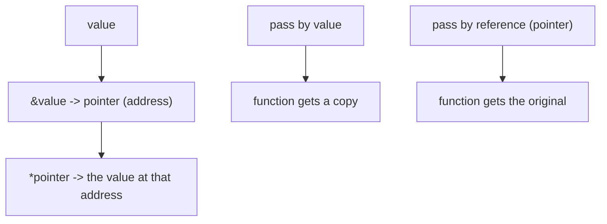
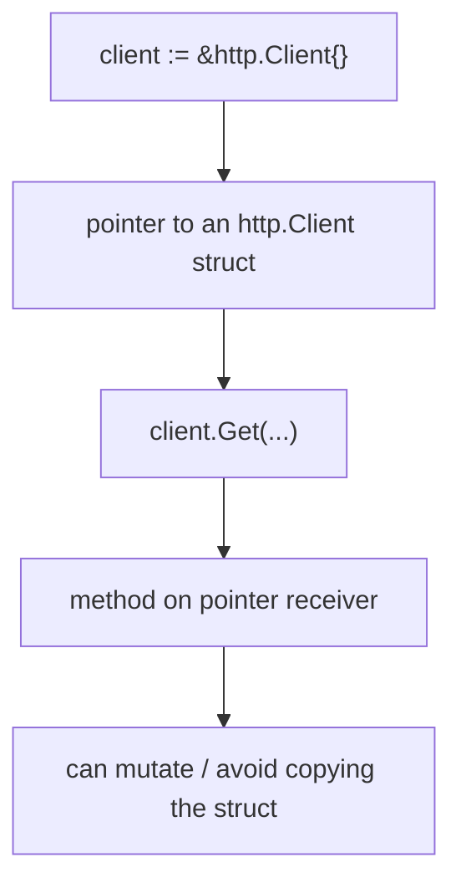

# Go Pointers

## TLDR

- Go has pointers, but **no pointer arithmetic**; you cannot do `p + 1`.
- A pointer holds the memory address of a value. Get an address with `&`, and read the value at an address with `*`.
- Struct fields can be accessed through a pointer transparently: `ptr.Field` works without writing `(*ptr).Field`.
- By default Go passes arguments **by value** (it copies them). To pass by reference, pass a pointer (or use a slice/map).
- Methods are often defined on pointer receivers, so you frequently store a pointer in a variable, as in `client := &http.Client{}`.

## The problem: sharing a value instead of copying it

When Go passes a value to a function, it copies that value. Copying is safe and simple, but sometimes you need the function to operate on the *original* value, not a copy: to mutate it, to avoid copying a large struct, or to share one instance across many places. Pointers are Go's way to refer to a value by its address rather than by copying it.

<div style={{display: 'flex', justifyContent: 'center'}}>



</div>

## Getting and dereferencing pointers

The `&` operator in front of a value yields its address (a pointer). The `*` operator in front of a pointer yields the value stored at that address.

```go
x := 42
p := &x   // p is a pointer to x
fmt.Println(*p) // 42
*p = 21    // change x through the pointer
fmt.Println(x)  // 21
```

`*p = 21` writes to the memory location `p` points at, which is `x` itself, so `x` changes. This is the mechanism that makes "pass by reference" possible.

## No pointer arithmetic

Unlike C, Go does not let you add to a pointer or move it around raw memory. `p + 1` does not compile. This removes a whole class of bugs (buffer overflows, out-of-bounds access) while keeping the essential benefit of pointers: referring to values without copying them. Pointers in Go are a sharing mechanism, not a way to walk raw memory.

## Struct fields through a pointer

When you have a pointer to a struct, you access its fields directly. Go inserts the dereference for you.

```go
type Artist struct {
    Name string
    Songs int
}

me := &Artist{Name: "Matt", Songs: 42}
fmt.Println(me.Name) // transparent: means (*me).Name
```

You do not write `(*me).Name`. The indirection through the pointer is transparent for struct fields and methods, which is a deliberate convenience so pointer-heavy code stays readable.

## A real example: `client := &http.Client{}`

This line creates a pointer to an `http.Client` struct:

```go
client := &http.Client{}
resp, err := client.Get("http://gobootcamp.com")
```

`http.Client` is a struct in the `http` package, a collection of related fields and methods. `&http.Client{}` creates the struct and takes its address, storing a pointer in `client`. Then `client.Get(...)` calls the `Get` method on that pointer. Using a pointer matters because `Get` and similar methods are often defined on a pointer receiver, which lets them modify or reuse the client instead of operating on a copy.

<div style={{display: 'flex', justifyContent: 'center'}}>



</div>

## Pointer receivers vs value receivers

Methods can be defined on either a value receiver or a pointer receiver. A pointer receiver gets the original value, so it can modify it and avoids copying a large struct. A value receiver gets a copy, so changes do not affect the caller. This is why you often see pointers in Go code: methods that need to change state, or operate efficiently on large structs, are defined on pointers, and you store a pointer to call them.

## Summary

Pointers in Go hold addresses so you can share a value without copying it. Use `&` to get an address and `*` to dereference it, but note there is no pointer arithmetic. Struct fields are accessed transparently through a pointer, and methods are frequently defined on pointer receivers, which is why code like `client := &http.Client{}` is common. Pointers are the mechanism behind Go's "pass by reference" and mutability, explored in the mutability article.

## Sources

- A Tour of Go, [Pointers](https://go.dev/tour/moretypes/1) and [Struct fields](https://go.dev/tour/moretypes/4) - the `&` and `*` operators and transparent struct-field access.
- A Tour of Go, [Methods and pointer indirection](https://go.dev/tour/methods/4) - pointer vs value receivers.
- Go Bootcamp (Matt Aimonetti), [Pointers](https://www.gobootcamp.com/book/pointers) - no pointer arithmetic, pass-by-value default, and the `client := &http.Client{}` example.
- The Go Programming Language Specification, [Address operators](https://go.dev/ref/spec#Address_operators) - formal rules for `&` and `*`.
