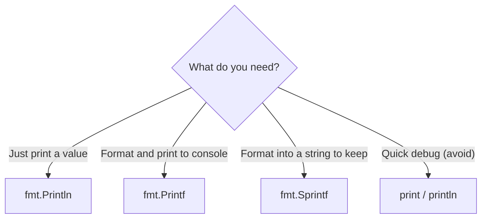
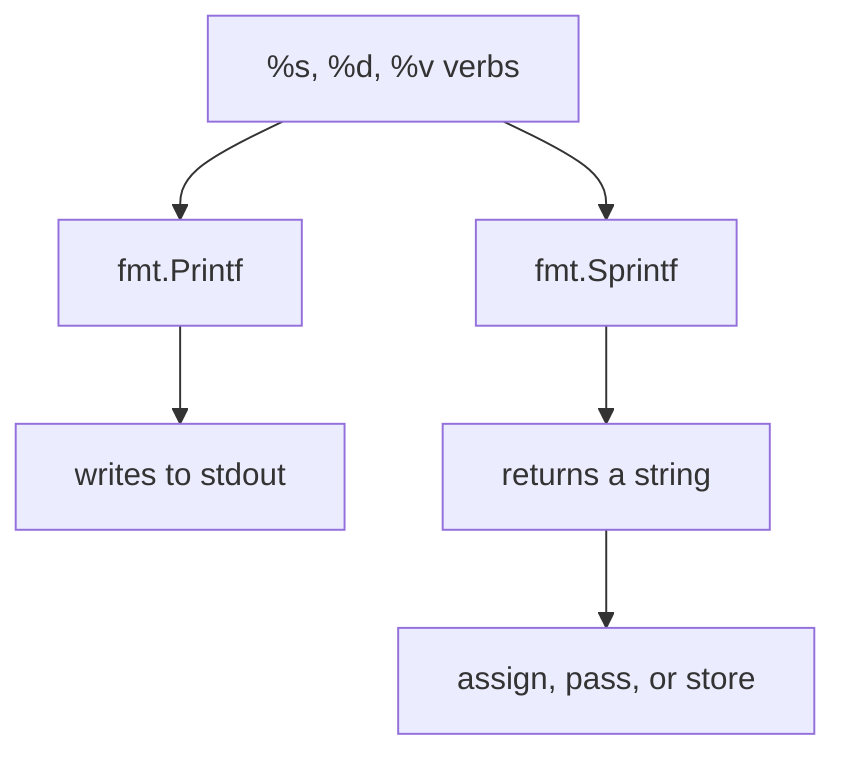

# Go Printing: `fmt` vs the Built-in `print`

## TLDR

- The built-in `print` and `println` exist, but they are **not idiomatic**; use the `fmt` package for real output.
- `fmt.Println` prints values separated by spaces with a trailing newline.
- `fmt.Printf` **prints** formatted text to standard output using verbs like `%s`, `%d`, `%v`.
- `fmt.Sprintf` **returns** the formatted text as a string and prints nothing; use it to build strings for later use.
- `Printf` and `Sprintf` use the exact same format verbs; the only difference is where the result goes.

## The problem: two ways to print, and two ways to format

Go gives you the built-in `print`/`println`, which are tempting because they need no import. But they are a debugging escape hatch, not a real output tool: their output goes to standard error and is not guaranteed to be stable or pretty. The proper tool is the `fmt` package. And once you use `fmt`, a second question appears: `Printf` and `Sprintf` look identical, so which one do you use?

<div style={{display: 'flex', justifyContent: 'center'}}>



</div>

## The built-in `print` and `println`

Go includes `print` and `println` as built-ins. You can print a variable with no import at all:

```go
func main() {
    cylonModel := 6
    println(cylonModel)
}
```

This compiles and works, but it is not idiomatic. The built-ins are intended for low-level debugging, their output can change between Go versions, and they offer no formatting control. For anything a human should read, use `fmt`.

## `fmt.Println`

`fmt.Println` prints its arguments separated by spaces and ends with a newline. It is the everyday "print this" function.

```go
package main

import "fmt"

func main() {
    cylonModel := 6
    fmt.Println(cylonModel)
}
```

`Println` does not do formatting; it just shows values. For full control over the shape of the text, you use `Printf` or `Sprintf`.

## `Printf` vs `Sprintf`: same verbs, different destination

Both functions format text using the same verbs. `%s` is a string, `%d` is a base-10 integer, `%v` is the default representation of any value, `%g` is a compact float. The verbs are identical. The only difference is where the result goes:

- `fmt.Printf` writes the formatted text **directly to standard output** (the console).
- `fmt.Sprintf` **returns** the text as a string, printing nothing. You can assign it, pass it, or save it.

```go
package main

import "fmt"

func main() {
    name := "Oberyn"
    age := 32

    fmt.Printf("%s is %d years old\n", name, age) // prints to console

    message := fmt.Sprintf("%s is %d years old", name, age) // returns a string
    fmt.Println(message) // prints the string we built
}
```

Here both lines ultimately show the same sentence, but `Sprintf`'s result first lived in the `message` variable. That is the entire distinction.

<div style={{display: 'flex', justifyContent: 'center'}}>



</div>

## When to use which

| Function | Output | Use case |
| --- | --- | --- |
| `fmt.Println` | Prints values, adds newline | Simple "show me this value" |
| `fmt.Printf` | Prints formatted text to stdout | Formatted console/log output |
| `fmt.Sprintf` | Returns a string | Build a string to store, return, or embed |
| `print` / `println` | Built-in, unstable | Low-level debugging only, avoid in real code |

## Summary

Skip the built-in `print`/`println` for real work; they are a debugging tool, not an output API. Use `fmt.Println` for simple printing, and remember that `fmt.Printf` and `fmt.Sprintf` share the same format verbs and differ only in whether they print to the console or return the string. Choose `Sprintf` whenever you need the formatted text as a value you can keep.

## Sources

- Go package documentation, [`fmt`](https://pkg.go.dev/fmt) - `Println`, `Printf`, and `Sprintf` and the shared format verbs.
- Go package documentation, [builtin](https://pkg.go.dev/builtin) - the built-in `print` and `println` and their debugging-oriented description.
- A Tour of Go, [Formatting](https://go.dev/tour/basics/) - introductory use of `fmt.Println`.
- Go Bootcamp (Matt Aimonetti), [Printing](https://www.gobootcamp.com/book/functions) - the contrast between built-in `print` and the `fmt` package, and the `Printf` vs `Sprintf` distinction.
