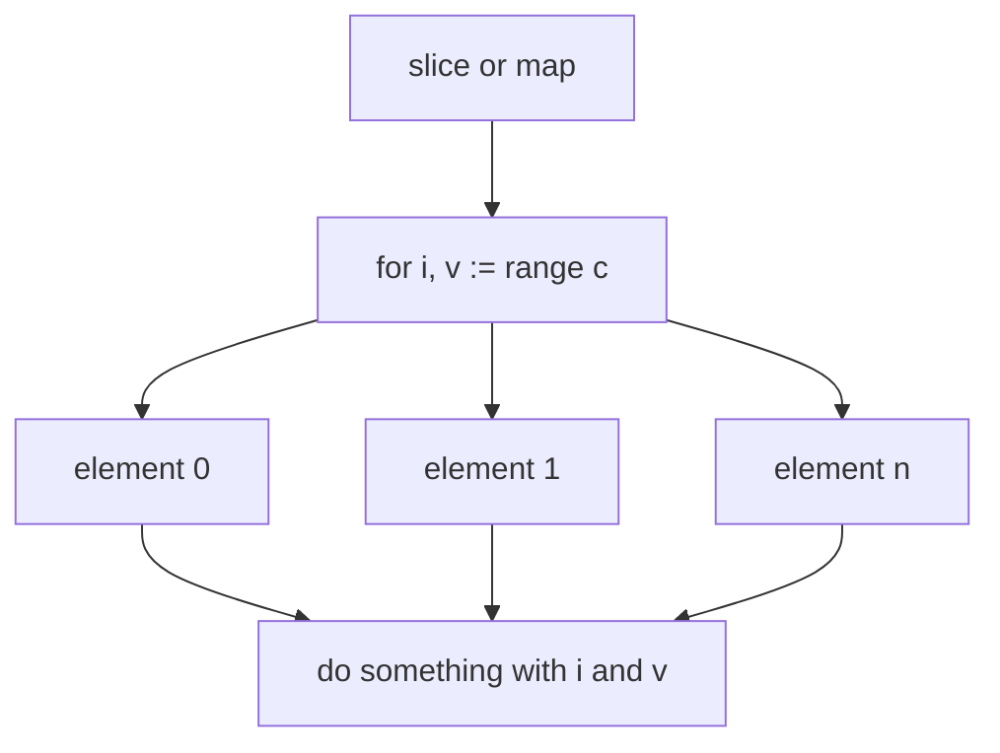
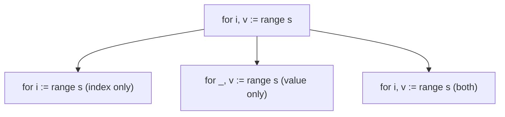
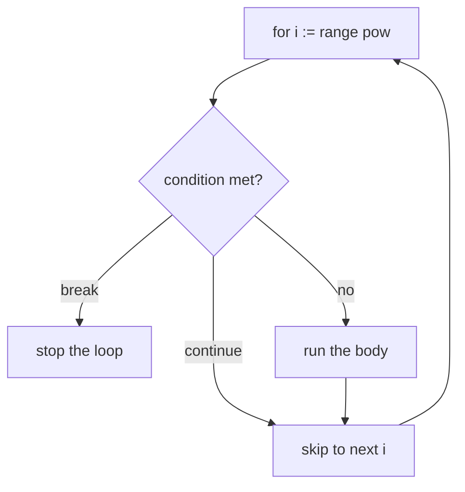

# Go Range

## TLDR

- `range` is a for-loop form that iterates over every element of a slice or a map.
- Over a slice it yields the index and the value: `for i, v := range s`.
- Drop the value for index-only loops: `for i := range s`.
- Skip either half with the blank identifier: `for _, v := range s`.
- `break` stops the loop early; `continue` skips the current iteration.
- Over a map, the first variable is the key, not an index.

## The problem: walking a collection without boilerplate

To process every element of a slice you could write an index loop, but that is verbose and error-prone: you must track a counter, bound it with `len`, and index every access. Maps are worse, because they have no index at all. Go's `range` gives you a single, uniform way to visit each element of a slice or map, handing you the index or key and the value on each turn.

<div style={{display: 'flex', justifyContent: 'center'}}>



</div>

## Range over a slice

When you range over a slice, each iteration gives you two values: the index and the element at that index.

```go
package main

import "fmt"

var pow = []int{1, 2, 4, 8, 16, 32, 64, 128}

func main() {
    for i, v := range pow {
        fmt.Printf("2**%d = %d\n", i, v)
    }
}
```

Here `i` is the index and `v` is `pow[i]`. The loop runs over the length of `pow`, so there is no separate counter or `len` check to write.

## Skipping the index or the value

You do not always want both halves. Assign to `_` to discard the one you do not need. If you only want the index, drop the value entirely.

```go
func main() {
    pow := make([]int, 10)
    for i := range pow {
        pow[i] = 1 << uint(i) // index only
    }
    for _, value := range pow {
        fmt.Printf("%d\n", value) // value only
    }
}
```

`for i := range pow` yields only the index, which is the common idiom for filling a slice in place. `for _, value := range pow` yields only the element.

<div style={{display: 'flex', justifyContent: 'center'}}>



</div>

## break and continue

`break` and `continue` work inside a range loop exactly as in a plain for loop. `break` stops the whole iteration; `continue` skips the current turn.

```go
func main() {
    pow := make([]int, 10)
    for i := range pow {
        pow[i] = 1 << uint(i)
        if pow[i] >= 16 {
            break // stop once we reach 16
        }
    }
    fmt.Println(pow)
    // [1 2 4 8 16 0 0 0 0 0]
}
```

The loop stops writing as soon as it produces 16, leaving the remaining slots at their zero value.

```go
func main() {
    pow := make([]int, 10)
    for i := range pow {
        if i%2 == 0 {
            continue // skip even indexes
        }
        pow[i] = 1 << uint(i)
    }
    fmt.Println(pow)
    // [0 2 0 8 0 32 0 128 0 512]
}
```

`continue` jumps to the next iteration before the body writes, so only odd indexes get a value.

<div style={{display: 'flex', justifyContent: 'center'}}>



</div>

## Range over a map

`range` also works on maps. The first value is not an index but the map key, and the second is the value for that key.

```go
package main

import "fmt"

func main() {
    cities := map[string]int{
        "New York":    8336697,
        "Los Angeles": 3857799,
        "Chicago":     2714856,
    }
    for key, value := range cities {
        fmt.Printf("%s has %d inhabitants\n", key, value)
    }
}
```

The loop visits each key-value pair. Since map iteration order is not guaranteed in Go, do not rely on the pairs coming back in any particular order.

## Summary

`range` replaces manual counter loops with a uniform iteration over slices and maps. Over a slice it yields index and value; over a map it yields key and value. Use `_` or a shorter assignment to keep only the part you need, and use `break` and `continue` to control the iteration. Maps are covered in detail in the next article.

## Sources

- A Tour of Go, [Range](https://go.dev/tour/moretypes/16) and [Range continued](https://go.dev/tour/moretypes/17) - the `pow` example, index-only and value-only forms.
- A Tour of Go, [Maps](https://go.dev/tour/moretypes/19) - ranging over a map with key and value.
- The Go Programming Language Specification, [For statements with range clause](https://go.dev/ref/spec#For_statements) - the formal behavior of `range` over slices and maps.
