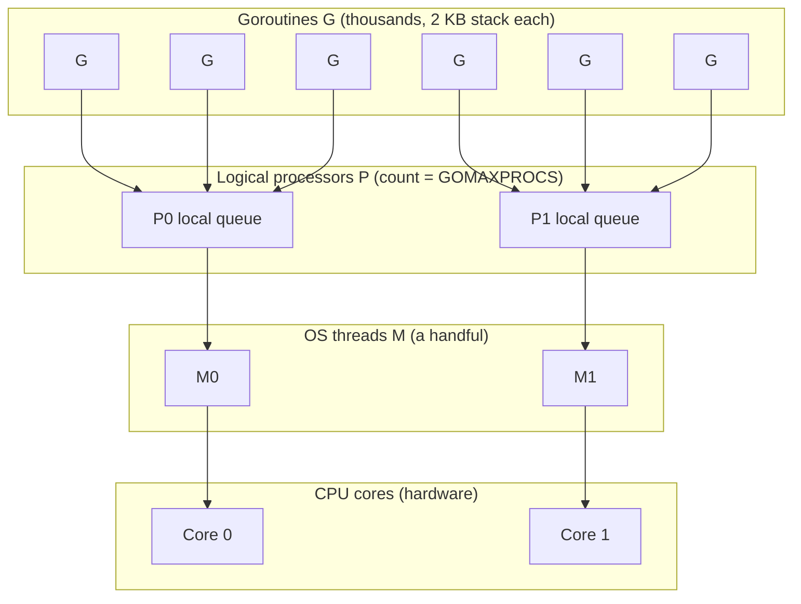
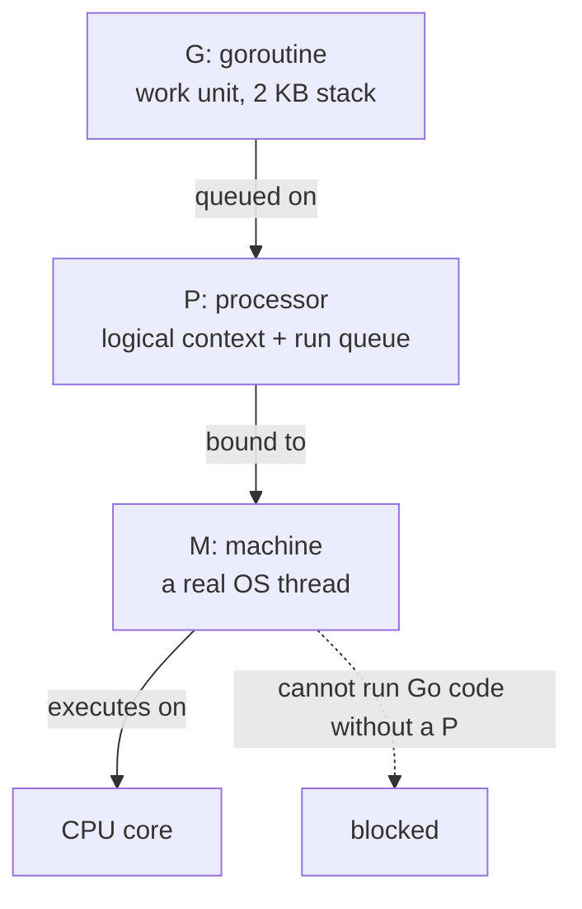
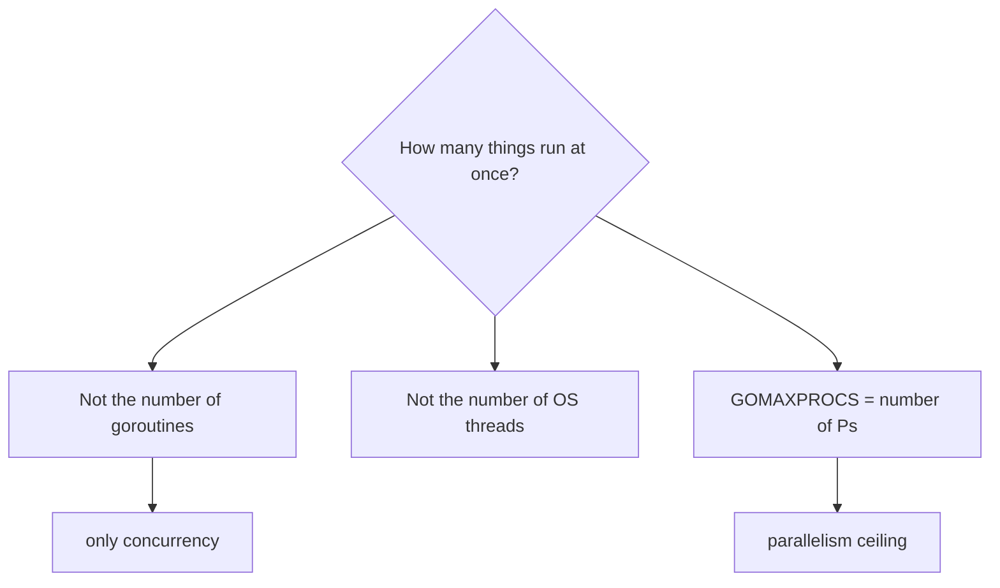
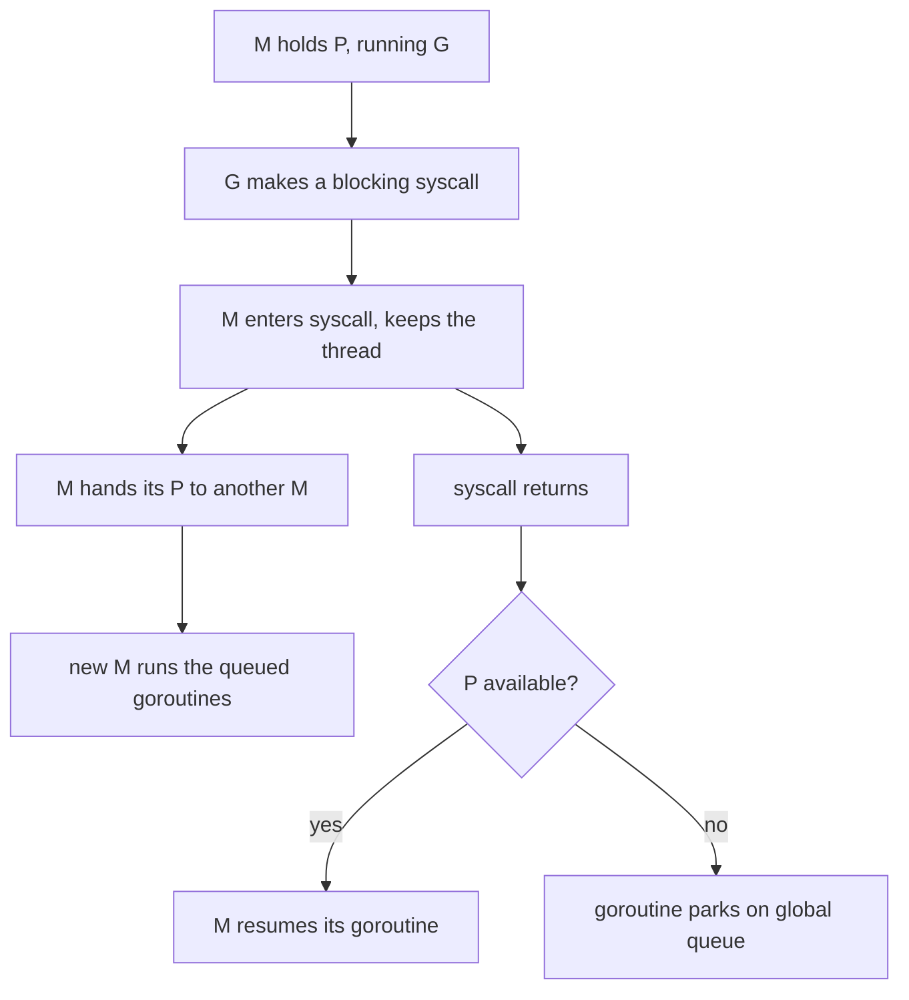
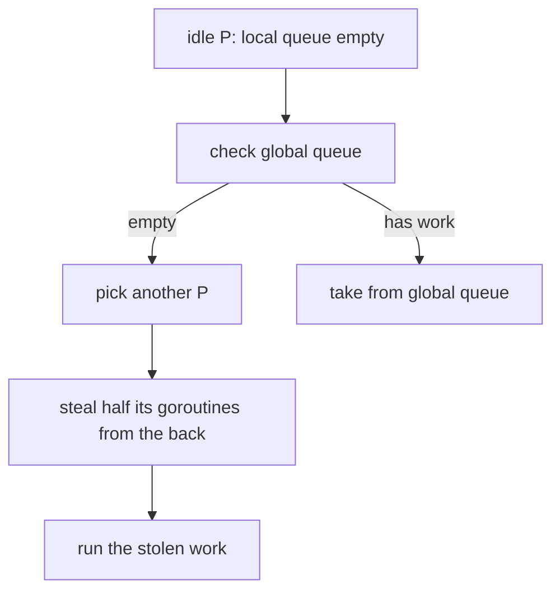

# The Go Runtime Architecture: Goroutines, Threads, and the GMP Scheduler

## TLDR

- Go does not map goroutines 1:1 to OS threads. It **multiplexes many goroutines onto a small pool of OS threads**.
- The scheduler has three abstractions, called **GMP**: **G** is a goroutine, **M** is an OS thread (a "machine"), **P** is a logical processor that holds a queue of runnable goroutines.
- A goroutine starts with a **2 KB stack** that grows and shrinks, versus an OS thread stack measured in megabytes. That is why you can have hundreds of thousands of goroutines.
- An **M must hold a P to run Go code**. The number of Ps is `GOMAXPROCS`, which defaults to the number of logical CPUs. So parallelism is capped by `GOMAXPROCS`, not by the number of goroutines.
- When a goroutine makes a **blocking syscall**, the M keeps the thread but **hands its P to another M**, so the other goroutines keep running instead of the whole CPU stalling.
- When a P runs out of work, it **steals half** of another P's queue. This is automatic and needs no tuning.
- The practical takeaway: goroutine count has nothing to do with parallelism. `GOMAXPROCS` does, and the runtime keeps your CPU busy across blocking calls for you.

## The problem: threads are expensive, concurrency is not optional

The straightforward way to run concurrent work is one OS thread per task. The kernel schedules each thread onto a CPU core, and the code reads naturally. The problem is cost. Every OS thread carries a large stack (typically megabytes), a kernel data structure, and a context switch that has to trap into the kernel. A server handling ten thousand simultaneous requests would need ten thousand threads, which means gigabytes of stack and a scheduler thrashing between them. The work is mostly waiting on I/O, and you have burned enormous resources to represent waiting.

The other classic answer is an event loop: one thread, non-blocking I/O, callbacks. That scales, but it makes concurrent code hard to write and read, because every wait has to be turned inside out into a callback or a state machine.

Go takes a third path. You write code that looks blocking and sequential, and the runtime turns it into an event-driven, multiplexed reality underneath. The mechanism is a user-space scheduler with its own notion of threads. This article is the architecture of that scheduler: what the layers are, how work is placed on them, and what happens when a goroutine blocks.

<div style={{display: 'flex', justifyContent: 'center'}}>



</div>

The diagram is the whole architecture in one picture. Many goroutines at the top feed into a few local queues, those queues are attached to logical processors, the processors are bound to OS threads, and the threads run on the cores. Each layer multiplexes onto the layer below it.

## The three abstractions: G, M, P

The Go scheduler is built on three types, all defined in `runtime/runtime2.go`. The names are the letters you will see everywhere in Go runtime discussion.

**G** is a goroutine. It is the unit of work: a function with its own stack and an instruction pointer. In the runtime it is `type g struct`. A goroutine stack begins at 2 KB (the constant `stackMin = 2048` in `runtime/stack.go`) and grows or shrinks as the function needs, up to a limit of 1 GB. A G is cheap because it starts tiny and is owned entirely by user space.

**M** is a machine, and it maps directly onto an OS thread. This is where the code actually executes on a CPU. An M is expensive to create, so the runtime keeps the number low rather than spawning one per goroutine.

**P** is a processor, but not a CPU: it is a logical processing resource, a scheduler context. It is created and managed by the Go runtime. Its most important contents are a local run queue of goroutines waiting to run and the bookkeeping the scheduler needs. The number of Ps is set by `GOMAXPROCS`.

The critical rule, stated in the runtime source on the `m` struct, is the binding between M and P:

```go
// p is the currently attached P for executing Go code, nil if not executing user Go code.
p puintptr
```

An **M must hold a P to execute Go code**. No P, no running. This single rule is what separates the Go scheduler from a naive thread pool, and it is the reason blocking I/O does not stall the machine, as we will see.

<div style={{display: 'flex', justifyContent: 'center'}}>



</div>

## Why P exists at all

P was not in the original design. Before Go 1.1 the scheduler had only G and M, with a single global run queue behind a single global lock. Every thread taking or returning a goroutine contended for that lock, and the contention got worse as cores were added. In 2012 Dmitry Vyukov wrote the "Scalable Go Scheduler Design Doc" naming this and other problems, and proposed the P abstraction to fix them. The redesign landed in Go 1.1 in 2013.

P solves the lock problem by giving each logical processor its own local queue, so most scheduling decisions need no shared lock. It also gives the scheduler a stable place to record per-CPU state, and it creates the unit that can be handed off during blocking operations. The runtime field names reflect the model directly: `p.runq` is a local run queue, and it is an array of 256 entries (`runq [256]guintptr`), so each P holds up to 256 runnable goroutines without touching the global queue.

`GOMAXPROCS` is therefore not "how many goroutines exist" and not even "how many threads exist". It is **how many Ps exist**, which is how many goroutines can be executing Go code at once. By default the runtime picks a value from the machine's logical CPU count (and, on Linux, cgroup CPU limits). Everything above that number is queued.

<div style={{display: 'flex', justifyContent: 'center'}}>



</div>

## What happens when a goroutine blocks

The reason M and P are separate types, rather than one thread object, is blocking. Suppose a goroutine makes a syscall that takes a long time. The OS thread genuinely has to wait, and the kernel will not run Go code on it meanwhile. If that thread also held the only P, the attached run queue would be stuck behind it.

So the runtime decouples them. On entering a blocking syscall, the M hands its P off. The function is literally named `handoffp` in `runtime/proc.go`. The freed P is picked up by another M, which then runs the goroutines that were queued behind the blocked one. The waiting thread keeps waiting; the CPU does not.

```go
// runtime/proc.go
func handoffp(pp *p) { ... }
func entersyscall() { ... }
func exitsyscall() { ... }
```

When the syscall returns, the M tries to reacquire a P. If one is available it resumes; if not, the goroutine is parked on the global queue and the M may sleep. The goroutine that was waiting does not lose its place; it just may resume on a different thread, which is fine because a goroutine is not tied to a thread.

This is the deep answer to a question every Go programmer eventually asks: why can a goroutine block without blocking the program? Because blocking blocks the **M**, and the P, the thing that actually decides what runs, was handed elsewhere.

<div style={{display: 'flex', justifyContent: 'center'}}>



</div>

## Work stealing: keeping every P busy

A local queue per P creates an imbalance problem: one P can be buried while another sits idle, if the work happened to be created unevenly. Go fixes this without a central coordinator, using work stealing. When a P's local queue and the global queue are both empty, it looks at other Ps' queues and takes about half their goroutines.

Stealing from the back matters. The goroutines at the front of a queue were usually created most recently by the goroutine currently running, so they are warm in cache and belong together. Taking from the back preserves that locality while still moving real work to the idle P.

The result is that you do not tune this. There is no thread pool size to pick, no queue discipline to configure. You set `GOMAXPROCS` if you want to cap parallelism, and the scheduler balances the rest.

<div style={{display: 'flex', justifyContent: 'center'}}>



</div>

## The scheduling loop and preemption

The scheduler does not switch goroutines on a timer the way the kernel does, and it does not need a signal to regain control in the common case. A goroutine yields when it naturally reaches a point where the runtime can intervene: a function call, a channel operation, a syscall, or an explicit `runtime.Gosched`. At a function call the compiler inserts a stack check that can trigger a reschedule, so "call a function" is a yield point the runtime can use. Scheduling code itself runs on a special per-thread goroutine, `g0`, kept separate from user goroutines so a user stack can be parked at any moment.

That cooperative approach had a hole: a tight loop that makes no function calls, like a long `for` doing arithmetic, would never yield. Go 1.14 closed it with asynchronous preemption, using a signal to interrupt a goroutine that has exceeded its time slice even if it never calls a function. The scheduler is still cooperative by preference and preemptive as a safety net.

## Putting the layers together

The stacked view from the start is the architecture, and each layer has a job:

- **Goroutines (G)** are the work, cheap and numerous, each with a tiny growable stack.
- **Processors (P)** are the scheduling contexts, each with a local queue, and their count is the parallelism limit.
- **Machines (M)** are the OS threads that actually execute, and they must borrow a P to run Go code.
- **CPU cores** are the hardware the threads land on.

The runtime's entire job is moving goroutines across those layers so the cores stay busy while the code stays simple. `go func` looks like a function call; underneath it is a queue insertion that the scheduler will service on whichever P, M, and core are free.

## Summary

Go's concurrency architecture is a user-space scheduler multiplexing many goroutines onto a few OS threads. The three abstractions are G (goroutine), M (OS thread), and P (logical processor with a local run queue). A goroutine starts at 2 KB and grows, which is why there can be vast numbers of them. An M must hold a P to run Go code, and the number of Ps is `GOMAXPROCS`, so that value, not the goroutine count, sets parallelism. The M and P split exists so that a blocking syscall can hand its P to another thread and keep the CPU busy. Idle Ps steal half of another P's queue to stay balanced. The payoff is that you write straightforward blocking code and the runtime keeps the machine saturated.

## Sources

- Dmitry Vyukov, [Scalable Go Scheduler Design Doc](https://go.dev/s/go11sched) (2012) - the original proposal for the P abstraction, per-P local run queues, work stealing, and spinning Ms, motivated by the single global lock.
- The Go runtime source, `runtime/runtime2.go` - `type g`, `type m` (including `p puintptr`, the attached processor, nil when not executing Go code), and `type p` (including `runq [256]guintptr` and `runqhead`/`runqtail`).
- The Go runtime source, `runtime/stack.go` - `stackMin = 2048`, the 2 KB starting goroutine stack size.
- The Go runtime source, `runtime/proc.go` - `entersyscall`, `exitsyscall`, and `handoffp`, the mechanism by which a blocked M gives up its P.
- The Go runtime source, `runtime/runtime2.go` - `m.g0`, the per-thread scheduling goroutine that runs scheduler code on its own stack.
- The Go 1.14 release notes and proposal [#24543](https://go.googlesource.com/proposal/+/master/design/24543-non-cooperative-preemption.md) - asynchronous preemption of goroutines that do not reach a cooperative yield point.
- The `runtime` package documentation, [func GOMAXPROCS](https://pkg.go.dev/runtime#GOMAXPROCS) - sets the maximum number of CPUs executing simultaneously; default derived from logical CPU count and, on Linux, cgroup quota.
- Go: Under the Hood, [The goroutine Scheduler](https://golang.design/under-the-hood/en/part3concurrency/ch09sched) - the GMP model, per-P local queues, and the historical move from a single global queue in Go 1.0 to the work-stealing design in Go 1.1.
