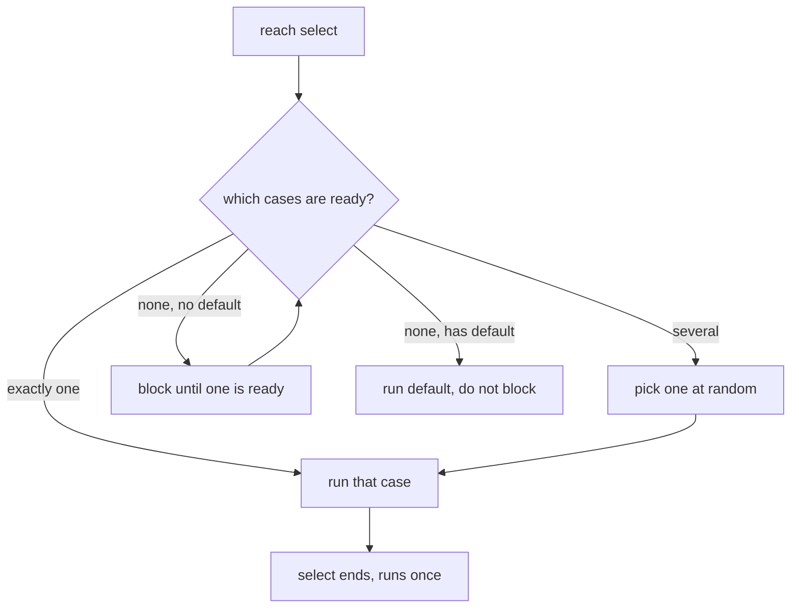
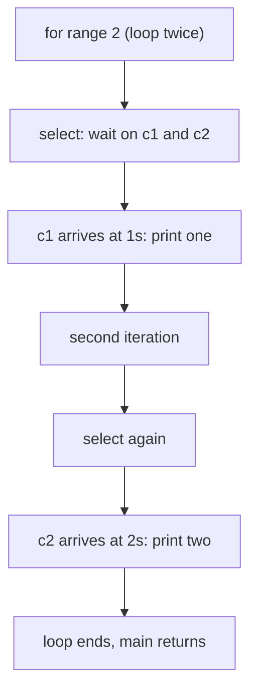

# `select`: Waiting on Many Channels at Once

## TLDR

- `select` waits on **several** channel operations at once and runs the **one case that is ready first**. It is `switch` for channels.
- It is **not a loop**. `select` runs its cases **once** and ends. To handle many events you wrap it in a loop yourself.
- Every `case` must be a channel operation: a receive `<-c`, a send `c <- v`, or a receive with a check. No other expressions.
- If **several** cases are ready at the same time, one is chosen **at random** (no starvation, no priority).
- A `default` case makes the select **non-blocking**: if nothing is ready, `default` runs instead of waiting.
- `time.After` in a case gives you **timeouts**: race a channel against a clock.
- `for range n` around a `select` is a plain counted loop (Go 1.22+), used here because each select consumes exactly one value and we sent exactly two.

## The problem: one channel is easy, several are not

A single receive `<-c` blocks until that one channel has a value. That is fine until you need to wait on more than one thing at a time, for example:

- Two concurrent RPCs, and you want to act on whichever **returns first**.
- A data channel plus a **cancellation** signal, and you must react to either.
- A data channel plus a **timeout**, so a slow result does not hang you forever.

You cannot do this with back-to-back receives, because the first one blocks and you never get to test the second. You need a construct that watches all of them simultaneously. That construct is `select`.

## What `select` is

`select` is `switch` for channel operations. It blocks until **one** of its cases is ready, then runs that case and nothing else. If more than one is ready, it picks one **uniformly at random**, so no channel can starve another.

<div style={{display: 'flex', justifyContent: 'center'}}>



</div>

The rules for each `case`:

```go
select {
case v := <-ch:       // receive: ready when ch can deliver a value
case ch <- v:         // send: ready when a receiver is waiting (or buffer has room)
case v, ok := <-ch:   // receive with closed-channel check
case <-time.After(d): // just wait for a time event; the value is discarded
}
```

Nothing else is allowed as a case. You cannot put `case x > 5:` or a function call.

## The program, line by line

```go
package main

import (
	"fmt"
	"time"
)

func main() {
	c1 := make(chan string) // unbuffered: a send blocks until a receive is ready
	c2 := make(chan string)

	// Two goroutines simulate slow, concurrent work (e.g. two RPC calls).
	// They run at the SAME time, so the total wait is max(1s, 2s), not the sum.
	go func() {
		time.Sleep(1 * time.Second)
		c1 <- "one" // after 1s, blocks until select receives it
	}()
	go func() {
		time.Sleep(2 * time.Second)
		c2 <- "two" // after 2s, blocks until select receives it
	}()

	// We sent exactly two values, so we select exactly twice.
	// for range 2 is Go 1.22+ for "loop twice"; the index is unused.
	for range 2 {
		select { // each pass blocks until one case is ready, then consumes one value
		case msg1 := <-c1:
			fmt.Println("received", msg1)
		case msg2 := <-c2:
			fmt.Println("received", msg2)
		}
	}
}
```

Output:

```
received one
received two
```

Total wall time is about 2 seconds, because both sleeps ran **concurrently** and `select` handed us each result the moment it arrived.

## Why there is a `for` around `select`

This is the part that looks strange, and the answer is simple: **`select` is one-shot, the loop provides repetition.**

Each successful select consumes **one** value. In the program above:

1. Pass 1: select fires on `c1`, prints `"one"`,`c1` is now drained.
2. Without a loop, `main` would reach `}` and exit, killing goroutine B before it can send `"two"`.
3. Pass 2: select fires on `c2`, prints `"two"`.
4. Two iterations done, `main` exits.

So the loop drains two values from two channels. `for range 2` is just the terse way to say "do this twice" when you know the count up front and do not need the index. It does **not** `range` over a channel; that would be `for msg := range c`, which loops until the channel is **closed**.

<div style={{display: 'flex', justifyContent: 'center'}}>



</div>

In real code the exit condition is usually not a fixed count but a signal. The general shape is an **event loop** that runs until something tells it to stop:

```go
for {
	select {
	case msg := <-c:
		fmt.Println(msg)
	case <-ctx.Done(): // stop when the context is cancelled
		return
	}
}
```

That is the same structure as the toy example, with `ctx.Done()` replacing the count of `2`.

## Variant 1: `default` makes it non-blocking

Add a `default` case and the select never blocks. If no case is ready, `default` runs immediately. This turns `select` into a **poll**.

```go
select {
case msg := <-c:
	fmt.Println("got", msg)
default:
	fmt.Println("nothing ready, no blocking")
}
```

Run against an idle `c`, this prints `nothing ready, no blocking` at once. Use it when you want to check a channel without committing to wait, for example inside a busy loop that also does other work.

## Variant 2: `time.After` gives you timeouts

This is where `select` becomes essential. Put `time.After(d)` in a case and you can race a result against a clock:

```go
select {
case msg := <-c:
	fmt.Println("got", msg)
case <-time.After(500 * time.Millisecond):
	fmt.Println("timed out")
}
```

If the goroutine behind `c` sleeps for 2 seconds, this prints `timed out` after half a second and stops waiting. Without `select`, a slow channel would hang you forever. Timeouts, cancellations, and heartbeats all use this pattern.

## The details that trip people up

- **Random, not priority.** When two cases are ready, the winner is random. If you need precedence, nest selects or check the preferred channel first in a non-blocking select. Here timing (`1s` vs `2s`) forces `one` first, which is why the output is deterministic.
- **Unbuffered channels rendezvous.** `c1 <- "one"` blocks until a receiver is ready, and the select is that receiver, so the handoff is synchronous.
- **A lone `select {}` with no cases blocks forever.** All goroutines asleep with no way to wake means the runtime reports `fatal error: all goroutines are asleep - deadlock!`.
- **Sends and receives both count.** A select can just as well choose among sends, which is how worker pools hand tasks to whichever worker is free.

## Summary

Reach for `select` when you must wait on **more than one** channel at once: multiple results, a result plus cancellation, or a result plus a timeout. It runs exactly one ready case (randomly chosen if several are ready) and then ends, so a surrounding `for` provides repeated handling. `default` makes it non-blocking; `time.After` makes it race a clock. It is the primitive behind timeouts and graceful cancellation, and it pairs directly with `context` for the "wait on work or stop" loop.

## Sources

- The Go Programming Language Specification, [Select statements](https://go.dev/ref/spec#Select_statements) - defines the select statement, the allowed case forms, and that "if multiple cases can proceed, a uniform pseudo-random choice is made" and an empty select blocks forever.
- The Go blog, [Go Concurrency Patterns: Timing out, moving on](https://go.dev/blog/concurrency-timeouts) - the `select` + `time.After` timeout pattern and why it beats a blocking receive.
- [Go by Example, Select](https://gobyexample.com/select) - the two-channel example this article walks through, including that the total time is the max of the sleeps because they run concurrently.
- The Go Programming Language Specification, [For statements](https://go.dev/ref/spec#For_statements) - `for range` over an integer, the Go 1.22+ counted form used around the select.
- The builtin documentation, [close](https://pkg.go.dev/builtin#close) - closing a channel so `for msg := range c` terminates, contrasted with the fixed-count loop here.
