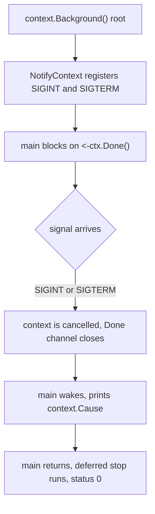
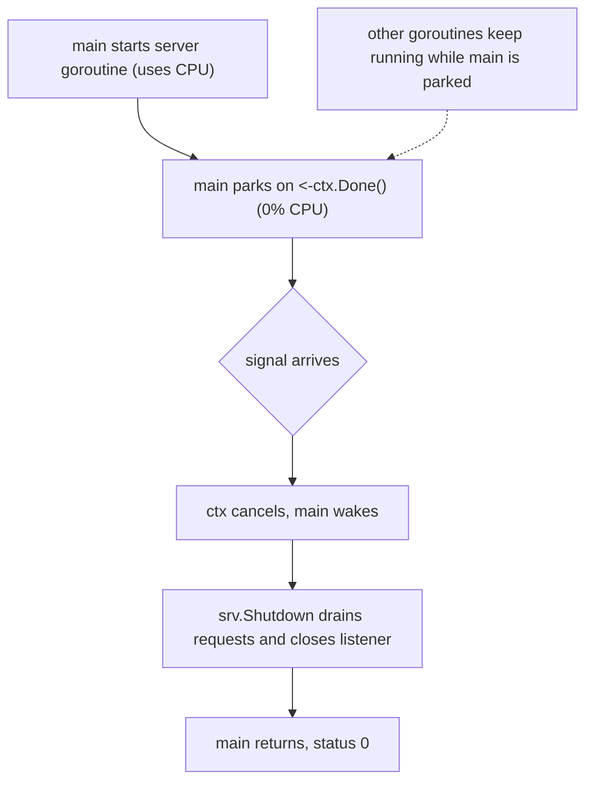

# Unix Signals in Go: `signal.NotifyContext`

## TLDR

- A Unix signal is a number the OS sends your process to say "interrupt" (`SIGINT`, Ctrl-C) or "terminate" (`SIGTERM`). By default Go just kills the program.
- `signal.NotifyContext(parent, sigs...)` tells Go: do not kill on these signals, instead **cancel a context** when one arrives. It returns that context and a `stop` function.
- The context is a **child of the parent you pass**. `context.Background()` is the empty root, so the only thing that will cancel it is a signal.
- `<-ctx.Done()` **blocks** the goroutine until the context is cancelled, then returns. `Done()` is a method that returns a channel; `<-` receives from it and throws the (empty) value away.
- `context.Cause(ctx)` reports *why* it was cancelled, e.g. `interrupt signal received`.
- `stop()` unregisters the handler. Call it (via `defer`) to release resources and restore the default kill behavior.

## The problem: your program is killed, not asked to stop

Ctrl-C sends `SIGINT`. `kill` and service managers (systemd, Kubernetes) send `SIGTERM`. If you do nothing, Go's default for these is to terminate the process at once: in-flight requests are dropped, files are not closed, buffers are not flushed.

You want the opposite: hear the signal, stop taking new work, finish or abandon cleanly, and exit on your own terms. That is **graceful shutdown**. Older Go did it with a channel and `signal.Notify`; modern Go wires it into `context`.

## What `context` is, in one sentence

A `context.Context` is a cancellation token you pass **down** a call tree: whoever created it can cancel it, and every function below only watches it to learn "stop now." `signal.NotifyContext` simply makes a context that a signal cancels, so signal handling looks like every other cancellation.

Contexts form a tree, so every context needs a parent. `context.Background()` is the root: never cancelled, no deadline. Passing it means "no other source of cancellation, only the signal."

## The program, line by line

```go
package main

import (
	"context"   // context.Context and context.Background: the cancellation plumbing
	"fmt"       // Println
	"os/signal" // signal.NotifyContext: bridges OS signals to a context
	"syscall"   // syscall.SIGINT, syscall.SIGTERM: the signal constants
)

func main() {
	// signal.NotifyContext returns two values:
	//   ctx  - a context cancelled when a listed signal arrives (or the parent is cancelled)
	//   stop - a function that unregisters the signal handling
	//
	// context.Background() is the parent: the empty root context, so the only
	// thing that can cancel ctx is a signal.
	// syscall.SIGINT  = Ctrl-C ("interrupt").
	// syscall.SIGTERM = the polite kill from systemd, Kubernetes, `kill` ("terminate").
	ctx, stop := signal.NotifyContext(
		context.Background(), syscall.SIGINT, syscall.SIGTERM)

	// Defer stop() so the handler is unregistered when main returns.
	// stop() releases resources and restores the default "signal kills the program" behavior.
	defer stop()

	// Print before blocking, so the user knows the program is waiting.
	fmt.Println("awaiting signal")

	// ctx.Done() is a METHOD: it returns a receive-only channel, <-chan struct{}.
	// Receiving from that channel BLOCKS this goroutine until the context is cancelled.
	// When cancelled, the channel is CLOSED, so the receive returns immediately.
	// The bare <- discards the value (always the empty struct struct{}{}) because the
	// event (the close) is the signal, not a value. This line is the whole wait loop.
	<-ctx.Done()

	// Cosmetic blank line, separating the prompt from the cause.
	fmt.Println()

	// context.Cause(ctx) tells you WHY it was cancelled. For a signal it returns an
	// error describing which one, e.g. "interrupt signal received" for SIGINT or
	// "terminated signal received" for SIGTERM. Needs Go 1.21+; before that, ctx.Err()
	// only gives the generic context.Canceled.
	fmt.Println(context.Cause(ctx))

	// Reached only after a signal. main then returns normally, which runs the
	// deferred stop() above and exits with status 0.
	fmt.Println("exiting")
}
```

Output when you press Ctrl-C:

```
awaiting signal
^C
interrupt signal received
exiting
```

<div style={{display: 'flex', justifyContent: 'center'}}>



</div>

## Blocking is free, and where shutdown actually runs

A common reaction to `<-ctx.Done()` is "isn't that just sitting there wasting a thread?" No. It blocks the **goroutine**, not the CPU. When a goroutine receives from an empty channel, the runtime parks it and takes it off the thread, and the scheduler runs other goroutines (or the thread sleeps in the kernel). You can verify it: a program parked on `<-ctx.Done()` sits at about `0%` CPU.

That matters because it means the wait line costs nothing while other work proceeds. The pattern is not "wait on this line and do nothing." It is: start your real work as **goroutines first**, then let `main` park cheaply until the signal arrives.

```go
func main() {
	ctx, stop := signal.NotifyContext(context.Background(), syscall.SIGINT, syscall.SIGTERM)
	defer stop()

	// Start the real work as a background goroutine. This is what uses CPU.
	srv := &http.Server{Addr: ":8080", Handler: mux}
	go srv.ListenAndServe()

	// Park here doing nothing, using no CPU, until a signal cancels ctx.
	<-ctx.Done()

	// Now, and only now, run the graceful shutdown. This is the work you care about.
	shutdownCtx, cancel := context.WithTimeout(context.Background(), 5*time.Second)
	defer cancel()
	srv.Shutdown(shutdownCtx) // stop accepting, drain in-flight requests, close the listener
}
```

The pasted `awaiting signal` program has no server, so the wait line looks pointless. It is the **minimal skeleton** of the mechanism, not a full program. In real code, that line sits next to running workers.

If you want shutdown logic to run *while* the wait is in progress, do not pile it onto that line. Give it its own goroutine watching the same `ctx`:

```go
go func() {
	<-ctx.Done() // wakes on signal
	// cleanup runs here, concurrently with whatever else is shutting down
}()
```

That is the whole idea: `ctx` is a shared stop signal, every goroutine that needs to react watches the same context, and none of them burns CPU just waiting for it.

<div style={{display: 'flex', justifyContent: 'center'}}>



</div>

## The two details the docs gloss over

**The exit status is still 0.** Catching a signal and returning from `main` is a normal, successful exit. If a signal should mean failure to the shell or CI, run your cleanup and then call `os.Exit(code)` yourself. See [`os.Exit`, deferred functions, and exit codes](./go-os-exit.md).

**Call `stop()` when shutdown is slow.** While the handler is registered, further signals do not use the default kill behavior. So a slow cleanup path means a second Ctrl-C will *not* force-kill. Call `stop()` at the *start* of shutdown, not only in the `defer`, to hand control back so a second signal can hard-kill.

## Summary

`signal.NotifyContext(parent, sigs...)` converts Unix signals into context cancellation: it returns a context that is cancelled when `SIGINT` or `SIGTERM` arrives, plus a `stop` function to unregister. `context.Background()` is the parent because a context needs a root and nothing else should cancel it. `<-ctx.Done()` blocks the goroutine (not the CPU) until cancellation, then returns, because `Done()` is a method returning a channel that closes on cancel. Start your real work as goroutines first, then park `main` on that line; the graceful shutdown runs after it wakes, watching the same `ctx`. `context.Cause(ctx)` reveals which signal fired. Return normally for a clean status `0`, or `os.Exit` if the signal should be a non-zero failure, and call `stop()` to restore default signal behavior.

## Sources

- The `os/signal` package documentation, [func NotifyContext](https://pkg.go.dev/os/signal#NotifyContext) - "returns a copy of the parent context that is marked done ... when one of the listed signals arrives, when the returned stop function is called, or when the parent context's Done channel is closed, whichever happens first." Also documents that `stop` restores the default signal behavior and that `context.Cause` describes the signal.
- The `context` package documentation, [type Context](https://pkg.go.dev/context#Context) - `Done()` returns a channel closed when the context is cancelled; `Err` and `Cause` describe why.
- The `context` package documentation, [func Background](https://pkg.go.dev/context#Background) - "returns a non-nil, empty Context ... never canceled, has no values, and has no deadline."
- The `syscall` package documentation, [SIGINT / SIGTERM](https://pkg.go.dev/syscall#pkg-constants) - the OS signal constants used to select which signals to catch.
- [Go by Example, Signals](https://gobyexample.com/signals) - the same `NotifyContext` pattern; explains graceful shutdown for a server on `SIGTERM` or a tool on `SIGINT`.
