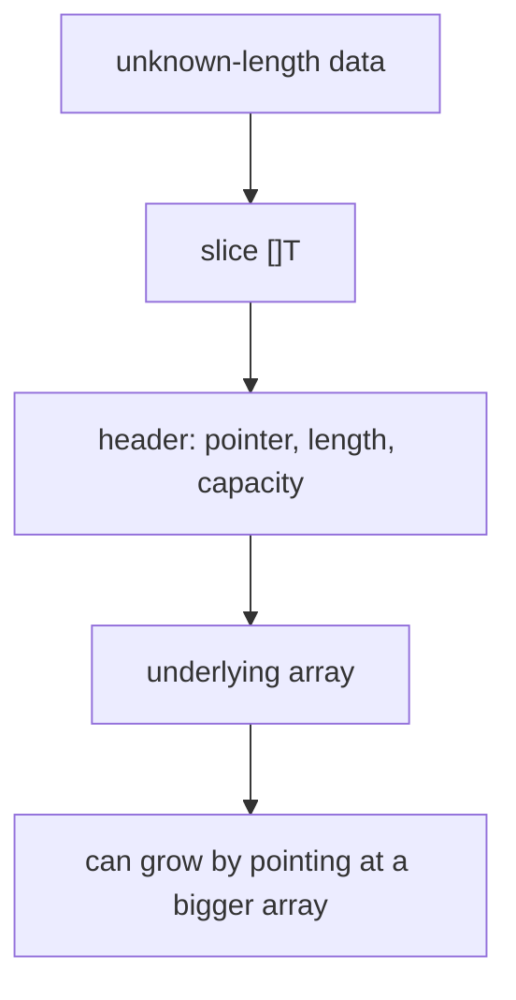
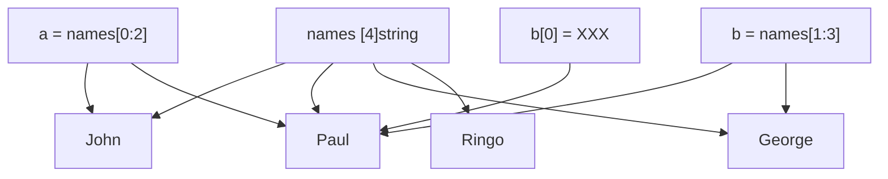
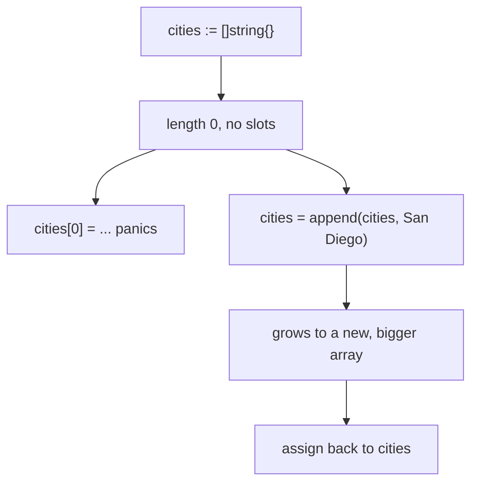

# Go Slices

## TLDR

- A slice `[]T` is a view onto an underlying array; it holds a reference to the array plus a length.
- Slices can grow, so they are the default collection in Go; plain arrays are rare.
- `[4]string` is an array (fixed length); `[]string` is a slice (variable length). The bracket spelling is the whole difference.
- Re-slicing `s[lo:hi]` creates a new slice header pointing at the same array, so writes through one slice are visible through the other.
- `make([]T, n)` allocates a zeroed array and returns a slice of length `n`.
- `append` grows a slice and returns the result; always assign it back: `s = append(s, v)`.
- The zero value is `nil`; a nil slice has length and capacity 0.

## The problem: a length you cannot know in advance

Arrays demand that you fix the length at compile time, and that length is part of the type. But most data has an unknown size: the number of rows in a result set, the words in a sentence, the items in a shopping cart. You need a sequence that behaves like an array but can grow and be passed around cheaply. Slices are Go's answer: a thin, resizable view over an array.

<div style={{display: 'flex', justifyContent: 'center'}}>



</div>

## Slices wrap arrays

A slice `[]T` is a descriptor over a segment of an array. It holds three things: a pointer to the array, the length of the segment, and its capacity. Because the actual data lives in the array, several slices can share one array, and a slice can be resized by pointing at a different array.

```go
p := []int{2, 3, 5, 7, 11, 13}
fmt.Println(p)
// [2 3 5 7 11 13]
```

Unlike an array, the length is not part of a slice's type, so `[]int` can hold any number of integers.

## Array literal vs slice literal

The spelling of the bracket is the only difference between an array and a slice literal, but it changes the type completely.

```go
names := [4]string{   // array: length 4 is part of the type
    "John",
    "Paul",
    "George",
    "Ringo",
}

names := []string{    // slice: variable length
    "John",
    "Paul",
    "George",
    "Ringo",
}
```

`[4]string` is a fixed-length array; `[]string` is a slice. Leaving the length out is what makes it a slice.

## Slicing a slice

A slice can be re-sliced with `s[lo:hi]`, producing a new slice header that points into the same array. `s[lo:lo+1]` has one element, `s[0:0]` is empty.

```go
package main

import "fmt"

func main() {
    names := [4]string{"John", "Paul", "George", "Ringo"}

    a := names[0:2] // ["John" "Paul"]
    b := names[1:3] // ["Paul" "George"]
    fmt.Println(a, b)

    b[0] = "XXX"    // changes the shared array
    fmt.Println(a, b)
    fmt.Println(names)
    // [John XXX] [XXX George]
    // [John XXX George Ringo]
}
```

`a` and `b` are two slices over the same `names` array. Writing `b[0] = "XXX"` mutates the shared element, which is why `a` and `names` also change. This is the key behavior to remember: a slice is a reference to its underlying array, not a copy of it.

<div style={{display: 'flex', justifyContent: 'center'}}>



</div>

## Making slices

Besides a slice literal, you can create a slice with `make`, which allocates a zeroed array and returns a slice of the requested length. Then you populate each entry by index.

```go
cities := make([]string, 3)
cities[0] = "Santa Monica"
cities[1] = "Venice"
cities[2] = "Los Angeles"
fmt.Printf("%q", cities)
// ["Santa Monica" "Venice" "Los Angeles"]
```

`make([]string, 3)` returns a slice of length 3 whose three elements are empty strings. Because the underlying array exists and has three slots, indexing `cities[0]` through `cities[2]` is legal.

## Appending to a slice

A slice literal `[]string{}` has length 0, so its underlying array has no slots, and `cities[0] = "..."` panics at runtime. Use `append` to grow the slice instead. `append` returns the new slice, so assign the result back.

```go
cities := []string{}
cities = append(cities, "San Diego")
fmt.Println(cities)
// [San Diego]
```

You can append more than one value at a time:

```go
cities = append(cities, "San Diego", "Mountain View")
fmt.Printf("%q", cities)
// ["San Diego" "Mountain View"]
```

And you can append the elements of another slice with an ellipsis:

```go
cities := []string{"San Diego", "Mountain View"}
otherCities := []string{"Santa Monica", "Venice"}
cities = append(cities, otherCities...)
fmt.Printf("%q", cities)
// ["San Diego" "Mountain View" "Santa Monica" "Venice"]
```

The ellipsis `...` means "spread this slice into its individual elements." You can only append strings to a `[]string`, so you cannot append an `[]int` to a `[]string`, and `otherCities...` unwraps a `[]string` into individual strings so the types match.

<div style={{display: 'flex', justifyContent: 'center'}}>



</div>

## Length, capacity, and nil

`len(s)` reports the number of elements; `cap(s)` reports the capacity, the number of elements the underlying array can hold before growing.

```go
cities := []string{"Santa Monica", "San Diego", "San Francisco"}
fmt.Println(len(cities)) // 3

countries := make([]string, 42)
fmt.Println(len(countries)) // 42
```

The zero value of a slice is `nil`. A nil slice has length 0 and capacity 0, and comparing it to `nil` is true.

```go
var z []int
fmt.Println(z, len(z), cap(z)) // [] 0 0
if z == nil {
    fmt.Println("nil!")
}
```

## Summary

A slice is a resizable view over an array, holding a pointer, a length, and a capacity. Re-slicing creates new slices over the same array, so changes are shared. Build a slice with a literal or `make`, grow it with `append` (always assigning the result back), and inspect it with `len` and `cap`. Because slices pass a reference to their underlying array, changes to a slice's elements are visible to the caller, which is why slices are the workhorse collection in Go.

## Sources

- A Tour of Go, [Slices](https://go.dev/tour/moretypes/7), [Slices are like references to arrays](https://go.dev/tour/moretypes/8), [Slice literals](https://go.dev/tour/moretypes/9), [Slice length and capacity](https://go.dev/tour/moretypes/11), [Nil slices](https://go.dev/tour/moretypes/12), [Creating a slice with make](https://go.dev/tour/moretypes/13), and [Appending to a slice](https://go.dev/tour/moretypes/15).
- Go Bootcamp (Matt Aimonetti), [Slices](https://www.gobootcamp.com/book/slices) - array vs slice literals, re-slicing with the `names` example, `make`, `append`, the ellipsis spread, and `len`.
- The Go Programming Language Specification, [Slice types](https://go.dev/ref/spec#Slice_types) - slices as descriptors of contiguous segments of an underlying array.
