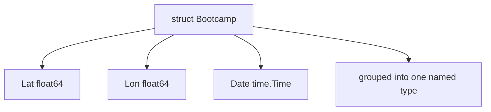
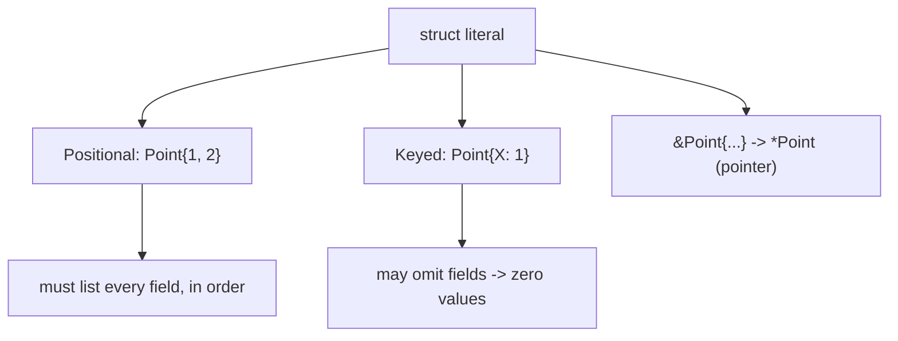
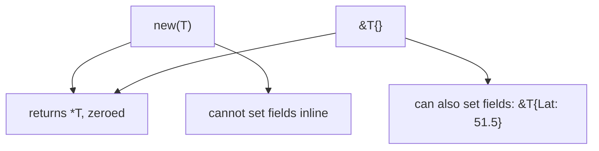

# Go Structs

## TLDR

- A struct is a collection of fields, and it is how you define new named types in Go.
- Structs support **composition but not inheritance**; think of a struct as a lightweight class without a hierarchy.
- You do not write getters/setters. Fields are accessed directly with `.`, and only capitalized (exported) fields are visible outside the package.
- A struct literal can be **positional** (all fields in order) or **keyed** (`Field: value`). Keyed literals let you omit fields, which silently become zero values.
- `&T{}` and `new(T)` both return a `*T` pointing at a zeroed value; `&T{}` is idiomatic because it can also set fields inline.

## The problem: grouping related values into one named type

The built-in types only get you so far. A real program works with concepts that bundle several values: an event has a latitude, a longitude, and a date. Representing that with three separate variables is fragile and unreadable. Go's answer is the struct, a named collection of fields. If you come from an object-oriented language, a struct is a light class: it groups data, but it deliberately supports composition instead of inheritance.

<div style={{display: 'flex', justifyContent: 'center'}}>



</div>

## Declaring a struct

A struct declaration lists fields with their types. Fields can be on one line each or grouped by type.

```go
package main

import (
    "fmt"
    "time"
)

type Bootcamp struct {
    // Latitude of the event
    Lat float64
    // Longitude of the event
    Lon float64
    // Date of the event
    Date time.Time
}

func main() {
    fmt.Println(Bootcamp{
        Lat:  34.012836,
        Lon:  -118.495338,
        Date: time.Now(),
    })
}
```

The type is named `Bootcamp`, and it has three fields: `Lat`, `Lon`, and `Date`. From now on, `Bootcamp` can be used anywhere the built-in types can.

## No getters and setters

Struct fields are accessed directly with the dot operator. You do not define `getLat()` and `setLat()`. This is one of the ways Go cuts ceremony compared to OOP languages that hide fields behind accessors.

```go
event := Bootcamp{}
event.Lat = 34.012836  // direct field assignment
fmt.Println(event.Lat) // direct field read
```

There is a rule attached to this freedom: only **exported** fields (those starting with a capital letter) can be accessed from outside the package where the struct is defined. Lowercase fields are package-private.

## Struct literals

A struct literal creates and initializes a struct value. There are two forms, and they follow different rules.

### Positional literals

A positional literal provides values in field order, and it must supply **all** fields.

```go
p := Point{1, 2} // X=1, Y=2
```

### Keyed literals

A keyed literal names each field with the `Field:` syntax. Field order does not matter, and you may omit any subset of fields.

```go
r := Point{X: 1} // Y is implicitly 0
s := Point{}     // both fields 0
```

The special prefix `&` takes the address of the newly allocated value, giving a pointer:

```go
q := &Point{1, 2} // type *Point
```

<div style={{display: 'flex', justifyContent: 'center'}}>



</div>

The complete example:

```go
package main

import "fmt"

type Point struct {
    X, Y int
}

var (
    p = Point{1, 2}  // has type Point
    q = &Point{1, 2} // has type *Point
    r = Point{X: 1}  // Y:0 is implicit
    s = Point{}      // X:0 and Y:0
)

func main() {
    fmt.Println(p, q, r, s)
}
```

## Zero values for omitted fields

When a keyed literal omits a field, that field takes its type's **zero value**. There is no such thing as an uninitialized struct field.

```go
type Person struct {
    id  int
    age int
}

fmt.Println(Person{id: 1}) // {1 0}: age omitted, so it is 0
```

The zero value depends on the field type:

| Type | Zero value |
| --- | --- |
| `int`, `float`, etc. | `0` |
| `string` | `""` |
| `bool` | `false` |
| pointer, slice, map, interface | `nil` |
| struct | its own zero-valued struct |

Two rules govern the two literal forms: positional literals must provide every field and cannot be mixed with keyed fields; keyed literals can provide any subset.

```go
Person{1, 30}       // ok
Person{1}           // compile error: too few values
Person{1, age: 30}  // compile error: cannot mix keyed and positional
```

## Accessing and modifying fields

Once you have a struct value, read and write fields with the dot. Assignment works the same way regardless of how the struct was created.

```go
package main

import (
    "fmt"
    "time"
)

type Bootcamp struct {
    Lat, Lon float64
    Date     time.Time
}

func main() {
    event := Bootcamp{
        Lat: 34.012836,
        Lon: -118.495338,
    }
    event.Date = time.Now() // set a field after creation
    fmt.Printf("Event on %s, location (%f, %f)",
        event.Date, event.Lat, event.Lon)
}
```

## `new(T)` vs `&T{}`

Both `new(Bootcamp)` and `&Bootcamp{}` allocate a zeroed `Bootcamp` and return a `*Bootcamp`. They are equivalent for zero values:

```go
x := new(Bootcamp)  // *Bootcamp, all fields zero
y := &Bootcamp{}    // *Bootcamp, all fields zero
fmt.Println(*x == *y) // true
```

The difference is flexibility. `&T{}` can set fields inline (`&Bootcamp{Lat: 51.5}`), while `new(T)` cannot. The rule of thumb: default to `&T{}` for structs, and reserve `new(T)` for primitives or explicit zeroing. Avoid `new` for slices, maps, and channels, where `new([]int)` produces a pointer to a nil slice rather than a usable slice.

<div style={{display: 'flex', justifyContent: 'center'}}>



</div>

## Comparing structs

Structs are comparable with `==` only if all their fields are comparable. `*x == *y` above works because `Bootcamp`'s fields are all `float64`. A struct containing a slice or map field is not comparable, because those types are not.

## Summary

A struct is a named collection of fields, Go's replacement for the class that favors composition over inheritance. Fields are accessed directly without getters and setters, and only exported (capitalized) fields cross package boundaries. Literals can be positional or keyed, with keyed literals allowing omitted fields that become zero values, and `&T{}` is the idiomatic way to allocate a pointer to a struct. Structs bundle data; the next two articles cover the two things you can do with them at a higher level: interfaces (behavior) and composition (reuse).

## Sources

- A Tour of Go, [Structs](https://go.dev/tour/moretypes/2) and [Struct literals](https://go.dev/tour/moretypes/5) - the `Point` example, keyed vs positional literals, and the `&Point{...}` pointer form.
- Go Bootcamp (Matt Aimonetti), [Structs](https://www.gobootcamp.com/book/structs) - the `Bootcamp` example, direct field access, and the note that only exported fields are visible from outside a package.
- The Go Programming Language Specification, [Struct types](https://go.dev/ref/spec#Struct_types) and [Composite literals](https://go.dev/ref/spec#Composite_literals) - the rules for struct declarations and the zero values of omitted fields.
- The Go Programming Language Specification, [Comparison operators](https://go.dev/ref/spec#Comparison_operators) - the rule that a struct is comparable only if all its fields are comparable.
