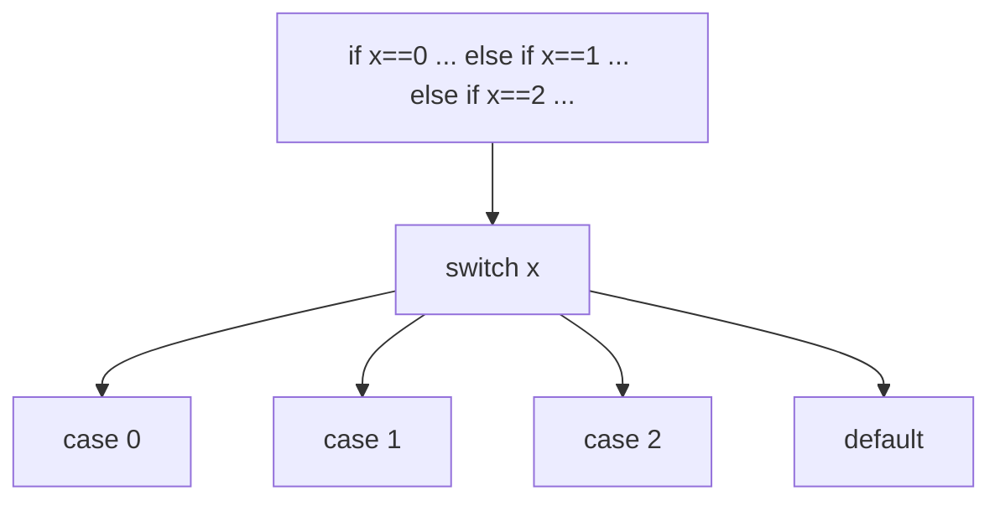
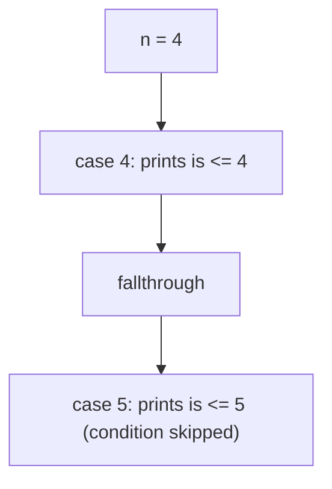

# Go Switch Case

## TLDR

- `switch` replaces a long chain of `if else` statements with a table of cases.
- Only values of the same type can be compared in one `switch`.
- An optional `default` case runs when nothing else matches.
- A case can hold an expression (`case 3 - 2:`) or several values (`case 0, 1, 3:`).
- `fallthrough` makes execution continue into the next case, skipping its condition check.
- A `break` inside a case exits the switch early; `break` is otherwise automatic (no fallthrough by default).

## The problem: replacing if-else chains

Choosing among many fixed values with `if else` produces long, repetitive code:

```go
if score == 10 {
    ...
} else if score == 9 {
    ...
} else if score == 8 {
    ...
}
```

Every branch rechecks the same variable, and the intent (pick one of several values) is buried. `switch` expresses that intent directly: list the values and the matching branch runs.

<div style={{display: 'flex', justifyContent: 'center'}}>



</div>

## The basic switch

```go
package main

import (
    "fmt"
    "time"
)

func main() {
    now := time.Now().Unix()
    mins := now % 2
    switch mins {
    case 0:
        fmt.Println("even")
    case 1:
        fmt.Println("odd")
    }
}
```

`switch mins` evaluates `mins` once, then compares it against each `case` value, running the first match. Unlike C or Java, Go does not fall through by default, so no `break` is needed after each case.

## Same type, and an optional default

The values compared in a switch must be of the same type. You can also add a `default` case that runs when no other case matches.

```go
package main

import "fmt"

func main() {
    num := 3
    v := num % 2
    switch v {
    case 0:
        fmt.Println("even")
    default:
        fmt.Println("odd")
    }
}
```

## Expressions in a case

A case value does not have to be a literal; it can be an expression that is evaluated and compared.

```go
package main

import "fmt"

func main() {
    num := 3
    v := num % 2
    switch v {
    case 0:
        fmt.Println("even")
    case 3 - 2: // evaluates to 1
        fmt.Println("odd")
    }
}
```

`case 3 - 2` is `case 1`, so it matches when `v` is 1.

## Multiple values in one case

Group several values in a single case by separating them with commas.

```go
package main

import "fmt"

func main() {
    score := 7
    switch score {
    case 0, 1, 3:
        fmt.Println("Terrible")
    case 4, 5:
        fmt.Println("Mediocre")
    case 6, 7:
        fmt.Println("Not bad")
    case 8, 9:
        fmt.Println("Almost perfect")
    case 10:
        fmt.Println("hmm did you cheat?")
    default:
        fmt.Println(score, " off the chart")
    }
}
```

`case 6, 7` matches either value, collapsing what would be several `else if` branches into one line.

## fallthrough

By default, once a case matches, execution stops after its body. `fallthrough` overrides that: after the current case runs, execution continues into the next case, skipping that next case's condition check.

```go
package main

import "fmt"

func main() {
    n := 4
    switch n {
    case 0:
        fmt.Println("is zero")
        fallthrough
    case 1:
        fmt.Println("is <= 1")
        fallthrough
    case 2:
        fmt.Println("is <= 2")
        fallthrough
    case 3:
        fmt.Println("is <= 3")
        fallthrough
    case 4:
        fmt.Println("is <= 4")
        fallthrough
    case 5:
        fmt.Println("is <= 5")
    }
    // prints is <= 4 then is <= 5
}
```

With `n == 4`, the `case 4` body runs, and `fallthrough` carries execution into `case 5` regardless of its condition. This is how you reproduce C's "fall through" behavior when you actually want it.

<div style={{display: 'flex', justifyContent: 'center'}}>



</div>

## break inside a switch

`break` inside a matched case exits the switch immediately, stopping any further cases (including a pending `fallthrough`).

```go
package main

import (
    "fmt"
    "time"
)

func main() {
    n := 1
    switch n {
    case 0:
        fmt.Println("is zero")
        fallthrough
    case 1:
        fmt.Println("<= 1")
        fallthrough
    case 2:
        fmt.Println("<= 2")
        fallthrough
    case 3:
        fmt.Println("<= 3")
        if time.Now().Unix()%2 == 0 {
            fmt.Println("un pasito pa lante maria")
            break // exit the switch entirely
        }
        fallthrough
    case 4:
        fmt.Println("<= 4")
    }
}
```

Because Go does not fall through by default, an explicit `break` is only needed when you are already inside a `fallthrough` chain and want to stop early.

## Summary

`switch` is the readable replacement for long `if else` chains over a single value. Cases compare the same type, may hold expressions or several values, and stop automatically. Use `fallthrough` to continue into the next case deliberately, and `break` to exit a running `fallthrough` chain.

## Sources

- A Tour of Go, [Switch](https://go.dev/tour/flowcontrol/9), [Switch evaluation order](https://go.dev/tour/flowcontrol/10), and [Switch with no condition](https://go.dev/tour/flowcontrol/11) - the basic switch form.
- The Go Programming Language Specification, [Switch statements](https://go.dev/ref/spec#Switch_statements) - `fallthrough` and `break` semantics.
- Go Bootcamp (Matt Aimonetti), [Switch case](https://www.gobootcamp.com/book/control-structures) - the `mins`, `score`, `fallthrough`, and `break` examples.
