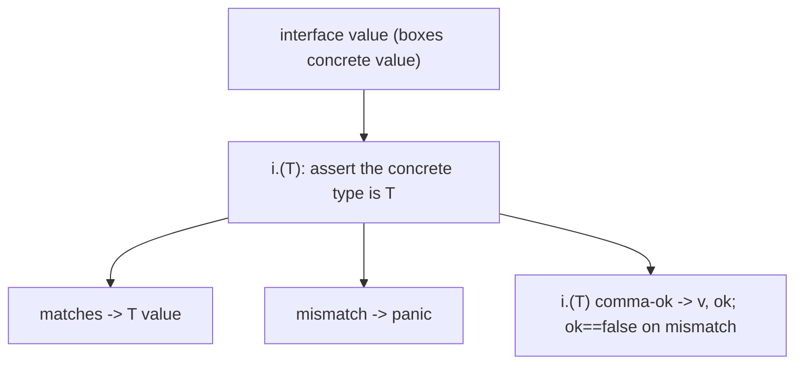
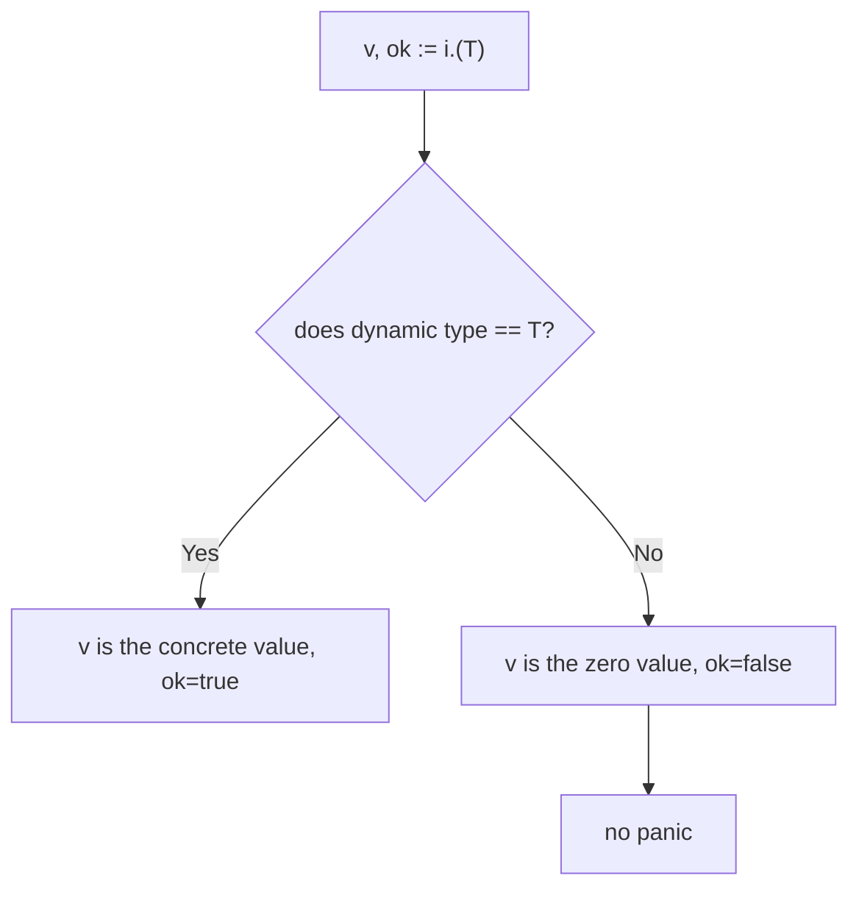
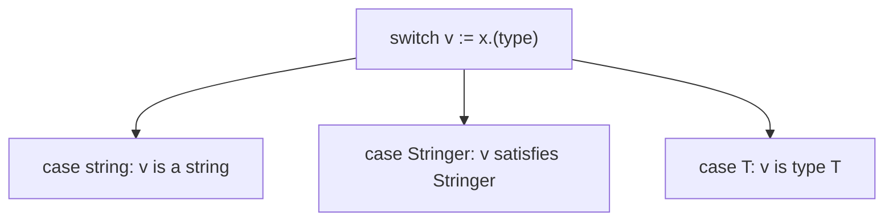

# Go Type Assertions and Type Switches

## TLDR

- A type assertion recovers the concrete value stored inside an interface: `v := i.(T)`.
- The comma-ok form `v, ok := i.(T)` is the safe version; it returns `ok == false` instead of panicking when the dynamic type does not match.
- Assertions only work on **interface** values, never on concrete types.
- A **type switch** (`switch v := x.(type)`) runs different code based on the dynamic type of the value.
- The asserted type must match **exactly**: a `map[string]string` does not satisfy an assertion to `map[string]interface{}`.

## The problem: getting a concrete value back out of an interface

An interface, especially `interface{}`/`any`, boxes a value so it can be treated generically. The catch is that while the value is inside the interface, you can only call the interface's methods, or nothing at all in the case of `any`. Sooner or later you need the concrete value back: to read a field, to call a type-specific method, or to convert it. A type assertion is the operation that pulls the concrete value back out, and doing it safely is what separates robust Go from panicking Go.

<div style={{display: 'flex', justifyContent: 'center'}}>



</div>

## The basic assertion

The expression `i.(T)` asserts that the interface value `i` holds a concrete value of type `T`, and returns that value. If the assertion is wrong, the program panics.

```go
var i interface{} = "hello"
s := i.(string) // ok, s == "hello"
n := i.(int)    // panics: i holds a string, not an int
```

The panic on failure is why the plain form is only safe when you already know the dynamic type with certainty.

## The comma-ok (safe) form

The comma-ok form captures the result of the assertion as a boolean, so a mismatch does not panic.

```go
var i interface{} = "hello"

s, ok := i.(string)
fmt.Println(s, ok) // "hello", true

n, ok := i.(int)
fmt.Println(n, ok) // 0, false
```

When the assertion fails, `ok` is `false` and the value is the zero value of the asserted type. Use this form whenever the dynamic type is uncertain. A type assertion only applies to interface values; you cannot assert on a concrete type because the compiler already knows its type.

<div style={{display: 'flex', justifyContent: 'center'}}>



</div>

## Asserting to a concrete map type

Assertions are exact. A value must match the asserted type precisely, which matters most with maps and slices. Consider a function that receives arbitrary data and wants to treat it as a `map[string]interface{}`:

```go
package main

import (
    "fmt"
    "time"
)

func timeMap(y interface{}) {
    z, ok := y.(map[string]interface{})
    if ok {
        z["updated_at"] = time.Now()
    }
}

func main() {
    foo := map[string]interface{}{"Matt": 42}
    timeMap(foo)
    fmt.Println(foo)
}
```

`y` is an `interface{}`, so it can hold anything. The assertion `y.(map[string]interface{})` checks whether the dynamic type is exactly `map[string]interface{}`. If so, `z` is that map, and `z["updated_at"] = time.Now()` adds a key. Because maps are reference types, the caller's `foo` sees the change.

The exactness rule is subtle: `map[string]string` will **not** satisfy an assertion to `map[string]interface{}`, even though a `string` is an `interface{}`. The dynamic type must match precisely. If `foo` had been a `map[string]string`, the assertion would fail and `ok` would be `false`, silently doing nothing.

## The type switch

When you want to handle several possible types in one place, a type switch is clearer than a chain of comma-ok assertions. Its syntax uses the special `.(type)` form.

```go
package main

import "fmt"

type Stringer interface {
    String() string
}

type fakeString struct {
    content string
}

func (s *fakeString) String() string {
    return s.content
}

func printString(value interface{}) {
    switch str := value.(type) {
    case string:
        fmt.Println(str)
    case Stringer:
        fmt.Println(str.String())
    }
}

func main() {
    s := &fakeString{"Ceci n'est pas un string"}
    printString(s)           // prints the content via Stringer
    printString("Hello, Gophers") // prints the string directly
}
```

The type switch does not require the type being switched on to be `interface{}`. It works on any interface value, and each `case` names a type to match against the dynamic type. Inside the case, `str` is the value with its concrete type.

<div style={{display: 'flex', justifyContent: 'center'}}>



</div>

## Real use: distinguishing error types

A common real-world pattern is checking whether a returned error is a specific concrete type before acting on it. A type assertion on the `error` interface recovers the concrete error and lets you inspect its fields.

```go
if err != nil {
    if msqlerr, ok := err.(*mysql.MySQLError); ok && msqlerr.Number == 1062 {
        log.Println("We got a MySQL duplicate :(")
    } else {
        return err
    }
}
```

The assertion `err.(*mysql.MySQLError)` checks whether the error's dynamic type is `*mysql.MySQLError`. If it is, `ok` is true and `msqlerr.Number` is the specific error code, allowing the code to treat a duplicate key (code 1062) specially. This is why the comma-ok form exists: it recovers a more specific type without panicking when the error is something else.

## Summary

A type assertion recovers the concrete value from an interface. The plain form `i.(T)` panics on mismatch, while the comma-ok form `v, ok := i.(T)` fails gracefully with `ok == false`. Assertions require an interface value and an exact type match, and a type switch (`x.(type)`) dispatches cleanly across multiple possible types. These tools are how you go from "any value" back to a usable, strongly typed value, whether you are handling arbitrary `interface{}` data or narrowing an error to its specific type.

## Sources

- A Tour of Go, [Type assertions](https://go.dev/tour/methods/15) - the `i.(T)` syntax and the comma-ok safe form.
- A Tour of Go, [Type switches](https://go.dev/tour/methods/16) - the `switch v := x.(type)` construct.
- Go Bootcamp (Matt Aimonetti), [Interfaces](https://www.gobootcamp.com/book/interfaces) - the `printString` type-switch example and the `*mysql.MySQLError` error-checking example.
- The Go Programming Language Specification, [Type assertions](https://go.dev/ref/spec#Type_assertions) - the formal rule that an assertion applies to interface values and panics on mismatch unless the comma-ok form is used.
