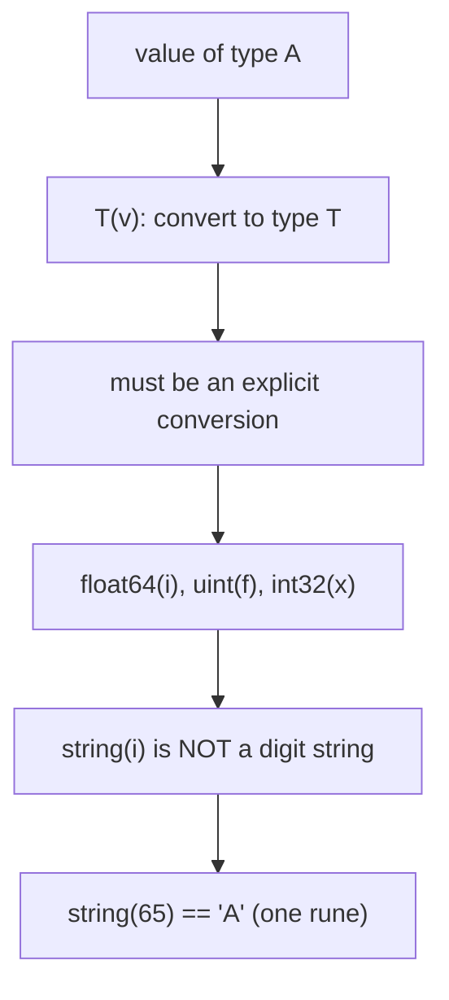
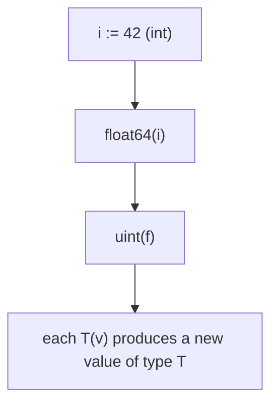
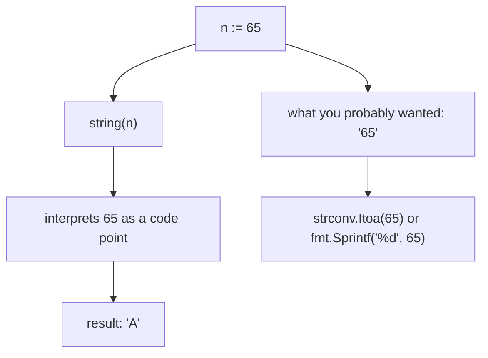

# Go Type Conversion (and the `string(int)` Gotcha)

## TLDR

- Convert a value to type `T` with the expression `T(v)`, for example `float64(i)` or `uint(f)`.
- Go requires **explicit** conversion; it never implicitly converts between numeric types the way C sometimes does.
- You must convert manually whenever you pass a variable to something that expects a different type, such as a function parameter.
- The dangerous special case: `string(int)` converts the integer to a **single rune**, not a string of digits. `string(65)` is `"A"`, not `"65"`.
- To turn a number into its decimal string, use `strconv.Itoa(n)` or `fmt.Sprintf("%d", n)`.

## The problem: strict typing, plus one misleading conversion

Go's static typing means an `int` and a `float64` are different types, and a value of one type is not automatically accepted where the other is expected. That part is a design choice. The trap is that Go's `string(...)` conversion looks like it should turn a number into its digit string, but it does something entirely different: it interprets the number as a Unicode code point and produces a one-rune string. This one-liner has bitten nearly every Go newcomer.

<div style={{display: 'flex', justifyContent: 'center'}}>



</div>

## Converting between types

The expression `T(v)` converts the value `v` to the type `T`. This is the only way to change a value's type; there is no implicit numeric conversion.

```go
var i int = 42
var f float64 = float64(i)
var u uint = uint(f)
```

Using short declarations, the same conversions read more concisely:

```go
i := 42
f := float64(i)
u := uint(f)
```

The conversion is necessary whenever a value's current type does not match what the surrounding code expects. For example, a function that takes a `float64` will reject an `int` argument until you convert it.

<div style={{display: 'flex', justifyContent: 'center'}}>



</div>

## Narrowing and widening

Conversions are not just cosmetic; they can change the value. Converting a `float64` to an `int` truncates toward zero, and converting to a narrower integer type wraps or truncates if the value does not fit. The compiler trusts you to know this.

```go
package main

import "fmt"

func main() {
    id := 12.3
    intConverted := float32(id) // float64 -> float32 (may lose precision)
    fmt.Println(intConverted)   // 12.3
}
```

Here `12.3` is a `float64` literal that gets converted to `float32`. The value happens to round-trip, but narrowing a `float64` to `float32` can lose precision in general, and converting a float to an integer would drop the fractional part.

## The `string(int)` gotcha

This is the conversion that confuses people. Converting an integer to a string does **not** produce the decimal representation of that integer. It produces a string containing the single rune whose Unicode code point is that integer.

```go
package main

import "fmt"

func main() {
    n := 65
    s := string(n)
    fmt.Println(s) // "A", not "65"
}
```

`65` is the Unicode code point for the capital letter `A`, so `string(65)` yields `"A"`. If you wanted the two characters `"65"`, this is wrong. The Go compiler and `go vet` flag exactly this mistake with a warning:

```text
prog.go:11:32: conversion from int to string yields a string of one rune, not a string of digits
```

The warning is Go telling you: you converted an `int` to a `string`, and what you almost certainly wanted was the decimal digits, but what you got is one rune.

<div style={{display: 'flex', justifyContent: 'center'}}>



</div>

## The correct way to get a digit string

To convert a number to its decimal string representation, use the `strconv` package or `fmt.Sprintf`. These are the tools whose whole job is formatting numbers as text, and they will never be mistaken for a rune conversion.

```go
package main

import (
    "fmt"
    "strconv"
)

func main() {
    n := 65
    fmt.Println(strconv.Itoa(n))      // "65"
    fmt.Println(fmt.Sprintf("%d", n)) // "65"
}
```

`strconv.Itoa` is the direct, idiomatic choice for an `int`. For other integer types or bases, use `strconv.FormatInt` or `strconv.FormatUint`; for floats, `strconv.FormatFloat`.

## Why the difference matters in practice

The distinction between `string(rune)` and `strconv.Itoa(int)` is not pedantic. The former is how you build a string from an individual character: `string('A')` or `string(0x2318)` produces a one-rune string, which is genuinely useful when working with runes. The latter is how you produce human-readable numbers for output, logging, and building messages. Reaching for the wrong one silently produces a single character instead of the number you expected, which is exactly why Go warns you.

## Summary

Go converts values with the explicit `T(v)` syntax and does no implicit numeric conversion. The conversion you must treat with care is `string(int)`: it yields a single rune from a code point, not a string of digits, so `string(65)` is `"A"`. To render a number as decimal text, use `strconv.Itoa` or `fmt.Sprintf`. Once you understand the basic types and how to convert between them, the natural next step is grouping several of them into one named type, which is what structs are for.

## Sources

- A Tour of Go, [Type conversions](https://go.dev/tour/basics/13) - the `T(v)` syntax and the `var i int` / `float64(i)` / `uint(f)` example.
- Go Bootcamp (Matt Aimonetti), [Type conversion](https://www.gobootcamp.com/book/type-conversion) - the `float32(id)` example and the requirement of manual conversions.
- The Go Programming Language Specification, [Conversions](https://go.dev/ref/spec#Conversions) - the formal rules, including that a conversion from an integer to a string yields one rune.
- The Go Programming Language Specification, [Conversions to and from a string type](https://go.dev/ref/spec#Conversions_to_and_from_a_string_type) - the code-point interpretation that produces the `string(65) == "A"` behavior.
