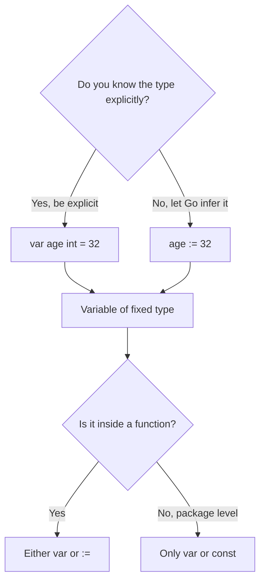
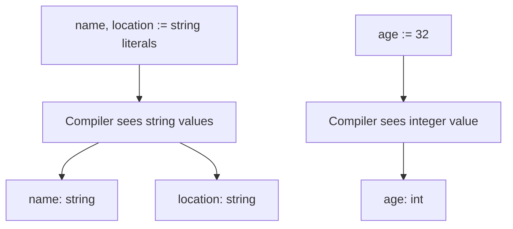
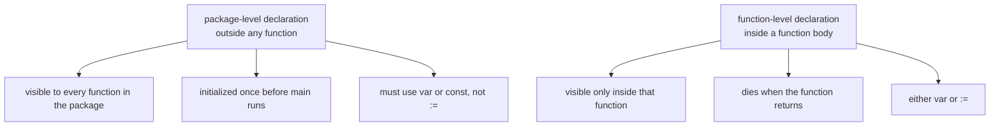

# Go Variables and Type Inference

## TLDR

- Go is **statically typed**: every variable has one fixed type, decided when the program compiles, not when it runs.
- You declare a variable two ways: `var name string` (explicit) or `name := "Oberyn"` (short, type inferred from the value).
- The `:=` short form **only works inside functions**; at package level you must use `var` (or `const`).
- The `var (...)` block lets you group several declarations without repeating the `var` keyword.
- Type inference does not mean "no types"; it means the compiler figures out the type for you from the value you assign.

## The problem: a language that wants types but not ceremony

Go is a statically typed language like Java or C, not a dynamically typed one like JavaScript or Python. The compiler must know the type of every value before it produces a binary, because that is what lets it catch mistakes early and optimize the machine code. But early statically typed languages made you write the type everywhere, even when it was obvious, which is tedious.

Go's answer is to keep static typing but remove the ceremony. You can declare the type explicitly when it matters, and let the compiler infer it when the value already says what it is.

<div style={{display: 'flex', justifyContent: 'center'}}>



</div>

## Two ways to declare a variable

### The `var` keyword

`var` declares a variable with an explicit type. The type comes after the name, which is the reverse of C or Java.

```go
var name string
var age int
var location string
```

When several variables share a purpose, group them in a `var` block instead of repeating the keyword:

```go
var (
    name     string
    age      int
    location string
)
```

The block form is just formatting sugar; it declares exactly the same three variables. It is the idiomatic style for related declarations at the top of a file or function.

### The short declaration `:=`

Inside a function you can skip the `var` and the type entirely. The `:=` operator declares the variable and infers its type from the value on the right.

```go
package main

import "fmt"

func main() {
    name, location := "Prince Oberyn", "Dorne"
    age := 32
    fmt.Printf("%s age %d from %s ", name, age, location)
}
```

Here `name` and `location` become `string`, and `age` becomes `int`, all inferred. `:=` is the normal way to write day-to-day Go code; you only reach for `var` when the type is not obvious from the value, or when you are declaring at package level.

<div style={{display: 'flex', justifyContent: 'center'}}>



</div>

## The rule that trips people up: `:=` is function-local

`:=` cannot be used at package level. The reason is a design decision: package-level declarations form the module's public surface and Go wants them explicit, so `var` (or `const`) is required there.

```go
// At package level, this is invalid:
// name := "Oberyn"

// Use var instead:
var name = "Oberyn"
```

Note that even at package level, `var name = "Oberyn"` still infers the type `string`; you do not have to write `var name string = "Oberyn"`. The restriction is only on the `:=` shorthand, not on inference itself.

## Function level vs package level

"Function level" and "package level" are the two *places* a declaration can sit in a file, and they have very different scopes.

### Package level: outside any function

A package-level declaration sits at the top of the file, outside any function. It belongs to the whole package, so every function in the package can see it, and it is initialized once before `main` runs.

```go
package main

var name = "Oberyn"   // package level

func main() {
    fmt.Println(name) // visible here
}

func other() {
    fmt.Println(name) // and here
}
```

Since these declarations are shared by the package, they are part of the package's surface, and Go requires you to write them explicitly with `var` or `const`.

### Function level: inside a function body

A function-level declaration sits inside a function. It is visible only inside that function and goes away when the function returns.

```go
package main

func main() {
    age := 32          // function level
    fmt.Println(age)   // fine
}

func other() {
    fmt.Println(age)   // error: undefined: age
}
```

No other function can see `age`. It lives and dies with the scope of `main`.

<div style={{display: 'flex', justifyContent: 'center'}}>



</div>

So the real reason behind the `:=` rule: `:=` is a short, inline declaration, appropriate for quick local code. Package-level declarations are the package's shared surface, so Go forces them to be explicit with `var`/`const`. Same idea as why you cannot declare at package level with `:=` at all.

## Type inference is not dynamic typing

The important distinction: inferred types are fixed at compile time. Once `age := 32` makes `age` an `int`, assigning a string to it is a compile error.

```go
age := 32
age = "thirty two" // compile error: cannot use "thirty two" as int
```

This is what separates Go from a dynamically typed language. In JavaScript, the same variable can hold a number and then a string at runtime. In Go, the compiler refuses to build the program. Inference only saves you from writing the type out; it does not make the type go away.

## When to use which form

| Situation | Use | Why |
| --- | --- | --- |
| Type is obvious from the value | `x := 42` | Less noise, idiomatic |
| Type is not obvious, or you want it explicit | `var x float64 = 42` | Makes intent clear; `42` alone would infer `int` |
| Package-level declaration | `var x = 42` | `:=` is not allowed here |
| Declaring several related variables | `var (...)` block | Groups intent, cleaner at the top |
| Declaring a zero value without assignment | `var x int` | `:=` requires a value on the right |

## Summary

Go keeps static typing but removes the ceremony with type inference. Declare with `var` when you want the type explicit or are at package level, and use `:=` inside functions when the value makes the type obvious. The type is still fixed at compile time either way, which is exactly where Go's safety and speed come from.

## Sources

- A Tour of Go, [Basics: Variables](https://go.dev/tour/basics/8) and [Short variable declarations](https://go.dev/tour/basics/10) - the `var` keyword, the `:=` short form, and the rule that `:=` is function-local.
- The Go Programming Language Specification, [Variable declarations](https://go.dev/ref/spec#Variable_declarations) - the syntax and semantics of `var` declarations and blocks.
- Go Bootcamp (Matt Aimonetti), [Variables](https://www.gobootcamp.com/book/variables) - the `var (...)` block style and type inference examples.
- Effective Go, [Short variable declarations](https://go.dev/doc/effective_go#short-declarations) - guidance on when `:=` is idiomatic.
