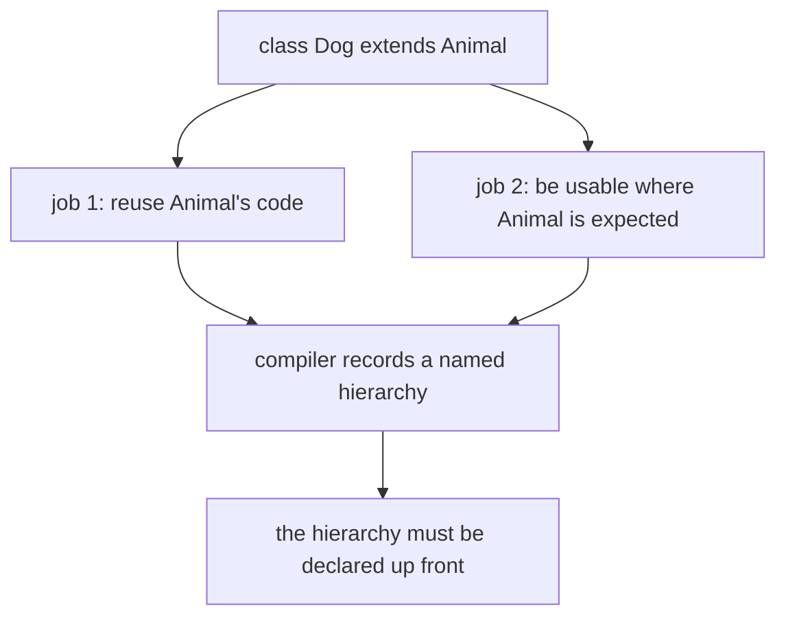
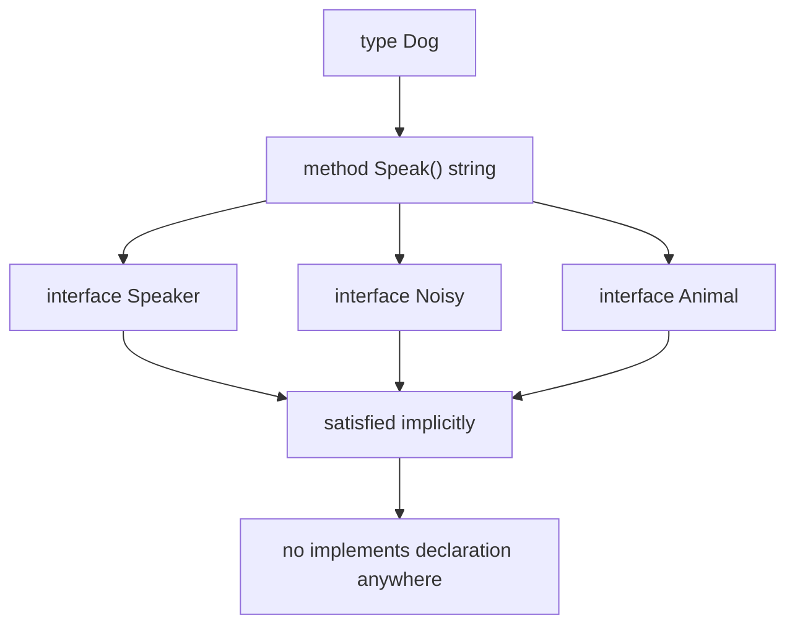
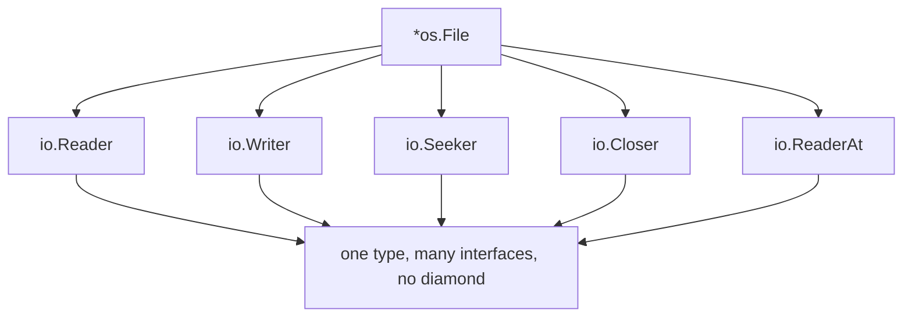
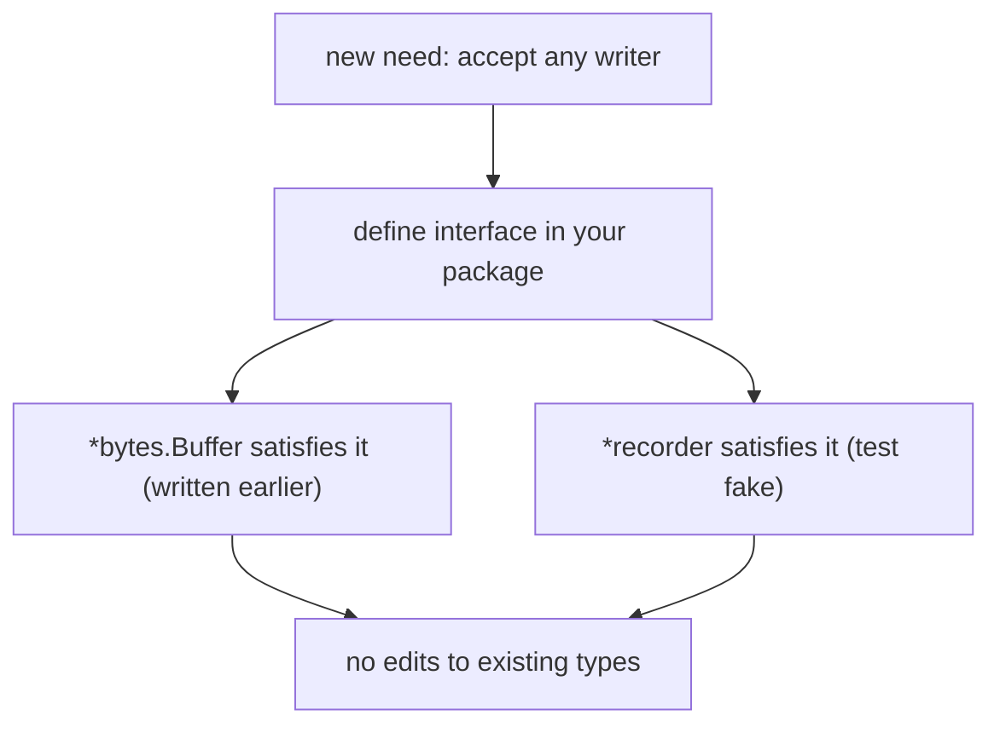
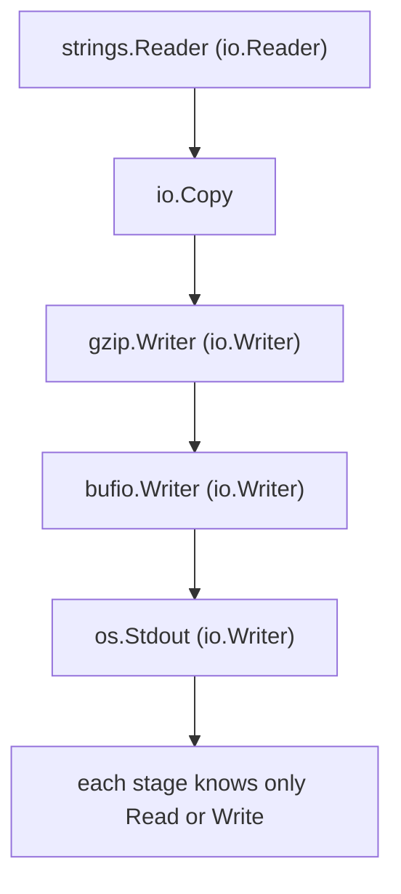
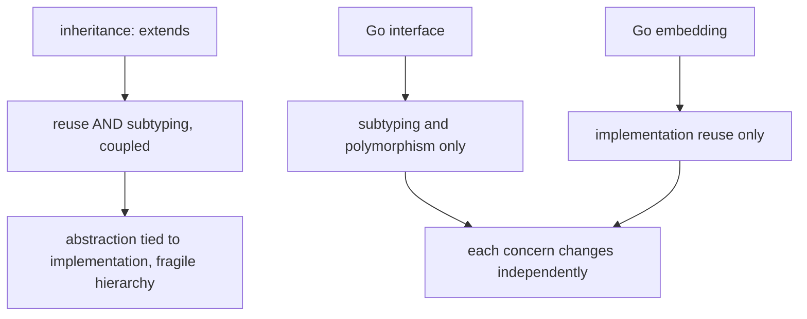

# Why Go Has No Type Inheritance

## TLDR

- Go has **no type inheritance**: no `extends`, no `class`, and no type hierarchy. Types "just are, they don't have to announce their relationships."
- A type **automatically satisfies any interface** that names a subset of its methods. There is no `implements` keyword and no ahead-of-time declaration.
- The Go FAQ gives four advantages: a type can satisfy **many interfaces at once** (without the diamond problem of multiple inheritance), interfaces can be **very lightweight** (one or zero methods), interfaces can be **added after the fact** (even for types you do not own, and for testing), and there is **no hierarchy to manage or discuss**.
- The payoff is **type-safe Unix pipes**: a single one-method interface, `io.Writer`, lets `fmt.Fprintf`, `bufio`, the `image` packages, and `compress/gzip` all interoperate without knowing about each other.
- Inheritance is replaced by two separate tools: **interfaces** for subtyping and polymorphism, and **embedding** for implementation reuse. Inheritance conflates those two jobs, which is exactly what makes hierarchies fragile.
- The costs are real: method signatures must match **exactly** (no covariant return types), embedding gives reuse but **not** subtyping, and dynamic dispatch is available **only through interfaces**.

## The problem inheritance was invented to solve

Classic object-oriented languages pack two different ideas into one keyword. `class Dog extends Animal` does two jobs at once: it lets `Dog` **reuse** `Animal`'s fields and methods, and it makes `Dog` a **subtype** that can be passed anywhere an `Animal` is expected. That single relationship is convenient, and it is also the source of the fragile base class problem, rigid is-a modeling, and subclass explosions.

The Go FAQ rejects the framing, not the goal. Reuse and polymorphism are both still needed. What Go refuses is the requirement to describe them as a named hierarchy before writing any code.

<div style={{display: 'flex', justifyContent: 'center'}}>



</div>

## What Go's designers objected to

The Go FAQ answers the question "Why is there no type inheritance?" directly. Its opening sentence names the objection: object-oriented programming, "at least in the best-known languages, involves too much discussion of the relationships between types, relationships that often could be derived automatically."

The complaint is about **bookkeeping**. In Java or C++, the compiler already knows that `Dog` has a `bark` method and an `Animal` has a `bark` method. The programmer still has to spell out `extends Animal`, and the whole program is shaped around that declaration. Go's position is that the relationship "Dog is usable as an Animal" is implied by the method set, so making the programmer write it down adds ceremony without adding information. The FAQ's guiding-principles section states the same idea from the design side: "there is no type hierarchy: types just are, they don't have to announce their relationships."

The FAQ's "Why did you create a new language?" entry lists this as one of the foundational choices: Go has "a compositional rather than hierarchical type system."

## The original answer

Here is the Go FAQ's full answer, verbatim:

> Object-oriented programming, at least in the best-known languages, involves too much discussion of the relationships between types, relationships that often could be derived automatically. Go takes a different approach.
>
> Rather than requiring the programmer to declare ahead of time that two types are related, in Go a type automatically satisfies any interface that specifies a subset of its methods. Besides reducing the bookkeeping, this approach has real advantages. Types can satisfy many interfaces at once, without the complexities of traditional multiple inheritance. Interfaces can be very lightweight—an interface with one or even zero methods can express a useful concept. Interfaces can be added after the fact if a new idea comes along or for testing—without annotating the original types. Because there are no explicit relationships between types and interfaces, there is no type hierarchy to manage or discuss.
>
> It’s possible to use these ideas to construct something analogous to type-safe Unix pipes. For instance, see how `fmt.Fprintf` enables formatted printing to any output, not just a file, or how the `bufio` package can be completely separate from file I/O, or how the `image` packages generate compressed image files. All these ideas stem from a single interface (`io.Writer`) representing a single method (`Write`). And that’s only scratching the surface. Go’s interfaces have a profound influence on how programs are structured.
>
> It takes some getting used to but this implicit style of type dependency is one of the most productive things about Go.

Source: [Go FAQ, "Why is there no type inheritance?"](https://go.dev/doc/faq#inheritance).

## The quote, explained

Each claim in the FAQ answer is a design decision. Taken one at a time:

### Relationships are derived, not declared

> Rather than requiring the programmer to declare ahead of time that two types are related, in Go a type automatically satisfies any interface that specifies a subset of its methods.

This is **implicit (or structural) interface satisfaction**. An interface is just a set of method signatures. Any type whose method set is a superset of that interface satisfies it, with no registration anywhere. `Dog` does not mention `Speaker`; it merely has `Speak() string`, and that is enough.

```go
package main

import "fmt"

type Speaker interface {
    Speak() string
}

type Dog struct{}

func (d Dog) Speak() string { return "Woof" }

type Cat struct{}

func (c Cat) Speak() string { return "Meow" }

func announce(s Speaker) {
    fmt.Println(s.Speak())
}

func main() {
    announce(Dog{}) // Woof
    announce(Cat{}) // Meow
}
```

<div style={{display: 'flex', justifyContent: 'center'}}>



</div>

### Advantage 1: a type can satisfy many interfaces at once

> Types can satisfy many interfaces at once, without the complexities of traditional multiple inheritance.

C++ multiple inheritance creates the **diamond problem**: if `D` inherits from `B` and `C`, and both inherit from `A`, the compiler must decide how many `A` subobjects `D` has and which one a call to an `A` method refers to. Virtual inheritance exists to patch this. Go never hits it because there is no shared inherited state and no subobject layout to reconcile. Methods are just functions attached to a type. If two interfaces declare the same method signature, the single implementation satisfies both.

A concrete example is `*os.File`. It satisfies many standard interfaces simultaneously, and each was written with no knowledge of the others:

```go
var _ io.Reader   = (*os.File)(nil)
var _ io.Writer   = (*os.File)(nil)
var _ io.Seeker   = (*os.File)(nil)
var _ io.Closer   = (*os.File)(nil)
var _ io.ReaderAt = (*os.File)(nil)
var _ io.WriterAt = (*os.File)(nil)
```

Those `var _ I = (*T)(nil)` lines are the idiomatic way to make the compiler prove that a type satisfies an interface, so a broken method set fails the build instead of failing a caller.

<div style={{display: 'flex', justifyContent: 'center'}}>



</div>

### Advantage 2: interfaces can be very lightweight

> Interfaces can be very lightweight: an interface with one or even zero methods can express a useful concept.

An abstract base class usually drags state, constructors, and a hierarchy with it. A Go interface is only a list of signatures, so the smallest useful one can be tiny. `io.Writer` has exactly one method:

```go
type Writer interface {
    Write(p []byte) (n int, err error)
}
```

Zero methods is also useful. The empty interface, written `interface{}` and aliased as `any` since Go 1.18, is satisfied by every type, which is what makes it a placeholder for "a value of any type."

### Advantage 3: interfaces can be added after the fact

> Interfaces can be added after the fact if a new idea comes along or for testing, without annotating the original types.

This is the advantage that a declared hierarchy cannot offer. Suppose a library returns a concrete `*bytes.Buffer` and you want to accept "anything with `Write`" so tests can pass a fake. You define the interface in your own package. `*bytes.Buffer` satisfies it automatically, and so does your fake, and neither was edited.

```go
package main

type writable interface {
    Write(p []byte) (int, error)
}

type recorder struct {
    data []byte
}

func (r *recorder) Write(p []byte) (int, error) {
    r.data = append(r.data, p...)
    return len(p), nil
}
```

`recorder` imitates `io.Writer` without importing or depending on it, and `*bytes.Buffer` already satisfies the same interface. This is why Go testing needs no mocking framework for most cases: the seam is just an interface defined where it is consumed.

<div style={{display: 'flex', justifyContent: 'center'}}>



</div>

### Advantage 4: no type hierarchy to manage

> Because there are no explicit relationships between types and interfaces, there is no type hierarchy to manage or discuss.

No hierarchy means no base classes to break, no fragile base class problem, no "which override runs?" archaeology, and no diamond to resolve. A type's behavior is its methods, and who can use it is decided at each call site by the interfaces involved. The FAQ's "Is Go an object-oriented language?" says the lack of a hierarchy is also why Go's objects "feel much lighter" than in C++ or Java.

### The payoff: type-safe Unix pipes

> It's possible to use these ideas to construct something analogous to type-safe Unix pipes ... All these ideas stem from a single interface (io.Writer) representing a single method (Write). And that's only scratching the surface.

A Unix pipeline works because every stage speaks the same simple protocol: read bytes, write bytes, and know nothing about its neighbors. `io.Reader` and `io.Writer` are the typed version of that protocol. Because they are tiny and implicitly satisfied, unrelated packages compose.

- `fmt.Fprintf(w io.Writer, ...)` writes formatted output to **any** writer, not just a file:

  ```go
  var buf bytes.Buffer
  fmt.Fprintf(&buf, "to memory\n")   // a buffer
  fmt.Fprintf(os.Stdout, "to stdout\n") // a file
  ```

- `bufio.NewWriter(w io.Writer)` adds buffering around **any** writer and is completely separate from file I/O:

  ```go
  bw := bufio.NewWriter(os.Stdout)
  fmt.Fprintf(bw, "buffered\n")
  bw.Flush()
  ```

- The `image` packages encode to any writer. `png.Encode(w io.Writer, m image.Image)` does not care whether `w` is a file, a socket, or a compressor.

- Because all of these are just `io.Writer`s, they can be chained the way shell pipes are:

  ```go
  src := strings.NewReader("hello, pipe\n")
  gz := gzip.NewWriter(os.Stdout)
  io.Copy(gz, src) // strings.Reader -> gzip.Writer -> os.Stdout
  gz.Close()
  ```

  `io.Copy` itself is defined entirely in terms of the two interfaces (`dst Writer, src Reader`), so it links any reader to any writer. Each stage knows only `Read` or `Write`; none knows what its neighbors are.

<div style={{display: 'flex', justifyContent: 'center'}}>



</div>

### The productivity claim

> It takes some getting used to but this implicit style of type dependency is one of the most productive things about Go.

The productivity comes from removing coordination. Two teams can define the same little interface independently and still interoperate, because satisfaction is determined by shape, not by a shared declaration. Interfaces stay at the point of use, so packages depend on abstractions they own rather than on a framework's base class. The FAQ's "Why doesn't Go have 'implements' declarations?" calls this "a kind of structural typing that promotes separation of concerns and improves code re-use."

## What replaces inheritance in Go

Go does not replace inheritance with a single feature. It splits the two jobs inheritance used to combine, and gives each its own tool.

- **Interfaces** provide subtyping and polymorphism: "this value can do these things." A function that takes an interface can accept any satisfying type, and the implementation that runs is chosen at runtime. This is the only way to get dynamic method dispatch in Go; methods on concrete types are resolved statically.
- **Embedding** provides implementation reuse: "this type has these fields and methods." Embedding a struct (or pointer) promotes its fields and methods to the outer type, which is the Go equivalent of inheriting code. Embedding is covered in depth in [Go Composition (Struct Embedding)](./go-composition.md), and interfaces in [Go Interfaces](./go-interfaces.md).

```go
type User struct {
    Id   int
    Name string
}

func (u User) Greet() string { return "Hi " + u.Name }

type Player struct {
    User // embedded: fields and methods are promoted
    GameId int
}

// p.Greet() works because it is promoted from User.
// But Player is NOT a User:
// var u User = Player{} // compile error: no subtyping
```

That last line is the crucial difference from `extends`. Embedding reuses code without creating a subtype, so the two jobs stay decoupled. An `Animal`-typed variable can hold a `Dog` only when `Animal` is an interface, never because of a shared base struct.

<div style={{display: 'flex', justifyContent: 'center'}}>



</div>

## What you give up

The FAQ is candid that the trade is not free.

- **Method signatures must match exactly.** There are no covariant result types. An `Opener` interface demanding `Open() io.Reader` is not satisfied by a method returning `*os.File`, even though `*os.File` implements `io.Reader`. The FAQ's answer is that Go "separates the notion of what a type does, its methods, from the type's implementation."
- **No automatic argument promotion.** A method `func (t T) Equal(u T) bool` does not satisfy an `Equaler` interface whose method is `Equal(Equaler) bool`; the argument type has to be the interface type itself. Go's rule is simply: are the function names and signatures exactly those of the interface?
- **Embedding is not subtyping.** As shown above, a struct that embeds `User` cannot be used where `User` is required. You must go through an interface to get substitutability.
- **Dynamic dispatch requires an interface.** If a value is held in a concrete type, calls are resolved at compile time. This is deliberate: it keeps the rules simple and fast.

These constraints are the price of a type system in which relationships are derived instead of declared. For the designers, the trade is worth it because the rules stay easy to state, easy to implement, and hard to get subtly wrong.

## Applying it: a decision guide

When you would reach for `extends` in Java or C++, ask what you actually need:

| What you need | In Go |
| --- | --- |
| A shared contract ("anything that can do X") | Define a small **interface** and accept it. |
| Reusing fields and methods from another type | **Embed** the type. |
| Choosing an implementation at runtime | Hold an **interface** and call through it (dynamic dispatch). |
| A "base" with partial behavior | Compose an embedded helper struct, do not build a hierarchy. |
| To accept either a real or a fake collaborator | Define the interface in the **consumer** package; the fake satisfies it automatically. |
| A public API that stays open to new implementations | Expose methods, not a base class; consumers can then satisfy your interface. |

The prominent recommendation that follows from the FAQ: keep interfaces **small** and define them where they are **used**. A one-method interface is not a weakness, it is the mechanism that made `io.Writer` the universal joint of the Go standard library.

## Summary

Go has no type inheritance because inheritance forces programmers to declare type relationships that the compiler could derive from method sets. Go instead makes interface satisfaction **implicit**, which lets one type satisfy many interfaces without multiple-inheritance complexity, keeps interfaces lightweight, allows interfaces to be introduced after the fact and in the consumer's package, and removes the type hierarchy entirely. The result is a compositional type system where `io.Writer` alone connects `fmt`, `bufio`, `image`, `compress/gzip`, and user code like type-safe Unix pipes. What inheritance used to do is split in two: interfaces for subtyping and runtime dispatch, embedding for code reuse. The limits (exact signatures, no subtyping from embedding, dispatch only through interfaces) are the deliberate cost of rules that are simple to state and easy to reason about.

## Sources

- The Go Programming Language FAQ, "Why is there no type inheritance?", https://go.dev/doc/faq#inheritance - the quoted answer and the four advantages.
- Go FAQ, "What are the guiding principles in the design?", https://go.dev/doc/faq#principles - "there is no type hierarchy: types just are, they don't have to announce their relationships."
- Go FAQ, "Why did you create a new language?", https://go.dev/doc/faq#creating_a_new_language - "a compositional rather than hierarchical type system."
- Go FAQ, "Is Go an object-oriented language?", https://go.dev/doc/faq#Is_Go_an_object-oriented_language - no type hierarchy, embedding as the analogue of subclassing, and the "lighter" feel of objects.
- Go FAQ, "Why doesn't Go have 'implements' declarations?", https://go.dev/doc/faq#implements_interface - structural typing, separation of concerns, and code reuse.
- Go FAQ, "How do I get dynamic dispatch of methods?", https://go.dev/doc/faq#How_do_I_get_dynamic_dispatch_of_methods - only interfaces dispatch dynamically.
- Go FAQ, "Why does Go not have covariant result types?", https://go.dev/doc/faq#covariant_types - exact method matching and the separation of what a type does from its implementation.
- Go FAQ, "Why doesn't type T satisfy the Equal interface?", https://go.dev/doc/faq#t_and_equal_interface - no automatic promotion of argument types.
- Go FAQ, "How can I guarantee my type satisfies an interface?", https://go.dev/doc/faq#guarantee_satisfies_interface - the `var _ I = T{}` compile-time check.
- A Tour of Go, "Interfaces are implemented implicitly", https://go.dev/tour/methods/10 - the no-declaration rule.
- The Go Programming Language Specification, "Interface types", https://go.dev/ref/spec#Interface_types - the formal definition of an interface as a method set.
- Effective Go, "Interfaces", https://go.dev/doc/effective_go#interfaces - "if something can do this, then it can be used here."
- `io.Writer`, https://pkg.go.dev/io#Writer - the one-method interface behind the pipe analogy.
- `fmt.Fprintf`, https://pkg.go.dev/fmt#Fprintf - formatted output to any `io.Writer`.
- `bufio.NewWriter`, https://pkg.go.dev/bufio#NewWriter - buffering around any `io.Writer`, independent of file I/O.
- `compress/gzip.NewWriter`, https://pkg.go.dev/compress/gzip#NewWriter - a writer that wraps a writer, enabling chained pipelines.
- `image/png.Encode`, https://pkg.go.dev/image/png#Encode - encoding an `image.Image` to any `io.Writer`.
- Rob Pike, "Go at Google: Language Design in the Service of Software Engineering" (2012), https://go.dev/talks/2012/splash.article - the design context behind the language's goals.
- Go Bootcamp (Matt Aimonetti), "Composition", https://www.gobootcamp.com/book/composition - the `User`/`Player` embedding example.
