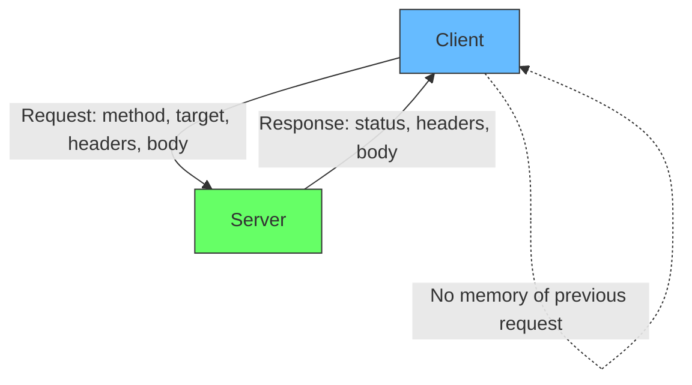
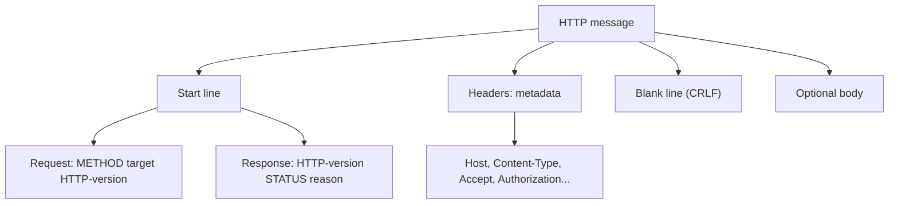
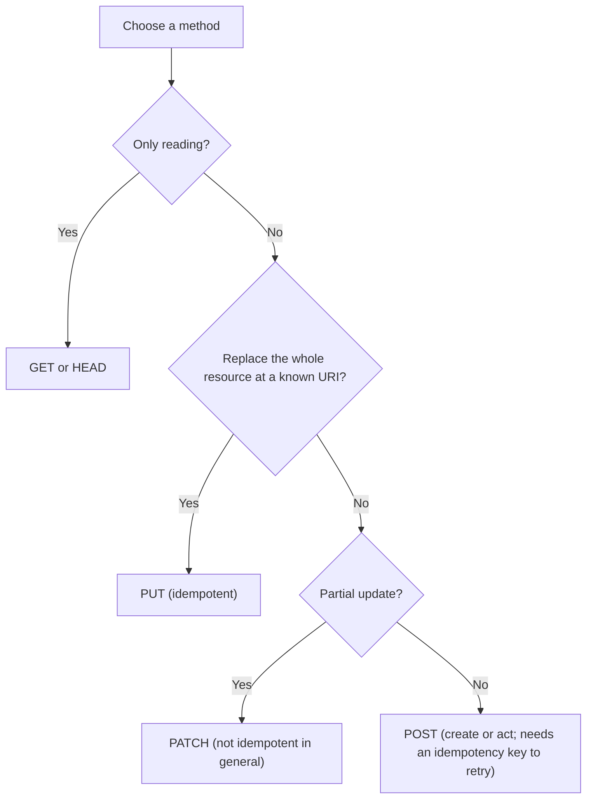
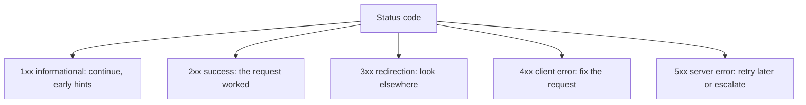
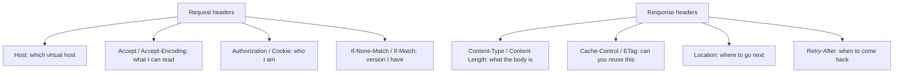
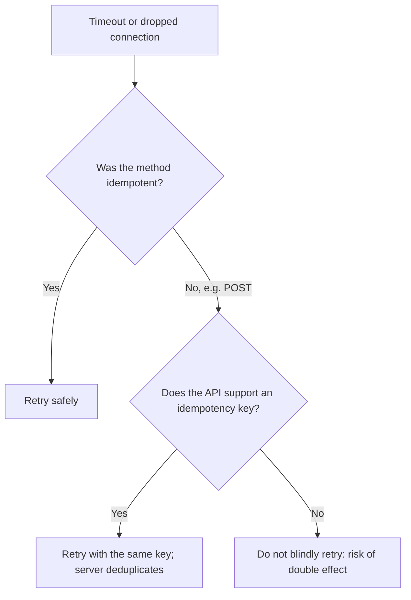
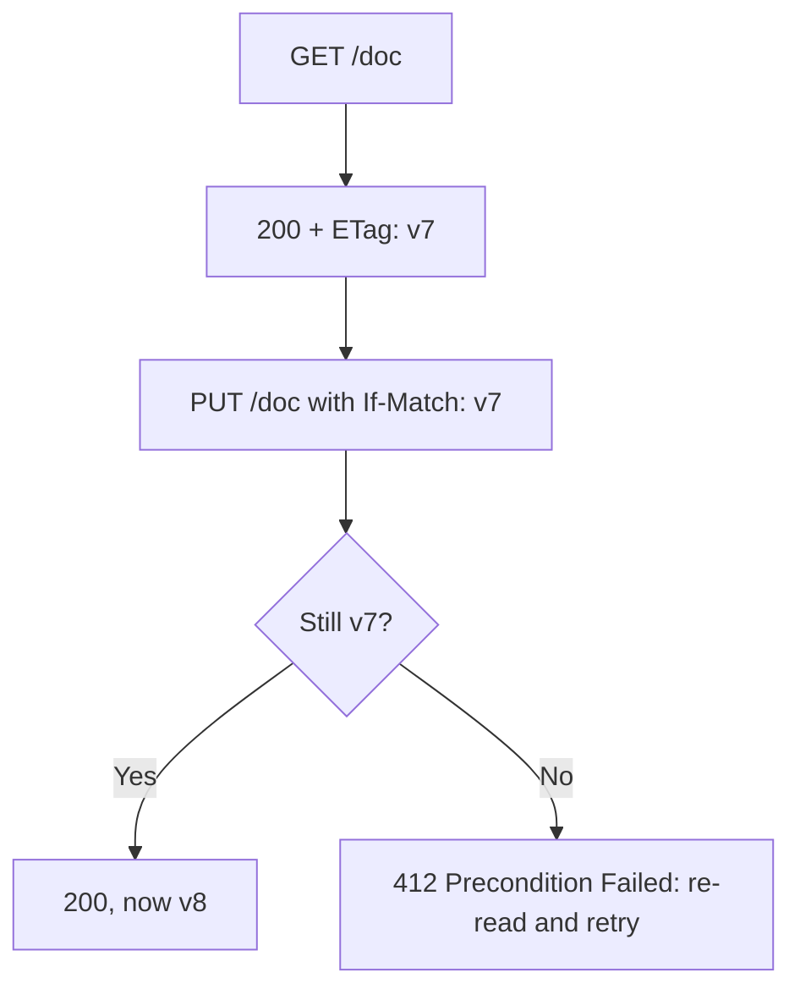
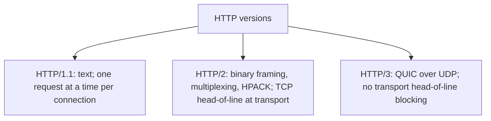

# HTTP Fundamentals: Methods, Status Codes, Headers, and Idempotency

## TLDR

- **HTTP is a stateless request/response protocol.** The client sends a request (method, target, headers, optional body), the server sends a response (status, headers, optional body). Nothing about the previous request is remembered unless you build state on top (cookies, sessions, tokens).
- **The method carries the semantics.** `GET`/`HEAD`/`OPTIONS`/`TRACE` are **safe** (no intended change). `PUT` and `DELETE` are **idempotent** (repeating has the same effect as once) but not safe. `POST` and `PATCH` are neither.
- **Idempotency is what makes retries safe.** Networks are at-least-once and timeouts leave you unsure whether a request landed. Retry an idempotent method freely; for `POST` you need an application-level **idempotency key**.
- **Safe does not mean "no side effects"** (the server may log), and **idempotent does not mean "same response"** (`DELETE` returns `200` then `404`). It means the *intended effect* is the same.
- **Status codes tell the caller what to do next:** fix the request (4xx), retry later (429/503), re-authenticate (401), or the server broke (5xx). Pick the specific code, not just "200 or 500".
- **Headers are the metadata layer:** `Host` (required in HTTP/1.1), `Content-Type`, `Content-Length`, `Accept`, `Authorization`, `Cookie`/`Set-Cookie`, `Cache-Control`, `ETag`, `Location`, `Retry-After`.
- **Use conditional requests for race-free updates.** `ETag` + `If-Match` turns a lost-update race into a `412 Precondition Failed` you can handle, and `If-None-Match` gives you a cheap `304 Not Modified`.
- **`PUT` replaces, `PATCH` modifies, `POST` creates/acts, `GET` reads.** Choosing correctly is most of REST design.
- **Cacheability follows from safe + idempotent:** `GET` and `HEAD` are cacheable; `POST` only with explicit freshness plus `Content-Location`.

## The problem HTTP solved

Before HTTP, every networked application invented its own protocol for talking to a server: its own commands, its own error handling, its own framing. HTTP (Tim Berners-Lee, 1989-1991) standardized a small, extensible request/response contract over TCP. Its genius was not any single feature but the combination of three ideas:

1. **A uniform interface.** A small set of methods with defined semantics, so a client, a proxy, a cache, and a server can all reason about a request without knowing the application.
2. **Self-describing messages.** Headers carry the metadata (content type, length, caching, auth) so intermediaries can act without parsing the body.
3. **Statelessness.** Each request carries everything needed to understand it. This is what let the web scale horizontally: any server can handle any request, and caches and load balancers can sit in the middle.

Roy Fielding later named the architectural style behind this REST, and statelessness is one of its constraints. The practical consequence for you: HTTP is not a framework, it is a contract, and the semantics you follow (or ignore) decide whether proxies, caches, and retries behave correctly.

<div style={{display: 'flex', justifyContent: 'center'}}>



</div>

## The shape of a message

An HTTP/1.1 message is text with a strict structure. A request is a **request line**, then **headers**, then a blank line, then an optional **body**. A response is a **status line**, then headers, blank line, body.

```http
GET /articles/42?fields=title,body HTTP/1.1
Host: api.example.com
Accept: application/json
Authorization: Bearer eyJhbGciOi...
If-None-Match: "v7"

```

```http
HTTP/1.1 200 OK
Content-Type: application/json; charset=utf-8
Content-Length: 51
Cache-Control: public, max-age=60
ETag: "v7"

{"id":42,"title":"HTTP","body":"..."}
```

<div style={{display: 'flex', justifyContent: 'center'}}>



</div>

Two structural rules are worth memorizing because bugs hide there: the blank line separates headers from body (so the body can contain anything, including `\r\n`), and in HTTP/1.1 the `Host` header is mandatory - it is how one IP serves many domains, and it is what virtual hosting and TLS SNI rely on. HTTP/2 replaces `Host` with the `:authority` pseudo-header.

## Methods and their semantics

The method is not a label, it is a promise about the *intended effect* of the request. Three properties matter:

- **Safe:** the client does not intend to change server state. Safe methods may still log or update counters, but the request is a read.
- **Idempotent:** making the request once or several times has the same intended effect. This is the property that makes a retry safe after a timeout.
- **Cacheable:** a response can be reused for later requests without hitting the origin.

MDN's summary is the table to remember:

| Method | Safe | Idempotent | Cacheable |
| --- | --- | --- | --- |
| `GET` | Yes | Yes | Yes |
| `HEAD` | Yes | Yes | Yes |
| `OPTIONS` | Yes | Yes | No |
| `TRACE` | Yes | Yes | No |
| `PUT` | No | Yes | No |
| `DELETE` | No | Yes | No |
| `POST` | No | No | Only with explicit freshness + `Content-Location` |
| `PATCH` | No | No | Only with explicit freshness + `Content-Location` |
| `CONNECT` | No | No | No |

<div style={{display: 'flex', justifyContent: 'center'}}>



</div>

### The four you use all day

- **`GET`** retrieves a representation. It is safe, idempotent, and cacheable. Never use it to change state: crawlers, prefetchers, and proxies will call it for you.
- **`POST`** submits data, usually creating a subordinate resource or triggering an action. It is not idempotent: calling it twice can create two rows or charge twice. This is the method that needs an idempotency key.
- **`PUT`** replaces the resource at a known URI with the request body. It is idempotent: sending the same body twice leaves the same final state. Use it for full replacement, not partial edits.
- **`DELETE`** removes the resource. It is idempotent: deleting an already-deleted resource leaves the same state, even though the status code changes (`200`, then `404`).

### PUT vs PATCH vs POST

This is the classic interview distinction:

- `PUT /users/42` with a full body replaces the user. Missing fields become null/default. Idempotent.
- `PATCH /users/42` with `{"name":"Ada"}` changes one field. Idempotent only if the operation is absolute; `{"amount":{"increment":10}}` is not, because repeating it increments twice.
- `POST /users` creates a new user without the client choosing the URI; the server assigns it and returns `201 Created` with a `Location` header. Repeating it creates another.

The reason this matters beyond style: only idempotent methods can be safely retried by infrastructure (proxies, service meshes, your own HTTP client) without coordination.

## Status codes

The first digit is the class, and the class tells the caller how to react:

<div style={{display: 'flex', justifyContent: 'center'}}>



</div>

The codes you should be able to justify:

| Code | Meaning | Use it when |
| --- | --- | --- |
| `200 OK` | Success with a body | Normal read or update response |
| `201 Created` | Resource created | After `POST`/`PUT`; include `Location` |
| `202 Accepted` | Accepted for async processing | Work queued, not done yet |
| `204 No Content` | Success, no body | After `DELETE` or an update with nothing to return |
| `301 Moved Permanently` | Permanent redirect | URL changed; clients/caches update |
| `302 Found` / `303 See Other` | Temporary redirect / see other | PRG pattern; `303` makes the follow-up a `GET` |
| `304 Not Modified` | Cached copy is still valid | Conditional `GET` with `If-None-Match` |
| `307` / `308` | Temporary / permanent redirect, **method preserved** | Redirect without turning `POST` into `GET` |
| `400 Bad Request` | Malformed syntax | The request cannot be parsed |
| `401 Unauthorized` | Not authenticated | Missing/invalid credentials; send `WWW-Authenticate` |
| `403 Forbidden` | Authenticated but not allowed | Valid identity, insufficient permission |
| `404 Not Found` | Resource does not exist | Also used to hide existence from unauthorized callers |
| `405 Method Not Allowed` | Wrong method for the URI | Include `Allow: GET, PUT` |
| `409 Conflict` | State conflict | Duplicate unique key, version clash |
| `412 Precondition Failed` | Concurrency check failed | `If-Match` did not match the current `ETag` |
| `415 Unsupported Media Type` | Wrong body type | `Content-Type` not accepted |
| `422 Unprocessable Content` | Syntactically fine, semantically invalid | Validation errors |
| `428 Precondition Required` | You must send a conditional header | Server demands `If-Match` to avoid lost updates |
| `429 Too Many Requests` | Rate limited | Include `Retry-After` |
| `500 Internal Server Error` | Unhandled server fault | A bug; do not use for validation |
| `502 Bad Gateway` | Upstream returned garbage/failed | Proxy got a bad response from the backend |
| `503 Service Unavailable` | Temporarily unavailable | Overload or maintenance; include `Retry-After` |
| `504 Gateway Timeout` | Upstream timed out | Proxy waited too long |

Two rules make status codes useful instead of decorative:

1. **The code is a contract about the next action.** `401` means "authenticate", `403` means "do not bother, you are not allowed", `429`/`503` mean "retry after the hint", `409`/`412` mean "re-read and resend". A client library, a retry policy, and a load balancer all branch on this.
2. **Do not collapse everything into `200` or `500`.** Returning `200` with `{"error": ...}` breaks monitoring and clients; returning `500` for user input pollutes your error budget with self-inflicted alerts.

`401` vs `403` is the most common mix-up: `401` is *who are you?*, `403` is *I know who you are, and no*.

## Headers

Headers are name/value metadata. They are grouped by direction and purpose:

- **Request:** `Host`, `Accept`, `Accept-Encoding`, `Authorization`, `Cookie`, `User-Agent`, `If-None-Match`, `If-Match`, `X-Forwarded-For`.
- **Response:** `Content-Type`, `Content-Length`, `Location`, `Set-Cookie`, `Cache-Control`, `ETag`, `Last-Modified`, `Retry-After`, `WWW-Authenticate`.
- **Representation (describe the body):** `Content-Type`, `Content-Length`, `Content-Encoding`, `Content-Language`.
- **Caching/conditional:** `Cache-Control`, `ETag`, `Last-Modified`, `Vary`, `If-None-Match`, `If-Modified-Since`.

<div style={{display: 'flex', justifyContent: 'center'}}>



</div>

The ones that cause real bugs when wrong:

- **`Content-Type`** decides how the body is parsed (`application/json`, `application/x-www-form-urlencoded`, `multipart/form-data`). Omitting it makes clients guess, and CORS preflights behave differently.
- **`Content-Length` vs `Transfer-Encoding: chunked`** - a body is framed one way or the other. Sending both is a request-smuggling vector, which is why servers reject it.
- **`Cache-Control`** is the cache policy (`no-store`, `no-cache`, `max-age=60`, `public`/`private`). Without it, caches apply heuristics you did not choose. `Vary` tells caches which request headers change the response (for example `Vary: Accept-Encoding`).
- **`Authorization`** carries the credential (often a bearer token). It must travel over TLS and must not be logged.
- **`Cookie` / `Set-Cookie`** carry session state; `Set-Cookie` supports `HttpOnly`, `Secure`, and `SameSite` to reduce XSS and CSRF risk (see the security and browser-storage articles).

## Idempotency: the property that makes retries safe

Networks are unreliable in a specific way: **at-least-once**. If a client sends a request and the connection drops before the response arrives, the client cannot know whether the server processed it. A timeout is not a failure, it is **uncertainty** - the worst case for a state-changing operation.

MDN's definition is precise: an HTTP method is idempotent if the intended effect on the server of a single request is the same as the effect of several identical requests. The HTTP specification defines this in terms of the client's *intended* effect, not the response:

- `GET /page` is idempotent because it is safe; successive calls may return different data if the page changed.
- `DELETE /users/42` is idempotent: the first call removes it (`200`), later calls find nothing (`404`). The state is the same.
- `POST /orders` is **not** idempotent: two calls create two orders.

<div style={{display: 'flex', justifyContent: 'center'}}>



</div>

### Idempotency keys for POST

Because `POST` cannot be retried safely by definition, APIs add a client-generated **idempotency key**. The pattern, popularized by payment APIs: the client generates a unique key (a UUID with enough entropy) and sends it in an `Idempotency-Key` header. The server stores the result of the first request under that key and returns the same stored result for any retry, so a duplicate request cannot create a second order or charge.

Stripe's documentation describes the mechanics well, and its details are the ones to copy: the server saves the status code and body of the first request for a key **regardless of whether it succeeded or failed** (including `500`); a reused key returns that same result; keys are pruned after a while (Stripe: after at least 24 hours); the server compares incoming parameters to the original and errors if they differ, to catch accidental misuse; and keys are only used for `POST` - `GET` and `DELETE` are already idempotent, so sending a key there has no effect.

```ts
async function createPayment(amount: number, idempotencyKey = crypto.randomUUID()) {
  const res = await fetch('https://api.example.com/payments', {
    method: 'POST',
    headers: {
      'Content-Type': 'application/json',
      'Idempotency-Key': idempotencyKey,
    },
    body: JSON.stringify({ amount }),
  });
  if (res.status === 503) {
    await new Promise((r) => setTimeout(r, Number(res.headers.get('Retry-After') ?? 1) * 1000));
    return createPayment(amount, idempotencyKey);
  }
  return res;
}
```

The key must be stable across retries and unique across requests. If the client regenerates the key on each attempt, the protection is gone.

### Conditional requests: idempotent, race-free updates

For `PUT`/`PATCH`, idempotency alone does not prevent lost updates: two clients can both read version 1, both write, and the second silently overwrites the first. HTTP solves this with **conditional requests**. The server sends an `ETag` (a version token) with the representation; the client sends it back in `If-Match` on the write. If the resource changed, the server returns `412 Precondition Failed` instead of clobbering. For reads, `If-None-Match` returns `304 Not Modified` with no body, which is the cheap cache-revalidation path.

<div style={{display: 'flex', justifyContent: 'center'}}>



</div>

This is optimistic concurrency control expressed in the protocol, and it is why ETags are not just a caching detail.

## Caching falls out of these semantics

Because `GET` and `HEAD` are safe and idempotent, their responses are cacheable. A correct cache is driven by `Cache-Control` (freshness) and validators (`ETag`/`Last-Modified`). On expiry, the client revalidates with `If-None-Match`; if the origin replies `304`, it reuses the stored body. `Vary` prevents a cache from serving a gzipped response to a client that did not ask for it. For the deeper treatment see the caching articles.

## State, sessions, and the stateless constraint

HTTP itself is stateless: the server is not required to remember the previous request. Real applications need state, so they layer it on top in one of three ways:

- **Cookies** (a `Set-Cookie` response, sent back in `Cookie` on each request) with server-side session storage.
- **Tokens** (typically a bearer `Authorization` header) that are self-contained and validated per request.
- **Server-side session stores** (Redis) keyed by an opaque cookie value.

The stateless constraint is what makes horizontal scaling and caching possible; the state you layer on is what makes caching and retries harder. That trade-off is the subject of the auth and caching articles.

## A quick note on HTTP versions

The semantics above are stable across versions; the wire format and performance characteristics changed.

<div style={{display: 'flex', justifyContent: 'center'}}>



</div>

HTTP/2 multiplexes many streams over one TCP connection and compresses headers (HPACK), fixing application-layer head-of-line blocking; HTTP/3 moves to QUIC over UDP to remove the TCP-level version. Your method/status/header semantics do not change, which is exactly why learning them once pays off across versions.

## Putting it together: designing a resource

A well-designed endpoint makes the method, the status, the headers, and the idempotency story agree:

```http
POST /payments HTTP/1.1
Host: api.example.com
Content-Type: application/json
Idempotency-Key: 8f14e45f-ea0d-4fbe-9c1a-7e2b6d3f9a11

{"amount": 4200, "currency": "USD"}
```

```http
HTTP/1.1 201 Created
Location: /payments/pay_123
Content-Type: application/json

{"id":"pay_123","status":"pending"}
```

- The method reflects the intent (`POST` creates; it is not idempotent, so a key is required).
- The status tells the caller it was created and where to find it (`201` + `Location`).
- A retry with the same key returns the same result instead of charging twice.

For an update, the same discipline with `PUT` plus `If-Match` makes the write idempotent *and* race-free.

## Common mistakes

- **Changing state with `GET`.** Crawlers, browsers prefetching, and proxies will call it for you.
- **Using `POST` for everything.** You lose cacheability, safe retries, and clear semantics.
- **`200` for everything.** Return `201` for creation, `202` for accepted async work, `204` for no content, and the correct `4xx`.
- **`401` vs `403` confusion.** `401` = not authenticated; `403` = authenticated but forbidden.
- **`500` for validation.** Bad input is `400`/`422`, not a server fault.
- **Retrying `POST` without an idempotency key.** Timeouts turn into double charges or duplicate rows.
- **Sending idempotency keys on `GET`/`DELETE`.** They are already idempotent; the key does nothing.
- **Missing `Content-Type`.** Clients and CORS preflights will guess wrong.
- **`302` where you meant `307`.** Some clients rewrite the method on `302`; `307`/`308` preserve it.
- **Ignoring `Retry-After`.** Retrying a `429`/`503` immediately amplifies the overload.
- **No `ETag` on updatable resources.** You have no protection against lost updates.

## Sources

- [MDN: HTTP request methods](https://developer.mozilla.org/en-US/docs/Web/HTTP/Reference/Methods) and the safe/idempotent/cacheable table; [MDN: Idempotent](https://developer.mozilla.org/en-US/docs/Glossary/Idempotent).
- [RFC 9110: HTTP Semantics](https://www.rfc-editor.org/rfc/rfc9110.html) - section 9.2.1 Safe Methods, 9.2.2 Idempotent Methods, and the method definitions.
- [RFC 9111: HTTP Caching](https://www.rfc-editor.org/rfc/rfc9111.html) and [RFC 9112: HTTP/1.1](https://www.rfc-editor.org/rfc/rfc9112.html) (message framing, `Host`).
- [MDN: HTTP response status codes](https://developer.mozilla.org/en-US/docs/Web/HTTP/Reference/Status); [IANA HTTP status code registry](https://www.iana.org/assignments/http-status-codes/http-status-codes.xhtml).
- [MDN: HTTP headers](https://developer.mozilla.org/en-US/docs/Web/HTTP/Reference/Headers) and [MDN: Conditional requests](https://developer.mozilla.org/en-US/docs/Web/HTTP/Guides/Conditional_requests).
- [Stripe: Idempotent requests](https://docs.stripe.com/api/idempotent_requests) - the idempotency-key pattern, result storage, key lifecycle, and parameter matching.
- [RFC 9114: HTTP/3](https://www.rfc-editor.org/rfc/rfc9114.html) and [RFC 9113: HTTP/2](https://www.rfc-editor.org/rfc/rfc9113.html).
- Roy T. Fielding, [Architectural Styles and the Design of Network-based Software Architectures](https://ics.uci.edu/~fielding/pubs/dissertation/rest_arch_style.htm) (2000) - REST and the stateless constraint.
