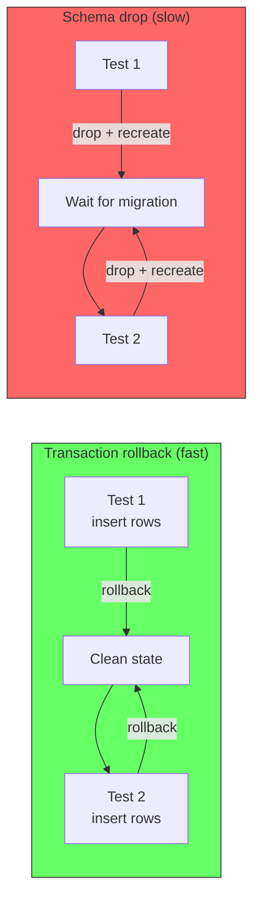

# Integration Test Rollback Pattern

Integration tests verify that your code actually persists data to the database. The standard approach is: use a real database, wrap each test in a transaction, and roll back after the test.

## What makes it an integration test

An integration test differs from a module test in one key way: the dependencies between modules are real. External infrastructure (third-party APIs, message brokers) is still stubbed, but the database is real.

```
// Module test: stub payment, in-memory or no database
payment = DummyPaymentService()
checkout = CheckoutModule(payment)

// Integration test: real payment module, real database
payment = PaymentModule(stripeAdapter, realDatabase)
checkout = CheckoutModule(payment)
```

The database must be real because that is where schema constraints, column types, transaction behavior, and query logic live. An in-memory database or a mocked repository cannot catch these bugs.

## The rollback pattern

Each test opens a transaction at the start and rolls it back at the end. No data persists between tests. No cleanup scripts needed.

```
beforeEach(() => {
  queryRunner = dataSource.createQueryRunner()
  queryRunner.startTransaction()
})

afterEach(() => {
  queryRunner.rollbackTransaction()
  queryRunner.release()
})

test("checkout creates payment transaction") {
  checkout.submitOrder(customerId, items)

  // This reads from the real database inside the transaction
  result = paymentRepo.find({ transaction: queryRunner })
  assert(result.length === 1)
}
```

The rollback is near-instantaneous because it is a database-level operation. Dropping and recreating the schema between tests takes orders of magnitude longer.



## References

This pattern is standard across every major framework:

**Spring Framework (Java/Kotlin)**
The `@Transactional` annotation on a test class causes each test to run within a transaction that is automatically rolled back after completion. This is the default behavior in Spring's TestContext framework.
> *"Annotating a test method with `@Transactional` causes the test to be run within a transaction that is, by default, automatically rolled back after completion of the test."*
> — [Spring Framework Docs: Transaction Management](https://docs.spring.io/spring-framework/reference/testing/testcontext-framework/tx.html)

**Spring @Rollback**
> *"`@Rollback` indicates whether the transaction for a transactional test method should be rolled back after the test method has completed. If `true`, the transaction is rolled back. Rollback for integration tests in the Spring TestContext Framework defaults to `true` even if `@Rollback` is not explicitly declared."*
> — [Spring Framework Docs: @Rollback](https://docs.spring.io/spring-framework/reference/testing/annotations/integration-spring/annotation-rollback.html)

**NestJS + TypeORM (Node.js)**
The NestJS community uses `QueryRunner` to wrap each test in a transaction and rollback after. This is the same pattern used in Spring, adapted for TypeORM.
> NestJS issue [#1843](https://github.com/nestjs/nest/issues/1843): *"Each test with database is never committed, all data becomes as initial after each. Some other frameworks have good practice to roll back all DB transactions inside test case after each test is finished."*

**NestJS + Prisma (Node.js)**
The `@chax-at/transactional-prisma-testing` library wraps the Prisma client in a proxy that starts a transaction before each test and rolls it back after.
> *"After each test case, we need to rollback the transaction, preventing side-effects."*
> — [transactional-prisma-testing docs](https://github.com/chax-at/transactional-prisma-testing)

**Django (Python)**
The `TestCase` class wraps each test in a transaction by default. Database changes are rolled back after each test.
> *"TestCase wraps each test in a transaction that is rolled back after the test completes."*
> — [Django Docs: TestCase](https://docs.djangoproject.com/en/stable/topics/testing/tools/#testcase)

## Summary

| | No database (module test) | Real database with rollback (integration test) |
|---|---|---|
| **Catches schema issues** | No | Yes |
| **Catches query logic bugs** | No | Yes |
| **Test speed** | Milliseconds | Milliseconds (transaction rollback) |
| **Setup complexity** | Low | Low (start transaction per test) |
| **Frameworks** | Any | Spring `@Transactional`, NestJS QueryRunner, Django TestCase, Prisma testing proxy |

The interface swap pattern handles isolation of module logic. The transaction rollback pattern handles isolation of database state. Together they make integration tests fast, reliable, and truthful.
