# The LangChain Family: LangChain, LangGraph, LangFlow, and LangSmith

They all start with "Lang" and they all build LLM applications, and on first glance they look like four competing versions of the same thing. This article explains what each one actually is, where they overlap, and how they fit together in a real system.

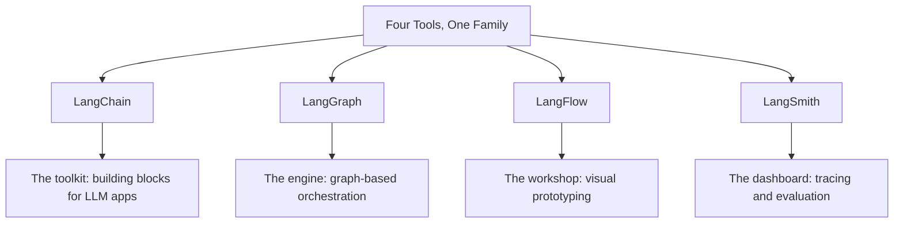

## The Problem

You want to build an application that talks to a large language model. Not a single prompt in a notebook, but a real system: it reads documents, retrieves context, calls a model, maybe calls several models, maybe loops until it gets a good answer, and then you need to know whether the answers are actually good.

As soon as you start looking for how to do this you see four tools with nearly identical names. LangChain, LangGraph, LangFlow, LangSmith. They all come from the same company, they all handle LLM applications, and they all show up in every job description. The natural reactions are confusion and then the false conclusion that you have to pick one winner.

The truth is simpler. They are not competitors. They are four layers of the same system, and real applications use most of them together. This article gives you a mental model that makes each one obvious, so you can decide per situation instead of per marketing page.

## The One-Sentence Mental Model

Think of them as the toolkit, the engine, the workshop, and the dashboard.

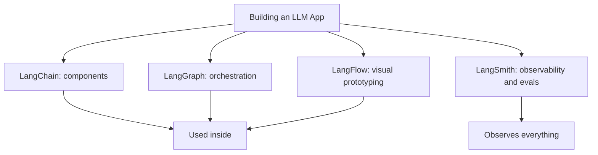

- **LangChain**: the components. Prompts, models, parsers, retrieval, memory. A toolbox of building blocks.
- **LangGraph**: the coordinator. Decides the order, and whether steps run once, in a loop, branch, or wait for a human. Built for control flow.
- **LangSmith**: the dashboard. Traces every run, stores test datasets, and evaluates whether outputs are correct.

## LangChain: The Components

LangChain started the family, and it solves the problem of writing LLM applications from scratch. Every serious LLM app needs the same handful of moving parts, and LangChain packages them so you do not rebuild them yourself.

The most useful pieces are the model API, the prompt templates, the structured output parser, the document loaders, and the retrieval chain for RAG. A model API wrapper lets you talk to OpenAI, Anthropic, and dozens of others through one interface. Prompt templates let you define a skeleton and fill in variables instead of formatting strings by hand. Output parsers turn the model text into JSON, Pydantic objects, or plain enumerations.

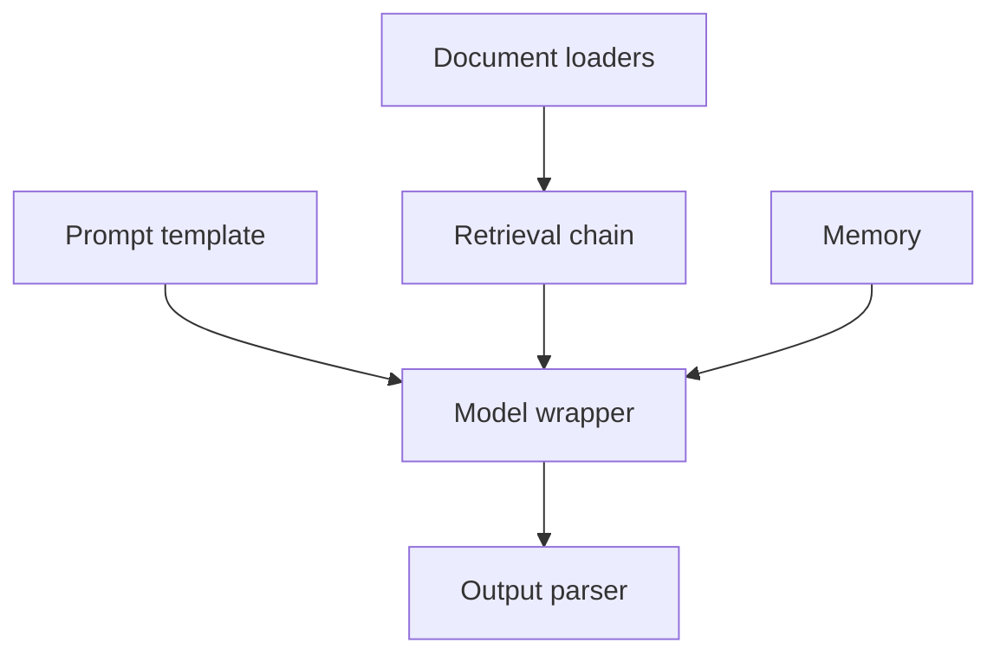

The strong point of LangChain is breadth. It has integrations for nearly everything in the LLM world, which makes it a great convenience layer. The weak point is that convenience can hide what is happening under the hood, so you should be able to explain what each component does without relying on the framework.

The honest default is this: LangChain is useful as a component library, not as a workflow runner. Grab its models, parsers, and document tooling. Do not let it dictate how your application moves between steps.

## LangGraph: The Control Flow

LangGraph exists because the world turns out not to be linear. A support question might need retrieval, then a confidence check, and if the confidence is low, a retry or a handoff to a human. That is a graph of decisions, not a straight line. LangGraph gives you nodes, edges, and shared state, which is the vocabulary you need to express that.

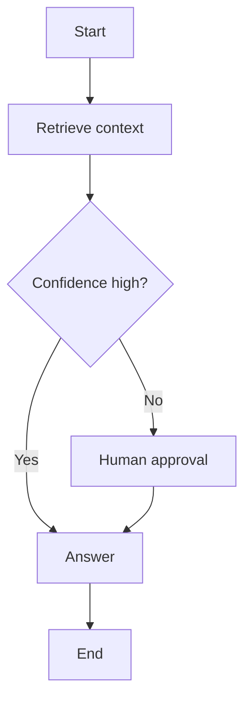

Two features make LangGraph the production choice. The first is a checkpoint system that persists state between executions, which enables two things human workflows depend on: pausing a run for approval and resuming it later, and recovering from a crash. The second is explicit support for human-in-the-loop, which in practice means the graph can stop at a node, wait for a human decision, then continue down the chosen edge.

This is the vocabulary you need to build workflow automation with human approval, so for that kind of project LangGraph is the right engine.

## One More Distinction: LangSmith Is Not All One Thing

Because LangSmith is the tool people understand least, it needs a section of its own. It does two separate jobs, and they require different habits.

The first job is tracing. Every call to a model, every retrieval, every tool use, records when it happened, how long it took, how many tokens, what went in and what came out. This is how you debug a system you cannot put a breakpoint in. The second job is evaluation. You store a set of test inputs with expected outcomes, run your application against them, and get scores that tell you whether the output quality is improving or degrading.

Both jobs matter, and they solve one underlying problem: with a traditional system you would either fall into the "everything is fine, ship it" trap or the "never trust anything" trap. Evaluation is how you escape both.

## Evaluation vs Monitoring

Two words that sound the same and are different. Monitoring tells you the system is alive. Evaluation tells you it is good.

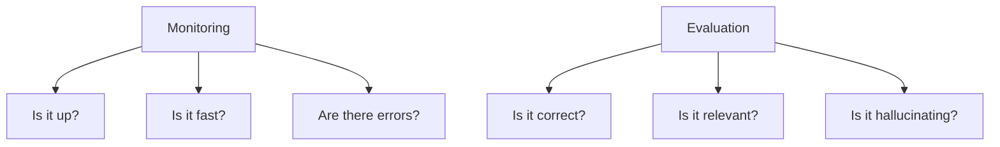

Monitoring answers operational questions. Is the service responding, how long does it take, how many errors. Evaluation answers quality questions. Is the retrieved context actually relevant, is the answer faithful to the source, is the output useful to a user.

Both matter. Monitoring without evaluation means a fast, reliable system that produces nonsense smoothly. Evaluation without monitoring means a high-quality system you cannot keep running. Production RAG needs both, and LangSmith provides both.

## How the Evaluations Work

LangSmith gives you several ways to evaluate an LLM application. They range from cheap and deterministic to expensive and judgment-based.

The first kind is the rule-based check. The output must be valid JSON, must contain a keyword, must not contain a forbidden phrase. These are cheap, fast, and run on every sample.

The second kind is the reference comparison. You have a golden answer that a human wrote. You compare the model output against it, typically with a score from another model, and you get a measure of similarity. This requires a golden dataset, which is a set of inputs with human-approved ideal outputs.

The third kind is the LLM-as-judge. You ask a strong model to grade the output of your weaker or cheaper model, using criteria you define. This is how you grade open-ended answers where no single correct output exists.

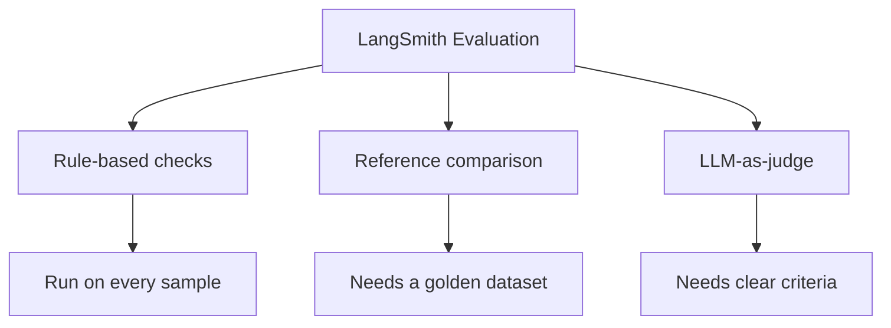

The message that matters for a builder: you cannot evaluate an LLM system the way you evaluate a function. There is no assert equals. You have to build an evaluation harness, and LangSmith is the tool that stores the test sets, runs the comparisons, and shows you the trend over time.

## LangFlow: Visual Prototyping

LangFlow is the fourth tool, and it is the one that looks most like a product rather than a library. It is a low-code visual builder where you drag and drop LangChain components onto a canvas, connect them with lines, and immediately run the flow.

The use case is prototyping and exploration. You want to try a setup before writing any Python. You want to show a stakeholder what the app does. You want to test a prompt change without editing code. LangFlow turns that process from writing code into arranging boxes.

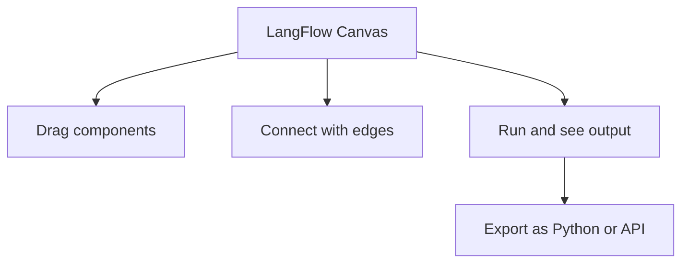

The honest framing for a serious engineer: LangFlow is a prototyping accelerator, not the production platform. It is useful when you need to move fast or when the person exploring is not a full-time engineer. Once a flow stabilizes, you implement it in code, because code is versionable, testable, and executable in production with LangGraph.

That is the whole loop in one line: prototype in LangFlow, productionize with LangGraph, keep LangChain components throughout, and watch everything in LangSmith.

## The Overlap Problem, Solved

The reason these tools feel identical is that they share the same components and the same names. A LangChain prompt is the same prompt object you see in LangFlow. A LangGraph node can be a LangChain chain. LangSmith traces LangChain runs, LangGraph steps, and LangFlow executions.

The distinction is not the pieces, it is the layer. Pieces are LangChain. Flow control is LangGraph. Visual exploration is LangFlow. Observation and evaluation is LangSmith. When you hold that model in your head, every document you read about these tools sorts itself into the right box.

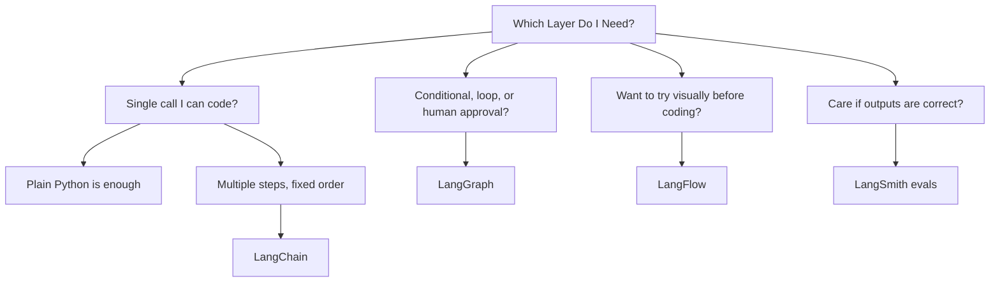

## A Practical and Important Rule

Use LangChain components freely, but do not build a long linear workflow as a LangChain chain. The chain object is a historical artifact. For anything with branches, loops, retries, or human approval, you want LangGraph, and LangGraph accepts LangChain components as nodes, so you are not choosing, you are upgrading.

There is one other rule that saves you from a common disappointment: start without any of these frameworks. A plain call to an LLM API with good prompts and clean code is the baseline. Add LangChain where it removes boilerplate, LangGraph where you need real control flow, LangSmith before you care about quality. If you adopt all four before you have a working system, the frameworks become the project and the product becomes the afterthought.

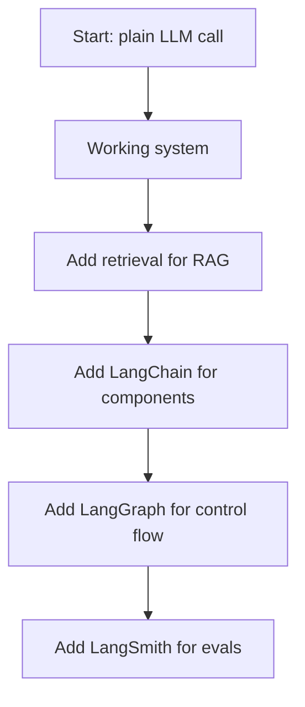

## The Four Tools Compared

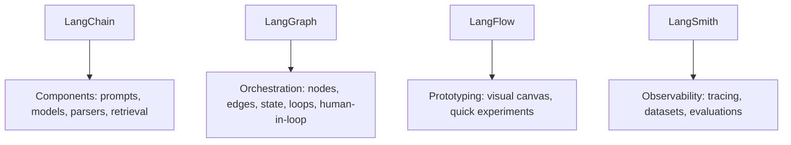

One missing name is worth mentioning. LlamaIndex is often discussed alongside LangChain. It is a separate framework from a different company that focuses heavily on data loading and retrieval pipelines. Its strength is RAG and indexing. If you are always comparing LangChain and LlamaIndex, remember you can use both, and for the highest-leverage scenarios in this article the four tools named here cover the core workflow.

## What to Build With It

Put all four together on a real world project in one paragraph: a small RAG assistant that answers questions about your own documentation.

Prototype the flow in LangFlow to see the structure quickly. Implement the production version in Python with LangChain components for loading, chunking, and retrieval, and use pgvector as the store. Wrap the flow in LangGraph because retries and a human-approval step for low-confidence answers are natural there. Instrument the whole thing with LangSmith, build a golden dataset of twenty questions with ideal answers, and use LLM-as-judge to track relevance and faithfulness on every change.

That single project touches all four tools without using any of them gratuitously, and it teaches you which tool earns its place where.

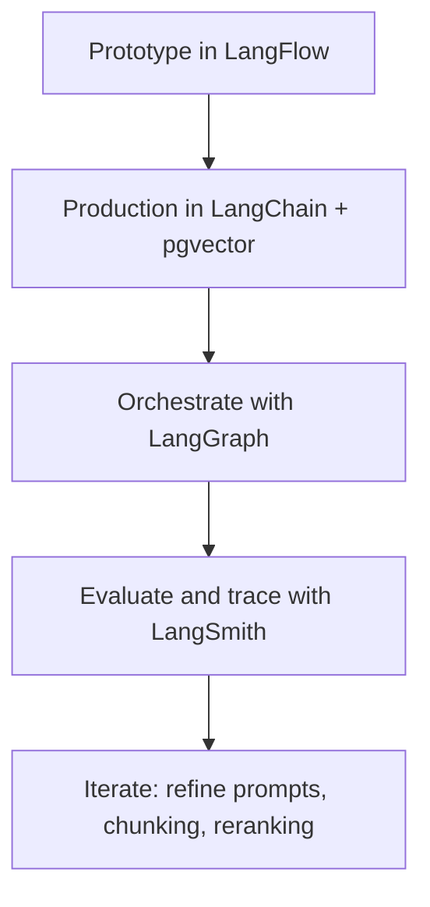

## Summary

LangChain, LangGraph, LangFlow, and LangSmith are not competing frameworks. They are four layers of one family.

LangChain is the toolkit of components. LangGraph is the engine for control flow. LangFlow is the visual prototyping workshop. LangSmith is the dashboard for tracing and evaluation.

The practical progression is: start plain, prototype visually when you need speed, productionize with LangChain and LangGraph, and add LangSmith the moment you care about correctness. With that mental model, the first glance confusion disappears, and each name becomes a place in a system you already understand.