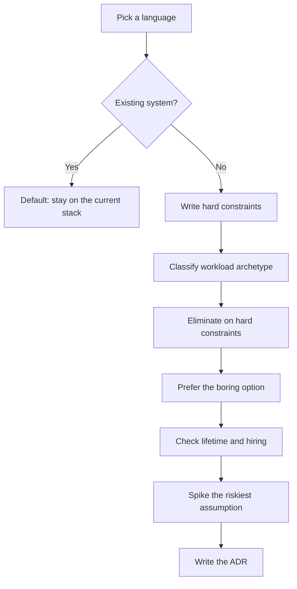

# Language Choice: How to Pick the Right Language for the Job

## TLDR

- **No language is best.** Every general-purpose language can build any backend, so "can it?" is the wrong question. The real question: which language **fails least** for this problem, team, and lifetime?
- **Decide on structure, not syntax:** runtime/memory model, concurrency model, ecosystem, hiring, and total cost. Those cannot be added later; syntax can.
- **Runtime model is the sharpest difference:** threads + GC (Java, C#), single-thread event loop (Node), goroutines (Go), GIL (Python), actor processes (Erlang/Elixir), ownership without GC (Rust).
- **Map workload to family:** I/O + glue -> Node/TS; data/ML -> Python; enterprise/long-lived -> Java/Kotlin/C#; high-concurrency network services -> Go; systems/latency/safety -> Rust/C++; fault-tolerant concurrent -> Erlang/Elixir.
- **Prefer boring technology.** Spend limited "innovation tokens" on your differentiator, not the language. Boring means the failure modes are already known.
- **Choose for 5-10 years and for who you can hire**, not the prototype. Migrations are multi-year (Twitter Ruby->JVM, Dropbox Python->Go, Discord Go->Rust).
- **Polyglot is a cost multiplier.** Add a language only at a clear boundary, with a migration plan and an owner.
- **Wrong reasons:** benchmarks, hype, "X is dead", resume-driven development, or one stack for every service.

## The only question that matters

Capability is a non-question: Node, Python, Java, Go, Rust, Erlang, and C# all expose HTTP, talk to Postgres, and serialize JSON. So "which language *can* do this?" is always "all of them".

> For this problem, on this team, with this hiring pool and lifetime, which language fails the least?

Language choice is constrained optimization over runtime model, ecosystem, people, and total cost of ownership, not a beauty contest. The differences that matter are invisible in a tutorial and surface eighteen months into production: the memory model, the concurrency model, ecosystem depth, hiring, and the runtime's performance floor.

## Decision framework (do in order)

Earlier steps are cheap and eliminate most options; later steps are expensive, so do them last.

1. **Existing or greenfield?** If existing, the default is to stay. Adding a language is its own project; a new endpoint is not a reason.
2. **Write the hard constraints first.** Numeric and testable: p99 budget, memory ceiling, deadline, required libraries/models, systems to interoperate with, compliance, and team size/skills.
3. **Classify the workload archetype** using the mapping below. This usually leaves two or three families.
4. **Eliminate anything that breaks a hard constraint.** A GC pause that can exceed p99 eliminates a GC language. A GIL that caps CPU parallelism eliminates Python for that path. A hiring pool of zero eliminates the exciting new language.
5. **Prefer the boring, already-known option.** Tie-break on team familiarity, ecosystem fit, and operational maturity, not elegance.
6. **Check lifetime and hiring.** Assume five to ten years and maintainers who are not the original author.
7. **Spike the single riskiest assumption.** If the decision hinges on a p99 number, prototype and measure it. A two-day spike beats a two-year mistake.
8. **Write an ADR.** Record problem, constraints, options, choice, and the accepted trade-off.

## Runtime models at a glance

This is where most "the language is slow/unpredictable" complaints come from. The model sets the performance floor and the characteristic failure mode.

| Model | Languages | Unit of concurrency | Memory | Failure mode |
| --- | --- | --- | --- | --- |
| OS threads + GC | Java, C# | OS thread | GC | GC pauses; memory per thread |
| Event loop | Node.js | callback | GC | one blocking call stalls everything |
| M:N goroutines | Go | goroutine | GC | GC pauses; simple type system |
| GIL | Python | thread (one at a time) | refcount + GC | no CPU parallelism in threads |
| Actor processes | Erlang, Elixir | isolated process | per-process GC | message-passing overhead |
| Ownership, no GC | Rust | thread | none | compile-time learning curve |

## Workload -> language (cheat sheet)

| Workload archetype | Primary pick | Alternatives | Why it fits | Main cost |
| --- | --- | --- | --- | --- |
| I/O-bound web, API, glue, real-time | Node / TypeScript | Go, Java, Elixir | Event loop; one language front to back | CPU work blocks the loop |
| Data, ML, scripting, automation | Python | R, Julia, JVM for big data | The ecosystem is the product | Slow execution; GIL; packaging |
| Enterprise, transactional, long-lived, large team | Java / Kotlin, C# | Go, TypeScript | JVM/.NET maturity, tooling, hiring | Footprint, startup, ceremony |
| High-concurrency network services, cloud infra | Go | Rust, Java, Elixir | Goroutines, fast builds, single binary | GC, simple type system |
| Systems, latency-critical, memory safety | Rust | C++, Go | No GC, predictable, compile-time safety | Learning curve, compile times |
| Fault-tolerant concurrent distributed | Erlang / Elixir | Go, Akka on JVM | Actors, supervision, let it crash | Niche hiring, lower throughput |

## Languages at a glance

Each language exists to solve a specific problem. That origin explains when to use it.

| Language | Built to solve | Pick when | Avoid when |
| --- | --- | --- | --- |
| **Node / TypeScript** | Many concurrent connections without a thread each (Dahl, 2009; V8 event loop) | I/O-bound services; TS-first team; full-stack type sharing | CPU-bound work, unless offloaded to workers/processes |
| **Python** | Readable, fast-to-write code; now the data/ML interface (NumPy, pandas, PyTorch) | The ecosystem is the product (ML/data) or the work is scripts | High-concurrency, low-latency services (GIL, interpreter overhead) |
| **Java / Kotlin / C#** | "Write once, run anywhere" (JVM, 1995) plus enterprise tooling and hiring | Transactional, long-lived systems on large teams | Tiny services where startup and footprint dominate |
| **Go** | Large-scale software engineering at Google (Pike; slow builds, huge codebases) | Many concurrent connections; simple, fast-building, single-binary deploys | You need zero-GC latency or the strongest type system |
| **Rust / C++** | Systems control; Rust removes memory-safety bugs without a GC (Chromium: ~70% of serious bugs are memory-safety) | p99 latency, memory, or safety-critical correctness | CRUD where p99 is dominated by the database |
| **Erlang / Elixir** | Telecom switches: no downtime, failing hardware (Armstrong; supervisors, let it crash) | Concurrency, fault tolerance, distribution (messaging, presence, IoT) | Raw compute throughput or broad general-purpose libraries |

## Field notes (the evidence)

- **Discord, Go -> Rust (2020):** the hot "Read States" Go service spiked roughly every two minutes because of the GC. Rust matched Go's latency without spikes, then beat it on latency, CPU, and memory. The lesson: the memory model, not syntax, was the problem. Discord also warned: do not rewrite everything in Rust just because.
- **Migrations are expensive.** Twitter moved from Ruby on Rails to the JVM/Scala; Dropbox migrated large parts of its infrastructure from Python to Go. Each was driven by a specific constraint and each took years. Choose for the life of the system, not the prototype.
- **Boring wins (McKinley, *Choose Boring Technology*).** New technology carries *unknown unknowns*; boring technology has only *known unknowns*. Before adding a language, write down exactly what makes the current stack prohibitive, and first try to solve it without adding anything.
- **Watch your bias (Graham, *Beating the Averages*).** The Blub paradox: programmers judge languages relative to the one they think in. You are biased toward what you know. Name it before you decide.

## Polyglot rules

1. **One new language at a time**, only for a constraint the current stack genuinely cannot meet.
2. **Draw a boundary.** It owns a service, directory, or pipeline stage with a clear interface.
3. **Commit to migrate or retire** the overlapping old code, with a timeline.
4. **Assign an owner** for build, deploy, observability, and security.
5. **Count the hire-ability.** If you cannot hire or train for it, the bus factor is one.

## Scorecard

Agree on weights before scoring, or the language you like wins. Score candidates 1-5.

| Criterion | Weight | What it captures |
| --- | --- | --- |
| Team familiarity | 20% | Time to first correct commit; onboarding |
| Hiring pool | 15% | Supply and salary pressure |
| Ecosystem fit | 15% | The specific libraries or models needed |
| Runtime fit | 15% | GC, concurrency, startup, footprint vs budgets |
| Operational maturity | 10% | Deploy, observe, profile, incident knowledge |
| Type safety | 10% | Compiler catches bugs; refactor confidence |
| Performance envelope | 10% | Throughput, tail latency, memory, cold start |
| Lifetime | 5% | Momentum, LTS policy, migration difficulty |

## Worked examples

- **API gateway (p99 < 20 ms, 30k rps, TS-first team, 8 weeks).** I/O-bound, so Node fits both. Flips to Go if a spike shows p99 is dominated by CPU work (TLS, JWT, transforms). The binding constraint decides, not reputation.
- **Billing / ledger (strong consistency, audit, large team, decade lifetime).** JVM home turf: mature transactional libraries, tooling, hiring. Node or Rust add risk for no gain.
- **Edge proxy / on-device agent (predictable p99, low memory, no GC).** Rust: no GC, low footprint, safe parsing of untrusted input. Go is the cheaper choice if "good enough" latency is acceptable.
- **ML inference service (model only in Python, moderate throughput).** Python is the interface the ecosystem assumes. If serving becomes the constraint, keep training in Python and move the serving path to Go/Rust, with a clear boundary.

## Anti-patterns

- **Resume-driven development**, then paying for it in operations and hiring.
- **Picking on benchmarks** that measure the router, not the database.
- **"Language X is dead."** Long tails, live ecosystems, and hiring pools matter more than hype.
- **One language for every service** when workloads genuinely differ.
- **Ignoring the hiring pool.** A language you cannot hire for has a bus factor of one.
- **Rewriting a working system for purity.** The rewrite must buy something specific and measurable.
- **Forgetting operations.** You are choosing what you will monitor, deploy, and page on for years.

## Final rule

Choose the language whose **failure modes** you can live with, whose ecosystem solves your actual problem, and whose people you can hire and keep. The runtime sets the floor, the ecosystem sets the ceiling, and the team decides whether it survives production. Everything else is syntax, and syntax is cheap to learn.

## Sources

- Dan McKinley, [Choose Boring Technology](https://mcfunley.com/choose-boring-technology) (2015).
- Rob Pike, [Go at Google: Language Design in the Service of Software Engineering](https://go.dev/talks/2012/splash.article) (2012).
- Jesse Howarth (Discord), [Why Discord is switching from Go to Rust](https://discord.com/blog/why-discord-is-switching-from-go-to-rust) (2020).
- Paul Graham, [Beating the Averages](https://www.paulgraham.com/avg.html) (2001, rev. 2003).
- [PEP 703: Making the Global Interpreter Lock Optional in CPython](https://peps.python.org/pep-0703/) and [Python free threading](https://docs.python.org/3/howto/free-threading-python.html).
- [Node.js: About](https://nodejs.org/en/about) and Dan Kegel, [The C10K problem](http://www.kegel.com/c10k.html) (1999).
- [Chromium Security: Memory safety](https://www.chromium.org/Home/chromium-security/memory-safety/) and [Memory Safe Languages in Android 13](https://security.googleblog.com/2022/12/memory-safe-languages-in-android.html).
- Frederick P. Brooks, [No Silver Bullet](http://worrydream.com/refs/Brooks-NoSilverBullet.pdf) (1986); Richard P. Gabriel, [The Rise of Worse is Better](https://dreamsongs.com/RiseOfWorseIsBetter.html).
- Joe Armstrong, [Making reliable distributed systems in the presence of software errors](https://erlang.org/download/armstrong_thesis_2003.pdf) (2003).
- [Twitter on Scala](https://www.artima.com/articles/twitter-on-scala) (2009); Dropbox, [Open Sourcing Our Go Libraries](https://dropbox.tech/infrastructure/open-sourcing-our-go-libraries) (2013).
