# Engineering Leadership: Training Teams and Giving Direction

## The problem: good engineers make bad leaders

The best frontend engineer gets promoted to tech lead. Six months later the team is lost, morale is down, and the engineer wants to go back to writing code.

This happens because leadership is a separate skill from engineering. Writing clean code does not teach you how to give direction, train juniors, or navigate organizational ambiguity. The skills that got you promoted are not the skills you need in the new role.

The problem has three dimensions:

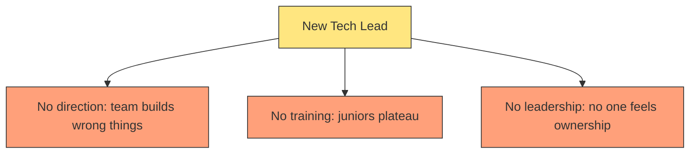

This article covers all three. Each section is a pattern you can apply starting tomorrow.

---

## Part 1: Giving Direction

Direction is the answer to "what should I work on and why?" Without it, engineers make locally optimal decisions that conflict globally.

### The North Star principle

Every project needs a visible destination. A North Star is a short sentence that anyone on the team can repeat:

- "Make the checkout flow complete in under 3 seconds"
- "Reduce PagerDuty alerts to zero for two consecutive weeks"
- "Ship the export feature without breaking existing reports"

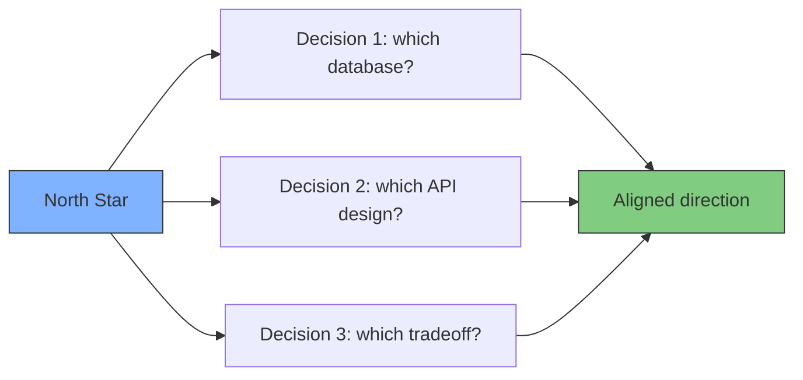

Without a North Star, three engineers will make three different choices. Each is correct locally, but the system becomes incoherent.

**Example:** A team building a reporting feature had no North Star. One engineer optimized for real-time data (chose streaming), another for historical accuracy (chose batch), a third for flexibility (chose a generic query engine). Six months later nothing shipped. The North Star "Ship the export feature without breaking existing reports" made the choice obvious: batch, because exports are point-in-time snapshots.

### Write decisions down

Direction does not stick if it lives in someone's head. Write down every decision and why you made it.

**Architecture Decision Records (ADRs):** A one-page document for each significant decision:

```markdown
# ADR-007: Use Postgres instead of DynamoDB for order storage

## Context
Orders need transactional updates across items, payments, and shipments.
The team evaluated DynamoDB for scale but found transactional support
limited.

## Decision
Use Postgres with read replicas for scale.

## Consequences
+ Strong transactional guarantees
+ Familiar to the team
- Need to manage read replicas
- Need to plan for connection pooling at scale
```

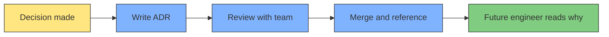

The act of writing forces clarity. "I'll explain it to you" becomes "I'll write it down so everyone can read it." ADRs also prevent the same debate from happening every six months — the next person reads why Postgres was chosen instead of reopening the discussion.

### Create clarity from ambiguity

Most of a tech lead's job is absorbing ambiguity and producing clarity. Stakeholders say "we need a better search." The team cannot build "better." They need specifics.

The pattern:

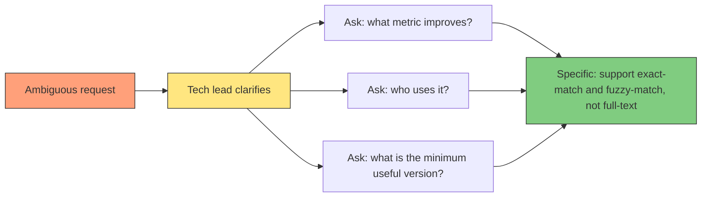

**Example:** A product manager says "we need real-time notifications." Instead of handing this to the team, you ask: "real-time meaning push notifications, in-app polling, or WebSockets? Support which platforms? What is the latency target?" The PM says "push notifications on mobile within 30 seconds." Now the team has something to estimate.

### Say no

Part of giving direction is stopping wrong work before it starts. Saying no is a skill.

Good ways to say no:

| Situation | How to say it |
|---|---|
| Feature does not align with North Star | "That helps X, but our North Star is Y. Let's revisit next quarter." |
| Too early to decide | "We do not have enough data yet. Let's run an experiment first." |
| Too expensive for the value | "That would cost 3 months. The expected gain is 5% conversion. Is there a cheaper 3% gain?" |
| Good idea, wrong time | "That is a good idea. Let's put it in the backlog and revisit after the current sprint." |

**Example:** A stakeholder asks for a dashboard with every possible metric. You say: "We can build a dashboard with 50 metrics in 2 months, or we can build one with the top 5 metrics in 1 week. Let's start with 5 and see what you actually use." The stakeholder agrees. Two weeks later they realize they only need 3.

---

## Part 2: Training the Team

Training is not about holding classes. It is about embedding learning into the daily workflow so every interaction teaches something.

### Code reviews as teaching

Code review is the highest-leverage teaching moment in engineering. Every review comment is a lesson. But most reviewers write:

```
This should use a factory pattern.
```

That teaches nothing. The engineer knows what you want but not why. A teaching review comment looks like:

```
This works, but think about what happens when we add a third payment provider.
The current approach would need another if/else branch.
A factory pattern would let us add providers without touching this file.
Want to pair on it?
```

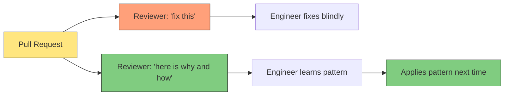

Rules for teaching reviews:

- **Explain the why, not just the what.** "Extract this into a function because it is tested separately" not "extract this."
- **Link to documentation.** If the concept is big (e.g., idempotency), link to an ADR or an article instead of explaining it in a comment.
- **Ask questions instead of giving answers.** "What happens if this input is null?" teaches defensive coding. "Add a null check" teaches compliance.
- **Celebrate good patterns.** "Nice use of the strategy pattern here. This will be easy to extend." Positive reinforcement is training too.

### Pair programming

Pairing is the fastest way to transfer context. A junior watching a senior debug is worth ten readme files.

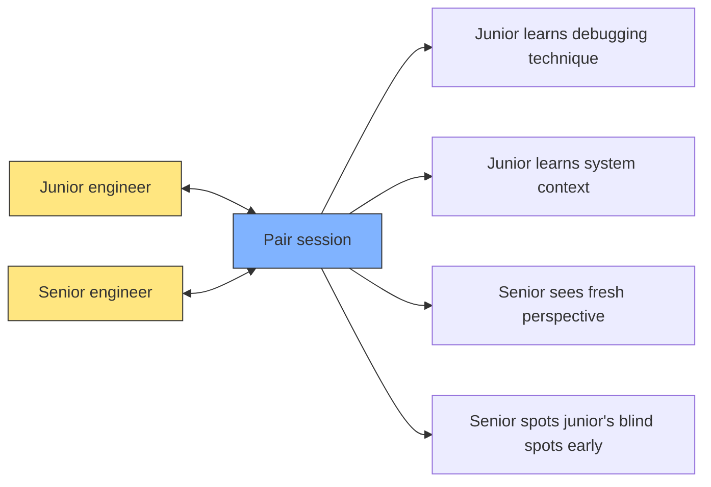

Three pairing patterns:

| Pattern | How it works | When to use |
|---|---|---|
| Driver-navigator | One types, one directs. Switch every 15 minutes. | Complex features, new tech |
| Ping-pong | One writes test, other makes it pass. Switch. | TDD, learning testing |
| Tour guide | Senior shows a part of the system, explains it. | Onboarding, system overview |

**Example:** A junior is struggling with database migrations. You pair for 30 minutes: you drive, they navigate. You explain why you write `up` and `down` migrations, why you use timestamps, and how to handle a failed migration. The junior runs the next migration alone. Two weeks later they fix a migration issue without help.

### Knowledge sharing sessions

Not everyone learns by reading. Some learn by listening and discussing. Regular knowledge sharing sessions catch the people who skip documentation.

Formats that work:

- **Lunch and learn:** One engineer presents a topic for 20 minutes. Low pressure, food helps attendance.
- **Architecture review:** Someone presents a design document. The team asks questions. The presenter learns from the critique.
- **Incident review:** Walk through a recent production issue. What happened? What did we learn? What will we change?
- **Show-and-tell:** Someone demonstrates something they built. The team sees what others are working on.

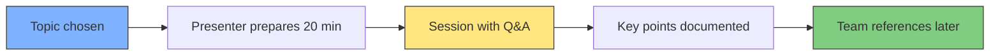

**Example:** A team adopts a new testing strategy. One engineer prepares a 20-minute session showing how they migrated a module from integration tests to module tests. They show before and after code, the test speed improvement (from 45 seconds to 2 seconds), and a template others can copy. Three other engineers adopt the pattern the same week.

### Written documentation culture

Not everything should be a session. Written documentation scales.

The rule: **write it down once, reference it forever.** Every session produces a document. Every decision produces an ADR. Every incident produces a postmortem.

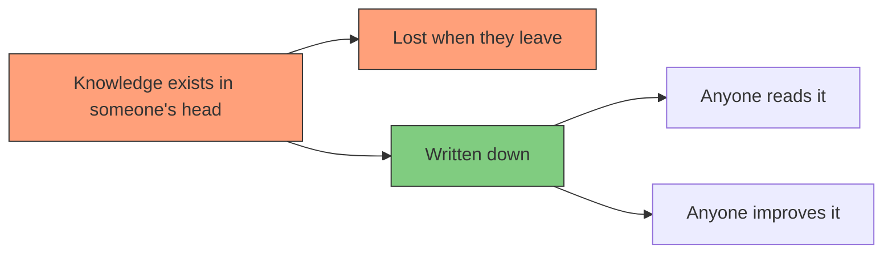

Encourage documentation by:

- **Leading by example.** You write docs first. The team follows.
- **Making it easy.** A docs directory, a template, a review process.
- **Rewarding it.** In retrospectives, highlight who wrote useful docs. In performance reviews, documentation is part of impact.
- **Not over-engineering it.** Markdown files in the repo beat a wiki that nobody maintains.

**Example:** The team has a 30-minute production issue. After fixing it, the senior writes a 5-minute postmortem: what happened, how it was fixed, what prevents it. Next time someone sees the same symptom, they search for it and find the postmortem. The fix takes 2 minutes instead of 30.

### Create safe spaces for questions

The biggest blocker to learning is fear. Juniors are afraid to ask questions because they do not want to look stupid. You fix this by making asking the norm.

Ways to create safety:

- **Ask questions yourself.** "I do not know how this caching layer works. Can someone explain it?" When the senior asks, the junior feels safe asking.
- **Praise questions.** "That is a great question. I had the same one when I first saw this code."
- **Never penalize not knowing.** "You should know this" is not allowed. "Let me show you" is the only response.
- **Have a #no-dumb-questions channel.** (But actually make it a safe space, not just a name.)

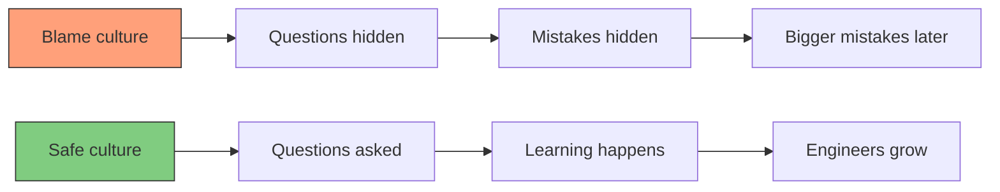

**Example:** A junior deploys a change that causes a minor outage. In a blame culture, they hide it and fix it silently, learning nothing and feeling guilty. In a safe culture, they say "I broke something, I need help." The team helps, the outage is fixed in 5 minutes, and the junior learns exactly what went wrong and never repeats it.

---

## Part 3: Leadership Without Authority

You do not need a manager title to lead. Leadership is influencing outcomes without controlling people.

### Leading by example

The team watches what you do more than what you say. If you skip tests, the team skips tests. If you write docs, the team writes docs. If you ship messy code and promise to clean it up later, everyone does the same.

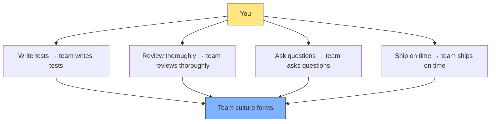

**Example:** The team has a habit of merging PRs without running tests locally. Instead of writing a rule, you start commenting "Ran locally, tests pass" on every PR you merge. Within two weeks, others start doing the same. The habit changes without a single policy.

### Delegating responsibility

You cannot train a team if you do everything yourself. Delegation is not dumping work — it is giving someone a problem and letting them solve it with support.

How to delegate well:

| Step | What to do |
|---|---|
| Choose the person | Match the task to their growth goal, not their current skill |
| Define success | "Implement the export endpoint. It should handle 1000 records, return a CSV, and not block other requests." |
| Set boundaries | "You own the implementation. I own the API contract review and the deployment." |
| Give support | "I am available for questions. Ping me if you get stuck." |
| Let them fail small | If they make a mistake, help them fix it. Do not take over. |

```mermaid
graph LR
    TASK["Task"] --> DELEGATE["Delegate to engineer"]
    DELEGATE --> OWN["They own it"]
    OWN --> MISTAKE["They make mistake"]
    MISTAKE --> COACH["You coach, not rescue"]
    COACH --> LEARN["They learn"]
    LEARN --> CONFIDENCE["They gain confidence"]
    CONFIDENCE --> MORE["You delegate more"]
    style TASK fill:#80b3ff,stroke:#333
    style COACH fill:#ffe680,stroke:#333
    style CONFIDENCE fill:#80cc80,stroke:#333
```

**Example:** A junior wants to learn about performance optimization. You delegate: "We have a slow endpoint. Find out why, propose a fix, and implement it. I will review and help deploy." The junior spends two days profiling the database query, finds the missing index, adds it, and the endpoint is 10x faster. They learned more from that than from a month of reading.

### Giving credit

Leadership is not about your output. It is about the team's output. When something goes well, point at the person who did it.

When something goes wrong, point at the process, not the person. Take responsibility for team failures: "I should have caught that in review" not "they should have known better."

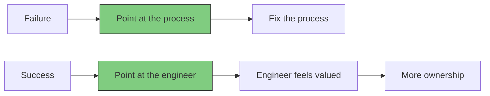

**Example:** The team ships a major feature. In the company meeting, you say "Sarah designed the data model, John built the API, and Maria handled the frontend. I just reviewed their work." Sarah, John, and Maria feel recognized. Next time they volunteer for hard work.

### Receiving feedback

You cannot lead if you are unreachable. Junior engineers will not challenge you publicly. You need to create private channels where they can tell you that you are wrong.

Pattern: **the ask for feedback, don't wait for it.**

"You are doing great" is not useful. Instead:

- "What is one thing I should start doing?"
- "What is one thing I should stop doing?"
- "What was unclear about my direction this sprint?"

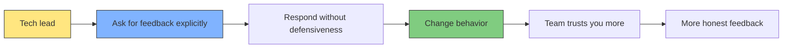

**Example:** A junior tells you (quietly) that your design documents are too long and they stop reading halfway. Instead of defending, you say "that is helpful. I will keep the next one under one page and include a summary section." You do. The junior reads it and catches a design flaw before implementation starts. The feedback loop pays for itself.

---

## Part 4: Practical tools and ceremonies

### Tech lead responsibilities

A tech lead is accountable for:

| Area | What it means |
|---|---|
| Technical direction | The team builds the right thing the right way |
| Code quality | Review standards, testing practices, architecture |
| Team health | Morale, learning, psychological safety |
| Stakeholder communication | Translating between business and engineering |
| Delivery | Helping the team estimate, prioritize, and ship |

Not a checklist — a mindset. Every day you ask: "did I move the team forward today?"

### Running design documents

Design documents (RFCs) are the primary tool for technical direction. A good design process:

1. **Write:** Author writes a one-page proposal
2. **Review:** Team reads and comments asynchronously
3. **Meet:** 30-minute discussion for unresolved questions
4. **Decide:** Author makes the final call and publishes the ADR

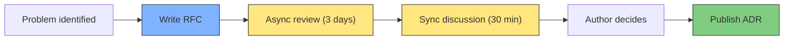

**Example:** An engineer proposes switching from REST to GraphQL. The RFC is two pages: motivation (frontend needs flexible queries), tradeoffs (caching harder, learning curve), and migration plan. The team discusses it for 30 minutes. They decide to use GraphQL for the new feature only, keeping REST for existing APIs. The ADR captures the decision.

### Running retrospectives

Retrospectives are the team's chance to improve the process. A good retro follows this structure:

| Phase | Time | Activity |
|---|---|---|
| Set the stage | 5 min | "What are we improving today?" |
| Gather data | 10 min | Everyone writes what went well and what did not |
| Generate insights | 10 min | Group themes, pick top 1-2 |
| Decide actions | 10 min | Commit to one change for next sprint |
| Close | 5 min | "What did we learn from this retro?" |

The key rule: **every retro produces exactly one action item.** Not five. One. The team commits to changing one thing. Next retro, they check if it worked.

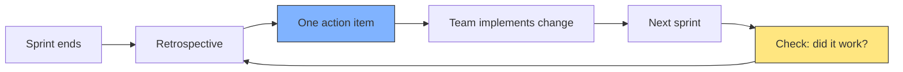

**Example:** The team identifies that PRs take too long to review. The action item: "No PR sits unreviewed for more than 4 hours. Pair assignments for reviews so there is always someone responsible." Next sprint, review time drops from 24 hours to 3 hours. The team keeps the rule.

### 1:1s

One-on-ones are not status updates. Status updates belong in Slack. 1:1s are for:

- Career growth: "What do you want to learn next?"
- Blockers: "What is slowing you down?"
- Feedback: "How am I doing as your lead?"
- Personal: "How are you feeling about work?"

Structure of a good 1:1:

```
What has gone well since we last talked?
What has not gone well?
What will you work on next?
How can I help?
```

30 minutes. Once a week or once every two weeks. The engineer talks 80% of the time.

### Creating growth plans

Every engineer should know what they need to do to reach the next level. You help them by being explicit:

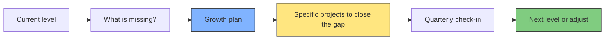

**Example:** A mid-level engineer wants to reach senior. You identify the gap: they write solid code but do not influence the team's direction. The growth plan: "Lead the next design document. Propose it, write it, present it. I will coach you through the process." They do it. The design is good. They learn that their opinions matter. Six months later they are leading designs independently.

---

## Summary: The leadership habits

| Habit | Frequency | Impact |
|---|---|---|
| Write decisions down (ADRs) | Per decision | Direction sticks, debates stop repeating |
| Review with teaching | Daily | Team learns from every PR |
| Pair on hard problems | Weekly | Context transfers fast |
| Run retro with one action | Per sprint | Team improves continuously |
| Ask for feedback explicitly | Monthly | Team trusts you |
| Document everything | Continuous | Knowledge survives |
| Delegate with support | Per task | Engineers grow |
| Say no with reasons | Weekly | Direction stays clear |
| Lead by example | Daily | Culture forms without policy |

The measure of leadership is not what you build. It is what the team builds after you step away.
