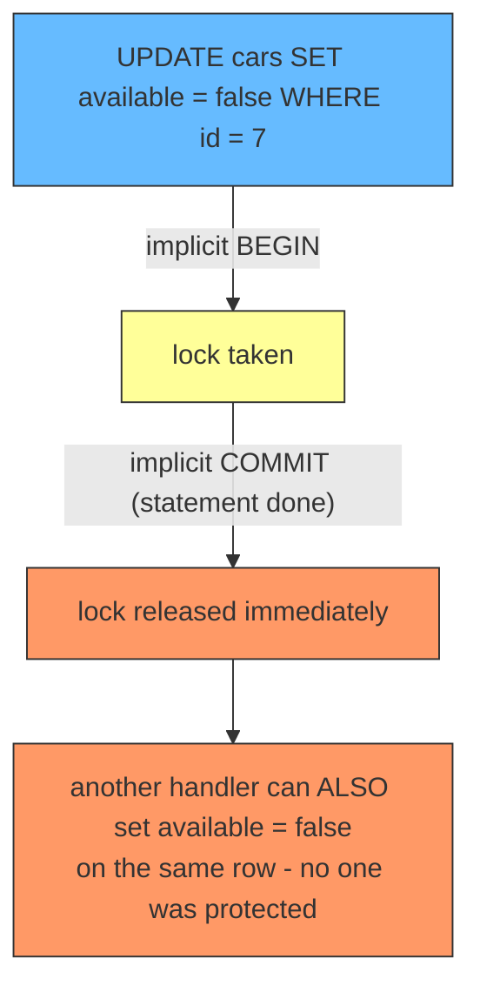
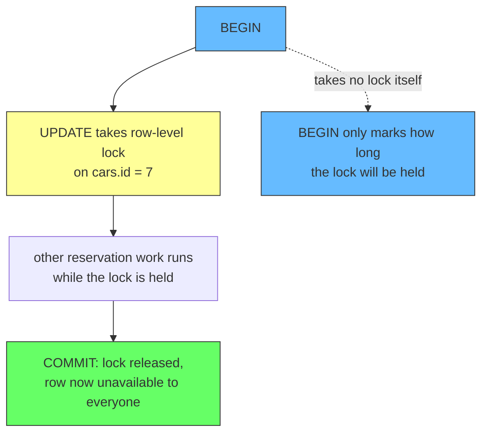
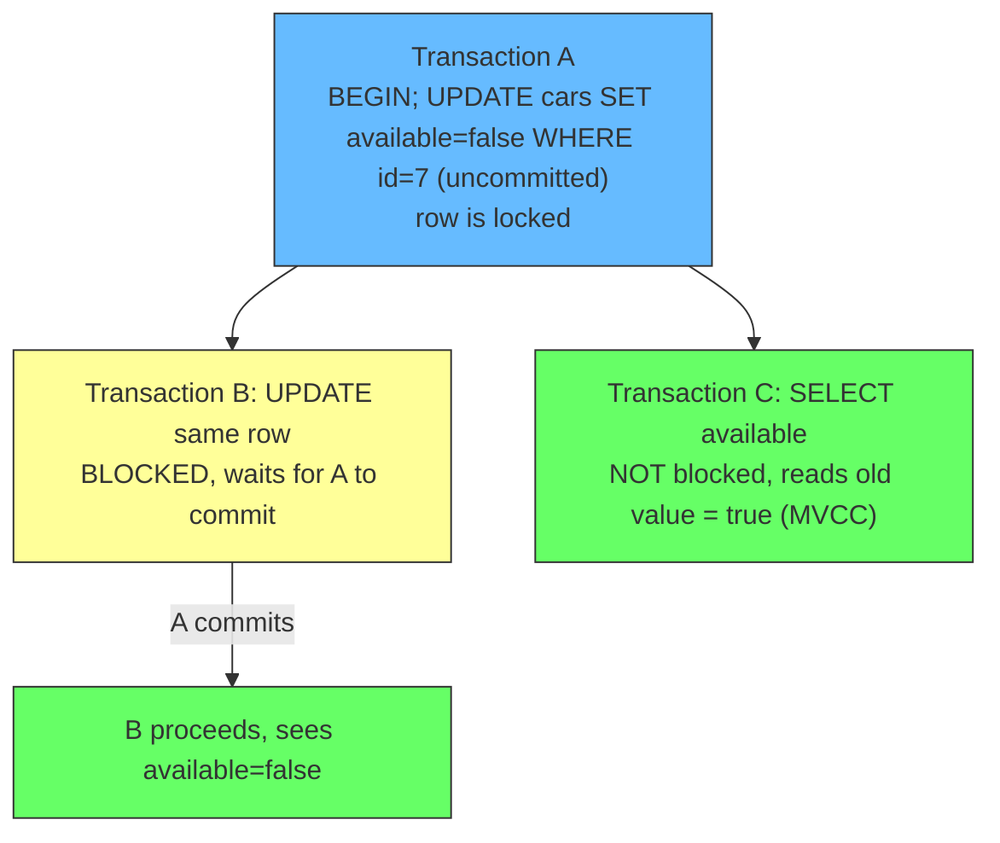
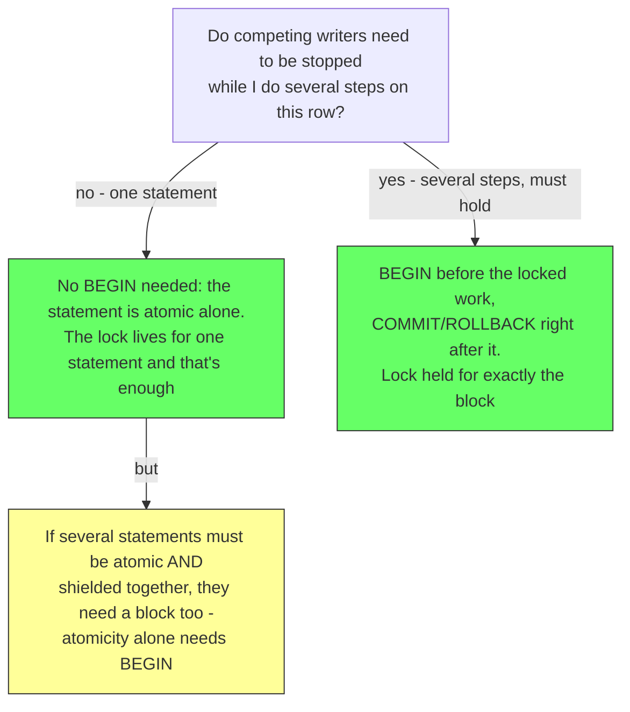

# Locks Only Live as Long as Your Transaction: What BEGIN Really Does

## TLDR

- **The problem:** developers often assume a lock protects a row just because they wrote `UPDATE`. It does not. A row lock exists only from the statement that takes it until the transaction ends. The instant your transaction commits or rolls back, every lock it held is gone.
- **`BEGIN` takes no locks.** It starts a transaction block: the unit of all-or-nothing work. Its real job for locking is to **extend the lifetime of the locks taken inside it**, from "one statement" to "until commit or rollback."
- **The statement takes the lock, not `BEGIN`.** `UPDATE`, `DELETE`, `INSERT`, and `SELECT ... FOR UPDATE` acquire row-level locks automatically. Locks are held until the end of the transaction ([PostgreSQL, Explicit Locking](https://www.postgresql.org/docs/current/explicit-locking.html)).
- **Without `BEGIN`, a lock lives for microseconds.** PostgreSQL wraps every individual statement in an implicit transaction. In that mode the `UPDATE` commits immediately, so the lock it took is released instantly - useless for a reservation "hold."
- **Row locks do not block readers.** They block only other writers and lockers of the same row. A plain `SELECT` still reads the old committed version (MVCC), so "locked" does not mean "unreadable" ([PostgreSQL, Explicit Locking - Row-Level Locks](https://www.postgresql.org/docs/current/explicit-locking.html)).
- **The rule to remember: lock duration equals transaction duration.** To hold a row against other writers while you do more work, put the lock inside a transaction block and don't commit yet. To let writers through as fast as possible, commit as soon as the locked work is done.
- **The three-tier duration matrix:** a bare `UPDATE` (autocommit) holds locks only for that one statement; the same `UPDATE` inside `BEGIN ... COMMIT` holds them until the transaction ends; and inside a prepare flow (`PREPARE TRANSACTION 'gid'` ... `COMMIT PREPARED`/`ROLLBACK PREPARED`) the locks are held across the prepared window until the transaction's fate is decided — see [Distributed Transactions](./distributed-transactions.md) for why that third tier is what makes 2PC block.

## The problem: the lock you expected was never there

Consider a reservation service. A customer wants to book car 7 for a weekend. The handler runs this "reservation":

```sql
UPDATE cars SET available = false WHERE id = 7;
```

The developer's mental model: "the car row is now marked unavailable, so nobody else can book it." That is false in a subtle way. Let another customer try to book car 7 at almost the same moment, and both handlers can pass that statement before either marks the row, because **neither statement's lock outlives the statement itself**.

Here is the hidden detail: PostgreSQL treats every SQL statement as executing inside its own transaction. If you do not issue `BEGIN`, each statement gets an implicit `BEGIN ... COMMIT` wrapped around it. That means the `UPDATE` above commits the moment it finishes, and its row lock is released at that same instant ([PostgreSQL, Transactions](https://www.postgresql.org/docs/current/tutorial-transactions.html)). The lock existed for the duration of one statement and protected nothing.

The problem this article exists to fix: **most developers do not know that the lock only lives as long as the transaction, and that without a transaction block a lock is released immediately.** Which turns the naive reservation into a race condition.

<div style={{display: 'flex', justifyContent: 'center'}}>



</div>

## Three things that are true, and what each does

### 1. `BEGIN` does not take locks - it extends the life of locks

`BEGIN` starts a transaction block. The essential point of a transaction is that it bundles multiple steps into a single, all-or-nothing operation: the intermediate states between the steps are not visible to other concurrent transactions, and if a failure occurs, none of the steps affect the database at all ([PostgreSQL, Transactions](https://www.postgresql.org/docs/current/tutorial-transactions.html)).

For locking, the consequence is the important part. From the PostgreSQL docs on locking: "Once acquired, a lock is normally held until the end of the transaction" ([PostgreSQL, Explicit Locking](https://www.postgresql.org/docs/current/explicit-locking.html)). So `BEGIN` determines *how long* the locks taken inside the block will last. It is the clock, not the lock.

```sql
BEGIN;                                         -- start the block: locks will last until...
UPDATE cars SET available = false WHERE id = 7; -- row lock taken here
-- ... whatever other work this reservation needs ...
COMMIT;                                        -- ... here: lock is now released
```

<div style={{display: 'flex', justifyContent: 'center'}}>



</div>

### 2. The statement takes the lock - you cannot opt out

`UPDATE`, `DELETE`, `INSERT`, and `MERGE` acquire a ROW EXCLUSIVE table lock on the target table, and row-level locks on the rows they touch. `SELECT ... FOR UPDATE` also locks the rows it returns. Every one of these is automatic; there is no switch to turn it off, and there is usually no good reason to want to ([PostgreSQL, Explicit Locking](https://www.postgresql.org/docs/current/explicit-locking.html)).

The design goal of all these modes (UPDATE, DELETE, SELECT FOR UPDATE, FOR NO KEY UPDATE, FOR SHARE, FOR KEY SHARE) is one thing: **block other writers and lockers of the same row until the transaction ends**. They are different strengths of that same guarantee, from the weakest (FOR KEY SHARE, only rejects key changes and deletes) to the strongest (FOR UPDATE, also rejects re-locking).

This is why the reservation works once you wrap it in a block:

```sql
BEGIN;
UPDATE cars SET available = false WHERE id = 7;
-- Now a competing handler's "UPDATE cars SET available = false WHERE id = 7"
-- will WAIT on this row lock instead of racing through.
COMMIT;
```

### 3. Row locks do not block readers - only writers and lockers

The most counterintuitive piece. From the docs: "Row-level locks do not affect data querying; they block only writers and lockers to the same row" ([PostgreSQL, Explicit Locking - Row-Level Locks](https://www.postgresql.org/docs/current/explicit-locking.html)).

If transaction A has locked car 7 (but not committed), a plain `SELECT available FROM cars WHERE id = 7` does **not** wait. Thanks to MVCC, the reader sees the old committed version, still `available = true`. The "hold" is invisible to simple reads. It only stops other transactions that try to `UPDATE`, `DELETE`, or lock that same row.

<div style={{display: 'flex', justifyContent: 'center'}}>



</div>

This matters operationally: a row being "held" for a reservation costs you nothing in read throughput. Only the writes queue up. And it matters for correctness: if you need the *read* to also see the latest state (or block), you must use `SELECT ... FOR UPDATE`, not a plain `SELECT`.

## The model that makes it all click

The entire article collapses into one sentence:

> **Lock duration equals transaction duration. Locks are taken by statements and released when the transaction ends.**

From that single rule, everything follows:

- Without `BEGIN`, each statement is its own transaction, so its locks live for one statement. Instant release. Useless for holding anything.
- With `BEGIN`, locks live until that transaction's `COMMIT` or `ROLLBACK`. Now you can deliberately hold a row while doing other work: the reservation "hold", a "read state, decide, then write" flow, or a short critical section.
- Lock contention is therefore controlled by *transaction length*. The longer any transaction runs, the longer everything behind its locks waits. The PostgreSQL docs warn explicitly: "it is a bad idea for applications to hold transactions open for long periods of time (e.g., while waiting for user input)" ([PostgreSQL, Explicit Locking - Deadlocks](https://www.postgresql.org/docs/current/explicit-locking.html)).

So the mental model when designing any write path:

1. Decide how long a row must be protected from competing writers.
2. Put that protection inside a transaction block that begins before the lock and commits or rolls back after the protected work is done.
3. Keep the block as short as possible. Locks are held for the whole block, so every extra millisecond in the block is a millisecond of contention for everyone behind the lock.

<div style={{display: 'flex', justifyContent: 'center'}}>



</div>

## The examples that make it concrete

**Reservation hold (the case that started this):**

```sql
BEGIN;                                         -- start the clock
UPDATE cars SET available = false WHERE id = 7; -- take the row lock
-- payment call, confirmation email, whatever the flow needs...
COMMIT;                                        -- release by committing

-- meanwhile, a second "UPDATE cars ... WHERE id = 7"
-- simply waits at the lock. No double booking.
```

If the flow fails, `ROLLBACK` releases the lock and reverts the update, so car 7 goes back to `available = true` in the same atomic step.

**The read-then-decide race, fixed with `SELECT ... FOR UPDATE`:**

A plain `SELECT` does not stop another writer, so "stock level: read, check, write" can double-sell the last item. Locking the row during the read makes the check and the write one protected unit:

```sql
BEGIN;
SELECT stock FROM products WHERE id = 5 FOR UPDATE; -- lock the row now
-- only this transaction can write product 5 until commit
UPDATE products SET stock = stock - 1 WHERE id = 5;
COMMIT;
```

**Keep it short - the counter-example (contention you created):**

```sql
BEGIN;
UPDATE cars SET available = false WHERE id = 7;
-- BAD: network call, user input, or a 2-minute job here.
-- Every booking for car 7 waits the whole time.
COMMIT;
```

This is the same code that produced the blocking problem in two-phase commit: the lock is held for the transaction's whole life, and if that life is long or never ends, everyone behind the lock queues up. Prevent it by committing as soon as the protected work is done.

## Summary

A row lock is not a permanent property of a row; it is a property of a transaction. `BEGIN` does not lock, it stretches the lock to match the transaction block. The `UPDATE` takes the lock, and `COMMIT` or `ROLLBACK` releases it. Without `BEGIN`, the implicit per-statement transaction releases the lock immediately, which is why an un-wrapped `UPDATE` protects nothing. And row locks block only writers and lockers, not plain readers, thanks to MVCC. Every locking decision in a database comes down to the same question: **how long do I want competing writers to wait?** Answer it by choosing where the transaction block begins and ends - because that is exactly how long the locks will live.

## References

- [PostgreSQL Documentation, Concurrency Control - Explicit Locking](https://www.postgresql.org/docs/current/explicit-locking.html) - the row-level and table-level lock modes, which commands acquire them, that "row-level locks do not affect data querying; they block only writers and lockers to the same row", that locks are "normally held until the end of the transaction", and the warning against holding transactions open while waiting for user input.
- [PostgreSQL Documentation, Transactions](https://www.postgresql.org/docs/current/tutorial-transactions.html) - transactions as all-or-nothing bundles, `BEGIN`/`COMMIT`s/`ROLLBACK` mechanics, and how PostgreSQL wraps every individual statement in an implicit transaction when no `BEGIN` is issued.
- [Sagas: Managing Transactions That Span Multiple Services](./sagas.md) - the same row-lock machinery, leveraged as the "semantic lock" countermeasure that prevents a saga from reading another saga's intermediate state.
- [Distributed Transactions: When 2PC Fails and Saga Is the Answer](./distributed-transactions.md) - why holding locks across a transaction window (as in two-phase commit's prepared state, which is exactly `BEGIN` ... `PREPARE TRANSACTION` ... held open) is precisely what makes a system block when the holder fails.
- [Transaction Locking: How Two Updates Block Each Other](./transaction-locking.md) - the same lock mechanics from the angle of two writers racing on one row, deadlocks, and how aggregate size changes how many rows you lock at once.
- [Do Concurrent UPDATEs Serialize in Autocommit? Yes, and Here's the Catch](./serialized-updates-autocommit.md) - the serialization follow-on: concurrent writers to the same row always serialize even without a block, which exact row lock is acquired (FOR NO KEY UPDATE), and why the actual autocommit danger is the read-then-write race.